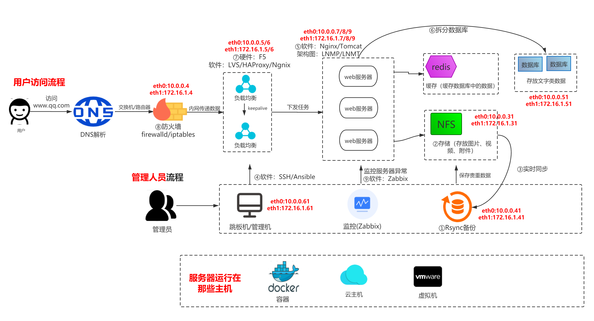

## 一 、综合架构规划

>项目中涵盖了架构，架构中又涵盖了不同的角色（高可用、负载均衡、web集群）
>五层架构模型--> 负载均衡 web服务 存储服务 缓存服务 数据库服务（通过tcp连接）



### 1 架构访问流程 

#### 1.1 用户视角

```shell
1.用户通过浏览器输入oldboyedu.com->回车
2.浏览器会发生一次跳转，分析URL->然后进行DNS解析->获取真实的公网IP地址
3.用户通过tcp的三次握手发起连接->真实的公网IP
4.连接会通过公网->路由器->交换机->抵达前端的硬件防火墙
5.防火墙根据自身访问规则，进行匹配->如果恶意的连接则拒绝->如果是正常的连接则放行
6.防火墙会将连接转发给负载均衡器->查看用户请求的内容->根据内容进行任务下发->下发给web服务器
7.web服务接收请求后会根据请求进行判断
如果是请求图片或者附件->查找存储服务器存储的静态资源
如果请求的网站上的内容->缓存服务器->如果缓存服务器没有->数据库
数据库查询完数据之后会返回数据给web服务器->同时也会返回一份给缓存服务器
8.数据库返回内容->web服务器->负载均衡->用户
```

#### 1.2 运维视角

```shell
1.用户通过公网连接（隧道）VPN服务器，这样方便管理内部主机，
2.自动化配置管理，节省人力成本，便于后期维护。统一环境，标准化
3.自动化监控服务，监控系统的运行状态，事前预警，事后追溯。
```

### 2 架构环境规划

#### 2.1 IP分配

```shell
 wanip         lanip       hostname
10.0.0.5     172.16.1.5     lb01
10.0.0.6     172.16.1.6     lb02
10.0.0.7     172.16.1.7     web01
10.0.0.8     172.16.1.8     web02
10.0.0.9     172.16.1.9     web03
10.0.0.31    172.16.1.31    nfs
10.0.0.41    172.16.1.41    backup
10.0.0.51    172.16.1.51    db01
10.0.0.61    172.16.1.61    m01
10.0.0.71    172.16.1.71    zabbix
```

#### 2.2 基础环境准备

##### 2.2.1 虚拟机系统和网卡准备

>安装全新Centos7系统，配置网卡为eth0及eth1命名模式
>1.第一块网卡为NAT模式[公网环境]，配置的网段为10.0.0.0网段
>2.第二块网卡为LAN模式[私网环境]，配置的网段为172.16.1.0网段
>3.优化安装好的Centos7虚拟机，安装常用软件、关闭防火墙等等

优化步骤

```shell
# 1.配置yum仓库
rm -f /etc/yum.repos.d/*
curl -o /etc/yum.repos.d/CentOS-Base.repo http://mirrors.aliyun.com/repo/Centos-7.repo
curl -o /etc/yum.repos.d/epel.repo http://mirrors.aliyun.com/repo/epel-7.repo

# 2.安装基础软件包
yum install net-tools vim tree htop iftop \
iotop lrzsz sl wget unzip telnet nmap nc psmisc \
dos2unix bash-completion bash-completion-extra sysstat \
rsync nfs-utils httpd-tools -y

# 3.关闭防火墙firewalld
systemctl disable firewalld
systemctl stop firewalld

# 4.关闭selinux
sed -i '/^SELINUX=/c SELINUX=disabled' /etc/selinux/config

# 5.调整单个进程最大能打开文件的数量
echo '* - nofile 65535' >> /etc/security/limits.conf
```

基于优化后的虚拟机进行克隆

```shell
1.连接克隆（需要依赖于母体）
2.完整克隆（完完全全的复制一份，占用磁盘空间）
```

对新克隆的主机进行如下操作：

```shell
# 1.修改主机名  
hostnamectl set-hostname backup

# 2.修改IP地址  
sed -i 's#200#41#g' /etc/sysconfig/network-scripts/ifcfg-eth[01]

# 3.重启服务器
```
