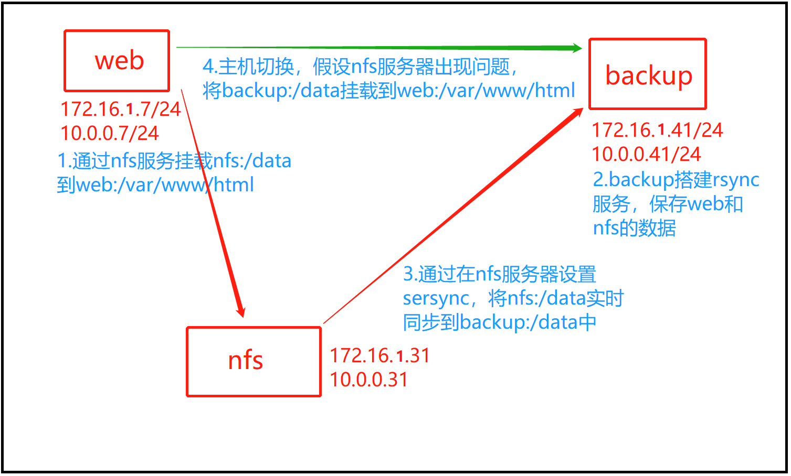

## 一、Sersync服务介绍

>

### 1 为什么要用sersync

- sersync是基于inotify开发的，类似于inotify-tools的工具
- sersync可以记录下被监听目录中发生变化的（包括增加、删除、修改）具体某一个文件或者某一个目录的名字，然后使用rsync同步的时候，只同步发生变化的文件或者目录
- 因为服务异常导致的同步失败有记录，便于恢复，确保高可用！

### 2 rsync+inotify-tools与rsync+sersync架构的区别？

- rsync+inotify-tools

  a、inotify只能记录下被监听的目录发生了变化（增，删，改）并没有把具体是哪个文件或者哪个目录发生了变化记录下来；

  b、rsync在同步的时候，并不知道具体是哪个文件或目录发生了变化，每次都是对整个目录进行同步，当数据量很大时，整个目录同步非常耗时（rsync要对整个目录遍历查找对比文件），因此效率很低

- rsync+sersync

  a、sersync可以记录被监听目录中发生变化的（增，删，改）具体某个文件或目录的名字；

  b、rsync在同步时，只同步发生变化的文件或目录（每次发生变化的数据相对整个同步目录数据来说很小，rsync在遍历查找对比文件时，速度很快），因此效率很高。

## 二、同步过程和原理

### 1 同步过程

1. 在同步服务器上开启sersync服务，sersync负责监控配置路径中的文件系统事件变化
2. 调用rsync命令把更新的文件同步到目标服务器；
3. 需要在主服务器配置sersync，在同步目标服务器配置rsync server（注意：是rsync服务

### 2 同步原理

1. 用户实时的往sersync服务器上写入更新文件数据；
2. 此时需要在同步主服务器上配置sersync服务；
3. 在另一台服务器开启rsync守护进程服务，以同步拉取来自sersync服务器上的数据；

>通过rsync的守护进程服务后可以发现，实际上sersync就是监控本地的数据写入或更新事件；然后，再调用rsync客户端的命令，将写入或更新事件对应的文件通过rsync推送到目标服务器。

## 三、案例

>案例: 实现web上传视频文件，实则是写入NFS至存储，当NFS存在新的数据则会实时的复制到备份服务器

| 角色       | 内网IP(LAN)      | 外网IP(NAT)    | 安装工具                         |
| ---------- | ---------------- | -------------- | -------------------------------- |
| web01      | eth1:172.16.1.7  | eth0:10.0.0.7  | httpd php                        |
| nfs-server | eth1:172.16.1.31 | eth0:10.0.0.31 | nfsServer、rsync+inotify+sersync |
| backup     | eth1:172.16.1.41 | eth0:10.0.0.41 | rsync-server                     |



### 1 web上传视频至nfs存储

```shell
nfs存储服务  172.16.1.31
	1.安装
		[root@nfs ~]# yum install nfs-utils -y
	2.配置
		[root@nfs ~]# cat /etc/exports
		/data 172.16.1.0/24(rw,sync,all_squash,anonuid=666,anongid=666)
		
		[root@nfs ~]# groupadd -g666 www
		[root@nfs ~]# useradd -u666 -g666 www
		
		[root@nfs ~]# mkdir /data
		[root@nfs ~]# chown -R www.www /data
		
	3.启动
		[root@nfs ~]# systemctl restart nfs-server
		[root@nfs ~]# sysytemctl enable nfs-server
		
web服务器操作：172.16.1.7
	1.安装
		[root@web01 ~]# yum install httpd php -y
	2.配置
		进程运行的身份（最好是和nfs的匿名用户保持一致）
			# sed c 匹配到User开头的字段，替换为User www
			[root@web01 html]# sed -i '/^User/c User www' /etc/httpd/conf/httpd.conf 	
			[root@web01 html]# sed -i '/^Group/c Group www' /etc/httpd/conf/httpd.conf
		挂载
			[root@web01 ~]# mount -t nfs 172.16.1.31:/data /var/www/html		#核心
		上传代码
			[root@web01 ~]# cd /var/www/html/
			[root@web01 html]# rz kaoshi.zip
			[root@web01 html]# unzip kaoshi.zip
	3.启动
		[root@web01 ~]# systemctl start httpd

	4.修改上传大小
		[root@web01 ~]# vim /etc/php.ini中设置：
		upload_max_filesize = 200M;
		post_max_size = 200M;
	
	5.注意: 修改完配置记得重启服务
	[root@web01 ~]#  systemctl restart httpd
```

### 2 web和nfs的数据都备份在备份服务器的/backup

```shell
备份服务器操作如下：172.16.1.41
	1.安装
		[root@backup ~]# yum install rsync -y
	2.配置
		[root@backup ~]# cat /etc/rsyncd.conf
		uid = www
		gid = www
		port = 873
		fake super = yes
		use chroot = no
		max connections = 200
		timeout = 600
		ignore errors
		read only = false
		list = true
		auth users = rsync_backup
		secrets file = /etc/rsync.passwd
		log file = /var/log/rsyncd.log
		#####################################
		[backup]
		path = /backup
		
		[data]
		path = /data
		
		创建用户
			[root@backup ~]# groupadd -g666 www
			[root@backup ~]# useradd -u666 -g666 www
		
		准备虚拟连接用户账号和密码
		[root@backup ~]# cat /etc/rsync.passwd 
		rsync_backup:123456
		[root@backup ~]# chmod 600 /etc/rsync.passwd
		
		创建数据存放的目录
		[root@backup ~]# mkdir -p /data /backup
		[root@backup ~]# chown -R www.www /data/ /backup/

	3.启动
		[root@backup ~]# systemctl restart rsyncd

	4.客户端执行脚本。测试rsync的备份是否ok   （客户端的数据都写入到/backup目录中） 172.16.1.7 172.16.1.31
	[root@web01 ~]# sh /server/scripts/client_push_data.sh 
	sending incremental file list
	web01_172.16.1.7_2019-01-08/
	web01_172.16.1.7_2019-01-08/flag_2019-01-08
	web01_172.16.1.7_2019-01-08/other.tar.gz
	web01_172.16.1.7_2019-01-08/sys.tar.gz
```

### 3 如何将nfs的数据实时的同步到备份服务器的/data目录

```shell
	监控nfs服务器上面的/data目录，如果发生变化则触发动作，动作可以是执行一次同步。
	1.安装
		[root@nfs ~]# yum install inotify-tools		监控工具
		
		[root@nfs ~]# rz -E sersync2.5.4_64bit_binary_stable_final.tar.gz	
		[root@nfs ~]# tar xf sersync2.5.4_64bit_binary_stable_final.tar.gz
		[root@nfs ~]# mv GNU-Linux-x86/ /usr/local/sersync
	2.配置
		[root@nfs sersync]# diff confxml.xml confxml.xml.bak
        5c5
        <     <fileSystem xfs="true"/>
        ---
        >     <fileSystem xfs="false"/>
        15c15
        <       <createFile start="true"/>
        ---
        >       <createFile start="false"/>
        19,20c19,20
        <       <attrib start="true"/>
        <       <modify start="true"/>
        ---
        >       <attrib start="false"/>
        >       <modify start="false"/>
        24,25c24,25
        <       <localpath watch="/data">
        <           <remote ip="172.16.1.41" name="data"/>
        ---
        >       <localpath watch="/opt/tongbu">
        >           <remote ip="127.0.0.1" name="tongbu1"/>
        30,31c30,31
        <           <commonParams params="-az"/>
        <           <auth start="true" users="rsync_backup" passwordfile="/etc/rsync.pass"/>
        ---
        >           <commonParams params="-artuz"/>
        >           <auth start="false" users="root" passwordfile="/etc/rsync.pas"/>
        33c33
        <           <timeout start="true" time="100"/><!-- timeout=100 -->
        ---
        >           <timeout start="false" time="100"/><!-- timeout=100 -->

		创建客户端密码文件
		[root@nfs ~]# cat /etc/rsync.pass
		123456
		[root@nfs ~]# chmod 600 /etc/rsync.pass
	
	3.启动
	[root@nfs ~]# /usr/local/sersync/sersync2  -h
	set the system param
	execute：echo 50000000 > /proc/sys/fs/inotify/max_user_watches
	execute：echo 327679 > /proc/sys/fs/inotify/max_queued_events
	parse the command param
	_______________________________________________________
	参数-d:启用守护进程模式
	参数-r:在监控前，将监控目录与远程主机用rsync命令推送一遍
	参数-n: 指定开启守护线程的数量，默认为10个
	参数-o:指定配置文件，默认使用confxml.xml文件
	参数-m:单独启用其他模块，使用 -m refreshCDN 开启刷新CDN模块
	参数-m:单独启用其他模块，使用 -m socket 开启socket模块
	参数-m:单独启用其他模块，使用 -m http 开启http模块
	不加-m参数，则默认执行同步程序

	启动
	[root@nfs ~]#  /usr/local/sersync/sersync2 -dro /usr/local/sersync/confxml.xml

	#启动sersync后一定要提取同步的命令，手动运行一次，检查是否存在错误
	[root@nfs ~]#  cd /data && rsync -az -R --delete ./  --timeout=100 rsync_backup@172.16.1.41::data --password-file=/etc/rsync.pass
	
	停止
	[root@nfs data]# pkill sersync
```

### 4 如何平滑的迁移nfs数据到backup服务器。并且让后续的上传都是上传至backup   （不能出现业务中断）

```shell
	1.backup服务器上需要运行和nfs服务器上一样的业务环境 
		创建用户
		[root@backup ~]# groupadd -g 666 www
		[root@backup ~]# useradd -u666 -g666 www
		配置
		[root@backup ~]# yum install -y nfs-utils -y
		[root@backup ~]# cat /etc/exports
		/data 172.16.1.0/24(rw,sync,all_squash,anonuid=666,anongid=666)
		启动
		[root@backup ~]# systemctl restart nfs-server
		
	2.先实现实时的同步 √

	3.在web上实现切换，卸载nfs的/data目录，重新挂载backup服务的/data目录
		[root@web01 ~]# umount -lf /var/www/html/ && mount -t nfs 172.16.1.41:/data /var/www/html/
```


