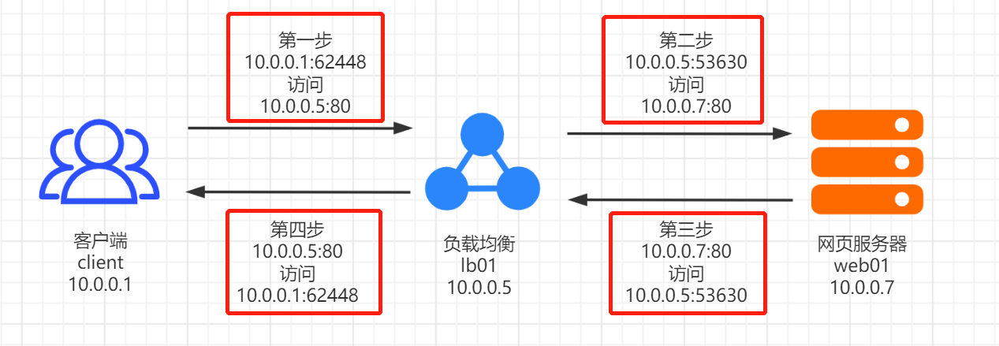

## 一、什么是代理

### 1.1 正向代理和反向代理的区别

区别在于形式上服务的"对象"不一样
	正向代理代理的对象是客户端，为客户端服务   PC电脑
	反向代理代理的对象是服务端，为服务端服务	服务器

### 1.2 Nginx反向代理模式配置模块

反向代理模式				Nginx配置模块
http、websocket、https		ngx_http_proxy_module
fastcgi						ngx_http_fastcgi_module
uwsgi						ngx_http_uwsgi_module
grpc						ngx_http_v2_module

## 二、Nginx代理配置

### 2.1 测试环境准备

| 主机名称 | 应用环境                    | 外网地址  | 内网地址    |
| -------- | --------------------------- | --------- | ----------- |
| web01    | nginx + php（提供网页服务） | 10.0.0.7  | 172.16.1.7  |
| lb01     | nginx（提供代理服务）       | 10.0.0.5  | 172.16.1.5  |
| db01     | mysql                       | 10.0.0.51 | 172.16.1.51 |

### 2.2 Nginx代理配置步骤

1、`web01`-配置后端的web

```shell
[root@web01 conf.d]# cat web.oldboy.com.conf 
server {
	listen 80;
	server_name web.oldboy.com;
	root /web;

	location / {
		index index.php index.html;
	}
}
```

2、创建文件夹和网页文件

```shell
[root@web01 conf.d]# mkdir /web
[root@web01 conf.d]# echo "Web01....." > /web/index.html
```

3、重启nginx服务

```shell
[root@web01 conf.d]# nginx -t
sysnginx: the configuration file /etc/nginx/nginx.conf syntax is ok
nginx: configuration file /etc/nginx/nginx.conf test is successful
t[root@web01 conf.d]# systemctl restart nginx
```

4、`lb01`-nginx代理配置

```shell
[root@lb01 conf.d]# cat proxy_web.conf
server {
	listen 80;
	server_name web.oldboy.com;
	location / {
		proxy_pass http://10.0.0.7:80;
		# 设置header将域名传过去
		proxy_set_header Host $http_host; 
	}
}
```

5、重启Nginx服务

```shell
systemctl restart nginx
```

6、客户机设置hosts，并测试访问网页，可以正常显示web01页面

```shell
10.0.0.5 web.oldboy.com
```


## 三、代理流程分析

1、走10网关，wireshark的抓包截图如下


2、流程图



3、测试，关掉web01的公网ip网口(10.0.0.7)，再尝试访问，也可以正常访问到web01的网页

```shell
[root@lb01 conf.d]# cat /etc/nginx/conf.d/proxy_web.conf
server {
        listen 80;
        server_name  web.oldboy.com;
        location / {
                proxy_pass http://172.16.1.7:80;
                include /etc/nginx/proxy_params;
        }

}
```

4、抓包分析

因为172网段走的虚拟机内部网络，抓不到


## 三、Nginx代理常用参数

### 3.1 常用参数解释

| 参数                                                         | 作用                                                         |
| ------------------------------------------------------------ | ------------------------------------------------------------ |
| proxy_pass http://10.0.0.7:80;                               |                                                              |
| proxy_http_version 1.1;                                      | 代理向后端请求使用的版本                                     |
| proxy_set_header Host $http_host;                            | 代理向后端请求携带的域名                                     |
| proxy_set_header X-Real-IP $remote_addr;                     | <font color="blue">用于获取客户端真实IP（不如x-forward）</font> |
| proxy_set_header X-Forwarded-For $proxy_add_x_forwarded_for; | <font color="blue">获取客户端真实IP及全链路IP</font>         |
| proxy_connect_timeout 30;                                    | 代理接连后端超时时间                                         |
| proxy_send_timeout 60;                                       | 后端传递数据至代理的超时时间                                 |
| proxy_read_timeout 60;                                       | 后端相应代理的超时时间                                       |
| proxy_buffering on;                                          | 是否开启proxy的buffer功能                                    |
| proxy_buffer_size 32k;                                       | 设置buffer大小                                               |
| proxy_buffers 4 128k;                                        | 设置存储被代理服务器上的数据所占用的buffer的个数和每个buffer的大小 |

X-Forwarded-For可以nginx的日志查看到

```shell
tail -f /var/log/nginx/access.log
```

### 3.2 参数多的时候如何配置

>可将参数写到一个文件中，然后在nginx配置文件里include包含进去

1、创建包含参数的文件

```shell
[root@lb01 conf.d]# cat /etc/nginx/proxy_params
proxy_set_header Host $http_host;
proxy_set_header X-Real-IP $remote_addr;
proxy_set_header X-Forwarded-For $proxy_add_x_forwarded_for;

proxy_connect_timeout 30;
proxy_send_timeout 60;
proxy_read_timeout 60;

proxy_buffering on;
proxy_buffer_size 32k;
proxy_buffers 4 128k;
```

2、在配置文件中导入，方便后续多个location使用

```shell
location / {
    proxy_pass http://127.0.0.1:8080;
    include proxy_params;
}
```

