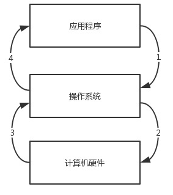
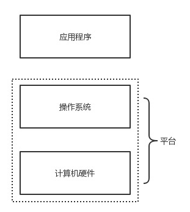

> **Note**
> This is a note

## 1 引子:

接下来一段时间，我们的目标的是：学会使用python这门编程语言来编写ATM+购物车程序，那么问题来了:

### 1.1 什么是语言？什么是编程语言？为何要有编程语言？


语言其实就是人与人之间沟通的介质，如英语，汉语，俄语等。

而编程语言则是人与计算机之间沟通的介质。

那么为何要有编程语言，或者说人为何要与计算机沟通呢？这是因为在编程的世界里，计算机就好比是人的奴隶，人与计算机沟通的目的就是为了奴役计算机，让计算机按照人类的思维逻辑自发地去工作从而把人力解放出来。

此处我们可以提炼出如下两个重要的概念

### 1.2 什么是编程？为什么要编程？

编程就是人把自己想命令计算机干的事用编程语言翻译出来并写到文件里（这一系列的文件就是程序），那么为什么要编程？

人类编程的目的就是为了让计算机按照人类的思维逻辑(程序)自发地去工作从而把人力解放出来。

综上，我们接下来的学习应该分为两个层面

1、为了更好地控制人类的奴隶（即计算机），我们需要学习计算机是由什么组成的、它能做什么事、它是怎样工作的（详见计算机组成原理、操作系统概述）

2、我们需要学习编程语言，从而把原来需要人力来完成的业务（比如ATM和购物）交给计算机去做


## 2 计算机组成原理

### 2.1、什么是计算机？

俗称电脑，即通电的大脑，电脑二字蕴含了人类对计算机的终极期望，希望它能真的像人脑一样去工作，从而解放人力。

### 2.2、为什么要用计算机？

世界是由聪明的懒人统治的，任何时期，总有一群聪明的懒人想要奴隶别人。在奴隶制社会，聪明的懒人奴役的是真正的人，而人是无法不吃、不喝、不睡觉一直工作的，但是计算机作为一台机器是可以做到的，所以把计算机当奴隶是上上之选。

### 2.3、计算机的五大组成部分

计算机有五大组成部分，既然计算机是人的奴隶，那么计算机设计核心肯定也是在模仿真正的人，所以我们完全可以把计算机的五大组件比喻成人类的各种器官

#### 2.3.1、控制器

控制器是计算机的指挥系统，用来控制计算机其他组件的运行，相当于人类的大脑

#### 2.3.2、运算器

运算器是计算机的运算功能，用来做算术运算和逻辑运算，相当于人脑。

ps：控制器+运算器=CPU，cpu相当于人的大脑

cpu详解见：

https://www.cnblogs.com/xiaoyuanqujing/articles/11640866.html

#### 2.3.3、存储器

存储器是计算机的记忆功能，用来存取数据。

存储器主要分为内存与外存：

 内存相当于人的短期记忆。断电数据丢失

 外存(如磁盘),相当于记事的本子，断电数据不会丢失，是用来永久保存数据的

 ps：内存的存取速度要远远高于外存

#### 2.3.4、输入设备input

输入设备是计算接收外界输入数据的工具，如键盘、鼠标，相当于人的眼睛或耳朵。

#### 2.3.5、输出设备output

输出设备是计算机向外输出数据的工具，如显示器、打印机，相当于人说的话，写出的文章。

ps：存储器如内存、磁盘等既是输入设备又是输出设备，统称为IO设备

#### 一个非常重要的基础知识:与运行程序相关的三大核心硬件

我们编写的程序一定是要运行于计算机硬件之上，而站在硬件的角度，与运行程序有关的三大核心硬件为CPU、内存、硬盘。

程序最先是存放于硬盘中的，程序的运行是先从硬盘把代码加载到内存中，然后cpu是从内存中读取指令运行。

**ps：了解其他计算机硬件知识**

https://www.cnblogs.com/linhaifeng/p/6523843.html#4462371


## 3 操作系统概述

### 3.1、操作系统的由来

 大前提：我们编程目的就是为了奴役计算机，让计算机硬件自发地运行起来，然而硬件毕竟是”死的“，硬件的运行都是由软件支配。

 倘若我们要开发一个应用程序，比如暴风音影，该软件的一个核心业务就是播放视频，开发者若要编写程序完成播放视频这个业务逻辑，必先涉及到底层硬件硬盘的基本运作（视频文件都是先存放于硬盘中），这意味着开发者在编写业务逻辑代码之前，必须先编写一个控制硬盘基本运行的控制程序，然而这仅仅只是一个开始，事实上，在编写应用程序的业务逻辑前，需要开发者编写出一套完整的控制程序用来控制所有硬件的基本运行（这要求开发者需要详细了解计算机硬件的各种控制细节，例如我们必须把CPU里面所有指令集都掌握一遍），如此，所有的开发者在开发程序时都必须依次开发两种：

```python
#1、编写一套完整的的控制程序，用来控制硬件的基本运行，以及把复杂的硬件的操作封装成简单的接口
#2、基于控制程序的接口开发包含一系列业务逻辑的程序，为了与控制程序区分，可以称为应用程序，以ATM这款应用程序为例，业务逻辑有提款、转账、查询余额等
```

 综上，对于不同公司的开发者来说，应用程序的业务逻辑各不相同，但硬件的控制程序都大致相同，为了避免所有程序员做重复劳动，以及不用再耗费精力去了解所有硬件的运行细节，有公司专门跳出来承担起控制程序的开发任务，这里所说的控制程序指的就是操作系统。

 操作系统的功能就是帮我们把复杂的硬件的控制封装成简单的接口，对于开发应用程序来说只需要调用操作系统提供给我们的接口即可

### 3.2、系统软件与应用软件

硬件以上运行的都是软件，而软件分为两类：

```python
#一、应用软件（例如qq、word、暴风影音，我们学习python就是为了开发应用软件的）

#二、操作系统，操作系统应用软件与硬件之间的一个桥梁，是协调、管理、控制计算机硬件与应用软件资源的控制程序。
```

### 3.3、计算机系统三层结构

综上，我们开发应用程序本质是在控制硬件，但是我们直接打交道的是操作系统，应用程序都是通过操作系统来间接地操作硬件的，所以一套完整的计算机系统分为三层，如下



### 一个非常重要的基础概念：平台

应用程序都是运行于操作系统之上，而操作系统则是运行于硬件之上的，所以承载应用程序的是一台运行有操作系统的计算机，称之为应用程序的运行平台，即：硬件 + 操作系统 == 平台



常见的平台有：windows系统+某款硬件、linux系统+某款硬件、ubuntu+某款硬件等，我们在开发应用程序时就需要考虑到应用程序的跨平台性，如果能开发出一款可以在任意平台运行的应用程序，那对于开发者来说真是极大的福音。而决定应用软件的跨平台性的关键因素往往是编程语言的选择，python恰好是一款跨平台性语言，这也是我们学习它的原因之一。