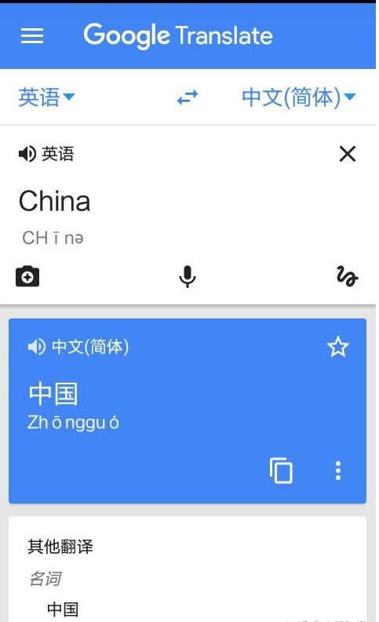
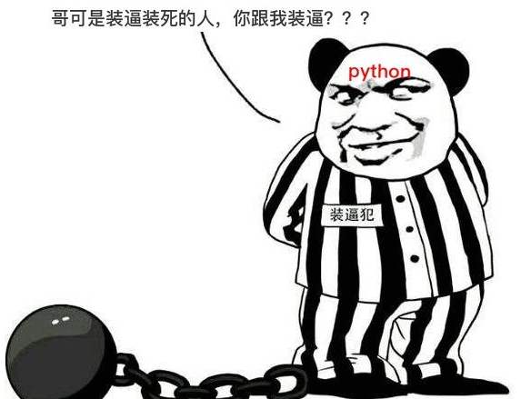
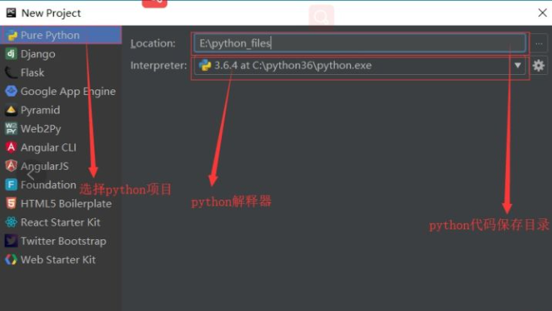
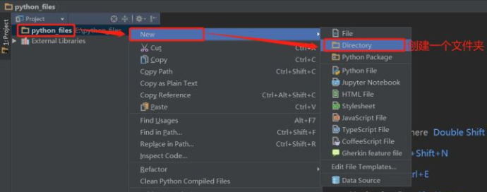
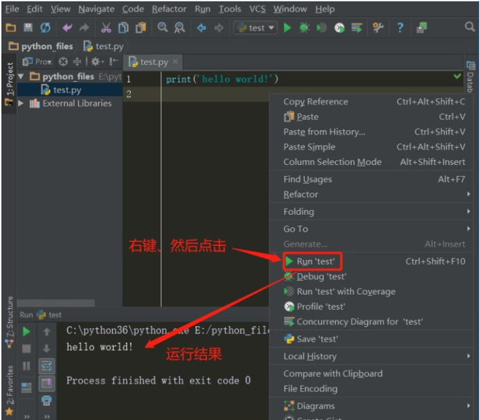

## 一 引子

 基于上一章所学，有了计算机硬件，再在硬件之上安装好操作系统，我们就有了一个应用程序的运行平台，我们接下来的任务就是学习如何使用某款编程语言来开发应用程序。

 本章的主题是先带大家了解下编程语言，然后重点介绍python这门编程语言


## 二 编程语言分类：

## 2.1 机器语言


`机器语言`是站在计算机(奴隶)的角度，说计算机能听懂/理解的语言，而计算机能直接理解的就是二进制指令，所以机器语言就是直接用`二进制编程`，这意味着机器语言是直接操作硬件的，因此机器语言属于低级语言，此处的低级指的是底层、贴近计算机硬件（贴近代指需要详细了解计算机硬件细节、直接控制硬件），详解如下

```python
#机器语言
    用二进制代码0和1描述的指令称为机器指令，由于计算机内部是基于二进制指令工作的，所以机器语言是直接控制计算机硬件。

    用机器语言编写程序，编程人员要首先熟记所用计算机的全部指令代码以及代码的含义，然后在编写程序时，程序员得自己处理每条指令和每一数据的存储分配和输入输出，还得记住编程过程中每步所使用的工作单元处在何种状态。这是一件十分繁琐的工作。编写程序花费的时间往往是实际运行时间的几十倍或几百倍。而且，编出的程序全是些0和1的指令代码，直观性差，不便阅读和书写，还容易出错，且依赖于具体的计算机硬件型号，局限性很大。除了计算机生产厂家的专业人员外，绝大多数的程序员已经不再去学习机器语言了。

    机器语言是被微处理器理解和使用的，存在有多至100000种机器语言的指令，下述是一些简单示例

    #指令部份的示例
    0000 代表 加载（LOAD）
    0001 代表 存储（STORE）
    ...

    #暂存器部份的示例
    0000 代表暂存器 A
    0001 代表暂存器 B
    ...

    #存储器部份的示例
    000000000000 代表地址为 0 的存储器
    000000000001 代表地址为 1 的存储器
    000000010000 代表地址为 16 的存储器
    100000000000 代表地址为 2^11 的存储器

    #集成示例
    0000,0000,000000010000 代表 LOAD A, 16
    0000,0001,000000000001 代表 LOAD B, 1
    0001,0001,000000010000 代表 STORE B, 16
    0001,0001,000000000001 代表 STORE B, 1[1]
```

总结机器语言

```python
# 1、执行效率最高
编写的程序可以被计算机无障碍理解、直接运行，执行效率高 。

# 2、开发效率最低
复杂，开发效率低

# 3、跨平台性差
贴近\依赖具体的硬件，跨平台性差
```


## 2.2 汇编语言

汇编语言仅仅是用一个英文标签代表一组二进制指令，毫无疑问，比起机器语言，汇编语言是一种进步，但汇编语言的本质仍然是直接操作硬件，因此汇编语言仍是比较低级/底层的语言、贴近计算机硬件


```python
#汇编语言
汇编语言的实质和机器语言是相同的，都是直接对硬件操作，只不过指令采用了英文缩写的标识符，更容易识别和记忆。它同样需要编程者将每一步具体的操作用命令的形式写出来。汇编程序的每一句指令只能对应实际操作过程中的一个很细微的动作。例如移动、自增，因此汇编源程序一般比较冗长、复杂、容易出错，而且使用汇编语言编程需要有更多的计算机专业知识，但汇编语言的优点也是显而易见的，用汇编语言所能完成的操作不是一般高级语言所能够实现的，而且源程序经汇编生成的可执行文件不仅比较小，而且执行速度很快。

汇编的hello world，打印一句hello world, 需要写十多行，如下

; hello.asm 
section .data            ; 数据段声明
        msg db "Hello, world!", 0xA     ; 要输出的字符串
        len equ $ - msg                 ; 字串长度
        section .text            ; 代码段声明
        global _start            ; 指定入口函数
        _start:                  ; 在屏幕上显示一个字符串
        mov edx, len     ; 参数三：字符串长度
        mov ecx, msg     ; 参数二：要显示的字符串
        mov ebx, 1       ; 参数一：文件描述符(stdout) 
        mov eax, 4       ; 系统调用号(sys_write) 
        int 0x80         ; 调用内核功能
                         ; 退出程序
        mov ebx, 0       ; 参数一：退出代码
        mov eax, 1       ; 系统调用号(sys_exit) 
        int 0x80         ; 调用内核功能
```

总结汇编语言

```python
# 1、执行效率高
相对于机器语言，使用英文标签编写程序相对简单，执行效率高，但较之机器语言稍低，

# 2、开发效率低：
仍然是直接操作硬件，比起机器语言来说，复杂度稍低，但依旧居高不下，所以开发效率依旧较低

# 3、跨平台性差
同样依赖具体的硬件，跨平台性差
```

## 2.3 高级语言

高级语言是站在人(奴隶主)的角度，说人话，即用人类的字符去编写程序，而人类的字符是在向操作系统发送指令，而非直接操作硬件，所以高级语言是与操作系统打交道的，此处的高级指的是高层、开发者无需考虑硬件细节，因而开发效率可以得到极大的提升，但正因为高级语言离硬件较远，更贴近人类语言，人类可以理解，而计算机则需要通过翻译才能理解，所以执行效率会低于低级语言。

按照翻译的方式的不同，高级语言又分为两种：

### 2.3.1 编译型（如C语言）:



类似谷歌翻译，是把程序所有代码编译成计算机能识别的二进制指令，之后操作系统会拿着编译好的二进制指令直接操作硬件，详细如下

```python
# 1、执行效率高
编译是指在应用源程序执行之前，就将程序源代码“翻译”成目标代码（即机器语言），
因此其目标程序可以脱离其语言环境独立执行，使用比较方便，执行效率较高。

# 2、开发效率低：
应用程序一旦需要修改，必须先修改源代码，然后重新编译、生成新的目标文件才能执行，
而在只有目标文件而没有源代码，修改会很不方便。所以开发效率低于解释型

# 3、跨平台性差
编译型代码是针对某一个平台翻译的，当前平台翻译的结果无法拿到不同的平台使用，针对不同的平台必须重新编译，即跨平台性差

# 其他
现在大多数的编程语言都是编译型的。
编译程序将源程序翻译成目标程序后保存在另一个文件中，该目标程序可脱离编译程序直接在计算机上多次运行。
大多数软件产品都是以目标程序形式发行给用户的，不仅便于直接运行，同时又使他人难于盗用其中的技术。
C、C++、Ada、Pascal都是编译实现的
```

### 2.3.2 解释型（如python）:


类似同声翻译，需要有一个解释器，解释器会读取程序代码，一边翻译一边执行，详细如下

```python3
# 1、执行效率低
解释型语言的实现中，翻译器并不产生目标机器代码，而是产生易于执行的中间代码。
这种中间代码与机器代码是不同的，中间代码的解释是由软件支持的，不能直接使用硬件，
软件解释器通常会导致执行效率较低。

# 2、开发效率高
用解释型语言编写的程序是由另一个可以理解中间代码的解释程序执行的，与编译程序不同的是，
解释程序的任务是逐一将源程序的语句解释成可执行的机器指令，不需要将源程序翻译成目标代码再执行。
解释程序的优点是当语句出现语法错误时，可以立即引起程序员的注意，而程序员在程序开发期间就能进行校正。


# 3、跨平台性强
代码运行是依赖于解释器，不同平台有对应版本的解释器，所以解释型的跨平台性强

# 其他
对于解释型Basic语言，需要一个专门的解释器解释执行Basic程序，每条语句只有在执行时才被翻译，
这种解释型语言每执行一次就翻译一次，因而效率低下。一般地，动态语言都是解释型的，
例如：Tcl、Perl、Ruby、VBScript、JavaScript等
```

ps：混合型语言

```python
Java是一类特殊的编程语言，Java程序也需要编译，但是却没有直接编译为机器语言，而是编译为字节码，
然后在Java虚拟机上以解释方式执行字节码。
```

## 2.4 总结

 综上选择不同编程语言来开发应用程序对比

```python
#1、执行效率：机器语言>汇编语言>高级语言（编译型>解释型）

#2、开发效率：机器语言<汇编语言<高级语言（编译型<解释型）

#3、跨平台性：解释型具有极强的跨平台型
```

 由于我们开发是应用程序，而应用程序必须运行于某一个平台之上，应用程序的快慢受限于平台（就好比F1赛车与宝马车同时跑在北京五环高速，都受限于道路环境，车速是差不多的）的快慢，并不是单从语言层面就可以提升整体执行效率的，于是开发效率、跨平台性才是我们需要优先考虑的问题，这就是我们首选python的原因



## 三 python介绍

 谈及python，涉及两层意思，一层代表的是python这门语言的语法风格，另外一层代表的则是专门用来解释该语法风格的应用程序：python解释器。

 python的创始人为吉多·范罗苏姆（Guido van Rossum）。Python这个名字，来自Guido所挚爱的电视剧Monty Python’s Flying Circus，他希望这个新的叫做Python的语言，能符合他的理想：创造一种C和shell之间，语法能够像shell一样简洁，易学易用、可拓展性强，同时兼顾C的强大功能。于是Guido在1989年的圣诞节期间，开始编写能够解释Python语言语法的解释器。

 Python崇尚优美、清晰、简单，是一个优秀并广泛使用的语言。最新的TIOBE排行榜[https://www.tiobe.com/tiobe-index/](https://link.zhihu.com/?target=https%3A//www.tiobe.com/tiobe-index/)，Python已飙升至世界第三。

 Python可以应用于众多领域，如：人工智能、数据分析、爬虫、金融量化、云计算、WEB开发、自动化运维/测试、游戏开发、网络服务、图像处理等众多领域。目前业内几乎所有大中型互联网企业都在使用Python，如：Youtube、Dropbox、BT、Quora（中国知乎）、豆瓣、知乎、Google、Yahoo!、Facebook、NASA、百度、腾讯、汽车之家、美团等。

## 3.1 Python解释器的发展史


Python 3.1 - June 27, 2009

Python 3.2 - February 20, 2011

Python 3.3 - September 29, 2012

Python 3.4 - March 16, 2014

Python 3.5 - September 13, 2015

Python 3.6 - 2016-12-23 发布python3.6.0版

## 3.2 Python解释器有哪些种类?

官方的Python解释器本质就是基于C语言开发的一个软件，该软件的功能就是读取以.py结尾的文件内容，然后按照Guido定义好的语法和规则去翻译并执行相应的代码。这种用C实现的解释器称为CPython，它是python领域性能最好，应用最广泛的一款解释器，我们在后面提到的解释器指的都是Cpython解释器。但其实解释器作为一款应用软件，完全可以采用其他语言来开发，只要能解释python这门语言的语法即可。Python解释器的一些种类如下，简单了解即可

```python
# Jython
JPython解释器是用JAVA编写的python解释器，可以直接把Python代码编译成Java字节码并执行，它不但使基于java的项目之上嵌入python脚本成为可能，同时也可以将java程序引入到python程序之中。

# IPython
IPython是基于CPython之上的一个交互式解释器，也就是说，IPython只是在交互方式上有所增强，但是执行Python代码的功能和CPython是完全一样的。这就好比很多国产浏览器虽然外观不同，但内核其实都是调用了IE。
CPython用>>>作为提示符，而IPython用In [序号]:作为提示符。

# PyPy
PyPy是Python开发者为了更好地Hack Python而用Python语言实现的Python解释器。PyPy提供了JIT编译器和沙盒功能，对Python代码进行动态编译（注意不是解释），因此运行速度比CPython还要快。

# IronPython
IronPython和Jython类似，只不过IronPython是运行在微软.Net平台上的Python解释器，可以直接把Python代码编译成.Net的字节码。
```


## 四 安装Cpython解释器

Python解释器目前已支持所有主流操作系统，在Linux,Unix,Mac系统上自带Python解释器，在Windows系统上需要安装一下，具体步骤如下。

## 4.1、下载python解释器

打开官网 [https://www.python.org](https://link.zhihu.com/?target=https%3A//www.python.org)，按提示下载即可

## 4.2、安装python解释器


## 4.3、测试安装是否成功

windows --> 运行 --> 输入cmd ，然后回车，弹出cmd程序，输入python,如果能进入交互环境 ，代表安装成功。

## 五 第一个python程序

## 5.1 运行python程序有两种方式

方式一： 交互式模式


方式二：脚本文件

```python
# 1、打开一个文本编辑工具，写入下述代码，并保存文件，此处文件的路径为D:\test.py。强调：python解释器执行程序是解释执行，解释的根本就是打开文件读内容，因此文件的后缀名没有硬性限制，但通常定义为.py结尾
print('hello world')

# 2、打开cmd，运行命令，如下图
```


总结：

```python
#1、交互式模式下可以即时得到代码执行结果，调试程序十分方便
#2、若想将代码永久保存下来，则必须将代码写入文件中
#3、我们以后主要就是在代码写入文件中，偶尔需要打开交互式模式调试某段代码、验证结果
```

## 5.2 注释

在正式学习python语法前，我们必须事先介绍一个非常重要的语法：注释

**1、什么是注释**

```python
注释就是就是对代码的解释说明，注释的内容不会被当作代码运行
```

**2、为什么要注释**

```python
增强代码的可读性
```

**3、怎么用注释?**

```python
代码注释分单行和多行注释

1、单行注释用#号，可以跟在代码的正上方或者正后方

2、多行注释可以用三对双引号""" """
```

```python
'''
这是多行注释
这是多行注释
这是多行注释
'''

# 这是单行注释，下面是测试代码
print("Hello World")
```

**4、代码注释的原则：**

```python
1、不用全部加注释，只需要为自己觉得重要或不好理解的部分加注释即可

2、注释可以用中文或英文，但不要用拼音
```

# 六 IDE工具pycharm的使用

## 6.1、什么是IDE？为何要有IDE

在编写第一个python程序时，存在以下问题，严重影响开发效率

问题一：我们了解到一个python程序从开发到运行需要操作至少两个软件

```python
1、打开一个软件：文本编辑器，创建文本来编写程序
2、打开cmd，然后输入命令执行pyton程序
```

问题二：在开发过程中，并没代码提示以及纠错功能

综上，如果能有一款工具能够集成n个软件的功能，同时又代码提示以及纠错等功能，那么将会极大地提升程序员的开发效率，这就是IDE的由来，IDE全称Integrated Development Environment，即集成开发环境，最好的开发Python程序的IDE就是PyCharm。

## 6.2、pychram安装

```python
# 下载地址: https://www.jetbrains.com/pycharm/download  选择Professional专业版
```

**安装完成后注册，然后启动，会让你先创建一个项目，其实就是一个文件夹，我们以后的代码都存在这里面。**



## 6.3、Pycharm创建文件夹

创建文件夹是管理文件的良好方式



## 6.4、如何创建文件并编写程序执行

创建py文件test.py

在test.py中写代码，输入关键字的开头可以用tab键补全后续，并且会有代码的错误提示



