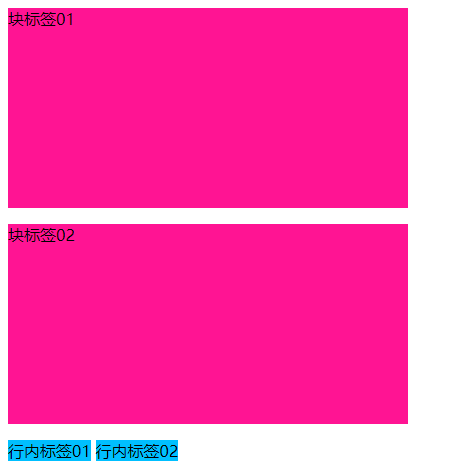
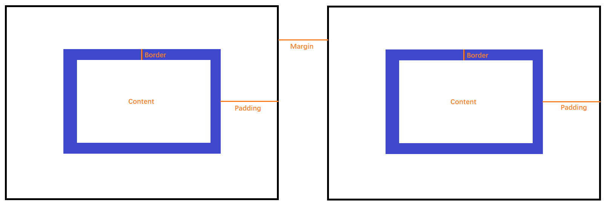

“第52天CSS02学习笔记”


# 1 分组与嵌套

## 1.1 分组选择器

在样式表中有很多具有相同样式的元素

```css
div {
    color: darkorange;
}

p {
    color: darkorange;
}
span {
    color: darkorange;
}
```

为减少代码， 可以使用分组选择器，多个选择器之间使用`逗号`分隔

```css
<!doctype html>
<html lang="en">
<head>
    <meta charset="UTF-8">
    <style>
        /*使用分组选择器*/
        div, p, span {
            color: darkorange;
        }
    </style>
</head>
<body>
    <div>DIV</div>
    <p>PPP</p>
    <span>SPAN</span>
</body>
</html>
```

## 1.2 嵌套选择器

它可能适用于选择器内部的选择器的样式。

在下面的例子设置了四个样式：

- **p{ }**: 为所有 **p** 元素指定一个样式。
- **.marked{ }**: 为所有 **class="marked"** 的元素指定一个样式。
- **.marked p{ }**: 为所有 **class="marked"** 元素内的 **p** 元素指定一个样式。
- **p.marked{ }**: 为所有 **class="marked"** 的 **p** 元素指定一个样式。

案例代码：

```css
p
{
    color:blue;
    text-align:center;
}
.marked
{
    background-color:red;
}
.marked p
{
    color:white;
}
p.marked{
    text-decoration:underline;
}
```


# 2 伪类选择器

伪类选择器以`标签:状态`的方式使用

案例代码:

```html
<!doctype html>
<html lang="en">
<head>
    <meta charset="UTF-8">
    <style>
        body {
            background-color: darkseagreen;
        }

        /*链接未点击的样式*/
        a:link {
            color: red;
        }

        /*鼠标放在链接上的样式*/
        a:hover {
            color: aqua;
        }

        /*鼠标按住不放的样式*/
        a:active {
            color: black;
        }

        /*鼠标点击松开后的样式*/
        a:visited {
            color: blue;
        }

        /*鼠标放在标签上的样式*/
        p:hover {
            background-color: white;
        }

        /*鼠标聚焦到输入框的样式（鼠标点了input框）*/
        input:focus {
            background-color: deeppink;
        }
    </style>
</head>
<body>
    <a href="https://gsproj.github.io">我的博客</a>
    <a href="https://gsproj.github.io">JUMP</a>
    <p>点我进去康康</p>
    <input type="text">
</body>
</html>
```


# 3 伪元素选择器

伪元素通常用来实现""首字母大写""和清除浮动带来的“父标签塌陷”的的问题

案例代码：

```html
<!doctype html>
<html lang="en">
<head>
    <meta charset="UTF-8">
    <title>Document</title>
    <style>
        /*伪元素实现首字母大写*/
        p:first-letter {
            font-size: 48px;
            color: orange;
        }

        /*段前添加文字*/
        p:before {
            content: '加在前面';
            color: palevioletred;
        }

        /*段后添加文字*/
        p:after {
            content: '加在后面';
            color: palevioletred;
        }
    </style>
</head>
<body>
    <p>这是一段不起眼的文字</p>
</body>
</html>
```

before和after加的文字是不能被鼠标选择的，效果如下：


# 4 选择器的优先级

选择器相同，书写顺序不同：

​	就近原则：谁离标签**更近**，谁的优先级**越高**

选择器不同：

​	行内 > id选择器 > 类选择器 > 标签选择器

组合选择器通过计算权值对比：

| 选择器       | 权值  |
| ------------ | ----- |
| ! important  | >1000 |
| 内联样式     | >1000 |
| id选择器 #   | 100   |
| 类选择器 .   | 10    |
| 伪类选择器   | 10    |
| 标签选择器   | 1     |
| 通用选择器 * | 0     |
| 继承的样式   | 0     |

# 5 块标签与行内标签

特点：

**块标签(block)**

​	独占一行，可以设置长宽

**行内标签(inline)**

​	多个标签在一行，设置长宽无效

案例代码：

```html
<!doctype html>
<html lang="en">
<head>
    <meta charset="UTF-8">
    <style>
        /*块标签设置高宽有效*/
        p {
            background-color: deeppink;
            border: 2px;
            height: 200px;
            width: 400px;
        }

        /*行内标签设置高宽无效*/
        span {
            background-color: deepskyblue;
            border: 2px;
            height: 200px;
            width: 400px;
        }
    </style>
</head>
<body>
    <p>块标签01</p>
    <p>块标签02</p>
    <span>行内标签01</span>
    <span>行内标签02</span>
</body>
</html>
```

效果：



# 6 字体属性

修改字体样式，案例代码如下：

```css
p {
    /*font-family: "Arial Black","微软雅黑","...";  !*第一个不生效就用后面的 写多个备用*!*/

    /*font-size: 24px;  !*字体大小*!*/

    /*font-weight: inherit;  !*bolder lighter 100~900 inherit继承父元素的粗细值*!*/

    /*color: red;  !*直接写颜色英文*!*/
    /*color: #ee762e;  !*颜色编号*!*/
    /*color: rgb(128,23,45);  !*三基色 数字  范围0-255*!*/
    /*color: rgba(23, 128, 91, 0.9);  !*第四个参数是颜色的透明度 范围是0-1*!*/
}
```

# 7 文字属性

修改文字居中、下划线等显示样式，案例代码如下：

```css
p {
            /*text-align: center;  !*居中*!*/
            /*text-align: right;*/
            /*text-align: left;*/
            /*text-align: justify;  !*两端对齐*!*/

            /*text-decoration: underline;*/
            /*text-decoration: overline;*/
            /*text-decoration: line-through;*/
            /*text-decoration: none;*/
            /*在html中 有很多标签渲染出来的样式效果是一样的*/
            font-size: 16px;
            text-indent: 32px;   /*缩进32px*/
        }
        a {
            text-decoration: none;  /*主要用于给a标签去掉自带的下划线  需要掌握*/
        }
```

# 8 背景图片

给标签添加背景色/背景图片, 案例如下：

```css
<!DOCTYPE html>
<html lang="en">
<head>
    <meta charset="UTF-8">
    <title>Title</title>
    <meta name="viewport" content="width=device-width, initial-scale=1">
    <style>
        #d1 {
            height: 500px;
            background-color: red;
        }
        #d2 {
            height: 500px;
            background-color: green;
        }
        #d3 {
            height: 500px;
            background-image: url("222.png");	/*添加背景图片*/
            background-attachment: fixed;	/*背景保持不动*/
            background-repeat: no-repeat;   /*背景图不平铺*/
        }
        #d4 {
            height: 500px;
            background-color: aqua;
        }
    </style>
</head>
<body>
<div id="d1"></div>
<div id="d2"></div>
<div id="d3"></div>
<div id="d4"></div>
</body>
</html>
```

# 9 边框

设置元素的边框样式，案例代码

```html
<!DOCTYPE html>
<html lang="en">
<head>
    <meta charset="UTF-8">
    <title>Title</title>
    <meta name="viewport" content="width=device-width, initial-scale=1">
    <style>

        p {
            background-color: red;

            border-width: 5px;
            border-style: solid;
            border-color: green;

        }
        div {
            /*border-left-width: 5px;*/
            /*border-left-color: red;*/
            /*border-left-style: dotted;*/

            /*border-right-width: 10px;*/
            /*border-right-color: greenyellow;*/
            /*border-right-style: solid;*/

            /*border-top-width: 15px;*/
            /*border-top-color: deeppink;*/
            /*border-top-style: dashed;*/

            /*border-bottom-width: 10px;*/
            /*border-bottom-color: tomato;*/
            /*border-bottom-style: solid;*/
            border: 3px solid red;  /*三者位置可以随意写*/

        }
        #d1 {
            background-color: greenyellow;
            height: 400px;
            width: 400px;
            border-radius: 50%;  /*设置边框椭圆：直接写50%即可 长宽一样就是圆 不一样就是椭圆*/
        }
    </style>
</head>
<body>
    <p>这是一个有趣的故事</p>
<div>乌拉阿拉蕾</div>
<div id="d1"></div>
</body>
</html>
```

# 10 display属性

display属性常用方法：

```css
display:none	隐藏元素，位置不占用
display:block	转换为块元素（独占一行，可调节高宽）
display:inline	转换为行内元素（非独占一行，不可调节高宽）
display:inline-block	转换为行内块元素（非独占一行，可调节高宽）
```

另一个隐藏属性的方法：

```css
visibility: hidden
```

与`display:none`的区别：隐藏的属性**<font color='red'>仍然占用位置</font>**

案例代码如下：

```html
<!DOCTYPE html>
<html lang="en">
<head>
    <meta charset="UTF-8">
    <title>Title</title>
    <meta name="viewport" content="width=device-width, initial-scale=1">
    <style>
        /*#d1 {*/
        /*    !*display: none;  !*隐藏标签不展示到前端页面并且原来的位置也不再占有了 但是还存在于文档上*!*!*/
        /*    display: inline;  !*将标签设置为行内标签的特点*!*/
        /*}*/
        /*#d2 {*/
        /*    display: inline;*/
        /*}*/
        /*#d1 {*/
        /*    display: block;  !*将标签设置成块儿级标签的特点*!*/
        /*}*/
        /*#d2 {*/
        /*    display: block;*/
        /*}*/
        /*#d1 {*/
        /*    display: inline-block;*/
        /*}*/
        /*#d2 {*/
        /*    display: inline-block;  !*标签即可以在一行显示又可以设置长宽*!*/
        /*}*/
    </style>
</head>
<body>
<div style="display: none">div1</div>
<div>div2</div>
<div style="visibility: hidden">单纯的隐藏 位置还在</div>  
<div>div4</div>
<!--<div id="d1" style="height: 100px;width: 100px;background-color: red">01</div>-->
<!--<div id="d2" style="height: 100px;width: 100px;background-color: greenyellow">02</div>-->
<!--<span id="d1" style="height: 100px;width: 100px;background-color: red">span</span>-->
<!--<span id="d2" style="height: 100px;width: 100px;background-color: greenyellow">span</span>-->

<!--<div id="d1" style="height: 100px;width: 100px;background-color: red">01</div>-->
<!--<div id="d2" style="height: 100px;width: 100px;background-color: greenyellow">02</div>-->
</body>
</html>
```

# 11 盒子模型

什么是盒子模型？

- 就以快递盒为例
- 快递盒与快递盒之间的距离(标签与标签之间的距离 margin外边距)
- 盒子的厚度(标签的边框 border)
- 盒子里面的物体到盒子的距离(内容到边框的距离  padding内边距)
- 物体的大小(内容 content)

如果你想要调整标签与标签之间的距离 你就可以调整margin

> 补充：浏览器会自带8px的margin，一般情况下我们在写页面的时候，上来就会先将body的margin去除



案例代码如下：

```html
<!DOCTYPE html>
<html lang="en">
<head>
    <meta charset="UTF-8">
    <title>Title</title>
    <meta name="viewport" content="width=device-width, initial-scale=1">
    <style>
        body {
            margin: 0;  /*上下左右全是0
            /*margin: 10px 20px;  !* 第一个上下 第二个左右*!*/
            /*margin: 10px 20px 30px;  !*第一个上  第二个左右  第三个下*!*/
            /*margin: 10px 20px 30px 40px;  !*上 右 下 左*!*/
        }
        /*p {*/
        /*    margin-left: 0;*/
        /*    margin-top: 0;*/
        /*    margin-right: 0;*/
        /*    margin-bottom: 0;*/
        /*}*/

        #d1 {
            margin-bottom: 50px;
        }


        #d2 {
            margin-top: 20px;  /*不叠加 只取大的*/
        }

        #dd {
            margin: 0 auto;  /*只能做到标签的水平居中*/
        }
        p {
            border: 3px solid red;
            /*padding-left: 10px;*/
            /*padding-top: 20px;*/
            /*padding-right: 20px;*/
            /*padding-bottom: 50px;*/

            /*padding: 10px;*/
            /*padding: 10px 20px;*/
            /*padding: 10px 20px 30px;*/
            /*padding: 10px 20px 30px 40px;*/  /*规律和margin一模一样*/
        }
    </style>
</head>
<body>
<!--    <p style="border: 1px solid red;" id="d1">ppp</p>-->
<!--    <p style="border: 1px solid orange;" id="d2">ppp</p>-->
<!--<div style="border: 3px solid red;height: 400px;width: 400px">-->
<!--    <div id='dd' style="border: 1px solid orange;height: 50px;width: 50px;background-color: blue;"></div>-->
<!--</div>-->

<p>ppp</p>

</body>
</html>
```

# 12 浮动

浮动的元素，没有块级和行内一说，本身多大浮起来之后就占多大

案例代码如下：

```html
只要是设计到页面的布局一般都是用浮动来提前规划好
<style>
        body {
            margin: 0;
        }
        #d1 {
            height: 200px;
            width: 200px;
            background-color: red;
            float: left;  /*浮动  浮到空中往左飘*/
        }
        #d2 {
            height: 200px;
            width: 200px;
            background-color: greenyellow;
            float: right;   /*浮动 浮到空中往右飘*/
        }
</style>
```

`overflow:hidden`超出部分隐藏，用来解决外边距塌陷问题：

父级元素内部有子元素，如果给子元素添加margin-top样式，那么父级元素也会跟着下来，造成外边距塌陷。

# 13 浮动带来的影响

