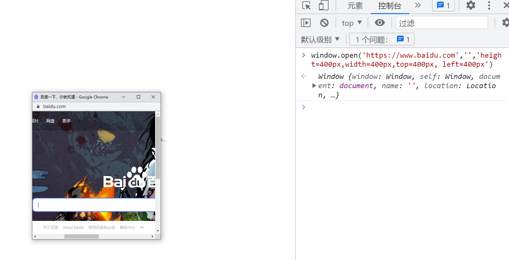
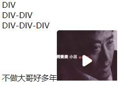
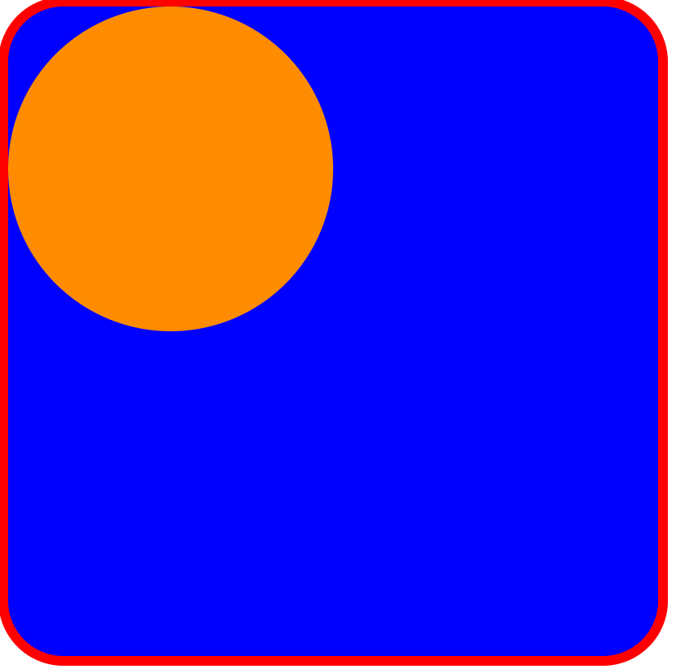
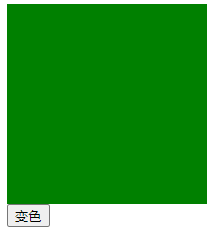
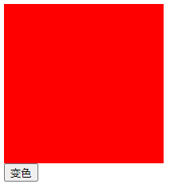
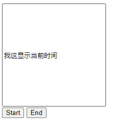
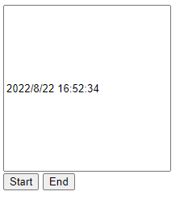
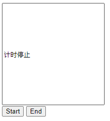

“第54天JavaScript（02）学习笔记”


# 1 BOM操作

BOM全称**Browser Object Model**，译为**浏览器对象模型**，主要用于操作浏览器，比如：

- 操作浏览器开打指定网页
- 浏览器跳转下一页/返回上一页
- 设置浏览器窗口大小

## 1.1 window对象

window对象指代的就是浏览器窗口

案例 -- 打开网页，并指定窗口大小

```javascript
window.open('https://www.baidu.com','','height=400px,width=400px,top=400px,left=400px')

// 新建窗口打开页面 第二个参数写空即可 第三个参数写新建的窗口的大小和位置
// 扩展父子页面通信window.opener()  了解
```

效果如下：



案例 -- 关闭网页

```javascript
window.close()
```

## 1.2 navigator对象

获取浏览器信息

案例代码：

```javascript
window.navigator.appName
'Netscape'

window.navigator.appVersion
'5.0 (Windows NT 10.0; Win64; x64) AppleWebKit/537.36 (KHTML, like Gecko) Chrome/104.0.0.0 Safari/5....

window.navigator.userAgent
'Mozilla/5.0 (Windows NT 10.0; Win64; x64) AppleWebKit/537.36 (KHTML, like Gecko) Chrome/104.0.0.0 Safari/537.36'

// 如果是window的子对象，那么window可以省略不写，如
navigator.platform
'Win32'
```

## 1.3 history对象

```javascript
window.history.back()  // 回退到上一页
window.history.forward()  // 前进到下一页
# 对应的就是你浏览器左上方的两个的箭头
```

## 1.4 localtion对象

```javascript
// 获取当前页面的url 
window.location.href
'https://www.baidu.com/'

// 跳转到指定的url
window.location.href = 'https://www.qq.com'

// 重载刷新页面
window.location.reload()
```

## 1.5 弹出框

弹出框分为：警告框、确认框、提示框

```javascript
// 警告框
alert('你不要过来啊！！！')
undefined

// 确认框
confirm('你确定真的要这么做吗?能不能有其他方式能够满足你...')
false
confirm('你确定真的要这么做吗?能不能有其他方式能够满足你...')
true

// 提示框 -- 输入后点击确认，内容将返回
prompt('这是输入框的名称', '这是输入框的默认内容')
'你过来啊！' 
```

## 1.6 计时器相关

创建定时任务--隔多久执行`Timeout`

案例：

```javascript
// 创建定时任务
function func1() {
    alert(123)
}

// 毫秒为单位，3秒后自动执行
let t = setTimeout(func1, 3000) 

// 取消定时任务
clearTimeout(t) 
```

创建循环定时任务--每隔多久执行一次`Interval`

```javascript
// 创建定时任务
function func2() {
    alert(456)
}

function show() {
    // 每3秒执行一次
    let t = setInterval(func2, 3000) 

    function inner() {
        // 清除定时器
        clearInterval(t) 
    }

    // 9秒之后停止循环
    setTimeout(inner, 9000) 
}

// 调用方法执行
show()
```


# 2 DOM操作

DOM全称**Document Object Model**，译为**文档对象模型**，主要用于操作网页内容，比如：

- 操作HTML添加标签
- 操作CSS添加/移除效果

## 2.1 查找标签

### 2.1.1 直接查找

通过ID、Class、标签名直接查找标签

```html
<!DOCTYPE html>
<html lang="en">
<head>
    <title>Document</title>
</head>
<body>
    <div class="c1">DIV
        <div id="d1">DIV-DIV
            <div></div>DIV-DIV-DIV
        </div>
        <div><p>不做大哥好多年</p></div>
    </div>

    <script>
        // 通过ID获得标签
        let d1Ele = document.getElementById('d1')
        console.log(d1Ele)
        // 通过Class获得标签
        console.log(document.getElementsByClassName('c1'))
        // 通过标签名获得标签
        console.log(document.getElementsByTagName('p'))
        // 如果有多个结果，需要指定下标
        console.log(document.getElementsByTagName('div')[2])
    </script>
</body>
</html>
```

### 2.1.2 间接查找

通过已找到的标签，间接查找标签

```javascript
// 通过直接查找先找到一个标签
let d1Ele = document.getElementById('d1')

// 获取标签的父标签
d1Ele.parentElement

// 获取标签的爷爷标签
d1Ele.parentElement.parentElement

// 获取标签的所有子标签
d1Ele.children

// 获取指定子标签
d1Ele.childern[2]

// 获取标签的第一个子标签
d1Ele.firstChild
"DIV-DIV "

// 获取标签的最后一个子标签
d1Ele.lastChild
"DIV-DIV-DIV "

// 获取标签同级别下面第一个
d1Ele.nextElementSibling

// 获取标签同级别上面第一个
d1Ele.previousElementSibling
```

## 2.2 节点操作

### 2.2.1 案例一

通过DOM动态创建img标签，并且给img标签添加属性，最后将标签添加到文本中

```html
<!DOCTYPE html>
<html lang="en">
<head>
    <title>Document</title>
</head>
<body>
    <div class="c1">DIV
        <div id="d1">DIV-DIV
            <div></div>DIV-DIV-DIV
        </div>
        <div id="d2">不做大哥好多年</div>
    </div>

    <script>
        // 创建img标签
        let imgEle = document.createElement('img')

        // 设置img标签属性
        imgEle.src = "111.png"
        imgEle.title = "飞跃黄河第一人"

        // 设置自定义属性de方式一
        imgEle.username = 'Goosh'

        // 设置自定义属性de方式二
        imgEle.setAttribute('username', 'Goosh')

        // 将img标签添加到d2中
        let d2Ele = document.getElementById("d2")
        d2Ele.appendChild(imgEle)
    </script>
</body>
</html>
```

效果：



### 2.2.2 案例二

创建`a`标签，设置属性，设置文本，

添加到<font color=red>**指定[子标签]之前**</font>

```javascript
<!DOCTYPE html>
<html lang="en">
<head>
    <title>Document</title>
</head>
<body>
    <div id="d1">第一层
        <div id="d2">第二层</div>
    </div>
    

    <script>
        // 创建a标签
        let aEle = document.createElement('a')
        aEle.href = "https://www.baidu.com"
        aEle.innerText = '点我有你好看，嘿嘿嘿'
        
        // 插到d1的里面，d2之前
        let d1Ele = document.getElementById('d1')
        let d2Ele = document.getElementById('d2')
        d1Ele.insertBefore(aEle, d2Ele)
    </script>
</body>
</html>
```

效果如下图：


### 2.2.3 额外补充

```javascript
"""
额外补充
	appendChild()
		removeChild()
		replaceChild()
	
	setAttribute()  设置属性
		getAttribute()  获取属性
		removeAttribute()  移除属性
"""
```

InnerText和InnerHtml的区别

```javascript
divEle.innerText  # 获取标签内部所有的文本
"div 点我有你好看!
div>p
div>span"

divEle.innerHTML  # 内部文本和标签都拿到
"div
        <a href="https://www.mzitu.com/">点我有你好看!</a><p id="d2">div&gt;p</p>
        <span>div&gt;span</span>
    "
    
divEle.innerText = 'heiheihei'
"heiheihei"
divEle.innerHTML = 'hahahaha'
"hahahaha"

divEle.innerText = '<h1>heiheihei</h1>'  # 不识别html标签
"<h1>heiheihei</h1>"
divEle.innerHTML = '<h1>hahahaha</h1>'  # 识别html标签
"<h1>hahahaha</h1>"
```

# 3 获取值的操作

获取标签内部属性的数据

```javascript
<!DOCTYPE html>
<html lang="en">
<head>
    <title>Document</title>
</head>
<body>
    <div id="d1" value="我是D1">第一层
        <div id="d2" value="我是D2" desc="今年18岁">第二层</div>
    </div>
    

    <script>
        // 获取标签d1的序号1属性的值
        var d1Ele = document.getElementById('d1')
        console.log(d1Ele.attributes[1].value)	// 输出 -- 我是01
		
		// 获取标签d2的序号2属性的值
        var d2Ele = document.getElementById('d2')
        console.log(d2Ele.attributes[2].value)	// 输出 -- 今年18岁
    </script>
</body>
</html>
```

获取输入框中的数据

```javascript
<!DOCTYPE html>
<html lang="en">
<head>
    <title>Document</title>
</head>
<body>
    <form action="">
        <div>账号：<input type="text" id="input01"></div>
        <div>文件：<input type="file" id="input02"></div>
    </form>
    

    <script>
        let input01Ele = document.getElementById('input01')
        let input02Ele = document.getElementById('input02')
        
        // 获取数据
        input01Ele.value
		input02Ele.value
    </script>
</body>
</html>
```


# 4 操作Class和CSS

案例如下：

```html
<!DOCTYPE html>
<html lang="en">
<head>
    <title>Document</title>
    <style>
        body {
            margin: 0;
        }
    
        #d1 {
            height: 200px;
            width: 200px;
        }

        #d2 {
            border-radius: 50px;
            height: 100px;
            width: 100px;
        }

        .bg_red {
            background-color: red;
        }

        .bg_green {
            background-color: green;
        }

        .bg_orange {
            background-color: darkorange;
        }
    </style>
</head>
<body>
    <div id="d1" class="c1 bg_red bg_green">
        <div id="d2" class="c2 bg_red bg_orange"></div>
    </div>
</body>
</html>
```

页面效果：


## 4.1 Class操作

**获取**标签的class属性

```javascript
// 获取d1标签（底层绿色标签）
let divEle = document.getElementById("d1")
undefined

// 获取d1标签的所有class
divEle.classList
DOMTokenList(3) ['c1', 'bg_red', 'bg_green', value: 'c1 bg_red bg_green']
```

**添加/移除**标签的class属性

```javascript
// 移除"bg_red"class
divEle.classList.remove('bg_red')
undefined

// 添加"bg_red"class
divEle.classList.add('bg_red')
undefined

// 移除"bg_green"class
divEle.classList.remove('bg_green')
undefined

// 再添加"bg_green"class
divEle.classList.add('bg_green')
undefined
```

**查询**标签是否包含指定的class属性

```javascript
divEle.classList.contains('bg_green')
true
divEle.classList.remove('bg_green')
undefined
divEle.classList.contains('bg_green')
false
```

**toggle**有则删除，无则添加

```javascript
divEle.classList.toggle('bg_green')
true
divEle.classList.toggle('bg_green')
false
divEle.classList.toggle('bg_green')
true
divEle.classList.toggle('bg_green')
false
divEle.classList.toggle('bg_green')
true
```

## 4.2 CSS操作

以4.1的页面为案例，操作div(d1)的css

通过`style`可以直接对应的属性

```javascript
// 背景色改为蓝色
divEle.style.backgroundColor='blue'
'blue'
// 圆角20px
divEle.style.borderRadius='20px'
'20px'
// 边框设置
divEle.style.border='3px solid red'
'3px solid red'
```

效果如下：



# 5 事件(*)

别听着这名字就跑路了，实际上就是按钮的点击事件

我们的案例html页面代码如下：

```html
<!DOCTYPE html>
<html lang="en">
<head>
    <title>Document</title>
</head>
<body>
    <input type="button" name="" id="btn01" value="点我有你好康">
</body>
</html>
```

<font color=red>**在JS中绑定事件有两种方式**</font>

第一种方式--行内绑定：

```html
<!DOCTYPE html>
<html lang="en">
<head>
    <title>Document</title>
</head>
<body>
    <input type="button" name="" id="btn01" value="点我有你好康" onclick="func1()">

    <script>
        function func1() {
            alert("嘎子偷狗！")
        }
    </script>
</body>
</html>
```

第二种方式--通过ID绑定：

```html
<!DOCTYPE html>
<html lang="en">
<head>
    <title>Document</title>
</head>
<body>
    <input type="button" name="" id="btn01" value="点我有你好康"">

    <script>
        let btnEle = document.getElementById("btn01")
        btnEle.onclick = function() {
            alert("潘嘎之交")
        }
    </script>
</body>
</html>
```

效果如下：


# 6 JS代码位置

JS代码一般放在body的最下方，如果在前面，将出现“XXX未定义”的问题

```html
<!DOCTYPE html>
<html lang="en">
<head>
    <title>Document</title>
</head>
<body>
    <div>HTML优先写</div>
    <script>
        // 放这里！
    </script>
</body>
</html>
```

还可以使用onload

```javascript
# 等待浏览器窗口加载完毕之后再执行代码
window.onload = function () {
            // 第一种绑定事件的方式
            function func1() {
                alert(111)
            }
            // 第二种
            let btnEle = document.getElementById('d1');
            btnEle.onclick = function () {
                alert(222)
            }
        }
```

# 7 原生JS事件绑定

通过几个案例学习

## 7.1 开关灯案例

点击按钮，div方块在“红色”和绿色之间切换

```html
<!DOCTYPE html>
<html lang="en">
<head>
    <title>Document</title>
    <style>
        .bg_red {
            background-color: red;
        }

        .bg_green {
            background-color: green;
        }

        .c1 {
            width: 200px;
            height: 200px;
        }
    </style>
</head>
<body>
    <div id="d1" class="c1 bg_red bg_green"></div>
    <button id="d2">变色</button>


    <script>
        let btnEle = document.getElementById("d2")
        let divEle = document.getElementById("d1")
        btnEle.onclick = function() {
            // 动态修改div类的属性
            divEle.classList.toggle('bg_green')
        }
    </script>
</body>
</html>
```

效果：



点击变色按钮后：




## 7.2 input框获取焦点/失去焦点

新事件`onfocus`和`onblur`

```html
<!DOCTYPE html>
<html lang="en">
<head>
    <title>Document</title>
</head>
<body>
    <input type="text" value="来看看嘛~" id="d1">
    
    <script>
        let iEle = document.getElementById('d1')
        // 获取焦点事件
        iEle.onfocus = function() {
            // 将input框中的值去掉
            iEle.value = '哎呀~鼠标点到我了'
        }

        // 失去焦点事件
        iEle.onblur = function() {
            iEle.value = '完事走人'
        }
    </script>
</body>
</html>
```

效果：


鼠标点击上去：


鼠标移开：


## 7.3 实时展示当前时间

点击“Start”按钮，实时刷新显示当前时间（1s一次），点击"End"按钮停止

```html
<!DOCTYPE html>
<html lang="en">
<head>
    <title>Document</title>
    <style>
        #d1 {
            display: block;
            width: 200px;
            height: 200px;
        }
    </style>
</head>
<body>
    <input type="text" value="我这显示当前时间" id="d1">
    <div>
        <button id="d2">Start</button>
        <button id="d3">End</button>
    </div>

    
    <script>
        let iEle = document.getElementById('d1')
        let btnStartEle = document.getElementById('d2')
        let btnEndEle = document.getElementById('d3')
        
        // 定义标识，用于标示开始和停止
        var flag = null 

        // 显示时间的时间
        function showtime() {
            // 创建时间对象，获取当前时间
            let currentTime = new Date();
            // 将当前时间显示到input框中
            iEle.value = currentTime.toLocaleString()
        }

        // Start按钮绑定事件
        btnStartEle.onclick = function() {
            console.log(showtime())
            if (!flag) {
                // 1秒显示一次当前时间
                t = setInterval(showtime, 1000)
            }
        }

        // End按钮绑定事件
        btnEndEle.onclick = function() {
            // 停止循环
            clearInterval(t)
            // 将标志设为null
            flag = null
            iEle.value = "计时停止"
        }
    </script>
</body>
</html>
```

效果：



点击“Start”后，显示时间，一秒刷新一次



点击“End”按钮后：

