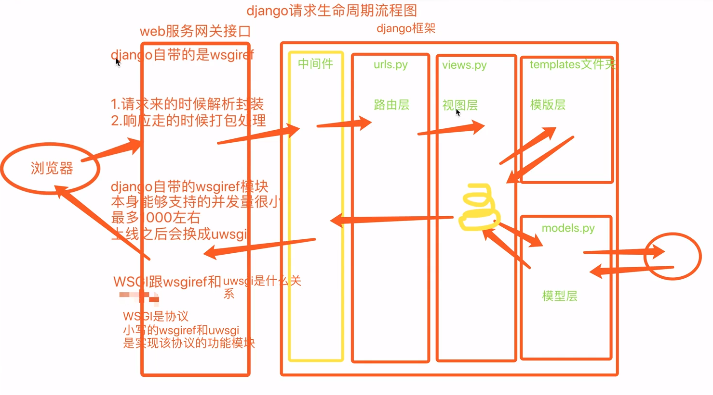

“第61天Django-02学习笔记”

# 1 Django ORM创建表关系（TODO补完数据库回来看）

表与表之间的关系分为：

一对多、多对多、一对一、没有关系

这里用一个案例来讲解：

```python
# 案例
图书表
出版社表
作者表
作者详情表

# 相互的关系
图书和出版社是一对多的关系 外键字段建在多的那一方 book
图书和作者是多对多的关系 需要创建第三张表来专门存储
作者与作者详情表是一对一

from django.db import models

# Create your models here.


# 创建表关系  先将基表创建出来 然后再添加外键字段
class Book(models.Model):
    title = models.CharField(max_length=32)
    price = models.DecimalField(max_digits=8,decimal_places=2)
    # 总共八位 小数点后面占两位
    """
    图书和出版社是一对多 并且书是多的一方 所以外键字段放在书表里面
    """
    publish = models.ForeignKey(to='Publish')  # 默认就是与出版社表的主键字段做外键关联
    """
    如果字段对应的是ForeignKey 那么会orm会自动在字段的后面加_id
    如果你自作聪明的加了_id那么orm还是会在后面继续加_id
    
    后面在定义ForeignKey的时候就不要自己加_id
    """


    """
    图书和作者是多对多的关系 外键字段建在任意一方均可 但是推荐你建在查询频率较高的一方
    """
    authors = models.ManyToManyField(to='Author')
    """
    authors是一个虚拟字段 主要是用来告诉orm 书籍表和作者表是多对多关系
    让orm自动帮你创建第三张关系表
    """


class Publish(models.Model):
    name = models.CharField(max_length=32)
    addr = models.CharField(max_length=32)


class Author(models.Model):
    name = models.CharField(max_length=32)
    age = models.IntegerField()
    """
    作者与作者详情是一对一的关系 外键字段建在任意一方都可以 但是推荐你建在查询频率较高的表中
    """
    author_detail = models.OneToOneField(to='AuthorDetail')
    """
    OneToOneField也会自动给字段加_id后缀
    所以你也不要自作聪明的自己加_id
    """

class AuthorDetail(models.Model):
    phone = models.BigIntegerField()  # 或者直接字符类型
    addr = models.CharField(max_length=32)


"""
	orm中如何定义三种关系
		publish = models.ForeignKey(to='Publish')  # 默认就是与出版社表的主键字段做外键关联
		
		authors = models.ManyToManyField(to='Author')
		
		author_detail = models.OneToOneField(to='AuthorDetail')
		
		
		ForeignKey
		OneToOneField
			会自动在字段后面加_id后缀
"""

# 在django1.X版本中外键默认都是级联更新删除的
# 多对多的表关系可以有好几种创建方式 这里暂且先介绍一种
# 针对外键字段里面的其他参数 暂时不要考虑 如果感兴趣自己可以百度试试看
```

# 2 Django请求周期图



# 3 路由层

## 3.1 路由匹配

```python
# 路由匹配
url(r'test',views.test),
url(r'testadd',views.testadd)
"""
url方法第一个参数是正则表达式
	只要第一个参数正则表达式能够匹配到内容 那么就会立刻停止往下匹配
	直接执行对应的视图函数

你在输入url的时候会默认加斜杠
	django内部帮你做到重定向
		一次匹配不行
		url后面加斜杠再来一次
"""
# 取消自动加斜杠
APPEND_SLASH = False/True	# 默认是自动加斜杠的


urlpatterns = [
    url(r'^admin/', admin.site.urls),
    # 首页
    url(r'^$',views.home),
    # 路由匹配
    url(r'^test/$',views.test),
    url(r'^testadd/$',views.testadd),
    # 尾页(了解)
    url(r'',views.error),
]
```

## 3.2 无名分组

```python
"""
分组:就是给某一段正则表达式用小括号扩起来
"""
url(r'^test/(\d+)/',views.test)

def test(request,xx):
    print(xx)
    return HttpResponse('test')
  
# 无名分组就是将括号内正则表达式匹配到的内容当作位置参数传递给后面的视图函数
```

## 3.3 有名分组

```python
"""
可以给正则表达式起一个别名
"""
url(r'^testadd/(?P<year>\d+)',views.testadd)

def testadd(request,year):
    print(year)
    return HttpResponse('testadd')

# 有名分组就是将括号内正则表达式匹配到的内容当作关键字参数传递给后面的视图函数
```

## 3.4 无名有名是否可以混合使用

**<font color=red>不能！</font>**


# 4 反向解析

通过一些方法得到一个结果 该结果可以直接访问对应的url触发视图函数

先给路由与视图函数起一个别名

	url(r'^func_kkk/',views.func,name='ooo')
## 4.1 反向解析

	# 后端反向解析
	from django.shortcuts import render,HttpResponse,redirect,reverse
	reverse('ooo')
  ## 4.2 前端反向解析
  	<a href="">111</a>