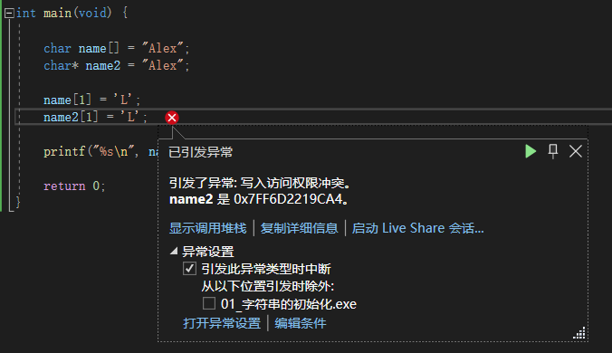
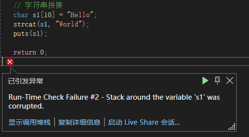

“C语言部分-Day06”

# 一、字符串

## 1.1 字符串的字面量

字符串的字面量概念：

- 是用双引号括起来的字符序列，如`“I love you”`，编译器会自动合并两个相邻的字符串（相邻：仅以空白分割）。
- 它是个常量，不能修改

字符串字面量是如何存储的？

- 如字符串"abc"，它会用4个字节存储，存储方式是：a	b	c	\0
- 最后一个'\0'代表空字符" "
- 字面量实际可以理解为`const char *`类型，无法修改

## 1.2 字符串变量

C语言是没有字符串类型的，都是依赖`字符数组`来实现，如

```c
char name[10] = "Alex";

// 存储方式，不足的会用'\0'填充
A l e x \0 \0 \0 \0 \0 \0 
```


## 1.3 字符串的初始化

字符串的初始化分为两种方式：

```c
char name[] = "Alex";	// 以数组方式存储 A l e x \0，可以修改
char * name = "Alex";	// 为字符串字面量，无法修改
```

这两种方式使用区别的案例：

```c
char name[] = "Alex";
char* name2 = "Alex";

name[1] = 'L';
name2[1] = 'L';	// Error
```




## 1.4 读写字符串

### 1.4.1 写字符串（打印）

打印字符串有两种方式：`%s`和`puts()`，它们的区别如下

```c
char name[] = "Alex";

// 方法一
printf("%s\n", name);

// 方法二
puts(name);	// 会自动添加'\n'换行符
```

### 1.4.2 读字符串（输入）

输入字符串有三种方式：`scanf()`和`gets()`和`get_s()`:


**方法一：scanf()**	<font color=red>【不推荐】</font>

- ​	会跳过前面的空白字符，然后读取字符存入数组，直到再次遇到***空白字符***为止，最后添加'\0'
- ​	永远不会包含空白字符
- ​	scanf不会检测数组越界

```c
char name[10] = "";
scanf("%s", &name);
```


**方法二：gets()**	<font color=red>【推荐】</font>

- 不跳过前面的空白字符，一直读取字符存入数组，直到遇到***换行符***为止，最后添加'\0'
- gets不会检查数组是否越界

```c
gets(name);
```

**

**方法三：gets_s()**	<font color=red>【推荐】</font>

- 不跳过前面的空白字符，一直读取字符存入数组，直到遇到***换行符***为止，最后添加'\0'
- gets_s**会检查数组是否越界**，较为安全
- 但是存在兼容性问题，使用需注意

```c
gets_s(name);
```

## 1.5 字符串的库函数

### 1.5.1 计算字符串的长度`strlen`

返回值：

- 字符串的长度

```c
char name1[5] = "Alex" ;
char name2[6] = "Haris";

// 计算字符串的长度
printf("name1的长度是%d\n", strlen(name1));	// 输出 4
```


### 1.5.2 比较两个字符串`strcmp`

返回值：

- 正整数：>
- 负整数：<
- 零：相等

```c
// 比较两个字符串
int result = strcmp(name1, name2);
if (result > 0) {
    printf("name1 > name2\n");
}
else if (result == 0) {
    printf("name1 == name2\n");
}
else {
    printf("name1 < name2\n");
}
```


### 1.5.3 字符串复制

#### 1.5.3.1 普通复制`strcpy`

参数：

- 目的字符串，源字符串

返回值：

- 该函数返回一个指向最终的目标字符串 dest 的指针

```c
// 字符串复制
char name3[6];
memset(name3, '\0', sizeof(name3));
strcpy(name3, name1);
puts(name3);	// 输出Alex
```


#### 1.5.3.2 更安全的复制`strncpy`

参数：

- 目的字符串，源字符串，拷贝长度

返回值：

- 该函数返回最终复制的字符串

```c
// 字符串复制
char name3[6];
memset(name3, '\0', sizeof(name3));
strncpy(name3, name1, 5);
puts(name3);	// 输出Alex
```

>strncpy的安全拷贝策略：
>
>```c
>char s1[10];
>strncpy(s1, "Hello", 4);	// 内存中，H e l l o, 不加'\o'
>strncpy(s1, "Hello", 6);	// 内存中，H e l l o \o，刚好
>strncpy(s1, "Hello", 8);	// 内存中，H e l l o \o \o \o，填补
>```


### 1.5.4 字符串拼接

#### 1.5.4.1 普通拼接`strcat`

参数：

- 目的字符串，源字符串

返回值：

- 返回拼接完的字符串

```c
// 字符串拼接
char s1[11] = "Hello";	
strcat(s1, "World");
puts(s1);	// 输出HelloWorld
```

>注意事项：
>
>需注意字符串的长度，以上案例中，如s1的数组长度为10，则在编译时会报错，因为拼接完的字符串最后还会加上'\0'，因此需要多留一个长度
>
>

1.5.4.2 更安全的拼接`strncat`

参数：

- char * dest：目的字符串
- const char * src：源字符串
- size_t count ：拷贝的字符数

返回值：

- char *

```c
// 安全的字符串拼接
char s2[11] = "Hello";
strncat(s2, "World", 4);
puts(s2);	// 输出HelloWorl
```

>strncat的安全拼接策略：
>
>```c
>char s1[10] = "abc";
>strncat(s1, "def", 2);	// a b c d e \0 \0 \0 \0 \0
>strncat(s1, "def", 3);	// a b c d e f \0 \0 \0 \0
>strncat(s1, "def", 6);	// a b c d e f \0 \0 \0 \0
>```
>
>因为strncat总会写入'\0'填充，所以我们一般会这样调用：
>
>```c
>strncat(s1, s2, sizeof(s1) - sizeof(s1) - 1);	// 最后的1预留给'\0'
>```


## 1.6 字符串的惯用法(TODO 例子不能跑)

1、搜索字符串的末尾（<font color=red>编译错误</font>）

```c
while(*s) {
    s++;
}
```

2、赋值字符串，包括空字符（<font color=red>编译错误</font>）

```c
while(*p++ = *s++);
```


## 1.7 字符串数组

如何表示字符串数组？

1、二维数组方式	【不推荐，空白空间很多】

```c
char planets[3][8] = { "Mecury", "Venus", "Earth" };
for (int i = 0; i < 3; i++) {
    puts(planets[i]);
}
```

2、字符指针数组	【推荐】

```c
char *planets[3] = { "Mecury", "Venus", "Earth" };
```

## 1.8 练习

1、编写自己的strlen函数

```c
int getlen(const char *arr) {
    //合法性校验
    if (arr == NULL) {
        return -1;
    }
	int num = 0;
	while (*arr != '\0') {
		arr++;
		num++;
	}
	return num;
}
```

2、编写自己的strcat函数

```c
char* mycat(char* dest, const char* src) {
	//合法性校验
	if (dest == NULL || src == NULL) {		
		return dest;
	}

	// 临时指针变量
	char* temp = dest;

	// 指针移动到dest的最后一个字符（'\0'之前）
	while (*temp != '\0') {
		temp++;
	}

	// src指针每后移一个字符，都加到dest后面
	while (*src != '\0') {
		*temp = *src;
		*temp++;
		src++;
	}

	// 最后追加'\0'符号
	*temp = '\0';
    
    // 返回合并后的字符串
	return dest;
}
```

