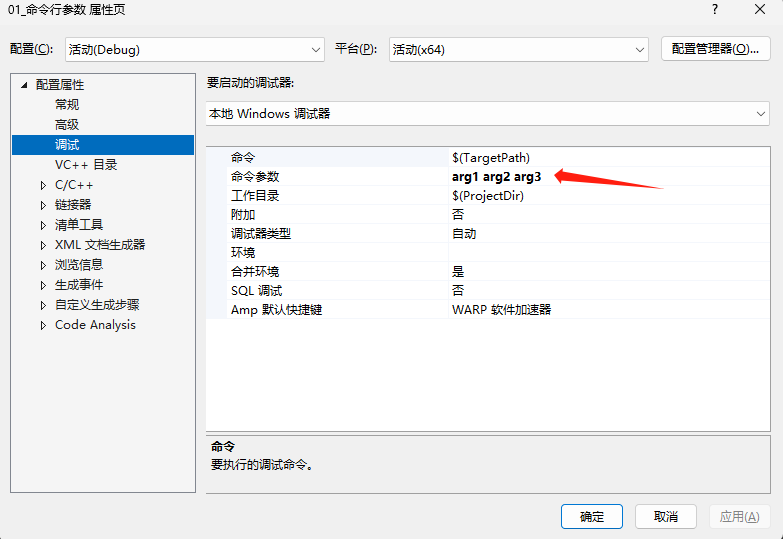

“C语言部分-Day07”

# 一、命令行参数

给程序传递参数，以main函数为例子

```c
#include <stdio.h>

int main(int argc, char* argv[]) {

	// 输出参数的个数
	printf("argc = %d\n", argc);

	// 输出每个参数
	printf("argv = ");
	for (int i = 0; i < argc; i++) {
		printf("%s ", argv[i]);
	}
	printf("\n");
	
	return 0;
}
```

以上代码的执行结果：

```c
argc = 1
argv = D:\C++\C++学习代码\01-C语言\Day07\x64\Debug\01_命令行参数.exe
```

**默认调用1个参数，即程序本身**，因此默认argc的个数为1，argv为程序本身

>**注意事项：**
>
>如何在VS中给程序加参数？
>
>**【项目】--【属性】--【调试】--【命令参数】**
>
>
>
>设置之后的运行结果：
>
>```c
>argc = 4
>argv = D:\C++\C++学习代码\01-C语言\Day07\x64\Debug\01_命令行参数.exe arg1 arg2 arg3
>```


# 二、结构体（※※※）

C语言的结构体，相当于其它高级语言中的类，但是C语言只能在结构体中定义数据，不能定义方法。

如表示一个学生：

```c
struct student {
    int number;	// 学号
    char name[25];	// 姓名
    bool gender;	// 性别	
    int chinese;	// 语文
    int math;	// 数学
    int english;	// 英语
}
```

使用结构体创建对象：

```c
// 创建对象
struct student stu1 = { 1, "大圣", true, 89, 22, 67 };
```


## 2.1 结构体的内存布局

以上面的学生数据结构为例，它在内存中的存储布局如下：

```c
number	name	gender	[...]	chinese		math	english
4		25		1		2		4			4		4
```

为何占用44字节空间，而不是42字节？

- 多出来的`[...]`是填充的`padding`，用于对齐 ---- 方便早期CPU寻址
- 因为number + name + gender = 30，而后面的chinese是4，为方便对齐，前面需要是4的倍数，因此+2


## 2.2 结构体对象的初始化

结构体的初始化方式：

```c
// 1、一次性给所有属性赋值
struct student stu1 = { 1, "大圣", true, 89, 22, 67 };
// 2、缺省初始化，省略的值自动赋值为0
struct student stu2 = { 1, "大圣", true };
// 3、按属性赋值
stu2.gender = 30;
```

对结构体的操作

```c
// 1、获取成员
stu2.name
    
// 结构体赋值
stu3 = stu1;

// 打印结构体的数据（值传递）
void printStu(struct student s) {
    printf("name = %s\n", s.name);
}
```

>**注意事项：**
>
>- 当结构体作为参数或返回值时，会拷贝整个结构体的数据（值传递）
>
>- 函数内的修改，不影响实参
>
>- 为了避免拷贝数据，一般会传指针
>- 指针传递时，`.`符号将变为`->`符号，`s->name`相当于`(*s).name`的简写
>
>```c
>void printStu(struct student *s) {
>    printf("name = %s\n", s->name);
>}
>```


## 2.3 结构体取别名

如2.1中定义的结构体，当我们使用它时，每次都需要在前面加上`struct`标识，比较麻烦：

```c
struct student stu3 = .....
```

这时候，我们可以用`typedef`给该结构体取个别名，使用起来会方便一些

```c
// 使用typedef取别名
typedef struct student {	
    int number;	// 学号
    char name[25];	// 姓名
    bool gender;	// 性别	
    int chinese;	// 语文
    int math;	// 数学
    int english;	// 英语
} STU;
```

再使用结构体：

```c
// 创建对象
STU stu4 = {4， "小明", false, 22, 33, 44};

// 函数定义
void printStu(STU *s) {
    printf("name = %s\n", s->name);
}
```

**还能再精简**

```c
// student都可以去掉
typedef struct {	
    int number;	// 学号
    char name[25];	// 姓名
    bool gender;	// 性别	
    int chinese;	// 语文
    int math;	// 数学
    int english;	// 英语
} STU;
```


# 三、枚举

## 3.1 枚举类型的使用

以扑克牌花色为例，如果使用宏定义，代码如下：

```c
// 宏定义扑克牌花色
#define SUIT int
#define SPADE 0 // 黑
#define HEART 1 // 红
#define CLUB 2	// 梅
#define DIANMOND 3 // 方

int main(void) {
	// 使用宏定义
	SUIT suit = SPADE;
	return 0;
}
```

改用枚举的代码如下：

```c
// 枚举扑克牌花色
enum suit { SPADE, HEART, CLUB, DIANMOND };

// 使用枚举
enum suit s = SPADE;
```

## 3.2 使用typdedef取别名

简化枚举的使用

```c
// 枚举扑克牌花色
typedef enum suit{ 
    SPADE, 
    HEART, 
    CLUB, 
    DIANMOND 
}SUIT;

// 使用枚举
SUIT s2 = HEART;
```

>**注意事项：**
>
>枚举类型的值，本质上都是一些整数，默认从0开始，可以手动指定
>
>```c
>typedef enum suit{ 
>    SPADE = 6, 
>    HEART = 8, 
>    CLUB = 19, 
>    DIANMOND = 20 
>}SUIT;
>```
>
>如果混合使用，下一个元素的值默认为上一个元素的值+1，案例如下：
>
>```c
>typedef enum suit{ 
>    SPADE = 6, 
>    HEART,	// 7 
>    CLUB = 19, 
>    DIANMOND	// 20
>}SUIT;
>```


# 四、指针的高级应用

## 4.1 动态内存分配

所谓动态内存分配即是在**堆上分配内存**，它在C语言中有举足轻重的地位，因为它是链式结构的基础。在头文件`stdlib.h`中定义有三个动态内存分配的函数，分别是：

- malloc
- calloc
- realloc

### 4.1.1 malloc的使用

定义：

```c
void * malloc(size_t size);
```

作用：

- 分配size个字节的内存空间
- 内存块不会清零
- 若分配不成功，返回空指针

使用案例：

```c
// malloc在堆上开辟空间
int* p = (int*)malloc(sizeof(int));
*p = 10;
printf("p = %d\n", *p);
```


### 4.1.2 calloc的使用

定义：

```c
void * calloc(size_t num, size_t size);
```

作用：

- 为num个元素分配内存空间，每个元素的大小为size字节
- 对内存块清零
- 若分配不成功，返回空指针

使用案例：

```c
// calloc开辟空间
int* p2 = (int*)calloc(4, sizeof(int));
p2[0] = 12;	
p2[1] = 22;
p2[2] =	32;
p2[3] = 42;
```

