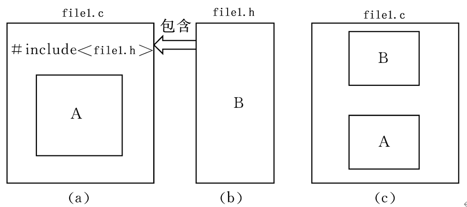
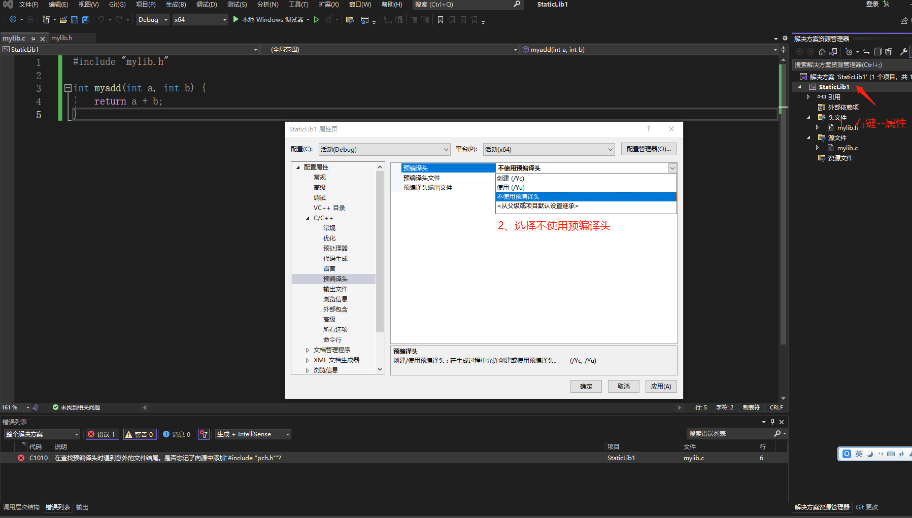

“C高级编程第6天学习笔记”

## 一、数类型和函数指针

### 1.1 函数类型

什么是函数类型？

这个得从函数的三要素说起，函数由返回值、参数、函数名组成

而函数类型主要由它的返回值和参数类型决定，与函数名无关

比如在以下案例中：

```c
int myfunction(int a, int b);
```

函数类型是：`int (int a, int b);`

### 1.2 函数指针

#### 1.2.1 概念

那么什么又是函数指针？（简单一句话：指向函数的指针）

和其他指针类型一样，函数指针指向某种特定类型的指针，不过它指向的是函数而非对象

比如在以下案例中：

```c
int myfunction(int a, int b);
```

函数指针pf是：`int (*pf)(int a, int b);`

#### 1.2.1 函数名会自动转换成指针

当把函数作为一个值使用时，该函数会自动转换成指针，比如

```c
pf = myfunction;
// 等价于
pf = &myfunction;   
```

案例如下：

```c
#include <stdio.h>

typedef int(p)(int, int);

int my_func(int a, int b) {
	printf("%d %d\n", a ,b);
	return 0;
}

void test() {
	p p1;
	// p1(10, 20); // Error, 不能指直接调用，只描述了函数类型，但是没有定义函数体，没有函数体没法调用
	p* p2 = my_func; // 正确，函数自动转换成指针
	p* p3 = &my_func; // 正确，效果同上
	p2(10, 20); // 输出"10 20"
	p3(20, 30); // 输出"20 30"
```

#### 1.2.2 函数指针的定义方式

函数指针的定义方式有两种

- 先定义函数类型，更具类型定义函数指针变量
- 直接定义函数指针变量

案例如下：

```c
#include <stdio.h>

int myfunc(int a, int b) {
	printf("ret: %d\n", a + b);
	return 0;
}

// 方式一：先定义函数类型，通过类型定义指针
void test01() {
	typedef int(FUNC_TYPE)(int, int);
	FUNC_TYPE* f = myfunc;
	// 两种调用都可以
	f(10, 20); // ret:30
	(*f)(10, 20); // ret:30
}

// 方式二：直接定义函数指针变量
void test02() {	
	typedef int(*FUNC_TYPE)(int, int);
	FUNC_TYPE f = myfunc;
    // 两种调用都可以
	f(10, 20); 
	(*f)(10, 20);
}

int main() {
	test01();
	test02();
}
```

#### 1.2.3 函数指针数组

函数指针数组，里面每个元素都是函数指针，案例如下：

```c
#include <stdio.h>

// 定义函数
void func01(int a) {
	printf("func01: %d\n", a);
}

void func02(int a) {
	printf("func02: %d\n", a);
}

void func03(int a) {
	printf("func03: %d\n", a);
}

void test() {
	// 定义函数指针数组有两种方式
#if 0
	// 方式一：
	void(*func_array[](int)) = { func01, func02, func03 };
#else
	void(*func_array[3])(int);
	func_array[0] = func01;
	func_array[1] = func02;
	func_array[2] = func03;
#endif

	for (int i = 0; i < 3; i++) {
		// 调用函数
		func_array[i](10 + i);
		// 或者
		(*func_array[i])(20 + i);
	}
}

int main() {
	test();
	return 0;
}
```

### 1.3 回调函数

#### 1.3.1 概念

什么是回调函数？

将函数指针作为函数参数，即称为回调函数

比如：

```c
// 普通函数，形参为普通变量
void func01(int a){}
// 回调函数，形参为函数指针
void func02(int(*p)(int a)){}
```

那么把函数指针作为变量(回调函数)的作用是什么？

最常见的用途之一是传递函数的地址

#### 1.3.2 回调函数案例

简易计算器的案例

```c
/*
	计算器案例，学习回调函数
*/

#define _CRT_SECURE_NO_WARNINGS

#include <stdio.h>

// 定义函数
int plus(int a, int b) {
	return a + b;
}

int sub(int a, int b) {
	return a - b;
}

int mul(int a, int b) {
	return a * b;
}

int division(int a, int b) {
	return a / b;
}

// 回调函数
void calculator(int(*mycal)(int, int), int a, int b) {
	int ret = mycal(a, b);
	printf("ret: %d\n", ret);
}

void subcall(int flag, int num1, int num2) {
	
}

int main() {
	int select = 0;
	int num1 = 0;
	int num2 = 0;
	int flag = 1;
	while (flag != 0) {
		printf("---简易计算器---\n");
		printf("1.加法+\n");
		printf("2.减法-\n");
		printf("3.乘法*\n");
		printf("4.除法/\n");
		printf("5.退出\n");
		printf("请输入选择项：");
		scanf("%d", &select);

		if (select != 5) {
			printf("请输入第1个数: ");
			scanf("%d", &num1);
			printf("请输入第2个数: ");
			scanf("%d", &num2);
		}

		switch (select)
		{
		case 1:
			calculator(plus, num1, num2);
			break;
		case 2:
			calculator(sub, num1, num2);
			break;
		case 3:
			calculator(mul, num1, num2);
			break;
		case 4:
			calculator(division, num1, num2);
			break;
		case 5:
			flag = 0;
			break;
		default:
			break;
		}
	}

	return 0;
}
```

### 1.4 函数指针和指针函数

两个概念容易混淆

函数指针：

​	指向函数的指针

指针函数：

​	返回类型是指针的函数

## 二、预处理

### 2.1 基本概念

编译C语言源代码包含四个步骤：

1. 预处理：预处理器根据`#`开头的命令，修改C源代码生成`.i`文件
2. 编译：将C代码`.i`文件翻译成汇编代码`.s`文件
3. 汇编：汇编编译`.s`文件，生成二进制文件`.o`
4. 链接：链接各`.o`文件以及库文件，生成可执行程序


---

### 2.2 文件包含指令#include

#### 2.2.1 文件包含处理

什么是文件包含处理？

将`#include`指定的文件内容和当前源文件整合到一起，图示如下：

 

#### 2.2.2 <>和""的区别

- #include<file.h>
  - 按系统指定的目录检索文件
  - 常用于包含库函数的头文件
- #include "file.h"：
  - 现在file.c所在的当前目录找file.h，如果找不到，再按系统指定的目录检索。
  - 常用于包含自定义的头文件

理论上#include可以包含任意格式的文件(.c、.h等)，但一般用于头文件的包含。

---

### 2.3 宏定义

#### 2.3.1 宏变量

为什么要用宏变量？

如果程序中大量使用到了100这个值，为了方便管理，我们可以将其定义为：

```c
const int num = 100;
```

但如果我们使用num这个变量去定义一个数组，在不支持C99标准的编译器上是行不通的，因为num并不是一个编译器变量，此时我们需要用到#define定义宏变量。

```c
#include <stdio.h>

#define NUM 100

int main() {
	const int num = 100;
	int nums[num] = { 0 }; // Error
	int nums[NUM] = { 0 }; // OK
	return 0;
}
```

为什么宏变量可以行得通？因为在编译预处理时，解释器便会将代码中所有的NUM替换成100，这个过程称为“宏展开”。要注意：

**使用宏变量的注意事项**

- <font color=red>宏定义只在宏定义的文件中起作用</font>
- 宏名一般用大写，以便于与变量区别；
- 宏定义可以是常数、表达式等；
- 宏定义不作语法检查，只有在编译被宏展开后的源程序才会报错；
- 宏定义不是C语言，不在行末加分号；
-  宏名有效范围为从定义到本源文件结束；
- 可以用#undef命令终止宏定义的作用域；
- 在宏定义中，可以引用已定义的宏名；

#### 2.3.2 宏函数

在项目中，可以把一些短小而又频繁使用的函数写成宏函数，这样做有什么好处？因为普通函数有参数压栈、跳转、返回等操作的开销，而宏函数没有，可以提高程序效率。宏函数使用案例如下：

```c
#include <stdio.h>

// 定义宏变量
#define PI 3.14

// 定义宏函数
#define SUM(x,y) (x + y)

void test01() {
	double r = 60;
	double girth = PI * r * r;
	printf("周长 = %f", girth);

}

void test02() {
	int a = SUM(7, 8);
	printf("sum = %d", a);
}

int main() {
	test01(); // 周长 = 11304.000000
	test02(); // sum = 15
	return 0;
}
```

**使用宏函数的注意事项:**

- 宏的名字中不能有空格，但是在替换的字符串中可以有空格。ANSI C允许在参数列表中使用空格；
- 用括号括住每一个参数，并括住宏的整体定义。
- 用大写字母表示宏的函数名。
- 如果打算宏代替函数来加快程序运行速度。假如在程序中只使用一次宏对程序的运行时间没有太大提高。

## 三、条件编译

一般情况下，源程序中的所有代码行都将参加编译，但有时希望部分代码行只在满足一定条件时才编译，这就需要设置条件编译。

1、测试存在条件

```c
#ifdef 条件
	程序段1
#else 条件
    程序段2
#endif
```

2、测试不存在条件

```c
#ifndef 条件
	程序段1
#else 条件
    程序段2
#endif
```

### 3.1 条件编译有哪些使用场景？

1、防止头文件被重复引用

```c
#ifndef _SOMEFILE_H
#define _SOMEFILE_H

//需要声明的变量、函数
//宏定义
//结构体

#endif
```

2、设置不需要编译的代码

```c
#include <stdio.h>

// 定义宏函数
#define SUM(x,y) (x + y)

#if 0
// 设置0不会编译，设置1将编译
void test02() {
	int a = SUM(7, 8);
	printf("sum = %d", a);
}
#endif

int main() {
	return 0;
}
```

3、代码分路编译

```c
#include <stdio.h>

// 宏函数定义
#define SUM(x,y) (x + y)
//#define __linux__ 0	// 开启输出sum = 15
#define __windows__ 1 // 开启输出sum = 30

// 按条件分路编译
#ifdef __linux__
void test02() {
	int a = SUM(7, 8);
	printf("sum = %d", a);
}
#elif __windows__
void test02() {
	int a = SUM(10, 20);
	printf("sum = %d", a);
}
#else 
void test02() {
	printf("都没定义，出错"); // 都不开启，输出这个
}
#endif

int main() {
	test02();
	return 0;
}
```

## 四、库的封装和使用

### 4.1 库的基本概念

什么是库？

库是已经写好的、成熟的、可复用的代码。每个程序都需要依赖很多的底层库，因为不可能每个人的代码都从零开始编写，因此库具有十分重要的意义。

库的用途是什么？

开发中经常有一些公共代码是需要反复使用的，可以把这些代码编译为库文件，方便调用。

怎么看待库文件？

库文件可以简单的看成是一组目标文件的集合，库文件是这些目标文件经过压缩打包之后形成的一个文件。

---

### 4.2 windows下静态库的创建和使用

以一个小案例来演示如何创建和使用静态库

#### 4.2.1 创建静态库

使用VS创建“静态库”项目`StaticLib1`，创建`mylib.h`文件

```c
// mylib.h
#pragma once
int myadd(int a, int b);
```

创建`mylib.c`文件

```c
#include "mylib.h"

int myadd(int a, int b) {
	return a + b;
}
```

**编译报错**：在查找预编译头时遇到意外的文件结尾。是否忘记了向源中添加“#include “pch.h”

处理方法：设置属性 -- 不使用预编译头



编译之后生成库文件：C:\Users\fr724\Desktop\C-Demo\03-静态库\StaticLib1\x64\Debug\StaticLib1.lib

#### 4.2.1 使用静态库

使用静态库有三种方法：

**方法一**：通过项目属性添加

>1. 添加工程的头文件目录：工程---属性---配置属性---c/c++---常规---附加包含目录：加上头文件存放目录。
>2. 添加文件引用的lib静态库路径：工程---属性---配置属性---链接器---常规---附加库目录：加上lib文件存放目录。
>3. 然后添加工程引用的lib文件名：工程---属性---配置属性---链接器---输入---附加依赖项：加上lib文件名。

**方法二**：使用编译语句添加

```c
#pragma comment(lib,"./mylib.lib")
```

**方法三**：直接添加到工程中

>就像你添加.h和.c文件一样,把lib文件添加到工程文件列表中去.
>
>切换到"解决方案视图",--->选中要添加lib的工程-->点击右键-->"添加"-->"现有项"-->选择lib文件-->确定.

#### 4.2.2 静态库的优缺点

优点：

- 编译后的二进制文件方便使用：在函数编译时会把库里所有的函数声明和实现都拷贝到二进制可执行文件中（如.exe），就算把.lib文件删了，编译出的程序也能正常运行
- 运行速度更快

缺点：

- 占用磁盘和内存空间：最终生成的可执行代码量相对变多
- 不方便迭代版本：一旦程序中有模块更新，都需要重新编译链接再发布给用户，用户也要重新安装整个程序

---

### 4.3 windows下动态库的创建和使用

要解决静态库产生的空间占用大、不方便迭代版本等问题，最简单的方法就是把程序的模块互相分割开，形成独立的文件，而不是将他们静态的链接在一起。换个说法，就是不把各模块直接加到程序中，而是等程序运行的时候再进行动态链接，这就是动态链接的基本思想。

#### 4.3.1 创建动态库

1、VS创建”动态库“项目，分别编写头文件和库函数文件

```c
// 头文件test.c
#pragma once
__declspec(dllexport) int myminus(int a, int b);
```

```c
// 库函数文件test.c
#include"test.h"
__declspec(dllexport) int myminus(int a, int b){
	return a - b;
}
```

2、编译生成动态库dll文件

#### 4.3.2 使用动态库

**方法一**：隐式调用

>- 创建主程序TestDll，将test.h、mydll.dll和mydll.lib复制到源代码目录下。
>- (P.S：头文件Func.h并不是必需的，只是C++中使用外部函数时，需要先进行声明)
>- 在程序中指定链接引用链接库 : #pragma comment(lib,"./mydll.lib")

**方法二**：显示调用（测试失败）

```c
HANDLE hDll; //声明一个dll实例文件句柄
hDll = LoadLibrary("mydll.dll"); //导入动态链接库
MYFUNC minus_test; //创建函数指针
//获取导入函数的函数指针
minus_test = (MYFUNC)GetProcAddress(hDll, "myminus");
```

#### 4.3.3 两个疑问

**疑问一：**__declspec(dllexport)是什么意思？

>动态链接库中定义有两种函数：导出函数(export function)和内部函数(internal function)。 导出函数可以被其它模块调用，内部函数在定义它们的DLL程序内部使用。

**疑问二：**动态库的lib文件和静态库的lib文件的区别？

>在使用动态库的时候，往往提供两个文件：一个引入库（.lib）文件（也称“导入库文件”）和一个DLL（.dll）文件。虽然引入库的后缀名也是“lib”，但是，动态库的引入库文件和静态库文件有着本质的区别，对一个DLL文件来说，其引入库文件（.lib）包含该DLL导出的函数和变量的符号名，而.dll文件包含该DLL实际的函数和数据。在使用动态库的情况下，在编译链接可执行文件时，只需要链接该DLL的引入库文件，该DLL中的函数代码和数据并不复制到可执行文件，直到可执行程序运行时，才去加载所需的DLL，将该DLL映射到进程的地址空间中，然后访问DLL中导出的函数。


