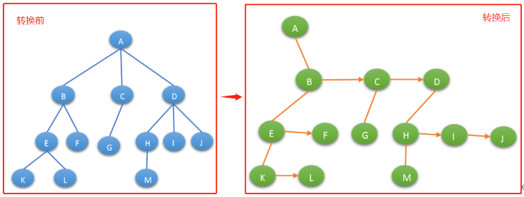
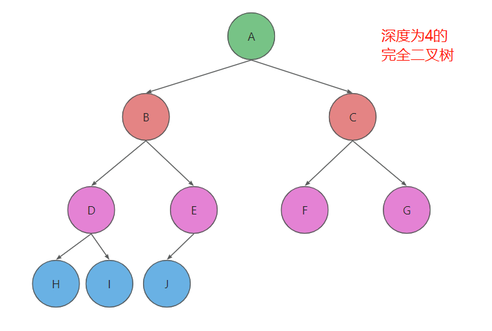

# 一、树和二叉树

## 1.1 树

### 1.1.1 树的基本概念

#### 1.1.1.1 树的定义

什么是树？

- 由一个或多个(n≥0)结点组成的有限集合T，有且仅有一个结点称为根（root）

- 当n>1时，其余的结点分为m(m≥0)个互不相交的有限集合T1,T2，…，Tm。每个集合本身又是棵树，被称作这个根的子树 。

  

#### 1.1.1.2 树的结构特点

结构特点有哪些？

- 非线性结构，有一个直接前驱，但可能有多个直接后继（1:n）
- 树的定义具有递归性，树中还有树。
- 树可以为空，即节点个数为0。

#### 1.1.1.3 常用术语

区分各术语：

- **根** --- 即根结点(没有前驱)
- **叶子** --- 即终端结点(没有后继)
- 森林 --- 指m棵不相交的树的集合(例如删除A后的子树个数)
- 有序树 --- 结点各子树从左至右有序，不能互换（左为第一）
- 无序树 --- 结点各子树可互换位置。
- **双亲** --- 即上层的那个结点(直接前驱) parent
- **孩子** --- 即下层结点的子树 (直接后继) child
- 兄弟 --- 同一双亲下的同层结点（孩子之间互称兄弟）sibling
- 堂兄弟 --- 即双亲位于同一层的结点（但并非同一双亲）cousin
- 祖先 --- 即从根到该结点所经分支的所有结点
- 子孙 --- 即该结点下层子树中的任一结点

- 结点 --- 即树的数据元素                       
- **结点的度** --- 结点挂接的子树数（有几个直接后继就是几度）
  - 示例图中，对于root（中国）结点的度是4，对于广东省结点的度是2
- **结点的层次** --- 从根到该结点的层数（根结点算第一层） 
  - 示例图中：对于长沙市这个结点，在第3层
- 终端结点 --- 即度为0的结点，即叶子       
- 分支结点 --- 除树根以外的结点（也称为内部结点）
- **树的度** --- 所有结点度中的最大值（Max{各结点的度}）
  - 示例图中：树的度是4    
- **树的深度(或高度)** --- 指所有结点中最大的层数（Max{各结点的层次}）
  - 示例图中：树的深度是4

### 1.1.2 树的表示方式

树的表示方式有三种：

- 图形表示法（图）：

  - 用图形表示：如1.1.1中的图，将树用图画出来

- 广义表示法（文字）：

  - 用广义表示法表示1.1.1的图为：

    中国（湖南（长沙，益阳），山西（太原），广东（广州，深圳），四川）

- 左孩子右兄弟表示法（方便写代码）：

  - 比如使用该方法可以将一颗多叉树转换为二叉树（最多两个叉的树）

    

  结点结构为：

  | 左指针--指向子结点 | 数据 | 右指针--指向兄弟结点 |
  | ------------------ | ---- | -------------------- |
  | LPointer           | Data | RPointer             |

## 1.2 二叉树

### 1.2.1 二叉树的基本概念

什么是二叉树？

- 二叉树是一个有n个结点的有限集合（n>=0），由**一个根结点**和两棵互不相交的、分别称为**左子树和右子树**的二叉树组成 。

二叉树的基本特征：

- 每个结点最多只有两棵子树
- 左子树和右子树的次序不能颠倒（有序树）

### 1.2.2 二叉树的性质

二叉树有5条性质，其中通用性质3条：

1. 在二叉树的第`i`层上至多有`2^i-1`个结点（i>0）
2. 深度为`k`的二叉树至多有`2^k-1`个结点（k>0）
3. 对于任何一棵二叉树，若度为2的结点数有`n2`个，则叶子数`n0`必定为`n2＋1` （即`n0=n2+1`）

完全二叉树性质2条：

1. 具有n个结点的完全二叉树的深度必为`[log2n] + 1`
2. 对完全二叉树，若从上至下、从左至右编号，则编号为`i `的结点，其左孩子编号必为`2i`，其右孩子编号必为`2i＋1`；其双亲的编号必为`i/2`（i＝1 时为根,除外）

### 1.2.3 满二叉树和完全二叉树

#### 1.2.3.1 满二叉树

一棵深度为`k`，且有`2^k-1`个结点的二叉树

它的特点：每层都“充满”了结点，如图所示，它有`2^4-1 = 15`个结点

#### 1.2.3.1 完全二叉树

定义：

前`k-2`层：每个节点都有两个孩子，`节点饱和`

前`k-1`层：节点肯定是`饱和的`—>到达了最大值

第`k-1`层：不一定所有的节点都有孩子节点，如果有孩子节点，至少要是左孩子节点，有可能出现不饱和节点

