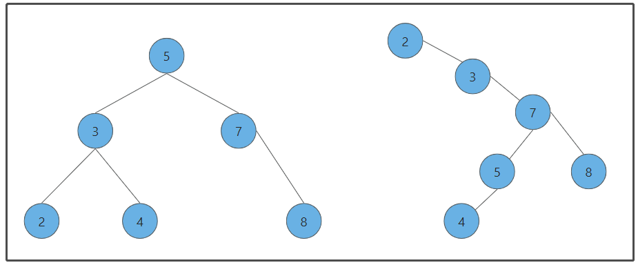

# 数据结构-查找

## 1 二叉排序树

### 1.1 二叉排序树的定义

什么是二叉排序树？

二叉排序树(Binary sort tree)，又称为二叉搜索树(Binary search tree)

它可以是一棵空树，或者是满足如下性质的二叉树：

- 若它的**左子树**非空，则左子树上左右结点的值均**小于**根结点的值
- 若它的**右子树**非空，则右子树上左右结点的值均**大于**根结点的值
- 左、右子树本省又各是一棵二叉排序树

以上性质又简称为二叉排序树性质（BST性质）

### 1.2 二叉排序树的特点

二叉排序树有如下特点：

- 二叉排序树中的任意一个结点**x**，其左子树中的任意一个结点**y**（若存在）的关键字必小余**x**的关键字，同理，其右子树中的任意一个结点**z**（若存在）的关键字必大于**x**的关键字
- 二叉排序树中，各结点的关键字是唯一的
- 按中序遍历该树所得到的中序序列是一个递增有序序列。

>注意：
>
>实际应用中，不能保证被查找的数据集中各元素的关键字互不相同，所以可将二叉排序树定义中BST性质(1)里的"小于"改为"大于等于"，或将BST性质(2)里的"大于"改为"小于等于"，甚至可同时修改这两个性质。

以下两棵二叉排序树，他们的中序序列均是有序序列：2,3,4,5,7,8

### 1.3 二叉排序树操作

一个无序序列可以通过构造成一棵二叉排序树来变成一个有序序列，构造树的过程即是对无序序列进行排序的过程。每次插入的新结点都是二叉排序树上的新的叶子结点

#### 1.3.1 存储结构

二叉排序树通常采用二叉链作为存储结构

