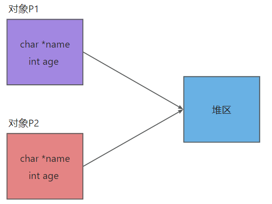
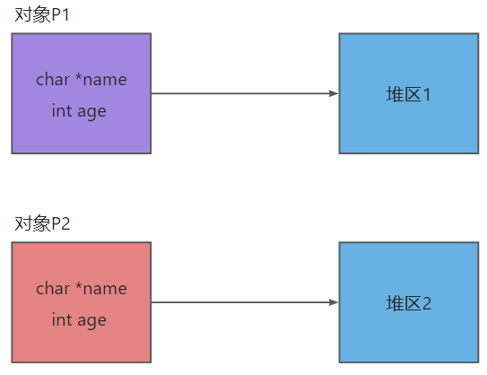

# 一、类和对象

## 1.1 类和对象基本概念

### 1.1.1 C和C++中struct的区别

C语言struct只有变量

C++struct中既有变量，又有函数

### 1.1.2 类的封装

#### 1.1.2.1 对象和封装

1）什么是对象？

我们编写程序的目的是为了解决现实中的问题，而这些问题都是由各种对象（事物）组成，我们在计算机中

要解决问题，首先要做就是要将这个问题的参与者：**对象**抽象到计算机程序中，也就是用程序语言表示现实

的事物。

2）如何用程序语言来表示对象？

对象都具有自身的属性，一些自身具有的行为，所以如果我们能把对象的属性和行为表示出来，那么就可以抽象出

来这个对象。比如我们要表示人这个对象，在**C语言**中，我们可以这么表示:

```c++
// 对象：人，用结构体表示
typedef struct Person {
	char name[48];
	int age;
}Person;
```

但是在c语言中，存在一个问题：行为和属性是分开的。

也就是说吃饭这个属性不属于某类对象，而属于所有的共同的数据，所以不单单是`PeopleEat函数`可以调用`Person的数据`，`AnimalEat`也可以调用`Person数据`，那么万一调用错误，将会导致问题发生。

以下代码在C编译通过，C++编译失败

```c
#include <stdio.h>

// 对象：人，属性
typedef struct Person {
	char name[48];
	int age;
}Person;

// 对象: 动物，属性
typedef struct Animal {
	char name[64];
	int age;
	int type;
}Animal;

// 行为：人吃饭
void PersonEat(Person *person) {
	printf("%s在吃人吃的饭\n", person->name);
}

// 行为：动物吃饭
void AnimalEat(Animal *animal) {
	printf("%s在吃动物吃的饭\n", animal->name);
}

int main() {
	Person person;
	strcpy(person.name, "小明");	// 输出"小明在吃动物吃的饭"
	person.age = 18;
	AnimalEat(&person);	

	return 0;
}
```

从这个案例我们应该可以体会到，属性和行为应该放在一起，一起表示一个具有属性和行为的对象。

假如某对象的某项属性不想被外界获知，比如说漂亮女孩的年龄不想被其他人知道，那么年龄这条属性应该作为女

孩自己知道的属性；或者女孩的某些行为不想让外界知道，只需要自己知道就可以。那么这种情况下，封装应该再

提供一种机制能够给属性和行为的访问权限控制住。所以说**封装特性包含两个方面，一个是属性和变量合成一个**

**整体，一个是给属性和函数增加访问权限。**

>封装：
>
> 1、把变量（属性）和函数（操作）合成一个整体，封装在一个类中
>
> 2、对变量和函数进行访问权限控制

#### 1.1.2.2 访问权限

访问权限分为三种：

1、在类的内部，没有访问权限之分，所有成员都可以互相访问

2、在类的外部，访问权限有意义，分为：public、private、protected

3、在类的外部，只有public修饰的成员才能被访问，在没有设置继承和派生时，private和protected是同等级的，外部不允许访问

| 访问属性  | 属性 | 对象内部 | 对象外部 |
| --------- | ---- | -------- | -------- |
| public    | 公有 | 可访问   | 可访问   |
| protected | 保护 | 可访问   | 不可访问 |
| provate   | 私有 | 可访问   | 不可访问 |

案例：创建类，添加访问权限

```c++
#include <iostream>
using namespace std;

class Person {
public:
	void Call() {
		cout << "个人介绍噼里啪啦！" << endl;
	}
public:
	int mTall; // 多高
protected:
	int mMoney; // 多富
private:
	int mAge; // 年龄，不想被外人知道
};

int main() {
	Person p;
	p.mTall = 180;
	p.Call();
	// p.mTall; 保护成员，外部无法访问 
	// p.mTall; 私有成员，外部无法访问
	return 0;
}
```

>扩展：
>
>上述代码将class换成struct也能编译运行，效果类似，它们两个的主要区别就是
>
> class默认访问权限为private，而struct默认访问权限为public

### 1.1.3 将成员变量设置为private

1、可赋予客户端访问数据的一致性。

如果成员变量不是public，客户端唯一能够访问对象的方法就是通过成员函数。如果类中所有public权限的成员都是函数，客户在访问类成员时只会默认访问函数，不需要考虑访问的成员需不需要添加(),这就省下了许多搔首弄耳的时间。

2、 可细微划分访问控制。

使用成员函数可使得我们对变量的控制处理更加精细。如果我们让所有的成员变量为public，每个人都可以读写它。如果我们设置为private，我们可以实现“不准访问”、“只读访问”、“读写访问”，甚至你可以写出“只写访问”

案例如下：

```c++
class AccessLevels{
public:
	//对只读属性进行只读访问
	int getReadOnly(){ return readOnly; }
	//对读写属性进行读写访问
	void setReadWrite(int val){ readWrite = val; }
	int getReadWrite(){ return readWrite; }
	//对只写属性进行只写访问
	void setWriteOnly(int val){ writeOnly = val; }
private:
	int readOnly; //对外只读访问
	int noAccess; //外部不可访问
	int readWrite; //读写访问
	int writeOnly; //只写访问
};
```

## 1.2 面向对象程序设计案例

### 1.2.1 设计立方体类

设计立方体类(Cube)，求出立方体的面积( 2\*a\*b + 2\*a\*c + 2\*b\*c )和体积( a \* b \* c)，分别用全局函数和成员函数判断两个立方体是否相等。

```c++
#include <iostream>
using namespace std;

// 立方体类
class Cube {
private:
	int height; // 高
	int weight;	// 宽
	int length;	// 长
public:
	// 设置长宽高
	void setHeight(int h) { this->height = h; }
	void setWeight(int w) { this->weight = w; }
	void setLength(int l) { this->length = l; }
	
	// 获取长宽高
	int getHeight() { return this->height; }
	int getWeight() { return this->weight; }
	int getLength() { return this->length; }

	// 计算面积
	int calculateS() {
		return (height * length + height * weight + weight * length) * 2;
	}

	// 计算体积
	int calculateV() {
		return height * length * weight;
	}

	//成员方法, 判断两个立方体是否相等
	bool CubCompare(Cube& c) {
		if (getLength() == c.getLength() && getWeight() == c.getWeight() && getHeight() == c.getHeight()) {
			return true;
		}
		return false;
	}

};


int main() {
	Cube c1;
	c1.setHeight(10);
	c1.setLength(5);
	c1.setWeight(8);

	Cube c2;
	c2.setHeight(20);
	c2.setLength(35);
	c2.setWeight(48);

	Cube c3;
	c3.setHeight(10);
	c3.setLength(5);
	c3.setWeight(8);

	cout << "c1的面积是: " << c1.calculateS() << endl;	// 340
	cout << "c2的体积是: " << c2.calculateV() << endl;	// 33600
	cout << "c1和c2是否一样？ " << c1.CubCompare(c2) << endl;	 // 0 
	cout << "c1和c3是否一样？ " << c1.CubCompare(c3) << endl;	 // 1

	return 0;
}
```

### 1.2.2 点和圆的关系

设计一个圆形类（AdvCircle），和一个点类（Point），计算点和圆的关系。

假如圆心坐标为x0, y0, 半径为r，点的坐标为x1, y1：

1）点在圆上：(x1-x0)\*(x1-x0) + (y1-y0)\*(y1-y0) == r*r

2）点在圆内：(x1-x0)\*(x1-x0) + (y1-y0)\*(y1-y0) < r*r

3）点在圆外：(x1-x0)\*(x1-x0) + (y1-y0)\*(y1-y0) > r*r

```c++
#include <iostream>
using namespace std;

//点类
class Point {
public:
	void setX(int x) { mX = x; }
	void setY(int y) { mY = y; }
	int getX() { return mX; }
	int getY() { return mY; }
private:
	int mX;
	int mY;
};

//圆类
class Circle {
public:
	void setP(int x, int y) {
		mP.setX(x);
		mP.setY(y);
	}
	void setR(int r) { mR = r; }
	Point& getP() { return mP; }
	int getR() { return mR; }
	//判断点和圆的关系
	void IsPointInCircle(Point& point) {
		int distance = (point.getX() - mP.getX()) *
            (point.getX() - mP.getX()) +
            (point.getY() - mP.getY()) *
            (point.getY() - mP.getY());
		int radius = mR * mR;
		if (distance < radius) {
			cout << "Point(" << point.getX() << "," << point.getY() << ")在圆内!" << endl;
		}
		else if (distance > radius) {
			cout << "Point(" << point.getX() << "," << point.getY() << ")在圆外!" << endl;
		}
		else {
			cout << "Point(" << point.getX() << "," << point.getY() << ")在圆上!" << endl;
		}
	}
private:
	Point mP; //圆心
	int mR; //半径
};

void test() {
	//实例化圆对象
	Circle circle;
	circle.setP(20, 20);
	circle.setR(5);
	//实例化点对象
	Point point;
	point.setX(25);
	point.setY(20);

	circle.IsPointInCircle(point);
}


int main() {
	test();
	return 0;
}
```

## 1.3 对象的构造和析构

### 1.3.1 构造函数和析构函数

**构造函数**（初始化）：

​	主要作用在于创建对象时为对象的成员属性赋值，构造函数由编译器自动调用，无须手动调用。

```c++
// 构造函数函数名和类名相同，没有返回值，不能有void，但可以有参数
ClassName() {}
```

**析构函数**（清理）：

​	主要用于对象**销毁前**系统自动调用，执行一些清理工作。

```c++
// 析构函数函数名是在类名前面加”~”组成,没有返回值，不能有void,不能有参数，不能重载
~ClassName() {}
```

案例如下：

```c++
#define _CRT_SECURE_NO_WARNINGS

#include <iostream>
using namespace std;

class Person {
public:
	// 构造函数
	Person() {
		cout << "构造函数调用" << endl;
		pName = (char*)malloc(sizeof("Jhon"));
		if (pName == NULL) {
			return;
		}
		strcpy(pName, "Jhon");
		mTall = 150;
		mMoney = 100;
	}

	// 析构函数
	~Person() {
		cout << "析构函数调用" << endl;
		if (pName != NULL) {
			free(pName);
			pName = NULL;
		}
	}

	// 成员属性
public:
	char* pName;
	int mTall;
	int mMoney;
};

void test() {
	Person p;
	cout << "NAME: " << p.pName << " TALL: " << p.mTall << " MONEY: " << p.mMoney << endl;
}

int main() {
	test();
	return 0;
}
```

以上代码输出：

```c++
构造函数调用
NAME: Jhon TALL: 150 MONEY: 100
析构函数调用
```

### 1.3.2 拷贝构造函数（TODO：不懂）

https://zhuanlan.zhihu.com/p/157833251

https://blog.csdn.net/KLKFL/article/details/87871418

对象以值的方式传递给函数参数

函数局部对象以值传递的方式从函数返回（vs中debug模式下，调用一次拷贝构造，qt不调用任何构造）

用一个对象初始化另外一个对象

```c++
#define _CRT_SECURE_NO_WARNINGS

#include <iostream>
using namespace std;

class Person {
public:
	Person() {
		cout << "调用：无参构造函数" << endl;
		mAge = 10;
	}

	Person(int age) {
		cout << "调用：有参构造函数" << endl;
		mAge = age;
	}

	Person(const Person& person) {
		cout << "调用：拷贝构造函数" << endl;
		mAge = person.mAge;
	}

	~Person() {
		cout << "调用：析构函数" << endl;
	}

public:
	int mAge;
};

// 1、旧对象初始化新对象
void test01() {
	Person p1(10);
	Person p2(p1);
	Person p3 = Person(p1);
	Person p4 = p1; // 相当于Person p4 = Person(p1)
}


// 2、传递的参数是普通对象，函数参数也是普通对象，传递将会调用拷贝构造
void doBussiness(Person p) {

}

void test02() {
	Person p(10);
	doBussiness(p);
}

//3. 函数返回局部对象
Person MyBusiness() {
	Person p(10);
	cout << "局部p:" << (int*)&p << endl;
	return p;
}
void test03() {
	//vs release、qt下没有调用拷贝构造函数
	//vs debug下调用一次拷贝构造函数
	Person p = MyBusiness();
	cout << "局部p:" << (int*)&p << endl;
}

int main() {
	test01();
	//test02();
	//test03();
	return 0;
}
```

### 1.3.3 构造函数的创建规则

默认情况下，C++编译器至少帮我们写的类增加3个函数：

1. 默认无参构造函数
2. 默认无参析构函数
3. 默认拷贝构造函数，对类中非静态成员属性简单值拷贝

如果用户定义拷贝构造函数，c++不会再提供任何默认构造函数

如果用户定义了普通构造函数(非拷贝)，c++不在提供默认无参构造，但是会提供默认拷贝构造

### 1.3.4 深拷贝和浅拷贝（TODO：增加案例）

**什么是浅拷贝？**

同一类型的对象之间可以赋值，使得两个对象的成员变量的值相同，两个对象仍然是独立的两个对象，这种情况被称为浅拷贝。一般情况下，浅拷贝没有任何副作用，但是当类中有指针，并且指针指向动态分配的内存空间，析构函数做了动态内存释放的处理，会导致内存问题。



**什么是深拷贝？**

当类中有指针，并且此指针有动态分配空间，析构函数做了释放处理，往往需要自定义拷贝构造函数，自行给指针动态分配空间，称为深拷贝。



### 1.3.5 多个对象构造和析构

#### 1.3.5.1 初始化列表

构造函数和其他函数不同，除了有名字、参数列表、函数体之外，还有初始化列表。以下案例为初始化列表的简单使用：

```c++
#define _CRT_SECURE_NO_WARNINGS

#include <iostream>
using namespace std;

class Person {
public:
#if 0
	// 传统方式初始化
	Person(int a, int b, int c) {
		mA = a;
		mB = b;
		mC = c;
	}
#endif
	// 初始化列表的方式
	Person(int a, int b, int c) :mA(a), mB(b), mC(c) {
		cout << "mA: " << mA << " mB: " << mB << " mC: " << mC << endl;
	}

private:
	int mA;
	int mB;
	int mC;
};

int main() {
	Person p(11, 22, 33);
	return 0;
}
```

以上代码的输出：

```c++
mA: 11 mB: 22 mC: 33
```

#### 4.3.7.2 类对象作为成员

在类中定义的数据成员一般都是基本的数据类型，但是类中的成员也可以是对象，叫做**对象成员**

对于子类调用构造函数，c++为此提供了专门的语法，即构造函数初始化列表，如：

```c++
Person(string carName, string tracName, string name) : mTractor(tracName), mCar(carName), mName(name) {
		cout << "Person 构造函数!" << endl;
	}
```

当调用构造函数时，首先按各对象成员在类定义中的顺序（和参数列表的顺序无关）

- 先依次调用对象成员的构造函数
- 再调用本身的构造函数。

析构函数和构造函数调用顺序相反，先构造，后析构。

```c++
#define _CRT_SECURE_NO_WARNINGS

#include <iostream>
using namespace std;

//汽车类
class Car {
public:
	Car() {
		cout << "Car 默认构造函数!" << endl;
		mName = "大众汽车";
	}
	Car(string name) {
		cout << "Car 带参数构造函数!" << endl;
		mName = name;
	}
	~Car() {
		cout << "Car 析构函数!" << endl;
	}
public:
	string mName;
};

//拖拉机
class Tractor {
public:
	Tractor() {
		cout << "Tractor 默认构造函数!" << endl;
		mName = "爬土坡专用拖拉机";
	}
	Tractor(string name) {
		cout << "Tractor 带参数构造函数!" << endl;
		mName = name;
	}
	~Tractor() {
		cout << "Tractor 析构函数!" << endl;
	}
public:
	string mName;
};

//人类
class Person {
public:
#if 1
	//类mCar不存在合适的构造函数
	Person(string name) {
		mName = name;
	}
#else
	//初始化列表可以指定调用构造函数
	Person(string carName, string tracName, string name) : mTractor(tracName), mCar(carName), mName(name) {
		cout << "Person 构造函数!" << endl;
	}
#endif

	void GoWorkByCar() {
		cout << mName << "开着" << mCar.mName << "去上班!" << endl;
	}
	void GoWorkByTractor() {
		cout << mName << "开着" << mTractor.mName << "去上班!" << endl;
	}
	~Person() {
		cout << "Person 析构函数!" << endl;
	}
private:
	string mName;
	Car mCar;
	Tractor mTractor;
};

void test() {
	// Person person("宝马", "东风拖拉机", "赵四");
	Person person("刘能");
	person.GoWorkByCar();
	person.GoWorkByTractor();
}

int main() {
	test();
	return 0;
}
```

输出如下：

```c++
Car 默认构造函数!
Tractor 默认构造函数!
刘能开着大众汽车去上班!
刘能开着爬土坡专用拖拉机去上班!
Person 析构函数!
Tractor 析构函数!
Car 析构函数!
```

### 1.3.6 explicit关键字

c++提供了关键字`explicit`，禁止通过构造函数进行的隐式转换。声明为explicit的构造函数不能在隐式转换中使用。