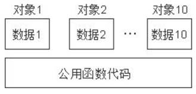
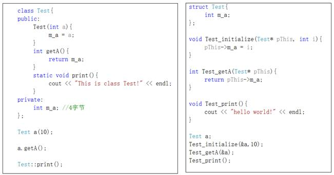

# 类和对象(二)

## 1.1 面向对象模型初探

### 1.1.1 成员变量和函数的存储

类的成员变量（数据）和成员函数（操作）是分开存储的：

- C++中的**非静态数据成员**是直接保存在类的对象的，就像c struct一样
- 成员函数虽然出现在类的声明中，但不保存在类的对象中
- 每一个**非内联成员函数**只会产生一份函数实例

如下演示案例：

```c++
#include <iostream>
using namespace std;

class MyClass01 {
public:
	int mA;	// 保存在类对象中，占4个字节
};

class MyClass02 {
public:
	int mA;	
	static int sB;	// 不保存在类对象中
};

class MyClass03 {
public:
	void printMyClass() {	// 不保存在类对象中
		cout << "Hello World！" << endl;
	}
public:
	int mA;
	static int sB;
};

class MyClass04 {
public:
	void printMyClass() {
		cout << "hello world!" << endl;
	}
	static void ShowMyClass() {	// 不保存在类对象中
		cout << "hello world！" << endl;
	}
public:
	int mA;
	static int sB;
};

int main() {
	MyClass01 mclass01;
	MyClass02 mclass02;
	MyClass03 mclass03;
	MyClass04 mclass04;

	cout << "MyClass01:" << sizeof(mclass01) << endl; //4
	//静态数据成员并不保存在类对象中
	cout << "MyClass02:" << sizeof(mclass02) << endl; //4
	//非静态成员函数不保存在类对象中
	cout << "MyClass03:" << sizeof(mclass03) << endl; //4
	//静态成员函数也不保存在类对象中
	cout << "MyClass04:" << sizeof(mclass04) << endl; //4

	return 0;
}
```

### 1.1.2 this指针

#### 1.1.2.1 this指针工作原理

通过上面的例子我们知道，C++的数据和操作也是分开存储，并且每一个非内联成员函数（non-inline member function）只会诞生一份函数实例，也就是说**多个同类型的对象会公用一块代码**

那么问题是，这一块代码是**如何区分到底是哪个对象调用自己的呢？**



c++通过提供特殊的对象指针，this指针，解决上述问题。**this指针指向被调用的成员函数所属的对象。**

c++规定，this指针是隐含在对象成员函数内的一种指针。当一个对象被创建后，它的**每一个成员函数都含有一个**系统自动生成的**隐含指针this**，用以保存这个对象的地址，也就是说虽然我们没有写上this指针，编译器在编译的时候也是会加上的。因此this也称为“指向本对象的指针”，this指针并不是对象的一部分，不会影响sizeof(对象)的结果。

this指针是C++实现封装的一种机制，它将对象和该对象调用的成员函数连接在一起，在外部看来，每一个对象都拥有自己的函数成员。一般情况下，并不写this，而是让系统进行默认设置。

>   this指针永远指向当前对象。

成员函数通过this指针即可知道操作的是那个对象的数据。This指针是一种隐含指针，它隐含于每个类的非静态成员函数中。This指针无需定义，直接使用即可。

>注意：静态成员函数内部没有this指针，静态成员函数不能操作非静态成员变量。

案例：c++编译器对普通成员函数的内部处理




