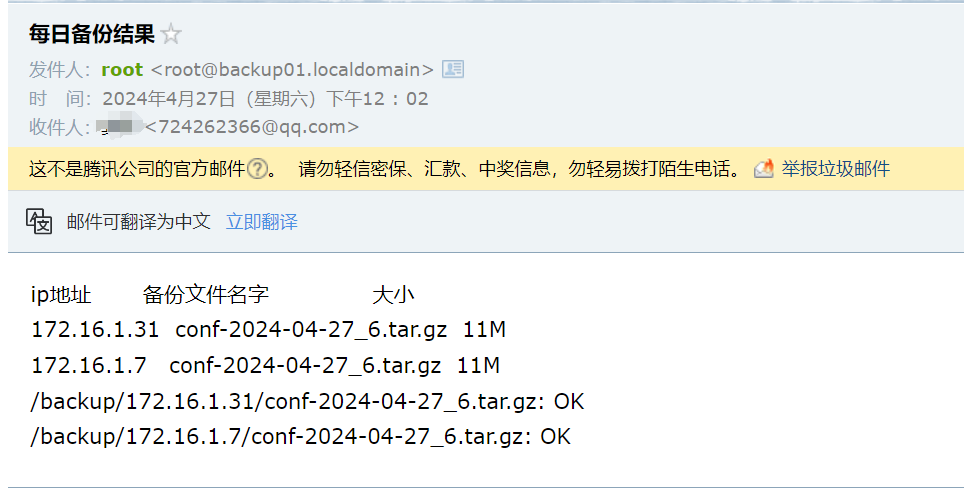

# 一、全网备份项目

网站数据需要备份

如何备份？打包压缩+定时任务

如何收集？rsync备份服务器收集备份数据（客户端推送到服务端）


## 1.2 项目流程

### 1.2.1 环境准备

| 角色            | 主机   | 运行服务             |
| --------------- | ------ | -------------------- |
| 存放备份 （41） | backup | rsync服务端          |
| 生成备份 （31） | nfs01  | rsync客户端,其他服务 |
| 生成备份 （7）  | web01  | rsync客户端,其他服务 |
| .....           |        |                      |

### 1.2.2 项目步骤描述

| 步骤说明                              | 详细内容                                    |
| ------------------------------------- | ------------------------------------------- |
| 1、rsync服务端并调试 ✅                | 服务端配置 /backup/目录                     |
| 2、rsync客户端节点配置脚本(备份) ✅    | 1备份 2推送 3清理                           |
| 3、其他节点匹配值定时任务 ✅           | 定时运行脚本                                |
| 4、在备份服务器上检查并发送结果邮件 ✅ | 1清理备份 2 在rsync服务端检查备份并发送邮件 |

架构流程图如下：


### 1.2.3 服务端配置

修改服务端的`/etc/rsyncd.conf`配置文件，添加【backup】

```shell
#created by oldboy 15:01 2009-6-5
##rsyncd.conf start##
fake super =yes
uid = rsync
gid = rsync
use chroot = no
max connections = 2000
timeout = 600
pid file = /var/run/rsyncd.pid
lock file = /var/run/rsync.lock
log file = /var/log/rsyncd.log
ignore errors
read only = false
list = false
#hosts allow = 10.0.0.0/24
#hosts deny = 0.0.0.0/32
auth users = rsync_backup
secrets file = /etc/rsync.password
#####################################
[data]
comment = www by old0boy 14:18 2012-1-13
path = /data/

# 新添加backup
[backup]
comment = backup project
path = /backup/
```

创建backup目录和设置用户

```shell
[root@backup01[ ~]#mkdir /backup
[root@backup01[ ~]#chown rsync.rsync /backup
```

远程调试

```shell
# 客户端传送
[root@nfs01[ ~]#rsync -av /etc/hosts rsync_backup@10.0.0.41::backup --password-file=/etc/client.rsync
sending incremental file list
hosts

sent 247 bytes  received 43 bytes  580.00 bytes/sec
total size is 158  speedup is 0.54

# 服务器验证
[root@backup01[ ~]#tree -F /backup/
/backup/
└── hosts
```

### 1.2.4 客户端备份功能

>在nfs01和web01进行配置，定时打包数据文件，并上传到backup服务器
>
>web01需要安装nfs01的设置，进行前期的rsync客户端设置

添加定时备份脚本

```shell
[root@web01[ /server/scripts]#cat backup.sh
#!/bin/bash
#author: lidao996
#desc:备份服务器的配置文件

# 1、变量
ip=`hostname -I | awk '{print $2}'`
backup_dir=/backup/${ip}
time=`date +%F_%w`
backup_file=conf-${time}.tar.gz
backup_server=172.16.1.41

# 2、备份命令
mkdir -p ${backup_dir}
# 备份etc文件夹
tar zcf ${backup_dir}/${backup_file}    /etc/   /var/spool/cron

# 3、推送
rsync -a ${backup_dir} rsync_backup@${backup_server}::backup --password-file=/etc/client.rsync

# 4、删除旧的备份
find ${backup_dir} -type f -name "*.tar.gz" -mtime +7 | xargs rm -f
```

添加执行权限

```shell
chmod 755 backup.sh
```

测试执行

```shell
# web01
[root@web01[ /server/scripts]#sh -x backup.sh
++ hostname -I
++ awk '{print $2}'
+ ip=172.16.1.7
+ backup_dir=/backup/172.16.1.7
++ date +%F_%w
+ time=2024-04-27_6
+ backup_file=conf-2024-04-27_6.tar.gz
+ backup_server=172.16.1.41
+ mkdir -p /backup/172.16.1.7
+ tar zcf /backup/172.16.1.7/conf-2024-04-27_6.tar.gz /etc/ /var/spool/cron
tar: Removing leading `/' from member names
+ rsync -a /backup/172.16.1.7 rsync_backup@172.16.1.41::backup --password-file=/etc/client.rsync
+ find /backup/172.16.1.7 -type f -name '*.tar.gz' -mtime +7
+ xargs rm -f

# nfs01
[root@nfs01[ /server/scripts]#sh -x backup.sh
++ hostname -I
++ awk '{print $2}'
+ ip=172.16.1.31
+ backup_dir=/backup/172.16.1.31
++ date +%F_%w
+ time=2024-04-27_6
+ backup_file=conf-2024-04-27_6.tar.gz
+ backup_server=172.16.1.41
+ mkdir -p /backup/172.16.1.31
+ tar zcf /backup/172.16.1.31/conf-2024-04-27_6.tar.gz /etc/ /var/spool/cron
tar: Removing leading `/' from member names
+ rsync -a /backup/172.16.1.31 rsync_backup@172.16.1.41::backup --password-file=/etc/client.rsync
+ find /backup/172.16.1.31 -type f -name '*.tar.gz' -mtime +7
+ xargs rm -f

# backup01查看
[root@backup01[ ~]#tree -F /backup/
/backup/
├── 172.16.1.31/
│   └── conf-2024-04-27_6.tar.gz
└── 172.16.1.7/
    └── conf-2024-04-27_6.tar.gz
```

添加定时任务

```shell
# crontab -e

# 测试，每分钟执行一次
* * * * * /server/scripts/backup.sh &>>/tmp/backup.log

# 配置：半夜执行
00 00 * * * /server/scripts/backup.sh &>>/tmp/backup.log
```

### 1.2.5 服务端检查和清理

编写脚本

```shell
[root@backup01[ /server/scripts]#cat /server/scripts/check.sh
#!/bin/bash
#desc: 检查备份，清理旧的备份文件

# 0. 清理旧备份
find /backup -type f -name "*.tar.gz" -mtime +180 | xargs rm -f

# 1. 统计备份结果
find /backup/ -type f -name "*.tar.gz" | xargs \
ls -lhd | \
awk -F'[ /]+' 'BEGIN{print "ip地址", "备份文件名字", "大小"} {print $(NF-1), $NF, $5}' |\
column -t > /server/scripts/result.txt

# 2.发送邮件
mail -s "每日备份结果" 724262366@qq.com </server/scripts/result.txt
```

测试执行

```shell
[root@backup01[ /server/scripts]#sh -x check.sh
+ find /backup -type f -name '*.tar.gz' -mtime +180
+ xargs rm -f
+ awk '-F[ /]+' 'BEGIN{print "ip地址", "备份文件名字", "大小"} {print $(NF-1), $NF, $5}'
+ column -t
+ find /backup/ -type f -name '*.tar.gz'
+ xargs ls -lhd
+ mail -s 每日备份结果 724262366@qq.com
```

查看结果和邮件

```shell
[root@backup01[ /server/scripts]#cat result.txt
ip地址       备份文件名字              大小
172.16.1.31  conf-2024-04-27_6.tar.gz  11M
172.16.1.7   conf-2024-04-27_6.tar.gz  11M
```


设置定时任务

```shell
# 配置：半夜执行检查配置情况
30 00 * * * /server/scripts/check.sh 
```


### 1.2.6 增加MD5校验功能

md5检查多个文件

```shell
#给/etc/下面所有的文件创建MD5保存到指定文件中
find /etc/ -type f | md5sum >etc-all.md5
#进行校验
md5sum -c etc-all.md5
#修改/etc/下某个文件比如增加个"#"
vim /etc/rsyncd.conf
#进行校验
md5sum -c etc-all.md5
#只显示md5异常的文件
md5sum --quiet -c etc-all.md5
```

具体应用 --- 客户端备份时新增MD5校验文件，并上传

```shell
[root@nfs01[ /server/scripts]#cat backup.sh
...
# 2、备份命
mkdir -p ${backup_dir}
# 备份etc文件夹
tar zcf ${backup_dir}/${backup_file}    /etc/   /var/spool/cron
# 追加校验信息到md5校验文件
md5sum ${backup_dir}/${backup_file} >> ${backup_dir}/check.md5
...
```

具体应用 --- 服务端根据MD5文件进行校验，并输出结果

```shell
[root@backup01[ /server/scripts]#cat check.sh
....
# 1. 统计备份结果
find /backup/ -type f -name "*.tar.gz" | xargs \
ls -lhd | \
awk -F'[ /]+' 'BEGIN{print "ip地址", "备份文件名字", "大小"} {print $(NF-1), $NF, $5}' |\
column -t > ${result_file}

# md5校验
find /backup/ -name "check.md5" | xargs md5sum -c >> ${result_file}

# 2.发送邮件
mail -s "每日备份结果" 724262366@qq.com </server/scripts/result.txt
```

检验邮件




# 二、存储服务（NFS）

## 2.1 什么是存储？

存储是用于存放数据的介质，如资源充足，推荐使用共享存储，对比图如下：


## 2.2 存储分类

| 分类     | 说明                                               |
| -------- | -------------------------------------------------- |
| 硬件存储 | 硬件存储,硬盘多,使用的时候挂载即可.                |
| 开源软件 | 普通存储NFS 分布式存储:GlusterFS,Ceph,.....FastDFS |
| 云产品   | 阿里云OSS(对象存储),七牛云存储,腾讯云COS           |

## 2.3 NFS介绍

NFS是(Network File System)的简写，即网络文件系统。使用NFS可以实现在网络上与它人共享目录和文件。

NFS的工作由两个服务组合完成：

- NFS服务
- rpcbind(portmap)服务  

其工作原理如下图所示：


## 2.4 配置NFS服务

环境准备

| 环境      | 主机                        |              |
| --------- | --------------------------- | ------------ |
| nfs服务端 | nfs01 10.0.0.31/172.16.1.31 |              |
| nfs客户端 | web01 10.0.0.7/172.16.1.7   | 通过挂载使用 |

服务端部署

```shell
# 安装
yum install -y rpcbind nfs-utils

#启动rpcbind
[root@nfs01[ /server/scripts]#systemctl enable rpcbind
[root@nfs01[ /server/scripts]#systemctl start rpcbind
[root@nfs01[ /server/scripts]#rpcinfo -p
   program vers proto   port  service
    100000    4   tcp    111  portmapper
    100000    3   tcp    111  portmapper
    100000    2   tcp    111  portmapper
    100000    4   udp    111  portmapper
    100000    3   udp    111  portmapper
    100000    2   udp    111  portmapper


#启动nfs
[root@nfs01[ /server/scripts]#systemctl enable nfs
Created symlink from /etc/systemd/system/multi-user.target.wants/nfs-server.service to /usr/lib/systemd/system/nfs-server.service.
[root@nfs01[ /server/scripts]#systemctl start nfs
[root@nfs01[ /server/scripts]#rpcinfo -p
   program vers proto   port  service
    100000    4   tcp    111  portmapper
    100000    3   tcp    111  portmapper
    100000    2   tcp    111  portmapper
    100000    4   udp    111  portmapper
    100000    3   udp    111  portmapper
    100000    2   udp    111  portmapper
    100024    1   udp  58232  status
    100024    1   tcp  52888  status
    100005    1   udp  20048  mountd
    100005    1   tcp  20048  mountd
    100005    2   udp  20048  mountd
    100005    2   tcp  20048  mountd
    100005    3   udp  20048  mountd
    100005    3   tcp  20048  mountd
    100003    3   tcp   2049  nfs
    100003    4   tcp   2049  nfs
    100227    3   tcp   2049  nfs_acl
    100003    3   udp   2049  nfs
    100003    4   udp   2049  nfs
    100227    3   udp   2049  nfs_acl
    100021    1   udp  38923  nlockmgr
    100021    3   udp  38923  nlockmgr
    100021    4   udp  38923  nlockmgr
    100021    1   tcp  37397  nlockmgr
    100021    3   tcp  37397  nlockmgr
    100021    4   tcp  37397  nlockmgr


# 配置，允许网段
cat /etc/exports
/data/ 172.16.1.0/24(rw)
systemctl reload nfs

# 目录与权限
chown nfsnobody.nfsnobody /data/
systemctl reload nfs

# 挂载到本地
mount -t nfs 172.16.1.31:/data/ /mnt/

# 查看挂载情况
[root@nfs01[ /mnt]#showmount -e
Export list for nfs01:
/data 172.16.1.0/24
```

客户端挂载

```shell
# 安装
yum install -y nfs-utils
# 挂载
mount -t nfs 172.16.1.31:/data /mnt
```

## 2.5 NFS相关的配置文件

| nfs服务端或客户端 |                                                              |
| ----------------- | ------------------------------------------------------------ |
| NFS服务端配置     | /etc/exports(配置文件里面的) ---> /var/lib/nfs/etab(当前使用的nfs服务端配置) |
| NFS客户端配置     | 客户端:mount /etc/rc.local 或/etc/fstab ---> /proc/mounts (当前系统的挂载情况) |

### 2.5.1 服务端配置

```shell
# /etc/exports 的文件格式
共享目录 网段(选项)

# NFS配置文件中网络配置
172.16.1.0/24	最常用
172.16.1.7		指定IP
baidu.com		指定域名
*				所有都可以
```

核心配置

| 服务端配置选项 | 说明                                                         |
| -------------- | ------------------------------------------------------------ |
| rw             | 可以读写共享目录                                             |
| ro             | 只读 read only                                               |
| sync           | 同步,只要用户上传,就把数据写到磁盘上.                        |
| async          | 异步,用户上传的数据,nfs先临时存放到内存中,过一段时间写入到磁盘. 并发高,数据可能丢失. |

服务端用户压缩

- NFS客户端挂载NFS服务端后,创建的文件默认属于nfsnobody,这种操作就叫用户压缩(映射).
  用户压缩是通过NFS服务端的配置实现. 

| 服务端配置选项-用户压缩系列 | 说明                                                         |
| --------------------------- | ------------------------------------------------------------ |
| root_squash                 | 如果客户端是root用户访问,则到了nfs服务端会被压缩( 默认的 )   |
| no_all_squash               | 如果客户端不是root用户访问,则不进行压缩(保存原始用户, 默认的 ) |
| all_squash                  | 所有用户都进行压缩(不是太安全)                               |
| anonuid 和 anongid          | 用于指定压缩的匿名用户(默认是nfsnobody用户) anonuid=65534,anongid=65534 |

>用户压缩/用户映射: NFS客户端访问NFS共享目录的时候变成了什么用户.
>nfs客户端用户 nfs服务端用户
>root ---> nfsnoboby  

图示：


## 2.6 永久挂载

永久挂载的方式

```shell
# 方法01 挂载命令写入到/etc/rc.local
chmod +x /etc/rc.d/rc.local

# 方法02 按照/etc/fstab格式要求书写
设备 挂载点 文件系统类型 挂载参数 是否检查 是否备份
172.16.1.31:/data/ /upload/ nfs defaults 0 0
```

>温馨提示:
>如果配置了nfs客户端永久挂载,未来要优先启动nfs服务端  

## 2.7 用户压缩的案例

设置/nfsdata共享目录,匿名用户为www. 客户端挂载到/upload-video/
www用户的uid,gid:1999 (服务端,客户端)  

```shell
#1. 所有主机(nfs服务端和nfs客户端)添加用户 www uid统一1999 1999
groupadd -g 1999 www
useradd -u 1999 -g www -s /sbin/nologin -M www

#2. nfs服务端配置
[root@nfs01[ /mnt]#cat /etc/exports
/data/  172.16.1.0/24(rw)
/nfsdata/       172.16.1.0/24(rw, all_squash, anonuid=1999,anongid=1999)
# 重新reload
systemctl reload nfs
# 修改共享文件夹的用户
chown -R www.www /nfsdata

#3. nfs客户端挂载
[root@web01[ /mnt]#mount -t nfs 172.16.1.31:/nfsdata /upload-video/


# 4、客户端创建文件
[root@web01[ /mnt]#touch /upload-video/test-{1..10}.txt

# 5、服务端查看，文件确实上传，且所有者都是www
[root@nfs01[ /mnt]#ll /nfsdata/
total 0
-rw-r--r--. 1 www www 0 Apr 28 11:01 test-10.txt
-rw-r--r--. 1 www www 0 Apr 28 11:01 test-1.txt
-rw-r--r--. 1 www www 0 Apr 28 11:01 test-2.txt
-rw-r--r--. 1 www www 0 Apr 28 11:01 test-3.txt
-rw-r--r--. 1 www www 0 Apr 28 11:01 test-4.txt
-rw-r--r--. 1 www www 0 Apr 28 11:01 test-5.txt
-rw-r--r--. 1 www www 0 Apr 28 11:01 test-6.txt
-rw-r--r--. 1 www www 0 Apr 28 11:01 test-7.txt
-rw-r--r--. 1 www www 0 Apr 28 11:01 test-8.txt
-rw-r--r--. 1 www www 0 Apr 28 11:01 test-9.txt
```

>以上案例，如果客户端www的用户被删除，效果如下：
>
>```shell
>[root@web01[ /mnt]#userdel -r www
>userdel: www home directory (/home/www) not found
>
># 客户端不显示www用户，显示uid和gid
>[root@web01[ /upload-video]#ll
>total 0
>-rw-r--r--. 1 1999 1999 0 Apr 28 11:01 test-10.txt
>-rw-r--r--. 1 1999 1999 0 Apr 28 11:01 test-1.txt
>-rw-r--r--. 1 1999 1999 0 Apr 28 11:01 test-2.txt
>-rw-r--r--. 1 1999 1999 0 Apr 28 11:01 test-3.txt
>-rw-r--r--. 1 1999 1999 0 Apr 28 11:01 test-4.txt
>-rw-r--r--. 1 1999 1999 0 Apr 28 11:01 test-5.txt
>-rw-r--r--. 1 1999 1999 0 Apr 28 11:01 test-6.txt
>-rw-r--r--. 1 1999 1999 0 Apr 28 11:01 test-7.txt
>-rw-r--r--. 1 1999 1999 0 Apr 28 11:01 test-8.txt
>-rw-r--r--. 1 1999 1999 0 Apr 28 11:01 test-9.txt
>
># 因为是all_squash，不影响上传文件
>[root@web01[ /upload-video]#>testnowww.txt
>[root@web01[ /upload-video]#ll
>total 0
>-rw-r--r--. 1 1999 1999 0 Apr 28 11:01 test-10.txt
>-rw-r--r--. 1 1999 1999 0 Apr 28 11:01 test-1.txt
>-rw-r--r--. 1 1999 1999 0 Apr 28 11:01 test-2.txt
>-rw-r--r--. 1 1999 1999 0 Apr 28 11:01 test-3.txt
>-rw-r--r--. 1 1999 1999 0 Apr 28 11:01 test-4.txt
>-rw-r--r--. 1 1999 1999 0 Apr 28 11:01 test-5.txt
>-rw-r--r--. 1 1999 1999 0 Apr 28 11:01 test-6.txt
>-rw-r--r--. 1 1999 1999 0 Apr 28 11:01 test-7.txt
>-rw-r--r--. 1 1999 1999 0 Apr 28 11:01 test-8.txt
>-rw-r--r--. 1 1999 1999 0 Apr 28 11:01 test-9.txt
>-rw-r--r--. 1 1999 1999 0 Apr 28 11:05 testnowww.txt
>```

## 2.8 NFS优化

NFS优化: 硬件(物理服务器+nfs服务)
NFS安全优化: 客户端挂载 只能上传,无法执行.  

```shell
[root@web01[ /]#mount -o noexec,nosuid,nodev -t nfs 172.16.1.31:/nfsdata /upload-video/

#这几个是客户端挂载选项
noexec 挂载的nfs目录中如果有命令，无法运行。
nosuid 带有suid的命令
nodev 带有特殊属性的文件。
```


