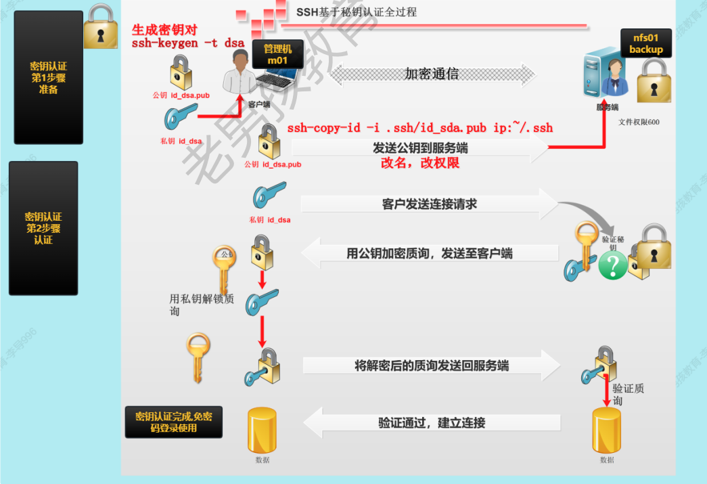

# 一、密钥认证-集群批量管理

## 1.1 概述

作用：

- 使管理更加轻松，两个节点通过密钥形式进行访问，不需要输入密码（单向）

应用场景：

- 一些服务在使用前要求我们做秘钥认证.
- 手动写批量管理脚本.

别名：

- 密钥认证
- 免密码登录
- 双机互信  

## 1.2 密钥认证的原理

图示如下：



>什么是密钥对?
>
>公钥: public key 一般以.pub结尾.
>私钥: private key 没有特殊的结尾  

## 1.3 配置密钥认证

环境准备

| 角色       | 主机名 | ip        |
| ---------- | ------ | --------- |
| 管理机     | m01    | 10.0.0.61 |
| 被管理节点 | nfs01  | 10.0.0.31 |
| 被管理节点 | web01  | 10.0.0.7  |
| 被管理节点 | backup | 10.0.0.41 |

### 1.3.1 基本检查

确保对向机器IP和端口正常

```shell
#ping
ping 172.16.1.41

# nmap探测22端口，sshd服务开启或可以访问
[root@mn01[ ~]#nmap -p 22 172.16.1.31 172.16.1.7 172.16.1.41
Starting Nmap 6.40 ( http://nmap.org ) at 2024-04-29 15:11 CST
Nmap scan report for 172.16.1.31
Host is up (0.00039s latency).
PORT   STATE SERVICE
22/tcp open  ssh
MAC Address: 00:0C:29:C7:69:C1 (VMware)
Nmap scan report for 172.16.1.7
...
Nmap scan report for 172.16.1.41
...
Nmap done: 3 IP addresses (3 hosts up) scanned in 0.47 seconds
```

### 1.3.2 创建密钥对

创建的时候需要按交互提示输入信息

```shell
ssh-keygen -t rsa
#注意创建的啥时候也可以不加-t, 默认通过rsa方法对数据进行加密.

[root@mn01[ ~]#ssh-keygen
Generating public/private rsa key pair.
Enter file in which to save the key (/root/.ssh/id_rsa):
Created directory '/root/.ssh'.
Enter passphrase (empty for no passphrase):
Enter same passphrase again:
Your identification has been saved in /root/.ssh/id_rsa.
Your public key has been saved in /root/.ssh/id_rsa.pub.
The key fingerprint is:
SHA256:ry8yEWh6ZJQ8SUDK7KoQbZW86Y3gScBPO1hJMSfuAGo root@mn01
The key's randomart image is:
+---[RSA 2048]----+
|..oOo+           |
|*.o.@.           |
|+E *+o           |
|ooB.*o.          |
|.o=Xo  .S        |
|.=.+oo.  .       |
|o o.o ..  .      |
|o     o ..       |
|.      o.o.      |
+----[SHA256]-----+
```

### 1.3.3 分发公钥

需要按交互提示输入yes / no，并输入对向主机密码

>yes后会将信息保存到如下文件中：
>
>[root@mn01[ ~]#ls ~/.ssh/known_hosts
>/root/.ssh/known_hosts

```shell
[root@mn01[ ~]#ssh-copy-id -i /root/.ssh/id_rsa.pub root@10.0.0.41
/usr/bin/ssh-copy-id: INFO: Source of key(s) to be installed: "/root/.ssh/id_rsa.pub"
The authenticity of host '10.0.0.41 (10.0.0.41)' can't be established.
ECDSA key fingerprint is SHA256:OVpquCehSKXH4UACbiezs1feEbgyswAvmfM0c1jFOww.
ECDSA key fingerprint is MD5:00:f4:c5:99:88:a5:d9:f3:5d:fa:65:d4:57:bd:39:a3.
Are you sure you want to continue connecting (yes/no)? yes
/usr/bin/ssh-copy-id: INFO: attempting to log in with the new key(s), to filter out any that are already installed
/usr/bin/ssh-copy-id: INFO: 1 key(s) remain to be installed -- if you are prompted now it is to install the new keys
root@10.0.0.41's password:

Number of key(s) added: 1

Now try logging into the machine, with:   "ssh 'root@10.0.0.41'"
and check to make sure that only the key(s) you wanted were added.
```

### 1.3.4 连接测试  

```shell
[root@mn01[ ~]#ssh 10.0.0.41 hostname -I
10.0.0.41 172.16.1.41
```

>温馨提示：
>
>ssh-copy-id后公钥被存放在对方服务器的用户家目录下面的.ssh下面.
>
>名字叫:authorized_keys，如果不想被密钥认证了，把该文件删了即可
>
>```shell
>[root@backup01[ ~]#ls ~/.ssh/
>authorized_keys
>```

## 1.4 自动化创建与分发密钥

结合2.3节的创建和分发流程，自动化创建和分发主要<font color=red>面临以下问题</font>：

- 创建秘钥对需要交互式输入【1.4.1解决】
- 分发公钥的时候需要交互式输入：yes/no 【1.4.2解决】
- 分发公钥的时候需要输入密码  【1.4.2解决】

### 1.4.1 自动化创建

使用选项指定参数，跳过交互式输入环节

```shell
# -f用于指定私钥的位置
# -P 密码短语 设置为空
# -t 用于指定加密算法，默认rsa，可以省略

ssh-keygen -f ~/.ssh/id_rsa -P ''
# 或者
ssh-keygen -t rsa -f ~/.ssh/id_rsa -P ''
```

### 1.4.2 自动化分化密钥

解决输入密码问题，需要使用到*sshpass*工具，其基本使用如下：

```shell
#安装工具
yum install -y sshpass

# 先测试对方机器是否需要输入yes / no，并输入yes
[root@mn01[ ~]#ssh 10.0.0.7 hostname -I
The authenticity of host '10.0.0.7 (10.0.0.7)' can't be 
....
Are you sure you want to continue connecting (yes/no) yes

# 然后使用sshpass测试, -p后面可以指定密码
[root@mn01[ ~]#sshpass -p "redhat123" ssh 10.0.0.7 hostname -I
10.0.0.7 172.16.1.7

# 成功解决交互式输入密码的问题
```

解决交互书yes / no的问题，需要使用到ssh-copy-id的选项

`-oStrictHostKeyChecking=no`

```shell
[root@mn01[ ~]#sshpass -p "redhat123" ssh-copy-id -i ~/.ssh/id_rsa.pub -oStrictHostKeyChecking=no 10.0.0.41
/usr/bin/ssh-copy-id: INFO: Source of key(s) to be installed: "/root/.ssh/id_rsa.pub"
...
Number of key(s) added: 1
...
and check to make sure that only the key(s) you wanted were added.
# 分发成功
```

### 1.4.3 自动化创建与分发脚本

创建和分发密钥脚本`/server/scripts/creatkey.sh`

```shell
#!/bin/bash 
#desc: 一键创建和分发密钥对

#1.vars
pass="redhat123"
ips="10.0.0.7 10.0.0.31 10.0.0.41"

# 导入模块
. /etc/init.d/functions

# 判断是否联网可以使用yum
# 加入判断sshpass命令是否存在，如果不存在则安装

# 2.创建密钥对
if [ -f ~/.ssh/id_rsa ];then
        echo "已经创建过密钥对"
else
        echo "正在创建密钥对..."
        ssh-keygen -t rsa -f ~/.ssh/id_rsa -P '' &>/dev/null
        if [ $? -eq 0 ];then
                action "密钥创建成功"   /bin/true
        else
                action "密钥创建失败"   /bin/false
        fi
fi

# 3.使用循环发送公钥
for ip in $ips
do
        sshpass -p ${pass} ssh-copy-id -i ~/.ssh/id_rsa.pub -oStrictHostKeyChecking=no $ip &>/dev/null
        if [ $? -eq 0 ];then
                action "密钥分发成功"   /bin/true
        else
                action "密钥分发失败"   /bin/false
        fi
done
```

分发脚本测试

```shell
[root@mn01[ /server/scripts]#./createkey.sh
正在创建密钥对...
密钥创建成功                                               [  OK  ]
密钥分发成功                                               [  OK  ]
密钥分发成功                                               [  OK  ]
密钥分发成功                                               [  OK  ]
[root@mn01[ /server/scripts]#./createkey.sh
已经创建过密钥对
密钥分发成功                                               [  OK  ]
密钥分发成功                                               [  OK  ]
密钥分发成功                                               [  OK  ]
```

检查脚本测试`/server/scripts/check.sh`

```shell
#!/bin/bash
# desc: 批量在所有机器上执行命令
for ip in 10.0.0.7 10.0.0.31 10.0.0.41
do
        ssh $ip hostname
done
```

脚本测试

```shell
[root@mn01[ /server/scripts]#./check.sh
web01
nfs01
backup01
```

