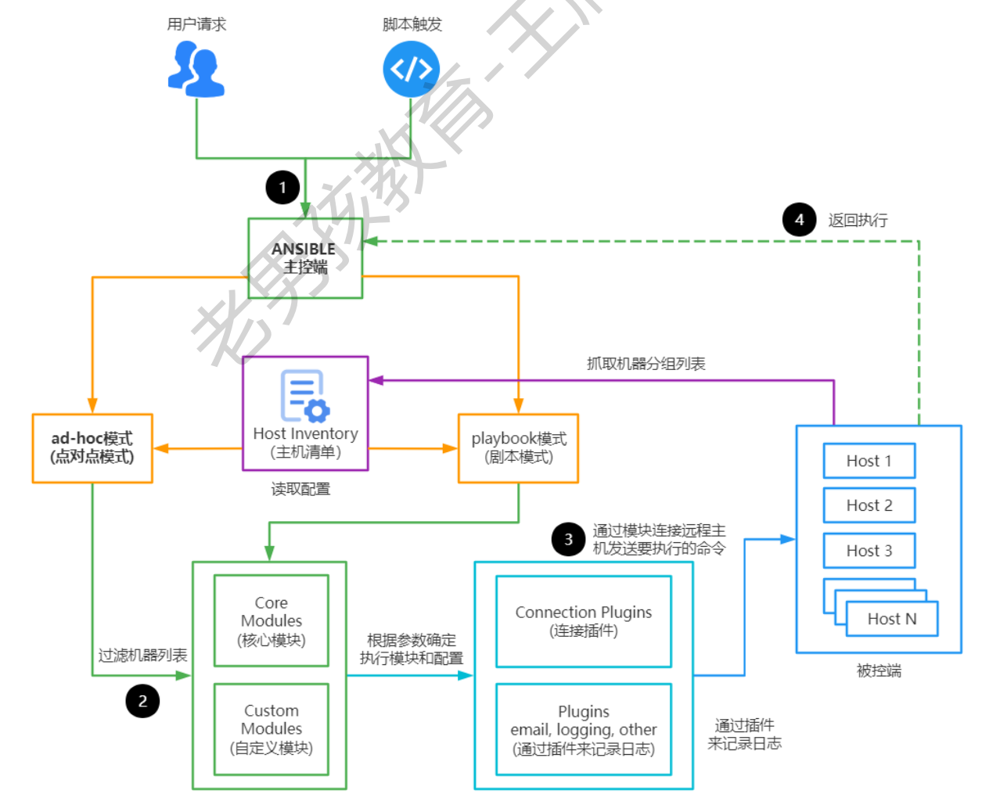
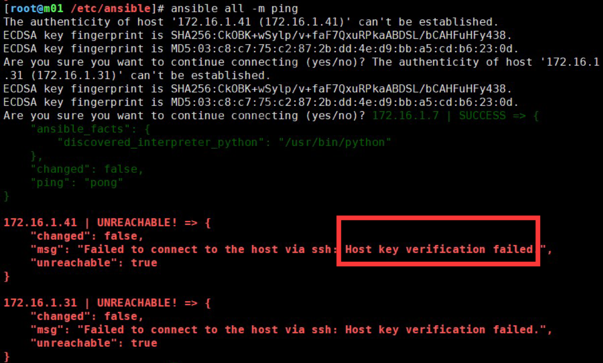

# Ansible集群自动化维护

## 1.1 Ansible概述

市面上的部分批量管理工具

| 批量管理工具 | 说明                                      |
| ------------ | ----------------------------------------- |
| Ansible      | 无客户端,基于ssh进行管理与维护.           |
| Saltstack    | 需要安装客户端,基于ssh进行管理,与ansible. |
| terraform    | tf批量管理基础设施(批量创建100台公有云)   |

Ansible是其中一种，基于Python语言实现，用于集群批量管理，批量分发，批量执行，维护等


## 1.2 Ansible的管理框架

图示：



详细解释：

- Inventory 主机机清单
  - 被管理主机的ip列表，分类.
- ad-hoc 模式：
  - 命令行批量管理(使用ans模块),临时任务.
- playbook 剧本模式
  - 类似于把操作写出脚本,可以重复运行这个脚本  

## 1.3 部署与配置

### 1.3.1 安装

在主控节点(mn01)安装ansible

```shell
yum install -y ansible
```

### 1.3.2 初始配置

修改ansible的配置文件：

- 关闭主机Host_key_checking .
- 开启日志功能

```shell
[root@mn01[ /server/scripts]#cp /eegrep -vn "^$|#" /etc/ansible/ansible.cfg
10:[defaults]
71:host_key_checking = False	# *
111:log_path = /var/log/ansible.log		# *
327:[inventory]
340:[privilege_escalation]
346:[paramiko_connection]
370:[ssh_connection]
431:[persistent_connection]
445:[accelerate]
460:[selinux]
469:[colors]
485:[diff]
```

>Host_key_checking如果没关闭，将造成如下报错：
>
>

## 1.3  Ans-inventory主机清单  

主机清单，就是让ansible管理的节点的列表，默认读取在`/etc/ansible/hosts`文件,并非/etc/hosts。

未来实际使用中一般我们会把主机清单文件存放在指定的目录中,运行ansible的时候通过`-i`选项指定主机清单文件即可  

### 1.3.1 主机清单的格式

>主机清单格式：
>
>[分类或分组的名字]			#注意分类要体现出服务器的作用
>
>ip地址 或 主机名 或 域名 	#注意主机名要能解析才行  
>
>
>
>命令格式：
>ansible [主机ip 或 分组 或 all]  -m [指定使用的模块名字]

案例01-对主机分组并进行连接测试  

```shell
[root@mn01[ /server/scripts]#cat /etc/ansible/hosts
[web01]
172.16.1.7
[backup01]
172.16.1.41
[nfs01]
172.16.1.31

# 测试, 这里的ping模块用于检查被管理端是否可以访问.  
[root@mn01[ /server/scripts]#ansible all -m ping
172.16.1.41 | SUCCESS => {
    "ansible_facts": {
        "discovered_interpreter_python": "/usr/bin/python"
    },
    "changed": false,
    "ping": "pong"
}
172.16.1.31 | SUCCESS => {
....
172.16.1.7 | SUCCESS => {
....
```

### 1.3.2 子组

案例02: 我希望对backup01,nfs01两个主机分组,再创建个分区叫data分组 

 ```shell
# 使用children关键字，创建子组
[root@mn01[ /server/scripts]#cat /etc/ansible/hosts
[web01]
172.16.1.7
[backup01]
172.16.1.41
[nfs01]
172.16.1.31

[data:children]
nfs01
backup01

# 测试
[root@mn01[ /server/scripts]#ansible data -m ping
172.16.1.41 | SUCCESS => {
...
}
172.16.1.31 | SUCCESS => {
...
}
 ```

### 1.3.3 指定用户名和密码

如果没有实现进行*密钥认证*配置，也可以通过修改配置文件来指定*用户名和密码*

该方法<font color=red>不推荐</font>

```shell
172.16.1.7 ansible_user=root ansible_password=redhat123	ansible_port=22
```

案例：

```shell
# 先删除172.16.1.7的密钥认证文件，再次ansible会失败
[root@mn01[ /server/scripts]#ansible 172.16.1.7 -m ping
172.16.1.7 | UNREACHABLE! => {
    "changed": false,
    "msg": "Failed to connect to the host via ssh: Permission denied (publickey,password).",
    "unreachable": true
}

# 配置用户名和密码
[root@mn01[ /server/scripts]#cat /etc/ansible/hosts
[web01]
172.16.1.7 ansible_user=root ansible_password=redhat123 ansible_port=22
[backup01]
172.16.1.41
...

# 再次测试成功访问
[root@mn01[ /server/scripts]#ansible 172.16.1.7 -m ping
172.16.1.7 | SUCCESS => {
    "ansible_facts": {
        "discovered_interpreter_python": "/usr/bin/python"
    },
    "changed": false,
    "ping": "pong"
}
```

## 1.4 Ansible必知必会的模块

Ansible模块概述:
ansible中的模块就类似于Linux中的命令,我们Linux命令管理系统,我们通过ansible模块实现批量管理.
ansible中模块一般相当于Linux中的一些命令.yum模块,file模块,user模块.
ansible中的模块拥有不同的选项,这些选项一般都是一些单词,拥有自己的格式与要求.  

| 模块分类       | 模块                                                         |
| -------------- | ------------------------------------------------------------ |
| 命令和脚本模块 | command模块 ans默认的模块,执行简单命令,不支持特殊符号        |
|                | shell模块 执行命令,支持特殊符号                              |
|                | script模块 分发脚本并执行                                    |
| 文件           | file 创建目录,文件,软连接,                                   |
|                | copy 远程分发文件,修改权限,所有者,备份                       |
| 服务           | systemd服务管理                                              |
|                | service 服务管理(了解)                                       |
| 软件包         | yum源 yum_repository                                         |
|                | yum命令                                                      |
|                | get_url下载软件                                              |
| 系统管理       | mount模块 挂载                                               |
|                | cron模块 定时任务                                            |
| 用户管理       | group模块 管理用户组                                         |
|                | user模块 管理用户                                            |
| 其他可以研究   | 压缩解压(unarchive) ,rsync模块(synchronize),数据库模块(mysql_db,mysql_user)ՎՎʢ |
| 其他           | ansible管理docker k8s zabbix grafana ՎՎʢ                     |
| 用于调试模块   | ping 模块检查 ansible与其他节点连通性.                       |
|                | debug 模块 用于检查/显示 变量                                |

命令和模块使用方法描述

| ansible             |                              |         |                 |
| ------------------- | ---------------------------- | ------- | --------------- |
| ansible             | 主机清单(all/web/172.16.1.7) | -m 模块 | -a 模块中的选项 |
| -i 指定主机清单文件 |                              |         |                 |
| -m 指定模块         |                              |         |                 |
| -a 指定模块中的选项 |                              |         |                 |

### 1.4.1 命令与脚本类模块

#### a) command模块

command模块是ansible的默认模块，适用于执行简单的命令，不支持特殊符号

案例：批量获取所有主机的ens33网卡信息

```shell
ansible all -m command -a 'ip a s ens33'
# 因为command是默认模块，可以省略指定
ansible all -a 'ip a s ens33'
```

#### b) shell模块

与command模块类似，但是shell模块*支持特殊符号*

案例1：批量删除/tmp下面的所有内容

```shell
[root@mn01[ /server/scripts]#ansible all -m shell -a 'rm -fr /tmp/*'
[WARNING]: Consider using the file module with state=absent rather than running 'rm'.  If you need to use command because file is insufficient you can add 'warn: false' to this command task or set
'command_warnings=False' in ansible.cfg to get rid of this message.
172.16.1.41 | CHANGED | rc=0 >>
172.16.1.31 | CHANGED | rc=0 >>
172.16.1.7 | CHANGED | rc=0 >>
```

>删除文件会有warning提示，建议用file模块来操作

案例2：批量获取IP地址

```shell
[root@mn01[ /server/scripts]#ansible all -m shell -a "ip a s ens33 | awk -F'[ /]+' 'NR==3{print \$3}'"
172.16.1.31 | CHANGED | rc=0 >>
10.0.0.31
172.16.1.7 | CHANGED | rc=0 >>
10.0.0.7
172.16.1.41 | CHANGED | rc=0 >>
10.0.0.41
```

#### c) script 模块

用于分发和执行脚本

案例：在所有主机中执行指定脚本

```shell
[root@mn01[ /server/scripts]#cat /server/scripts/ansible-script.sh
#!/bin/bashh
#desc: 系统巡检脚本
hostname
hostname -I
ip a s ens33 |awk -F'[ /]+' 'NR==3{print $3}'
uptime
whoami
date +%F
sleep 10
```

分发执行脚本

```shell
[root@mn01[ /server/scripts]#ansible all -m script -a '/server/scripts/ansible-script.sh'
172.16.1.7 | CHANGED => {
    "changed": true,
....
    "stdout_lines": [
        "web01",
        "10.0.0.7 172.16.1.7 ",
        "10.0.0.7",
        " 09:49:47 up 1 day, 17:52,  2 users,  load average: 0.00, 0.01, 0.05",
        "root",
        "2024-04-30"
    ]
172.16.1.31 ....
```

### 1.4.2 文件相关的模块

#### a) file模块

作用：

- file模块不仅可以管理文件,还可以管理目录,管理软连接.
- 相当于把touch命令,mkdir命令,rm命令,ln -s命令结合在一起了.  

| file模块 | 模块说明                                                     |
| -------- | ------------------------------------------------------------ |
| path     | 路径(目录,文件) 必须要写                                     |
| src      | source源,源文件一般用于link(创建软连接模式) 用于指定源文件   |
| state    | 状态(模式) ,具体要做的什么,创建/删除,操作文件/操作目录 state=directory 创建目录 state=file (默认) 更新文件,如果文件不存在也不创建 state=link 创建软连接 state=touch 创建文件 |
|          | state=absent 删除 (⚠ 注意如果是目录递归删除目录. )           |
| mode     | mode=755创建并修改权限                                       |
| onwer    | onwer=root                                                   |
| group    | group=root                                                   |

案例1：创建/opt/test.txt文件

```shell
[root@mn01[ /server/scripts]#ansible all -m file -a 'path=/opt/test.txt state=touch'

# 查看是否创建成功
[root@web01[ /upload]#tree /opt/
/opt/
└── test.txt
```

案例2：创建目录（可以直接多级）

```shell
[root@mn01[ /server/scripts]#ansible all -m file -a 'path=/app/a/b/c/d state=directory'
172.16.1.41 | CHANGED => {
    "ansible_facts": {
        "discovered_interpreter_python": "/usr/bin/python"
    },
...

# 查看是否创建成功
[root@web01[ /upload]#tree /app/
/app/
└── a
    └── b
        └── c
            └── d
```

案例3：创建软连接

```shell
# /etc/hosts软连接到/opt下
[root@mn01[ /server/scripts]#ansible all -m file -a 'src=/etc/hosts path=/opt/hosts state=link'

# 查看是否创建成功
[root@mn01[ /server/scripts]#ansible all -a 'ls /opt -l'
172.16.1.31 | CHANGED | rc=0 >>
total 0
lrwxrwxrwx. 1 root root 10 Apr 30 09:58 hosts -> /etc/hosts
-rw-r--r--. 1 root root  0 Apr 30 09:54 test.txt
172.16.1.7 | CHANGED | rc=0 >>
total 0
lrwxrwxrwx. 1 root root 10 Apr 30 09:58 hosts -> /etc/hosts
-rw-r--r--. 1 root root  0 Apr 30 09:54 test.txt
172.16.1.41 | CHANGED | rc=0 >>
total 0
lrwxrwxrwx. 1 root root 10 Apr 30 09:58 hosts -> /etc/hosts
-rw-r--r--. 1 root root  0 Apr 30 09:54 test.txt
```

案例4：创建/ans-backup目录，所有者是oldboy，权限是700

```shell
ansible all -m file -a 'path=/ans-backup/
owner=oldboy group=oldboy mode=700 state=directory'
```

案例5：删除/ans-backup目录

```shell
[root@mn01[ /server/scripts]#ansible all -m file -a 'path=/ans-backup/ state=absent'
172.16.1.41 | CHANGED => {
    "ansible_facts": {
        "discovered_interpreter_python": "/usr/bin/python"
...
```

>温馨提示:
>
>查看模块的帮助,可以通过`ansible-doc -s`模块名查看，如：
>
>```shell
>ansible-doc -s file
>```

#### b) copy模块

批量分发：类似于scp，1个节点(管理节点)发送文件或压缩包到所有被管理端. 

注意：copy是单向的传输。

| copy模块 |                                                         |
| -------- | ------------------------------------------------------- |
| src      | source 源文件,管理端的某个文件.                         |
| dest     | destination 目标,被管理端的目录/文件.                   |
| backup   | backup=yes 则会在覆盖前进行备份,文件内容要有变化或区别. |
| mode     | 修改权限                                                |
| owner    | 修改为指定所有者                                        |
| group    | 修改为指定用户组                                        |

案例：分发书写好的/etc/hosts文件，如果文件存在则备份

```shell
# 查看文件内容
[root@mn01[ ~]#cat /etc/hosts
127.0.0.1   localhost localhost.localdomain localhost4 localhost4.localdomain4
::1         localhost localhost.localdomain localhost6 localhost6.localdomain6

172.16.1.7 web01
172.16.1.31 nfs01
172.16.1.41 backup01

# 分发
[root@mn01[ ~]#ansible all -m copy -a 'src=/etc/hosts dest=/etc/hosts backup=yes'
172.16.1.7 | CHANGED => {
    "ansible_facts": {
        "discovered_interpreter_python": "/usr/bin/python"
    },
    "backup_file": "/etc/hosts.28793.2024-04-30@10:11:37~",
....

# 查看
[root@mn01[ ~]#ansible all -m shell -a 'tree /etc | grep hosts'
172.16.1.7 | CHANGED | rc=0 >>
├── hosts
├── hosts.28793.2024-04-30@10:11:37~
...
│   │   │   │   │   ├── denyhosts
172.16.1.31 | CHANGED | rc=0 >>
├── hosts
├── hosts.39547.2024-04-30@10:11:37~
...
│   │   │   │   │   ├── denyhosts
172.16.1.41 | CHANGED | rc=0 >>
├── hosts
├── hosts.105718.2024-04-30@10:11:37~
...
```

#### c) lineinfile模块

未来修改配置文件使用,类似于sed -i 'sg'和sed 'cai'.
未来使用的时候讲解  

### 1.4.3 服务管理模块

systemd模块相当于是linux systemctl命令：

- 开启/关闭/重启服务
- 开机自启动  

| systemd模块   | 说明                                                         |
| ------------- | ------------------------------------------------------------ |
| name          | 用于指定服务名称                                             |
| enabled       | yes开机自启动 (yes/no)                                       |
| state         | 表示服务开,关,重启.... state=started 开启 state=stopped 关闭 state=reloaded 重读配置文件(服务支持) state=restarted 重启(关闭再开启) |
| daemon-reload | yes是否重新加载对应的服务的管理配置文件(未来讲解书写systemctl配置文件) |

案例：开启crond服务并设置开机自启动；关闭firewalld服务并不让开机自启动  

```shell
#启动服务
ansible all -m systemd -a 'name=crond enabled=yes state=started'
#关闭服务
ansible all -m systemd -a 'name=firewalld enabled=no state=stopped'
#重启ssh
ansible all -m systemd -a 'name=sshd state=restarted'
```

>额外扩展:
>
>- systemd模块适用于目前大部分的Linux系统.
>- service模块适用于管理旧的Linux系统  

### 1.4.4 软件管理模块

分为：

- yum模块
- get_url模块，类似于wget命令
- yum_repository模块，yum源配置模块，还是建议通过copy模块分发.  

#### a) yum模块

yum模块并不只是yum命令,包含了yum/apt命令  

| yum模块      |                                                              |
| ------------ | ------------------------------------------------------------ |
| name         | 指定软件包名字,可以指定多个,通过","分割.                     |
| state        | installed 安装(也可以写为present)(默认) removed 删除 (也可以写为absent) lastest 安装或更新 |
| update_cache | 可以设置为no加加速,表示不更新本地yum缓存.实际应用建议开启    |

案例: 安装常用的软件htop,tree,lrzsz,sshpass

  ```shell
[root@mn01[ ~]#ansible all -m yum -a 'name=htop,tree,lrzsz,sshpass'
  ```

#### b) get_url模块

相当于是wget命令.所有主机能访问网络才行.
推荐在管理节点下载好,使用copy仅分发即可  

| get_url下载功能 |                  |
| --------------- | ---------------- |
| url             | 指定要下载的地址 |
| dest            | 下载到哪个目录   |

案例：下载zabbix。。。

```shell
# 创建目录
[root@mn01[ ~]#ansible all -m file -a "path=/app/tools state=directory"


[root@mn01[ ~]#ansible all -m get_url -a 'url="https://mirrors.aliyun.com/zabbix/zabbix/6.0/rhel/7/x86_64/zabbix-agent-6.0.13-release1.el7.x86_64.rpm" dest=/app/tools/'

# 后续可以调用yum模块安装本地的软件
name=/app/tools/xxxxx.rpm即可.

# 查看
[root@mn01[ ~]#ansible all -a 'tree /app/tools'
172.16.1.41 | CHANGED | rc=0 >>
/app/tools
└── zabbix-agent-6.0.13-release1.el7.x86_64.rpm

0 directories, 1 file
172.16.1.7 | CHANGED | rc=0 >>
/app/tools
└── zabbix-agent-6.0.13-release1.el7.x86_64.rpm

0 directories, 1 file
172.16.1.31 | CHANGED | rc=0 >>
/app/tools
...
└── zabbix-agent-6.0.13-release1.el7.x86_64.rpm
```

#### c) yum_repository模块  

了解即可，建议未来书写好yum配置文件,copy分发过去即可  

| yum源模块 yum_repository |                                                    |
| ------------------------ | -------------------------------------------------- |
| name                     | yum源中名字 [epel]                                 |
| description              | yum源的注释说明 对应的 是name的内容                |
| baseurl                  | yum源中 baseurl 下载地址                           |
| enabled                  | 是否启动这个源 yes/no                              |
| gpgcheck                 | 是否启动gpgcheck功能 no                            |
| file                     | 指定yum源的文件 自动添加 .repo 默认与模块名字一致. |

例如，以下repo源

```shell
root@m01 ~]# cat /etc/yum.repos.d/epel.repo
[epel]
name=Extra Packages for Enterprise Linux 7 -
$basearch
baseurl=http:Վˌmirrors.aliyun.com/epel/7/$basearch
enabled=1
gpgcheck=0
```

使用ansible配置

```she
-m yum_repository
-a 'name=epel description="Extra Packages for Enterprise Linux
7 - $basearch" baseurl="http://mirrors.aliyun.com/epel/7/$basearch"
enabled=yes
gpgcheck=no
'
```

对比如下：

| yum配置文件内容                                     | yum源的模块的选项                                     |
| --------------------------------------------------- | ----------------------------------------------------- |
| [epel]                                              | name=epel #默认yum源文件的名字与这个一致.             |
| name=Extra Pxxxxx                                   | description="Extra xxxxxxx"                           |
| baseurl=http:Վˌmirrors.aliyun.com/epel/7/$basea rch | baseurl="http:Վˌmirrors.aliyun.com/epel/7/$basear ch" |
| enabled=1                                           | enabled=yes                                           |
| gpgcheck=0                                          | gpgcheck=no                                           |

案例：给web服务器配置nginx的yum源（http暂用test代替s）

```shell
[root@mn01[ ~]#ansible web01 -m yum_repository -a 'name=nginx-stable description=nginx-stable-repo baseurl=http:/test gpgcheck=yes enabled=yes'

# 查看效果
[root@web01[ /upload]#cat /etc/yum.repos.d/nginx-stable.repo
[nginx-stable]
baseurl = http:/test
enabled = 1
gpgcheck = 1
name = nginx-stable-repo
```

### 1.4.5 用户管理模块

分为：

- user用户管理：useradd，userdel
- group用户组管理：groupadd

#### a) user模块

| user模块    |                                                       |
| ----------- | ----------------------------------------------------- |
| name        | wwww 用户名                                           |
| uid         | 指定uid                                               |
| group       | 指定用户组,一般用于事先创建好了用户组,通过选项指定下. |
| shell       | 指定命令解释器:默认是/bin/bash，可改成如/sbin/nologin |
| create_home | 是否创建家目录(yes/no)                                |
| state       | present 添加；absent 删除                             |
| password    | 加密的密码.                                           |

案例: 创建www-ans用户uid 2000虚拟用户 

```shell
ansible all -m user -a 'name=www-ans uid=2000 shell=/sbin/nologin create_home=no state=present'
```

案例：批量更新密码，更新用户gs的密码

```shell
ansible all -m user -a "name=gs password={{'1' | password_hash('sha512', 'lidao') }} state=present"
```

也可以用shell模块更新

```shell
ansible all -m shell -a 'echo 1 |passwd --stdin gs'
```

>关于`{{}}`相关的解释：
>
>```shell
>{{ '1' | password_hash('sha512', 'lidao') }}
>```
>
>表示1是密码,经过管道,传递给了password_hash()插件, sha512加密算法，lidao是随机字符用于生成随机加密后的密码  

#### b) group模块

| group |                         |
| ----- | ----------------------- |
| name  | 指定用户组名字          |
| gid   | 指定组的gid             |
| state | present添加 absent 删除 |

案例：添加用户组gs

```shell
# 添加
[root@mn01[ ~]#ansible all -m group -a 'name=gs gid=1003 state=present'

# 查看
[root@nfs01[ /opt]#cat /etc/group
...
gs:x:1003:

# 删除
[root@mn01[ ~]#ansible all -m group -a 'name=gs gid=1003 state=absent'
```

### 1.4.6 mount模块

mount模块，实现mount命令进行挂载可以修改/etc/fstab实现永久挂载.  

| mount选项 | 说明                                             |
| --------- | ------------------------------------------------ |
| fstype    | filesystem type指定文件系统,xfs,ext4,iso9660,nfs |
| src       | 源地址(nfs地址 eg 172.16.1.31/data )             |
| path      | 注意这里不是dest,挂载点(要把源挂载到哪里)        |
| state     | 参考下表                                         |

| mount模块的state参数可使用的值 |                         |
| ------------------------------ | ----------------------- |
| absent                         | 卸载并修改fstab         |
| unmounted                      | 卸载不修改/etc/fstab    |
| present                        | 仅修改/etc/fstab 不挂载 |
| mounted                        | 挂载并修改/etc/fstab    |
| remounted                      | 重新挂载                |

案例17: 通过ans管理在web01上挂载nfs:/data挂载到web01的/ans-upload/  

```shell
#在web服务器上安装nfs
ansible web01 -m yum -a 'name=nfs-utils state=present'
#创建挂载点
ansible web01 -m file -a 'path=/ans-upload/ state=directory'
#挂载nfs
ansible web01 -m mount -a 'src=172.16.1.31:/data/ path=/ans-upload/ fstype=nfs state=mounted '

#检查已挂载上
[root@mn01[ ~]#ansible web01 -a 'df -h'
172.16.1.7 | CHANGED | rc=0 >>
Filesystem               Size  Used Avail Use% Mounted on
...
172.16.1.31:/data         50G  2.5G   48G   5% /upload

# fstab已写入
[root@mn01[ ~]#ansible web01 -a 'grep upload /etc/fstab '
172.16.1.7 | CHANGED | rc=0 >>
172.16.1.31:/data/ /ans-upload/ nfs defaults 0 0
```

### 1.4.7 cron模块

用于管理系统的定时任务,替代了`crontab -e`功能  

| cron模块 选项 | 说明                                                         |
| ------------- | ------------------------------------------------------------ |
| name          | 定时任务名字(一定要加上), 对应下面 注释 的内容               |
| minute        | 分钟 minute="*/2"                                            |
| hour          | 小时                                                         |
| day           | 日期                                                         |
| month         | 月份                                                         |
| week          | 周几                                                         |
| job           | 指定命令或脚本(定向到空) job="/sbin/ntpdate ntp1.aliyun.com &>/dev/null" |
| state         | present 添加定时任务(默认) absent 删除                       |

案例: 每3分钟同步时间.  

```shell
#1. sync time 原写法
*/3 * * * * /sbin/ntpdate ntp1.aliyun.com &>/dev/null

# 2.清理已有的定时任务
ansible all -a "sed -i '/ntpdate/d' /var/spool/cron/root"

# 3.重新添加定时任务
ansible all -m cron -a 'name="sync time by lidao996" minute="*/3" job="/sbin/ntpdate ntp1.aliyun.com &>/dev/null" state=present'

# 4.删除
ansible all -m cron -a ' name="sync time by lidao996" state=absent'
```

