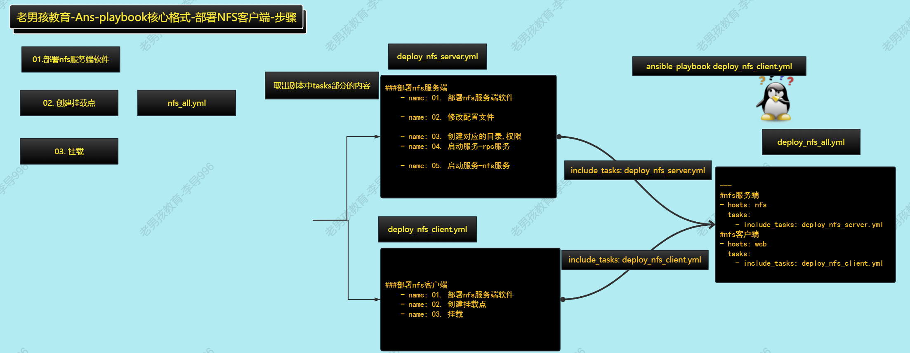
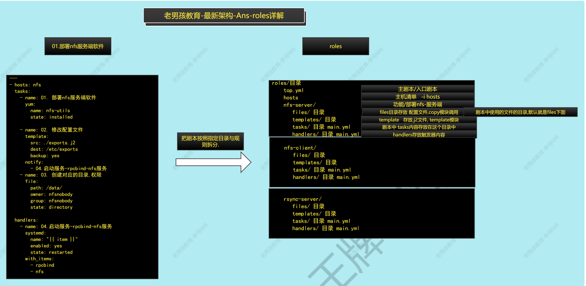
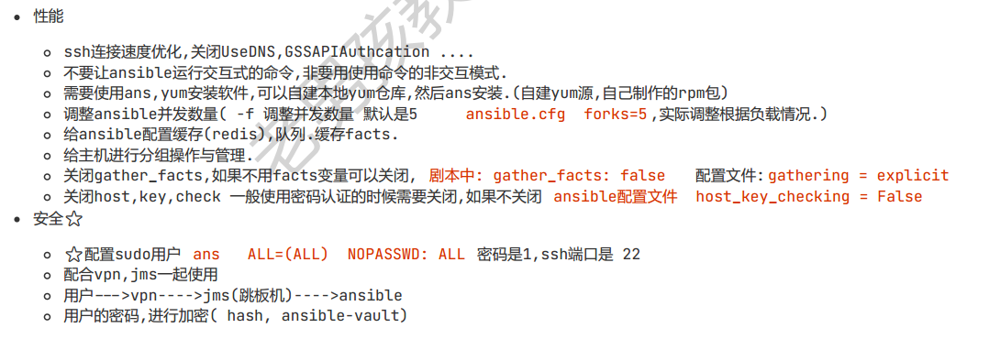

# Ansible集群自动化维护（四）- 完结

# 一、include文件包含

## 1.1 概述

应用场景：

在我们书写剧本的时候，会涉及到多个步骤，有时还会涉及到服务端和客户端。当剧本越来越大时，不容易进行分

析与阅读，这时候就需要把剧本拆分开，分成多个文件，如服务端、客户端。然后可以通过include_tasks的功能把

多个剧本文件合并在一起，让剧本变成多个方便阅读与维护  

如：普通部署nfs服务的方式：


采用include的剧本



## 1.2 实现案例

拆分nfs部署的剧本，实现如下：

部署服务端：

```shell
# 服务端
[root@mn01[ /server/scripts/playbook]#cat 15-deploy-nfs-server.yml
    - name: 01. 安装服务
      yum:
        name: nfs-utils, rpcbind
        state: present
      # 打标签tag
      tags:
        - 01.install
    - name: 02. 修改配置文件
      lineinfile:
        path: /etc/exports
        line: "/backup-nfs 172.16.1.0/24(rw, all_squash)"
        create: true
      tags:
        - 02.conf
    - name: 03. 创建共享目录并修改所有者
      file:
        path: /backup-nfs
        owner: nfsnobody
        group: nfsnobody
        state: directory
      tags:
        - 03.dir
    - name: 04. 启动服务
      systemd:
        name: "{{ item }}"
        state: started
        enabled: yes
      loop:
        - rpcbind
        - nfs
      tags:
        - 04.start_srv
```

部署客户端：

```shell
[root@mn01[ /server/scripts/playbook]#cat 15-deploy-nfs-client.yml
# 客户端
    - name: 01. 部署nfs-utils
      yum:
        name: nfs-utils
        state: present
    - name: 02. 挂载nfs
      mount:
        src: 172.16.1.41:/backup-nfs
        path: /ans-upload
        fstype: nfs
        state: mounted
```

include整合

```shell
[root@mn01[ /server/scripts/playbook]#cat 15-deploy-nfs-all.yml
# 服务端
- hosts: backup01
  tasks:
    - include_tasks: 15-deploy-nfs-server.yml


# 客户端
- hosts: web01
  tasks:
    - include_tasks: 15-deploy-nfs-client.yml
```


# 二、Roles标准

Roles是一套playbook的目录结构标准，用于解决剧本文件存放比较混乱的问题。例如当剧本规模扩大，各种handlers文件、变量文件，j2文件等存放在一起，怎么定义其目录结构呢？

## 2.1 概述

Roles的目录规范如下图所示：


同样以nfs剧本为例，按照Roles规则调整后的目录如图所示：



## 2.2 实现案例

使用Roles规则，实现nfs服务部署剧本

### 2.2.1 目录准备

按照Roles规则创建目录

```shell
[root@mn01[ /server/scripts/roles-all/roles01]#tree -F
.
├── group_vars/
│   └── all/	# 用于存放变量文件
├── hosts	# hosts文件，方便指定
├── nfs-server/·
│   ├── files/	# 存放需要下发的普通文件
│   ├── handlers/	# 存放handler操作
│   ├── tasks/·# 存放tasks任务
│   └── templates/	# 存放需要下发的j2文件
└── top.yml	# 整体调用接口

7 directories, 2 files
```

### 2.2.2 添加文件

创建各文件

```shell
[root@mn01[ /server/scripts/roles-all/roles01]#tree -F
.
├── group_vars/
│   └── all/
├── hosts
├── nfs-server/
│   ├── files/
│   │   └── exports
│   ├── handlers/
│   │   └── main.yml
│   ├── tasks/
│   │   └── main.yml
│   └── templates/
│       └── motd.j2
└── top.yml
```

exports文件

```shell
[root@mn01[ /server/scripts/roles-all/roles01]#cat nfs-server/files/exports
/backup-nfs 172.16.1.0/24(rw,all_squash)
```

handler/main.yml文件

```shell
[root@mn01[ /server/scripts/roles-all/roles01]#cat nfs-server/handlers/main.yml
- name: restart nfs server
  systemd:
    name: nfs
    state: reloaded
```

tasks/main.yml文件

```shell
[root@mn01[ /server/scripts/roles-all/roles01]#cat nfs-server/tasks/main.yml
    - name: 01. 部署nfs-utils
      yum:
        name: nfs-utils,rpcbind
        state: installed
      tags:
        - 01-install-nfs
    - name: 02. 修改配置文件
      copy:
        src: exports
        dest: /etc/exports
        backup: yes
      tags:
        - 02-conf
      notify:
        - restart nfs server

    - name: 03. 共享目录
      file:
        path: /backup-nfs/
        owner: nfsnobody
        group: nfsnobody
        state: directory
      tags:
         - 03-mkdir
    - name: 04. 启动服务 rpc nfs
      systemd:
        name: "{{ item }}"
        enabled: yes
        state: started
      loop:
        - rpcbind
        - nfs
      tags:
        - 04-start-service
    - name: 05 分发motd
      template:
        src: motd.j2
        dest: /etc/motd
        backup: yes
      tags:
        - 05-motd
```

templates/motd.j2文件

```shell
[root@mn01[ /server/scripts/roles-all/roles01]#cat nfs-server/templates/motd.j2
#######################################
welcome to oldboy elastic linux system
操作需谨慎,删根弹指间
主机名: {{ ansible_hostname }}
ip地址: {{ ansible_default_ipv4.address }}
内存大小: {{ ansible_memtotal_mb }}
CPU数量: {{ ansible_processor_vcpus }}
核心总数: {{ ansible_processor_cores }}
发行版本: {{ ansible_distribution }}
```

### 2.2.3 运行调试

运行如下：

```shell
[root@mn01[ /server/scripts/roles-all/roles01]#ansible-playbook -i hosts top.yml
 _________________
< PLAY [backup01] >
 -----------------
        \   ^__^
         \  (oo)\_______
            (__)\       )\/\
                ||----w |
                ||     ||

 ________________________
< TASK [Gathering Facts] >
 ------------------------
        \   ^__^
         \  (oo)\_______
            (__)\       )\/\
                ||----w |
                ||     ||

ok: [172.16.1.41]
 _____________________________________
< TASK [nfs-server : 01. 部署nfs-utils] >
 -------------------------------------
        \   ^__^
         \  (oo)\_______
            (__)\       )\/\
                ||----w |
                ||     ||

ok: [172.16.1.41]
 ________________________________
< TASK [nfs-server : 02. 修改配置文件] >
 --------------------------------
        \   ^__^
         \  (oo)\_______
            (__)\       )\/\
                ||----w |
                ||     ||

changed: [172.16.1.41]
 ______________________________
< TASK [nfs-server : 03. 共享目录] >
 ------------------------------
        \   ^__^
         \  (oo)\_______
            (__)\       )\/\
                ||----w |
                ||     ||

ok: [172.16.1.41]
 ______________________________________
< TASK [nfs-server : 04. 启动服务 rpc nfs] >
 --------------------------------------
        \   ^__^
         \  (oo)\_______
            (__)\       )\/\
                ||----w |
                ||     ||

ok: [172.16.1.41] => (item=rpcbind)
ok: [172.16.1.41] => (item=nfs)
 _______________________________
< TASK [nfs-server : 05 分发motd] >
 -------------------------------
        \   ^__^
         \  (oo)\_______
            (__)\       )\/\
                ||----w |
                ||     ||

ok: [172.16.1.41]
 ___________________________________________________
< RUNNING HANDLER [nfs-server : restart nfs server] >
 ---------------------------------------------------
        \   ^__^
         \  (oo)\_______
            (__)\       )\/\
                ||----w |
                ||     ||

changed: [172.16.1.41]
 ____________
< PLAY RECAP >
 ------------
        \   ^__^
         \  (oo)\_______
            (__)\       )\/\
                ||----w |
                ||     ||

172.16.1.41                : ok=7    changed=2    unreachable=0    failed=0    skipped=0    rescued=0    ignored=0
```

## 2.3 加入变量

使用`group_vars`文件夹，加入变量

```shell
路径、用户、uid、gid、域名/端口
```

添加变量文件：

```shell
[root@mn01[ /server/scripts/roles-all/roles01]#cat group_vars/all/main.yml
nfs_share_dir: /backup-nfs-v3/
nfs_user: nfsnobody
nfs_user_id: 65534
```

下发文件

```shell
[root@mn01[ /server/scripts/roles-all/roles01]#cat nfs-server/templates/exports.j2
{{ nfs_share_dir }} 172.16.1.0/24(rw,all_squash,anonuid={{nfs_user_id}},anongid={{nfs_user_id}})

```

主任务文件（**<font color=red>注意调用需要双引号</font>**）

```shell
[root@mn01[ /server/scripts/roles-all/roles01]#cat nfs-server/tasks/main.yml
    - name: 01. 部署nfs-utils
      yum:
        name: nfs-utils,rpcbind
        state: installed
      tags:
        - 01-install-nfs
    - name: 02. 修改配置文件
      # 改动1，下发exports文件改用变量
      template:
        src: exports.j2
        dest: /etc/exports
        backup: yes
      tags:
        - 02-conf
      notify:
        - restart nfs server

    - name: 03. 共享目录
      file:
        # 改动2, 共享目录改用变量
        path: "{{ nfs_share_dir }}"
        owner: "{{ nfs_user }}"
        group: "{{ nfs_user }}"
        state: directory
      tags:
         - 03-mkdir
    - name: 04. 启动服务 rpc nfs
      systemd:
        name: "{{ item }}"
        enabled: yes
        state: started
      loop:
        - rpcbind
        - nfs
      tags:
        - 04-start-service
    - name: 05 分发motd
      template:
        src: motd.j2
        dest: /etc/motd
        backup: yes
      tags:
        - 05-motd
```

执行：

```shell
[root@mn01[ /server/scripts/roles-all/roles01]#ansible-playbook -i hosts top.yml
 _________________
< PLAY [backup01] >
 -----------------
        \   ^__^
         \  (oo)\_______
            (__)\       )\/\
                ||----w |
                ||     ||

 ________________________
< TASK [Gathering Facts] >
 ------------------------
        \   ^__^
         \  (oo)\_______
            (__)\       )\/\
                ||----w |
                ||     ||

ok: [172.16.1.41]
 _____________________________________
< TASK [nfs-server : 01. 部署nfs-utils] >
 -------------------------------------
        \   ^__^
         \  (oo)\_______
            (__)\       )\/\
                ||----w |
                ||     ||

ok: [172.16.1.41]
 ________________________________
< TASK [nfs-server : 02. 修改配置文件] >
 --------------------------------
        \   ^__^
         \  (oo)\_______
            (__)\       )\/\
                ||----w |
                ||     ||

changed: [172.16.1.41]
 ______________________________
< TASK [nfs-server : 03. 共享目录] >
 ------------------------------
        \   ^__^
         \  (oo)\_______
            (__)\       )\/\
                ||----w |
                ||     ||

ok: [172.16.1.41]
 ______________________________________
< TASK [nfs-server : 04. 启动服务 rpc nfs] >
 --------------------------------------
        \   ^__^
         \  (oo)\_______
            (__)\       )\/\
                ||----w |
                ||     ||

ok: [172.16.1.41] => (item=rpcbind)
ok: [172.16.1.41] => (item=nfs)
 _______________________________
< TASK [nfs-server : 05 分发motd] >
 -------------------------------
        \   ^__^
         \  (oo)\_______
            (__)\       )\/\
                ||----w |
                ||     ||

ok: [172.16.1.41]
 ___________________________________________________
< RUNNING HANDLER [nfs-server : restart nfs server] >
 ---------------------------------------------------
        \   ^__^
         \  (oo)\_______
            (__)\       )\/\
                ||----w |
                ||     ||

changed: [172.16.1.41]
 ____________
< PLAY RECAP >
 ------------
        \   ^__^
         \  (oo)\_______
            (__)\       )\/\
                ||----w |
                ||     ||

172.16.1.41                : ok=7    changed=2    unreachable=0    failed=0    skipped=0    rescued=0    ignored=0
```


# 三、Ansible文件加密-Vault

使用方法如下：

```shell
#进行加密
ansible-vault encrypt 文件#enable
#进行使用
ansible或ansible-playbook --ask-vault-pass 即可
#彻底解密
ansible-vault decrypt hosts#
```

如果加密后是不能查看内容和执行的

```shell
[root@mn01[ /server/scripts/roles-all/roles01]#ansible-playbook top.yml
ERROR! Attempting to decrypt but no vault secrets found
[root@mn01[ /server/scripts/roles-all/roles01]#cat top.yml
$ANSIBLE_VAULT;1.1;AES256
38323232336535376538333039623035306130393831336563633134656661303166336434303231
3166623337343664653963646664326566303663653762620a353936373566316436613837313534
64343932663833343364326137316633626437303130366663666263616366303361666433393330
3438343536306431300a636331333662386364626362636537303164623865353139613333346261
63313066396361623839333461623365626136353434313663316564333735613037656437353136
31383531613666613038353365636231326637333036626131316263366439643266643735393634
653233353234353535663538326538366138
```


# 四、Glaxy-别人的Roles

可以从Glaxy网站下载别人做好的Roles，并安装

```she
ansible-galaxy collection install nginxinc.nginx_core
```


# 五、优化性能和安全性

如图：



其中安全--配置sudo的方法：

```shell
管理端:
[root@m01 /server/scripts/playbook]# egrep -v '^$|#' /etc/ansible/ansible.cfg
[defaults]
sudo_user = ans Վˁ被管理端上具有sudo权限的用户
nopasswd: ALL
remote_user = ans Վˁ被管理端使用的用户,不指定默认是当
前用户/root
remote_port = 22 Վˁ被管理端ssh端口号
host_key_checking = False
log_path = /var/log/ansible.log
[inventory]
[privilege_escalation]
become=True Վˁ开启sudo功能
become_method=sudo Վˁ使用sudo命令
become_user=root Վˁ普通用户切换为root
[paramiko_connection]
[ssh_connection]
[persistent_connection]
[accelerate]
[selinux]
[colors]
[diff]

# 被管理端:
ans ALL=(ALL) NOPASSWD: ALL` 密码是1,ssh端口是 22

# 重新分发密钥给ans普通用户.
ssh-copy-id ans@10.0.0.7

# 测试
ansible -i hosts web -m ping
```


参考脑图：https://www.processon.com/view/link/61addd266376896056c1b1b2