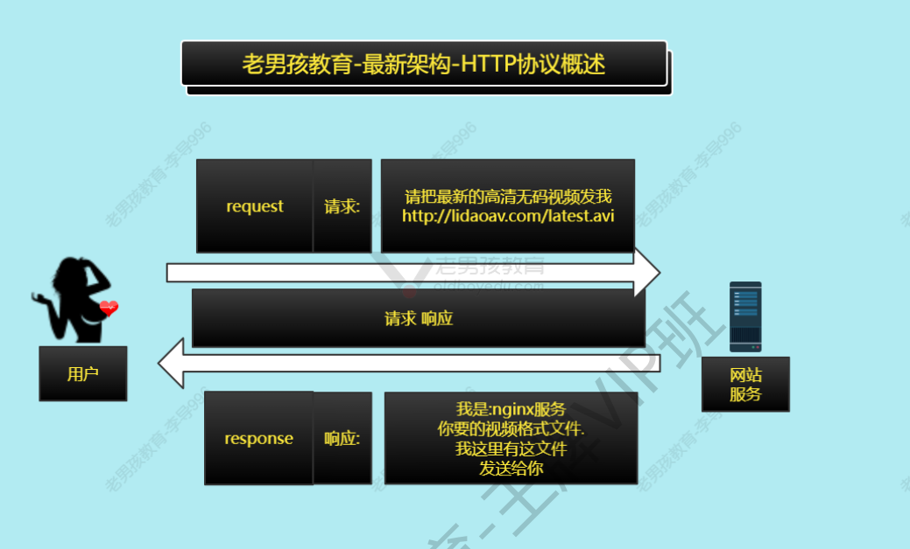
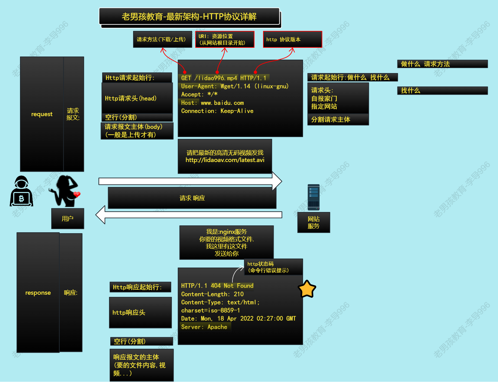
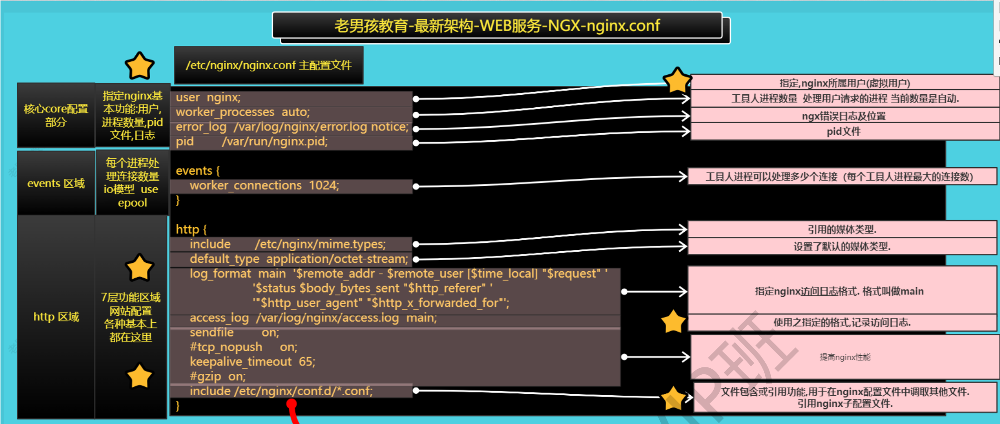

# Web集群-Nginx（一）

# 一、HTTP协议

## 1.1 HTTP协议概述

什么是HTTP协议？

- http协议全称叫超文本传输协议，默认端口是80，主要用于数据请求与响应。解决网络传输问题：
  - 用户的数据如何传递给网站（请求request）
    - 打开网站，访问网站
  - 网站如何传递数据给用户（响应response）
    - 网站显示，返回你想要的内容

什么是超文本？

- 文本,图片,视频....都是超文本


案例01：通过curl或wget访问网站并显示详细过程,能够找出哪部分是请求和响应 

curl

```shell
[root@mn01[ /server/scripts/roles-all/roles01]#curl -v baidu.com
* About to connect() to baidu.com port 80 (#0)
*   Trying 110.242.68.66...
* Connected to baidu.com (110.242.68.66) port 80 (#0)
> GET / HTTP/1.1
> User-Agent: curl/7.29.0
> Host: baidu.com
> Accept: */*
>
< HTTP/1.1 200 OK
< Date: Tue, 07 May 2024 02:06:40 GMT
< Server: Apache
< Last-Modified: Tue, 12 Jan 2010 13:48:00 GMT
< ETag: "51-47cf7e6ee8400"
< Accept-Ranges: bytes
< Content-Length: 81
< Cache-Control: max-age=86400
< Expires: Wed, 08 May 2024 02:06:40 GMT
< Connection: Keep-Alive
< Content-Type: text/html
<
<html>
<meta http-equiv="refresh" content="0;url=http://www.baidu.com/">
</html>
* Connection #0 to host baidu.com left intact
```

wget

```shell
[root@mn01[ /server/scripts/roles-all/roles01]#wget --debug baidu.com
...
---request begin---
GET / HTTP/1.1
User-Agent: Wget/1.14 (linux-gnu)
Accept: */*
Host: baidu.com
Connection: Keep-Alive

---request end---
HTTP request sent, awaiting response...
---response begin---
HTTP/1.1 200 OK
Date: Tue, 07 May 2024 02:07:08 GMT
Server: Apache
Last-Modified: Tue, 12 Jan 2010 13:48:00 GMT
ETag: "51-47cf7e6ee8400"
Accept-Ranges: bytes
Content-Length: 81
Cache-Control: max-age=86400
Expires: Wed, 08 May 2024 02:07:08 GMT
Connection: Keep-Alive
Content-Type: text/html

---response end---
200 OK
Registered socket 3 for persistent reuse.
Length: 81 [text/html]
Saving to: ‘index.html’
...
```

## 1.2 HTTP协议版本

|              | http1.0                                 | http1.1                                                | http2.0             | http3.0                    |
| ------------ | --------------------------------------- | ------------------------------------------------------ | ------------------- | -------------------------- |
| 特点         | 短连接,每次请求都需要重复建立 断开连接. | 加入长连接功能                                         | 增加并发 问更快 ,访 | 基于 流媒体 udp更快,应用于 |
|              | 占用服务端资源                          | keepalive功能 (网站响应后不会立刻断开,保留下 这个连接) |                     |                            |
| 是否加密     |                                         | http 不加密的 https 加密的                             | 默认基于 https      |                            |
| 基于 tcp/udp | tcp                                     | tcp                                                    | tcp                 | udp                        |

>目前状况：
>
>- 大部分企业还在使用http1.1, 一部分使用http2.0
>- 目前http3.0( QUIC ) 流媒体直播在使用.  

## 1.3 HTTP协议详解

图示一：请求报文和响应报文



更为详细的流程如图：



### 1.3.1 HTTP请求

#### a) 概述

请求流程图示：


#### b) 请求报文起始行

请求方法: 用于指定客户端如何访问服务端(下载,上传,查看服务端信息)  

| 常见的请求方法 | 说明                                                         |
| -------------- | ------------------------------------------------------------ |
| GET            | 下载(大部分请求)                                             |
| POST           | 上传(上传文件内容,登录)                                      |
| HEAD           | 类似于GET,仅仅输出响应的头部信息.(查看服务端的信息,一般用于检查) |

资源的位置(URI): 这个资源在网站站点目录的哪个地方,叫什么名字.  

这里面写的`/lidao.mp4`,斜线并非是Linux系统的根目录.这个`/`叫网站的站点目录  

>什么是URI (uri)？
>
>- 统一资源标识符 
>
>什么是站点目录？
>
>- 用于存放网站代码的地方。未来在nginx中我们可以指定与查看。
>  - GET /lidaoav.mp4 HTTP/1.1 这里的/不是根,是网站站点目录,未来可以在web服务中进行配置.
>  - 比如/app/code/www/是站点目录
>  - 访问/lidaoav.mp4 == /app/code/www/lidaoav.mp4  

#### c) 请求头

| 字段(一些关键词) | 含义                                   |
| ---------------- | -------------------------------------- |
| User-Agent       | 客户端代理(用什么工具访问网站),浏览器. |
| Host             | 表示访问的目标网站:域名或ip            |
| ....             |                                        |

#### d) 其他

请求报文中还包含：

- 空行: 分割请求头与请求报文主体
- 请求报文主体(body): 一般上传的时候才有

### 1.3.2 HTTP响应

#### a) 概述

状态码与服务端信息  


#### b) 响应报文起始行  

协议与版本 HTTP/1.1

状态码: 数字3位,用于描述服务端是否能找到或处理用户的请求.(类似于命令行错误提示) 200 ok. 404

状态码描述:  见1.3.3

#### c) 响应头

| 响应头字段     |                                                            |
| -------------- | ---------------------------------------------------------- |
| Server         | 显示服务端使用的web服务器及版本                            |
| 下面了解       |                                                            |
| Content-Type   | 媒体类型(文件类型)                                         |
| Content-Length | 大小                                                       |
| Location       | 跳转之后的新的位置(未来讲解rewrite 301/302),跳转的时候才有 |

#### d）其他

响应报文中还有什么？

- 空行
- 响应报文主体: 服务端返回给客户端的数据

### 1.3.3 状态码

状态码:：错误提示，反映出服务端是否能够正常的处理用户请求  

大致分类：

| 状态码 | 含义                      |
| ------ | ------------------------- |
| 2xx    | 表示正常                  |
| 3xx    | 表示需要进行跳转,表示正常 |
| 4xx    | 表示异常,客户端问题       |
| 5xx    | 表示异常,服务端问题       |

详细状态码：

| 详细的状态码                        | 说明                                                         |
| ----------------------------------- | ------------------------------------------------------------ |
| 200 ok                              | 访问正常                                                     |
| 301 Moved Permanently               | 永久跳转                                                     |
| 302 Found或Moved Temporarily        | 临时跳转                                                     |
| 304 Not Modified                    | 浏览器缓存                                                   |
| 403 Forbidden                       | 权限拒绝(拒绝访问)                                           |
| 404 Not Found                       | 文件找不到,一般辅助错误日志排查                              |
| 500 Internal Error                  | 内部错误,SElinux开启,其他原因一般辅助错误日志排查            |
| 502 Bad Gateway                     | 网关错误,一般发生在负载中(类似场景下),请求发送到后面,后面无人处理,提示 502. |
| 503 service temporarily unavailable | 服务临时不可用,后端负载异常等情况,人为设置(升级)             |
| 504 Gateway Time-out                | 网关超时                                                     |

### 1.3.4 HTTP协议小结

HTTP: 用户的请求与响应的格式与定义

HTTP请求报文

- 请求起始行: GET / (url) HTTP/1.1
- 请求头(head):
  - User-Agent: 客户端代理(浏览器)  
  - Host: 域名  
- 空行
- 请求豹纹主体(body): POST  

HTTP响应报文

- 响应报文的起始行: HTTP/1.1 状态码
- 响应头: Server(web服务器)
- 空行
- 响应豹纹的主体(body): 文件内容  

状态码


# 二、衡量系统访问量的指标

## 2.1 概述

指标分为：

| 指标 | 说明                                       |
| ---- | ------------------------------------------ |
| IP   | 访问网站的独立ip数量，公网ip.              |
| PV   | 页面访问量Page view.                       |
| UV   | 独立访客数量，接近于用户数量 Unique Vistor |
| DAU  | 每天的活跃用户的数量：日活(日活跃用户)     |
| MAU  | 月活(月活跃用户)                           |

## 2.2 统计方法

IP,PV,UV 

- 使用三剑客进行过滤
- 第三方统计插件(百度统计,.....网站页面加入代码),ELK

DAU,MAU 

- 第3方工具统计
- 数据库统计用户登录情况  


# 三、Nginx介绍

## 3.1 web服务概述

**WEB服务**：网站服务,部署并启动了这个服务,你就可以搭建一个网站.
**WEB中间件**：等同于WEB服务
中间件：范围更加广泛,指的负载均衡之后的服务.
数据库中间件：数据库缓存,消息对列... 

## 3.2 常见网站服务

| 网站服务                    | 说明                                |
| --------------------------- | ----------------------------------- |
| Nginx                       | 大部分使用nginx,Engine X            |
| Tengine                     | 基于Nginx二开,淘宝开源,更多内置模块 |
| Openresty                   | 基于Nginx二开,加强Lua功能与模块     |
| ......                      |                                     |
| Tomcat/Jboss/Jetty/Weblogic | 运行java环境的,web服务              |
| PHP                         | 运行php环境,需要ngx(LNMP)           |

## 3.3 配置Nginx

Nginx版本选择：

- 记录常用服务的版本：1.22.1
- 选用稳定版本：上一个稳定版本  

<font color=red>本配置在web01（10.0.0.7）服务器操作</font>

### 3.3.1 安装nginx

配置yum源

```shell
[root@web01[ /]#cat /etc/yum.repos.d/nginx.repo
[nginx-stable]
name=nginx stable repo
baseurl=http://nginx.org/packages/centos/$releasever/$basearch/
gpgcheck=1
enabled=1
gpgkey=https://nginx.org/keys/nginx_signing.key
module_hotfixes=true

# 刷新yum源
yum clean all
yum makecache
```

安装

```shell
[root@web01[ /]#yum install nginx -y

# 查看安装情况
[root@web01[ /]#rpm -ql nginx
/etc/logrotate.d/nginx
/etc/nginx
/etc/nginx/conf.d
/etc/nginx/conf.d/default.conf
/etc/nginx/fastcgi_params
/etc/nginx/mime.types
/etc/nginx/modules
/etc/nginx/nginx.conf
/etc/nginx/scgi_params
/etc/nginx/uwsgi_params
/usr/lib/systemd/system/nginx-debug.service
/usr/lib/systemd/system/nginx.service
/usr/lib64/nginx
/usr/lib64/nginx/modules
/usr/libexec/initscripts/legacy-actions/nginx
/usr/libexec/initscripts/legacy-actions/nginx/check-reload
/usr/libexec/initscripts/legacy-actions/nginx/upgrade
/usr/sbin/nginx
/usr/sbin/nginx-debug
/usr/share/doc/nginx-1.26.0
/usr/share/doc/nginx-1.26.0/COPYRIGHT
/usr/share/man/man8/nginx.8.gz
/usr/share/nginx
/usr/share/nginx/html
/usr/share/nginx/html/50x.html
/usr/share/nginx/html/index.html
/var/cache/nginx
/var/log/nginx
[root@web01[ /]#rpm -qa nginx
nginx-1.26.0-1.el7.ngx.x86_64
```

### 3.3.2 nginx目录结构

>温馨提示:
>
>Nginx不同的安装方法，目录，文件会有所区别.  

| 目录结构                       | 说明                                 |
| ------------------------------ | ------------------------------------ |
| /etc/nginx/                    | nginx各种配置目录                    |
| /etc/nginx/nginx.conf          | 主配置文件                           |
| /etc/nginx/conf.d/             | 子配置文件(网站)                     |
| /etc/nginx/conf.d/default.conf | 默认的子配置文件                     |
| /usr/sbin/nginx                | ngx命令                              |
| /usr/share/nginx/html/         | ngx默认的站点目录,网站的根目录       |
| /var/log/nginx/                | ngx日志: 访问日志,错误日志 ,跳转日志 |

其他目录说明

| 其他目录和文件                        | 说明                   |
| ------------------------------------- | ---------------------- |
| /etc/logrotate.d/nginx                | 日志切割(防止文件过大) |
| /etc/nginx/mime.types                 | 媒体类型               |
| /etc/nginx/fastcgi_params             | ngx+php                |
| /etc/nginx/uwsgi_params               | ngx+python             |
| /usr/lib/systemd/system/nginx.service | systemctl配置文件      |
| /var/cache/nginx/                     | 缓存目录               |

### 3.3.3 服务启动与管理

启动服务

```shell
systemctl enable nginx
systemctl start nginx
```

检查端口与进程

```shell
#检查服务状态
systemctl status nginx
#检查端口，会显示TCP和UDP
ss -lntup |grep 80
#检查进程
ps -ef |grep nginx
```

浏览器访问：http://10.0.0.7


命令访问

```shell
curl 10.0.0.7
curl -v 10.0.0.7
```


# 四、Nginx核心功能

## 4.1 配置文件详解

### 4.1.1 主配置文件

主配置文件：`/etc/nginx/nginx.conf  `

各配置项的详解如下：



>需要熟练掌握的配置项
>
>- include 文件包含,引用其他地方的ngx配置文件.
>- user指定ngx用户.
>- error_log错误日志
>- log_format日志格式
>- access_log 访问日志  

### 4.1.2 子配置文件

子配置文件：`/etc/nginx/conf.d/default.conf`


常用选项如下：

| 网站中常用必会指 令 | 说明                                                         |
| ------------------- | ------------------------------------------------------------ |
| listen              | 指定监听端口                                                 |
| server_name         | 指定域名,多个通过空格分割.                                   |
| location(区域)      | 匹配请求中的uri(资源地址)                                    |
| root                | 指定站点目录(网站的根目录) root /app/code/www; www.baidu.com/lidao/lidao.txt == /app/code/www/lidao/lidao.txt |
| index               | 指定站点的首页文件. 用户访问的时候不加上任何的文件,展示首页文件. |
| error_log           | 指定错误状态码与对应的错误页面.                              |

>ngx:必会问题：
>
>如果删除首页文件,进行(不指定文件)访问会发生什么?
>
>- 403首页文件不存在. 

## 4.2 部署第一个CXK网站

| 网站要求 | 说明                              |
| -------- | --------------------------------- |
| 域名     | cxk.oldboylinux.cn                |
| 站点目录 | /app/code/cxk                     |
| 代码来源 | https://gitee.com/xiaomingcai/cxk |

### a) 部署代码

```shell
# 创建目录/app/cpde/cxk
[root@web01[ /app]#mkdir -p code/cxk
# 解压代码放进去
[root@web01[ /]#tree -F app/code/cxk
app/code/cxk
├── about.md
├── css/
│   ├── common.css
│   └── style.css
├── images/
│   ├── b1.png
│   ├── b2.png
....
```

### b) 创建配置文件

```shell
# 新建配置文件
[root@web01[ /etc/nginx/conf.d]#cat cxk.oldboylinux.cn.conf
server {
  listen 80;
  server_name cxk.oldboylinux.cn;
  root /app/code/cxk;
  location / {
    index index.html;
  }
}

# 检查
[root@web01[ /etc/nginx/conf.d]#nginx -t
nginx: the configuration file /etc/nginx/nginx.conf syntax is ok
nginx: configuration file /etc/nginx/nginx.conf test is successful

# 重新加载
[root@web01[ /etc/nginx/conf.d]#systemctl reload nginx
```

## c) 设置客户机器的hosts解析文件

```shell
10.0.0.7 cxk.oldboylinux.cn
```

访问

