# Web集群-Tomcat（一）

今日内容：

- JAVA容器介绍
- JAVA环境介绍
- Tomcat上手


# 一、JAVA容器

什么是java容器？

- 用于存放java代码的环境，就叫java容器
- web中间件，很多就是java容器，见下表

| java容器 |                                                |
| -------- | ---------------------------------------------- |
| Tomcat   | 最常用，较重，功能完善.                        |
| Jetty    | 轻量，功能较少.                                |
| Weblogic | 用于Oracle数据库环境使用，Weblogic属于甲骨文． |
| 东方通   | 国产java容器                                   |


# 二、JAVA环境

JAVA环境分为三部分：

- JVM: java 虚拟机，运行java代码的地方.
- JRE: java Runtime Enviroment，java运行环境 。提供jvm环境，java命令。
- JDK: Java Development Kit，java开发环境 , jvm+jre+额外功能

图示如下：

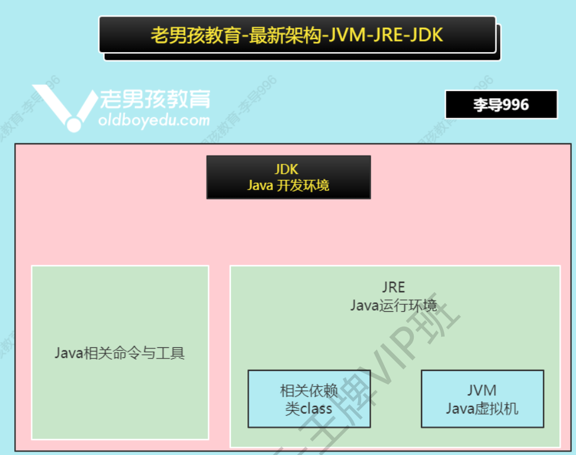

>提示：
>
>未来部署JDK即可，主要版本JDK1.8 或称 JDK8
>
>JDK - ORACLE所有，未授权仅允许个人研究
>
>OPenJDK - 开源，允许商用


# 三、Tomcat极速上手

## 3.1 环境准备

| 环境  |                       |        |
| ----- | --------------------- | ------ |
| web03 | 10.0.0.9/172.16.1.9   | tomcat |
| web04 | 10.0.0.10/172.16.1.10 | tomcat |
| db01  | 10.0.0.51/172.16.1.51 |        |

## 3.2 部署JDK

版本：JDK-8u411

下载：https://www.oracle.com/java/technologies/downloads/#java8

部署

```shell
# 解压
tar -vxf jdk-8u411-linux-x64.tar.gz -C /app/tools/

# 创建软连接
ln -s /app/tools/jdk1.8.0_411/ /app/tools/jdk

# 配置JAVA环境变量
[root@web03[ /app/tools]#tail -n 4 /etc/profile
# JDK环境
export JAVA_HOME=/app/tools/jdk
export PATH=$JAVA_HOME/bin:$JAVA_HOME/jre/bin:$PATH
export CLASSPATH=.$CLASSPATH:$JAVA_HOME/lib:$JAVA_HOME/jre/lib:$JAVA_HOME/lib/tools.jar

# 生效
source /etc/profile

# 测试java命令
[root@web03[ /app/tools]#java -version
java version "1.8.0_411"
Java(TM) SE Runtime Environment (build 1.8.0_411-b09)
Java HotSpot(TM) 64-Bit Server VM (build 25.411-b09, mixed mode)
[root@web03[ /app/tools]#which java
/app/tools/jdk/bin/java
```


## 3.3 部署Tomcat

版本：9.0.89

下载：https://dlcdn.apache.org/tomcat/tomcat-9/v9.0.89/bin/apache-tomcat-9.0.89.tar.gz

部署

```shell
tar -vxf apache-tomcat-9.0.89.tar.gz -C /app/tools/
ln -s /app/tools/apache-tomcat-9.0.89 /app/tools/tomcat

# 测试
[root@web03[ /app/tools]#tomcat/bin/version.sh
Using CATALINA_BASE:   /app/tools/tomcat
Using CATALINA_HOME:   /app/tools/tomcat
Using CATALINA_TMPDIR: /app/tools/tomcat/temp
Using JRE_HOME:        /app/tools/jdk
Using CLASSPATH:       /app/tools/tomcat/bin/bootstrap.jar:/app/tools/tomcat/bin/tomcat-juli.jar
Using CATALINA_OPTS:
Server version: Apache Tomcat/9.0.89
Server built:   May 3 2024 20:22:11 UTC
Server number:  9.0.89.0
OS Name:        Linux
OS Version:     3.10.0-1160.el7.x86_64
Architecture:   amd64
JVM Version:    1.8.0_411-b09
JVM Vendor:     Oracle Corporation
```

启动Tomcat

```shell
# 启动
[root@web03[ /app/tools]#tomcat/bin/startup.sh
Using CATALINA_BASE:   /app/tools/tomcat
Using CATALINA_HOME:   /app/tools/tomcat
Using CATALINA_TMPDIR: /app/tools/tomcat/temp
Using JRE_HOME:        /app/tools/jdk
Using CLASSPATH:       /app/tools/tomcat/bin/bootstrap.jar:/app/tools/tomcat/bin/tomcat-juli.jar
Using CATALINA_OPTS:
Tomcat started.

# 查看进程信息, 默认在8080端口监听
[root@web03[ /app/tools]#ss -lntup | grep java
tcp    LISTEN     0      100    [::]:8080               [::]:*                   users:(("java",pid=2585,fd=57))
tcp    LISTEN     0      1        [::ffff:127.0.0.1]:8005               [::]:*                   users:(("java",pid=2585,fd=65))


[root@web03[ /app/tools]#ps -ef | grep java
root       2585      1  9 16:27 pts/0    00:00:02 /app/tools/jdk/bin/java -Djava.util.logging.config.file=/app/tools/tomcat/conf/logging.properties -Djava.util.logging.manager=org.apache.juli.ClassLoaderLogManager -Djdk.tls.ephemeralDHKeySize=2048 -Djava.protocol.handler.pkgs=org.apache.catalina.webresources -Dorg.apache.catalina.security.SecurityListener.UMASK=0027 -Dignore.endorsed.dirs= -classpath /app/tools/tomcat/bin/bootstrap.jar:/app/tools/tomcat/bin/tomcat-juli.jar -Dcatalina.base=/app/tools/tomcat -Dcatalina.home=/app/tools/tomcat -Djava.io.tmpdir=/app/tools/tomcat/temp org.apache.catalina.startup.Bootstrap start
root       2628   2312  0 16:27 pts/0    00:00:00 grep --color=auto java
```

测试访问：http://10.0.0.9:8080/

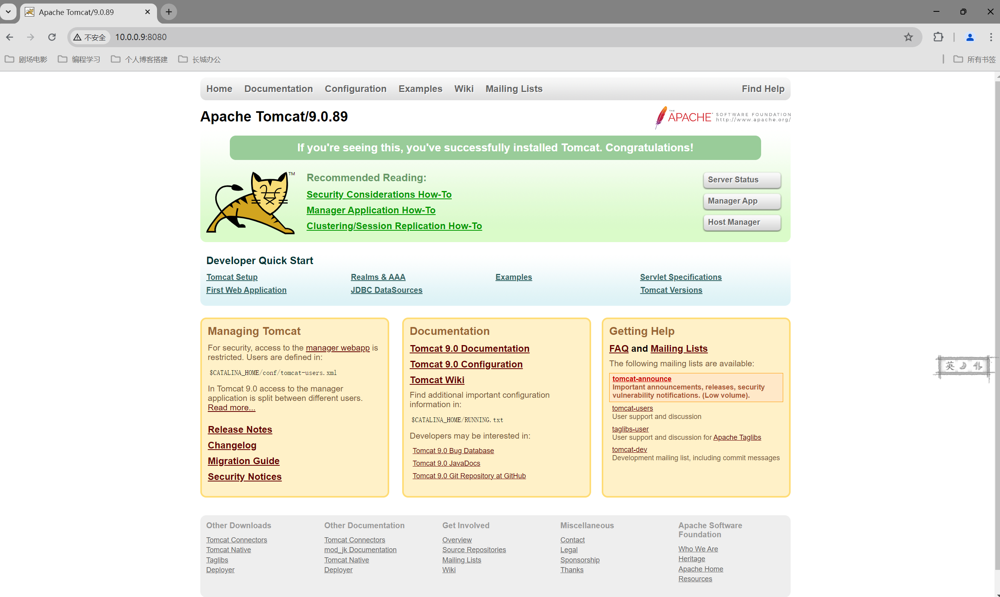


# 四、Tomcat目录结构

## 4.1 目录概述

Tomcat下有如下目录：

```shell
[root@web03[ /app/tools]#ll tomcat/
total 132
drwxr-x---. 2 root root  4096 May 11 16:25 bin
-rw-r-----. 1 root root 20913 May  4 04:22 BUILDING.txt
drwx------. 3 root root   254 May 11 16:27 conf
-rw-r-----. 1 root root  6210 May  4 04:22 CONTRIBUTING.md
drwxr-x---. 2 root root  4096 May 11 16:25 lib
-rw-r-----. 1 root root 57092 May  4 04:22 LICENSE
drwxr-x---. 2 root root   197 May 11 16:27 logs
-rw-r-----. 1 root root  2333 May  4 04:22 NOTICE
-rw-r-----. 1 root root  3283 May  4 04:22 README.md
-rw-r-----. 1 root root  6901 May  4 04:22 RELEASE-NOTES
-rw-r-----. 1 root root 16505 May  4 04:22 RUNNING.txt
drwxr-x---. 2 root root    30 May 11 16:25 temp
drwxr-x---. 7 root root    81 May  4 04:22 webapps
drwxr-x---. 3 root root    22 May 11 16:27 work
```

重要目录的概述如下

| 目录    |                                    |
| ------- | ---------------------------------- |
| bin     | 存放tomcat管理命令                 |
| conf    | tomcat配置文件                     |
| lib     | 依赖与库文件,插件文件              |
| logs    | 日志目录                           |
| webapps | 站点目录                           |
| work    | tomcat运行java代码的存放代码的目录 |

## 4.2 bin目录

核心文件：

| bin目录     |                                 |
| ----------- | ------------------------------- |
| startup.sh  | 启动脚本                        |
| shutdown.sh | 关闭脚本                        |
| catalina.sh | 核心脚本,配置tomcat优化,jvm优化 |

## 4.3 conf目录

核心文件

| conf配置文件 | 说明              |
| ------------ | ----------------- |
| server.xml   | tomcat配置文件    |
| web.xml      | 配置文件,辅助配置 |


## 4.4 logs目录

| logs目录                            |                                                              |
| ----------------------------------- | ------------------------------------------------------------ |
| catalina.out                        | tomcat应用日志,启动过程,关闭,错误信息 <br/>**核心找**：startup启动用时,错误提示:error,failed,exception |
| catalina.2022-09-15.log             | catalina.out的切割日志.按照每天进行切割.                     |
| localhost_access_log.2022-09-15.txt | 访问日志,未来可以重新定义名字和内容                          |


## 4.5 webapps目录

站点目录
war包，自动解压，自动部署  


# 五、Tomcat日常管理与访问

## 5.1 日常启动与维护

启动tomcat查看日志

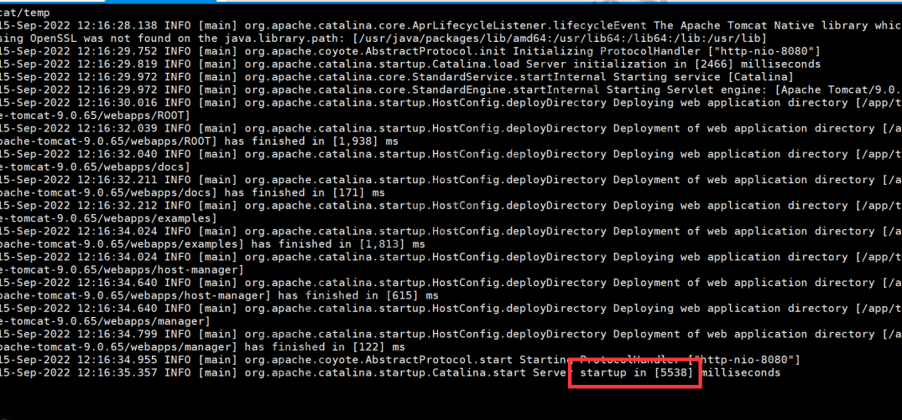

浏览器测试访问：http://10.0.0.9:8080/  


## 5.2 systemctl管理配置文件介绍

如果纯靠手动执行`startup.sh`脚本来维护tomcat，有些费时费力，可以把这些工作写成systemctl服务，用服务来自动管理。

服务管理指令存放：`/usr/lib/systemd/system/xxxx.service`，

分为3个部分：Unit、Service、Install

修改或设置systemctl配置要进行重新加载配置  

比如sshd服务的配置

```shell
[root@web03[ /app/tools]#cat /usr/lib/systemd/system/sshd.service
[Unit]
Description=OpenSSH server daemon
Documentation=man:sshd(8) man:sshd_config(5)
After=network.target sshd-keygen.service
Wants=sshd-keygen.service

[Service]
Type=notify
EnvironmentFile=/etc/sysconfig/sshd
ExecStart=/usr/sbin/sshd -D $OPTIONS
ExecReload=/bin/kill -HUP $MAINPID
KillMode=process
Restart=on-failure
RestartSec=42s

[Install]
WantedBy=multi-user.target
```

各项解释如下：

| 配置文件结构                         |                                                         |
| ------------------------------------ | ------------------------------------------------------- |
| **<font color=red>[Unit]</font>**    | 指定注释信息,依赖(先后顺序)                             |
| Description                          | 说明与注释                                              |
| After                                | 在这里指定的服务之后运行. network.target                |
| **<font color=red>[Service]</font>** | 用于指定服务开启命令,关闭命令,重启命令.                 |
| Type=notify                          | 指定类型 simple 或forking即可                           |
| ExecStart                            | 服务启动命令                                            |
| ExecStop                             | 服务关闭命令                                            |
| ExecReload                           | 重启命令                                                |
| EnvironmentFile                      | 配置环境变量的文件(一般对于编译安装,二进制安装需要加上) |
| **<font color=red>[Install]</font>** | 内容固定,用于指定运行级别.                              |
| WantedBy=multi-user.target           | 运行级别,一般都是多用户模式.                            |

## 5.3 创建systemctl文件

创建环境变量文件

```shell
[root@web03[ /etc/sysconfig]#cat /etc/sysconfig/tomcat
JAVA_HOME=/app/tools/jdk
PATH=$JAVA_HOME/bin:$JAVA_HOME/jre/bin:/usr/bin/:/usr/sbin/:/usr/local/bin/:/usr/local/sbin/
CLASSPATH=.$CLASSPATH:$JAVA_HOME/lib:$JAVA_HOME/jre/lib:$JAVA_HOME/lib/tools.jar
```

创建tomcat systemctl文件

```shell
[root@web03[ /usr/lib/systemd/system]#cat tomcat.service
[Unit]
Description=Tomcat java web container
After=network.target

[Service]
Type=forking
EnvironmentFile=/etc/sysconfig/tomcat
ExecStart=/app/tools/tomcat/bin/startup.sh
ExecStop=/app/tools/tomcat/bin/shutdown.sh
ExecReload=/app/tools/tomcat/bin/shutdown.sh && sleep 1 && /app/tools/tomcat/bin/startup.sh

[Install]
WantedBy=multi-user.target
```

重新加载配置（重要，不能忘记！！）

```shell
systemctl daemon-reload
```

测试

```shell
[root@web03[ /usr/lib/systemd/system]#systemctl enable tomcat.service
Created symlink from /etc/systemd/system/multi-user.target.wants/tomcat.service to /usr/lib/systemd/system/tomcat.service.
[root@web03[ /usr/lib/systemd/system]#systemctl start tomcat.service
[root@web03[ /usr/lib/systemd/system]#systemctl status tomcat.service
● tomcat.service - Tomcat java web container
   Loaded: loaded (/usr/lib/systemd/system/tomcat.service; enabled; vendor preset: disabled)
   Active: inactive (dead) since Sat 2024-05-11 16:52:52 CST; 637ms ago
  Process: 2956 ExecStop=/app/tools/tomcat/bin/shutdown.sh (code=exited, status=0/SUCCESS)
  Process: 2931 ExecStart=/app/tools/tomcat/bin/startup.sh (code=exited, status=0/SUCCESS)
 Main PID: 2939 (code=exited, status=0/SUCCESS)

May 11 16:52:49 web03 systemd[1]: Starting Tomcat java web container...
May 11 16:52:49 web03 startup.sh[2931]: Tomcat started.
May 11 16:52:49 web03 systemd[1]: Started Tomcat java web container.
```


## 5.4 运行站点代码

开发写的JAVA源代码不能直接部署在Tomcat中，需要对源代码进行编译，生成war包或者jar包

| 分类  | 说明                                                         | 应用场景 |
| ----- | ------------------------------------------------------------ | -------- |
| war包 | 需要放在java容器中运行<br/>比如放到tomcat的webapps目录下.<br/>(tomcat会自动加载与运行 war包内容) | 功能复杂 |
| jar包 | 不需要java容器，内置tomcat<br/>只需要jdk ，通过` java -jar xxx.jar` 运行 |          |

### 5.4.1 运行war包案例

上传memtest.war包，放在webapps目录，然后访问即可

  ```shell
[root@web03[ /app/tools/tomcat/webapps]#ls
docs  examples  host-manager  manager  memtest.war  ROOT
  ```

测试访问：http://10.0.0.9:8080/memtest/meminfo.jsp

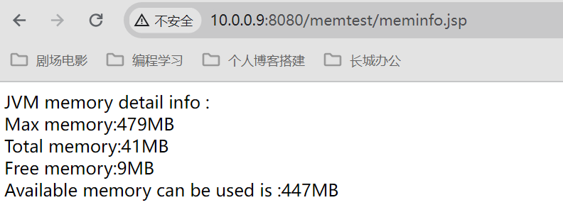

### 5.4.2 运行jar包案例

> JAR包如果内置了Tomcat，直接指定端口运行即可

下载程序包：

```shell
wget http://file.nginxwebui.cn/nginxWebUI-3.4.0.jar
```

部署

```shell
nohup java -jar -Dfile.encoding=UTF-8 /home/nginxWebUI/nginxWebUI-4.0.8.jar --server.port=8081 --project.home=/home/nginxWebUI/ > /dev/null &
```

参数说明

| 参数           | 作用                                                    |
| -------------- | ------------------------------------------------------- |
| --server.port  | 占用端口                                                |
| --project.home | 项目配置文件目录，存放数据库文件，证书文件，<br/>日志等 |
| &              | 项目后台运行                                            |

测试访问：http://10.0.0.9:8081/adminPage/login

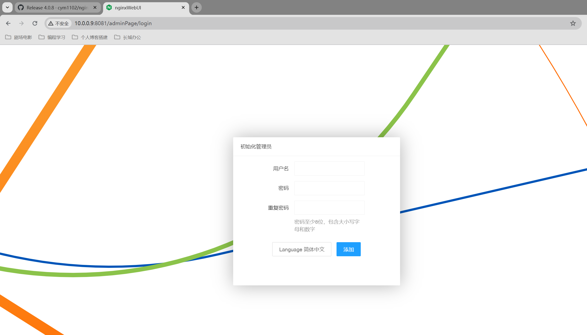


## 5.6 Tomcat管理端（熟悉即可）

tomcat管理端：

- 用于web页面管理与查看tomcat信息的功能。
- 未来对tomcat进行调优的时候需要关闭。

开启管理端的方法：

1. 修改配置文件tomcat-users.xml
2. 修改安全配置，默认只能127访问，去掉此限制  

修改配置文件

```shell
[root@web03[ /app/tools/tomcat/conf]#cat tomcat-users.xml
<?xml version="1.0" encoding="UTF-8"?>
<tomcat-users xmlns="http://tomcat.apache.org/xml"
              xmlns:xsi="http://www.w3.org/2001/XMLSchema-instance"
              xsi:schemaLocation="http://tomcat.apache.org/xml tomcat-users.xsd"
              version="1.0">
<!-- 添加  -->
<role rolename="manager-gui"/>
<role rolename="admin-gui"/>
<user username="lidao996" password="1" roles="manager-gui,admin-gui"/>
</tomcat-users>
```

去掉只能127网段访问的限制，否则10网段访问将报403错误

```shell
sed -i 's#127#\\d+#g' ./host-manager/META-INF/context.xml ./host-manager/WEB-INF/manager.xml  ./manager/META-INF/context.xml
```

重启服务

```shell
systemctl restart tomcat
```

测试访问：http://10.0.0.9:8080/manager/status

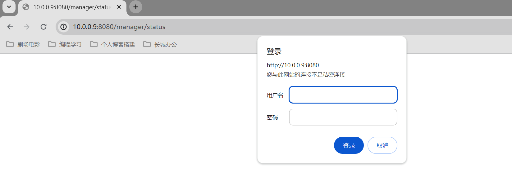

输入配置的账号密码，成功进入

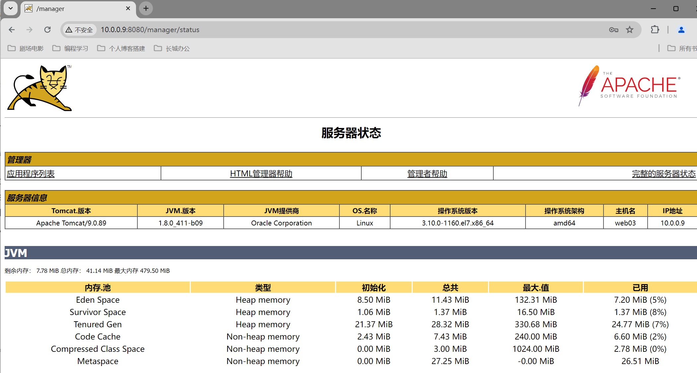


# 六、Tomcat集群

## 6.1 Tomcat配置文件详解

主配置文件：`conf/server.xml`

```xml
<!-- 8085 shutdown端口，连接这个端口输入shutdown字符，就可以关闭tomcat -->
<Server port="8005" shutdown="SHUTDOWN">

<!-- 管理端认证功能 -->
<GlobalNamingResources>
    <Resource name="UserDatabase" auth="Container"
              type="org.apache.catalina.UserDatabase"
              description="User database that can be updated and saved"
              factory="org.apache.catalina.users.MemoryUserDatabaseFactory"
              pathname="conf/tomcat-users.xml" />
  </GlobalNamingResources>

<!-- 8080端口 处理用户Http请求 -->
 <Connector port="8080" protocol="HTTP/1.1"
               connectionTimeout="20000"
               redirectPort="8443"
               maxParameterCount="1000"
               />

<!--  Engine部署，指定默认的虚拟主机，这里指定localhost为默认虚拟主机 -->
<Engine name="Catalina" defaultHost="localhost">

<!-- Host部分，虚拟主机的配置, name就是域名 -->
<Host name="localhost"  appBase="webapps"
            unpackWARs="true" autoDeploy="true">
        <Valve className="org.apache.catalina.valves.AccessLogValve" directory="logs"
               prefix="localhost_access_log" suffix=".txt"
               pattern="%h %l %u %t &quot;%r&quot; %s %b" />

      </Host>

<!-- 日志记录部分 -->
            <Valve className="org.apache.catalina.valves.AccessLogValve" directory="logs"
               prefix="localhost_access_log" suffix=".txt"
               pattern="%h %l %u %t &quot;%r&quot; %s %b" />

```

Tomcat配置于nginx配置的对比

| tomcat   | ngx                                                          |                                            |
| -------- | ------------------------------------------------------------ | ------------------------------------------ |
| 虚拟主机 | Host部分                                                     | server {}                                  |
| 域名     | name="域名"                                                  | server_name java.oldboylinux.cn;           |
| 端口     | Connector部分 port="8080"                                    | listen 80;                                 |
| 站点目录 | appBase="webapps"                                            | root /app/code/blog;                       |
| 自动解压 | unpackWARs="true"                                            | 无                                         |
| 自动部署 | autoDeploy="true" 加载到jvm中                                | 无                                         |
| 日志目录 | <Valve 部分 日志目录 directory="logs"                        | access_log /var/log/nginx/access.log main; |
| 日志名字 | <Valve 部分前半部分prefix="localhost_access_log" 后半部分suffix=".txt" | access_log /var/log/nginx/access.log main; |
| 日志格式 | <Valve 部分pattern="%h %l %u %t "%r" %s %b"                  | log_format main ................;          |

## 6.2 tomcat访问日志格式

说明

| 说明                             | tomcat                | nginx                   |
| -------------------------------- | --------------------- | ----------------------- |
| 定义访问日志的格式               | Host部分的pattern定义 | http区域 log_format部分 |
| 客户端ip地址                     | %h                    | $remote_addr            |
| 访问的时间                       | %t                    | $local_time             |
| 请求起始行                       | %r                    | $request                |
| 状态码                           | %s                    | $status                 |
| 大小                             | %b                    | $body_bytes_sent        |
| 从哪里跳转来的(用户如何访问网站) | %{Referer}i           | $http_referer           |
| 客户端类型,浏览器                | %{User-Agent}i        | $http_user_agent        |
| XFF头记录                        | %{X-Forwarded-For}i   | $http_x_forwarded_for   |

建议配置

```xml
pattern="%h %l %u %t &quot;%r&quot; %s %b &quot;% {Referer}i&quot; &quot;%{User-Agent}i&quot; &quot;% {X-Forwarded-For}i&quot;" />
```

>其中`&quot;`表示双引号


## 6.3 Tomcat与用户请求

请求流程：

1. 请求与8080端口连接
2. 域名与Host部分的Name进行匹配
   1. 匹配成功：使用对应虚拟主机
   2. 匹配失败：使用Engine中定义的default默认虚拟主机

>Tomcat可以处理静态与动态的请求：
>
>- 处理静态的效率较低，擅长动态


## 6.4 案例-部署zrlog应用

步骤：

- 准备站点war文件
- 创建数据库、用户
- 修改Tomcat配置

1、代码准备：

```shell
# 上传zrlog的war包到webapps文件夹中
[root@web03[ /app/tools/tomcat/webapps]#mv /root/zrlog-2.2.1-efbe9f9-release.war zrlog.war
```

2、创建数据库、用户

```shell
# 创建数据库
MariaDB [(none)]> create database zrlog;
Query OK, 1 row affected (0.00 sec)

# 创建对应用户
MariaDB [(none)]> grant all on zrlog.* to 'zrlog'@'172.16.1.%' identified by 'redhat123';
Query OK, 0 rows affected (0.00 sec)

# 查看
MariaDB [(none)]> show databases;
+--------------------+
| Database           |
+--------------------+
| information_schema |
| mysql              |
| performance_schema |
| wordpress          |
| zrlog              |
+--------------------+
5 rows in set (0.01 sec)
MariaDB [(none)]> select user,host from mysql.user;
+------------+------------+
| user       | host       |
+------------+------------+
| root       | 127.0.0.1  |
| phpmyadmin | 172.16.1.% |
| wordpress  | 172.16.1.% |
| wp         | 172.16.1.% |
| zrlog      | 172.16.1.% |
| root       | ::1        |
| root       | localhost  |
| wordpress  | localhost  |
+------------+------------+
8 rows in set (0.00 sec)
```

测试访问：

>以上配置并没有未站点配置域名，zrlog.olboy这个域名是通过配置hosts解析设置的，只是为方便站点理解
>
>```shell
>10.0.0.9 zrlog.oldboylinux.cn
>```

前台：http://zrlog.oldboylinux.cn:8080/zrlog/

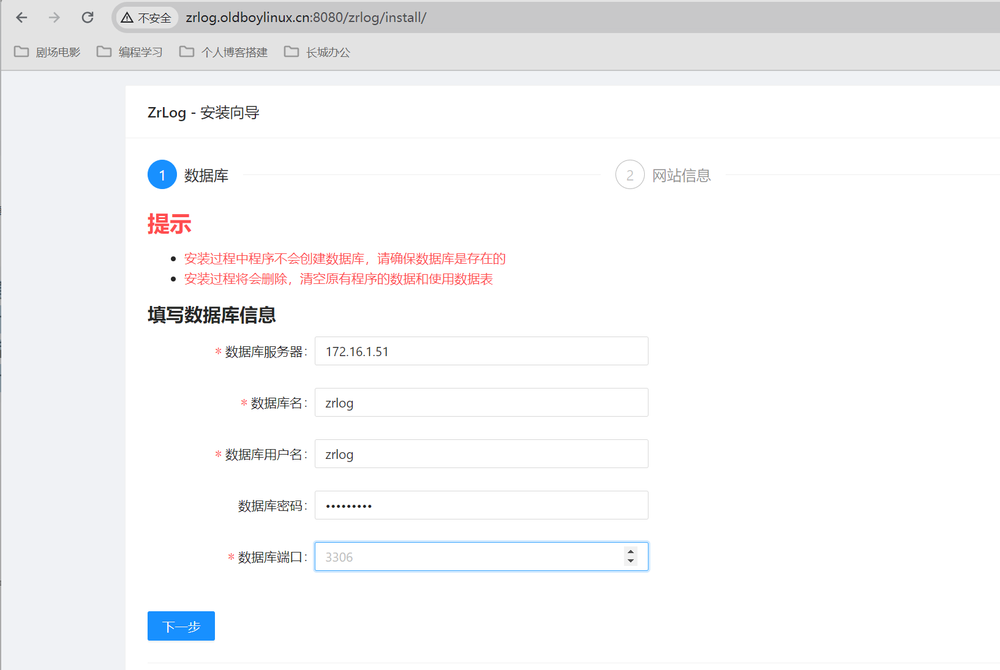

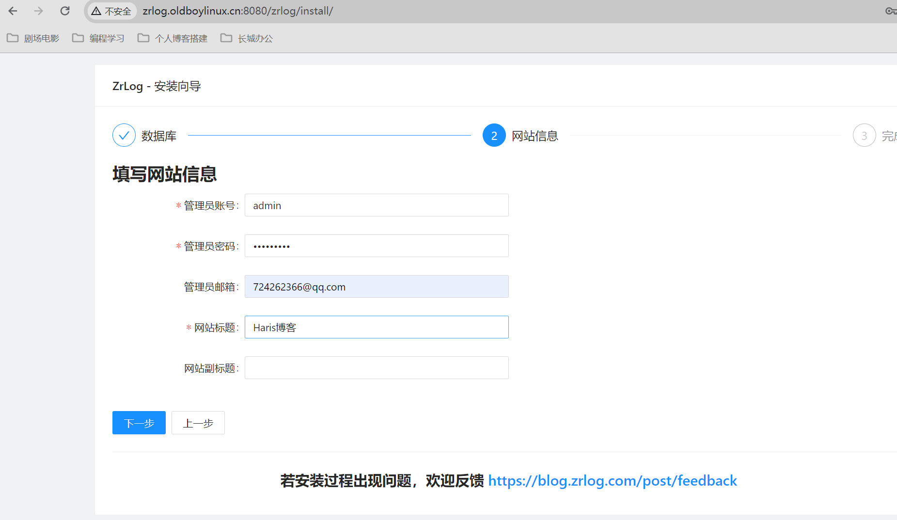


后台管理：http://zrlog.oldboylinux.cn:8080/zrlog/admin/  

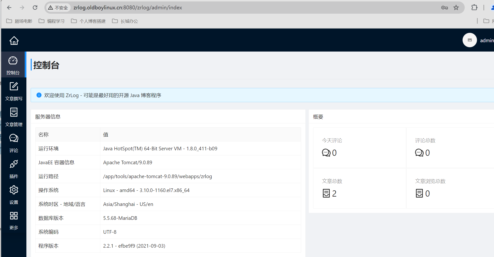

## 6.5 Tomcat的ROOT文件夹

实现目标：想直接访问到网站，而不是加上网站路径

比如：

```shell
# 现在访问zrlog
http://zrlog.oldboylinux.cn:8080/zrlog/

# 我想要的
http://zrlog.oldboylinux.cn:8080
```

原理：当访问站点不加上路径时，会直接访问ROOT下面的内容

实现直接访问zrlog：

```shell
# 先删除原有的ROOT文件夹（重命名也可以）
mv ROOT ROOT.old

# 把zrlog.war该名称ROOT.war 
mv zrlog.war ROOT.war

# 会新部署生成ROOT文件夹，老的zrlog可以删了
rm zrlog -fr

# 查看
[root@web03[ /app/tools/tomcat/webapps]#ls
docs  examples  host-manager  manager  memtest  memtest.war  ROOT  ROOT.old  ROOT.war 
```

测试访问：http://zrlog.oldboylinux.cn:8080/

直接跳到zrlog的安装界面，说明成功

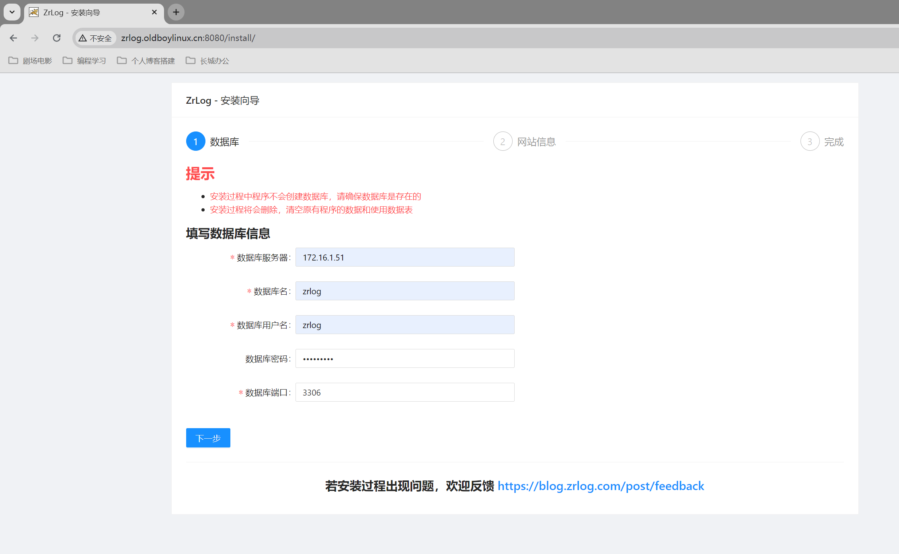

>补充：
>
>如果zrlog已经配置完了，后续如何修改数据库的地址？
>
>```shell
>[root@web03[ /app/tools/tomcat/webapps]#cat ROOT/WEB-INF/db.properties
>#This is a database configuration file
>#Mon May 13 13:44:21 CST 2024
>driverClass=com.mysql.cj.jdbc.Driver
>user=zrlog
>password=redhat123
>jdbcUrl=jdbc\:mysql\://172.16.1.51\:3306/zrlog?characterEncoding\=UTF-8&allowPublicKeyRetrieval\=true&useSSL\=false&serverTimezone\=GMT
>```

## 6.6 Tomcat接入Nginx

Tomca接入Nginx，其原理是

用户 --访问---> nginx ---转发---> Tomcat

Nginx虚拟主机：

```shell
[root@web03[ /etc/nginx/conf.d]#cat zrlog.oldboylinux.cn.conf
server {
  listen 80;
  server_name zrlog.oldboylinux.cn;
  error_log  /var/log/nginx/zrlog-error.log notice;
  access_log /var/log/nginx/zrlog-access.log main;

  # location转发
  location / {
    proxy_pass http://127.0.0.1:8080;
    proxy_set_header Host $http_host;
    proxy_set_header X-Forwarded-For $proxy_add_x_forwarded_for;
  }
}
```

设置Hosts，测试访问：http://zrlog.oldboylinux.cn/，转发成功

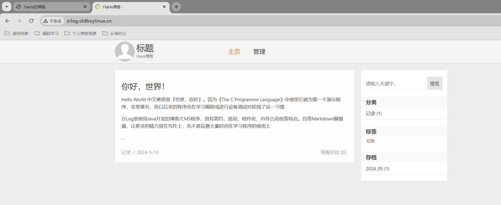

## 6.7  Tomcat + Ngx动静分离

什么是动静分离：

- 动态资源和静态资源都单独存放
- 如果需要访问静态资源，Nginx直接返回
- 如果需要访问动态资源，Nginx再转发给Tomcat处理

>前提：需要开发拆分代码，把静态资源拆分出来单独存放.  

图示：没有动静分离，Ngx一股脑全抛给Tomcat

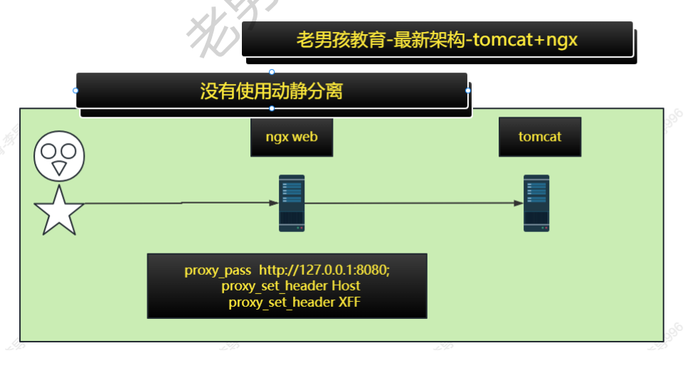

图示：有动静分离，Nginx处理静态资源，Tomcat处理动态资源

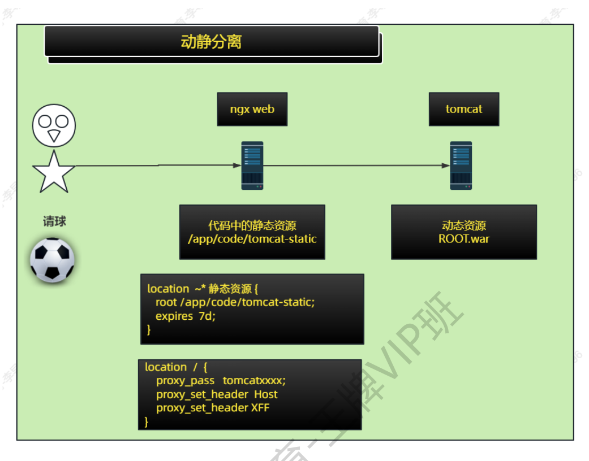

## 6.8 Tomcat创建多个实例

目标：在同一台Linux主机上运行多个Tomcat实例

原因：可以充分利用服务器资源

步骤：

- 创建多个tomcat目录
- 配置文件端口8080，8005，改掉防止冲突
- 启动  

创建多个Tomcat目录

```shell
tar xf apache-tomcat-9.0.65.tar.gz
cp -r apache-tomcat-9.0.65 tomcat-8081
cp -r apache-tomcat-9.0.65 tomcat-8082
mv tomcat-808* /app/tools/
```

修改配置

```shell
sed -i 's#8005#8006#g' tomcat-8081/conf/server.xml
sed -i 's#8080#8081#g' tomcat-8081/conf/server.xml
sed -i 's#8005#8007#g' tomcat-8082/conf/server.xml
sed -i 's#8080#8082#g' tomcat-8082/conf/server.xml
```

手动启动

```she
echo java oldboylinux 8081 >/app/tools/tomcat-
8081/webapps/ROOT/lidaojsp
echo java oldboylinux 8082 >/app/tools/tomcat-
8082/webapps/ROOT/lidao.jsp
```

测试访问

>建议：
>
>未来生产上，可以直接把tomcat+应用整体打包，使用的时候直接解压即可  

## 6.9 监控功能

### 6.9.1 监控概述

作用：

- 通过各种监控工具(Zabbix/Grafana/Prometheus/....)来监控Tomcat/java.
- 需要我们开启java远程监控功能(JMX remote)  

### 6.9.2 配置步骤

tomcat配置中修改tomcat启动的选项，开启jmx远程监控功能。

```shell
# 备份文件
[root@web03[ /app/tools/tomcat]#cp bin/catalina.sh bin/catalina.sh.bak

# 编辑catalina.sh，125行之后加
# 从tomcat 8.5开始 配置的每一行要通过\进行续行
CATALINA_OPTS="$CATALINA_OPTS \
 -Dcom.sun.management.jmxremote \
 -Dcom.sun.management.jmxremote.port=12345 \
 -Dcom.sun.management.jmxremote.authenticate=false \
 -Dcom.sun.management.jmxremote.ssl=false \
 -Djava.rmi.server.hostname=10.0.0.9" \
 
# 重启tomcat生效
systemctl restart tomcat
```

选项说明

| 开启远程监控功能选项                              |                              |                 |
| ------------------------------------------------- | ---------------------------- | --------------- |
| -Dcom.sun.management.jmxremote                    | 开启远程监控功能             |                 |
| -Dcom.sun.management.jmxremote.port=12345         | 指定端口                     |                 |
| -Dcom.sun.management.jmxremote.authenticate=false | 关闭认证功能                 |                 |
| -Dcom.sun.management.jmxremote.ssl=false          | 关闭ssl加密功能              |                 |
| -Djava.rmi.server.hostname=10.0.0.9               | 写上本地网卡的ip,监听的地址. | 未来需要修改的. |

### 6.9.3 验证

配置完监控后，Tomcat的java进程有什么改变？

- 可以看到tomcat配置的监控信息

```shell
[root@web03[ /app/tools/tomcat]#ps -ef | grep java
root      13476      1  2 14:19 ?        00:00:05 /app/tools/jdk/bin/java -Djava.util.logging.config.file=/app/tools/tomcat/conf/logging.properties -Djava.util.logging.manager=org.apache.juli.ClassLoaderLogManager -Djdk.tls.ephemeralDHKeySize=2048 -Djava.protocol.handler.pkgs=org.apache.catalina.webresources -Dorg.apache.catalina.security.SecurityListener.UMASK=0027 -Dcom.sun.management.jmxremote -Dcom.sun.management.jmxremote.port=12345 -Dcom.sun.management.jmxremote.authenticate=false -Dcom.sun.management.jmxremote.ssl=false -Djava.rmi.server.hostname=10.0.0.9 -Dignore.endorsed.dirs= -classpath /app/tools/tomcat/bin/bootstrap.jar:/app/tools/tomcat/bin/tomcat-juli.jar -Dcatalina.base=/app/tools/tomcat -Dcatalina.home=/app/tools/tomcat -Djava.io.tmpdir=/app/tools/tomcat/temp org.apache.catalina.startup.Bootstrap start
```


在windows下，通过JDK连接tomcat，模拟监控软件连接

>C:\Program Files\Java\jdk1.8.0_201\bin\jconsole.exe  

执行：

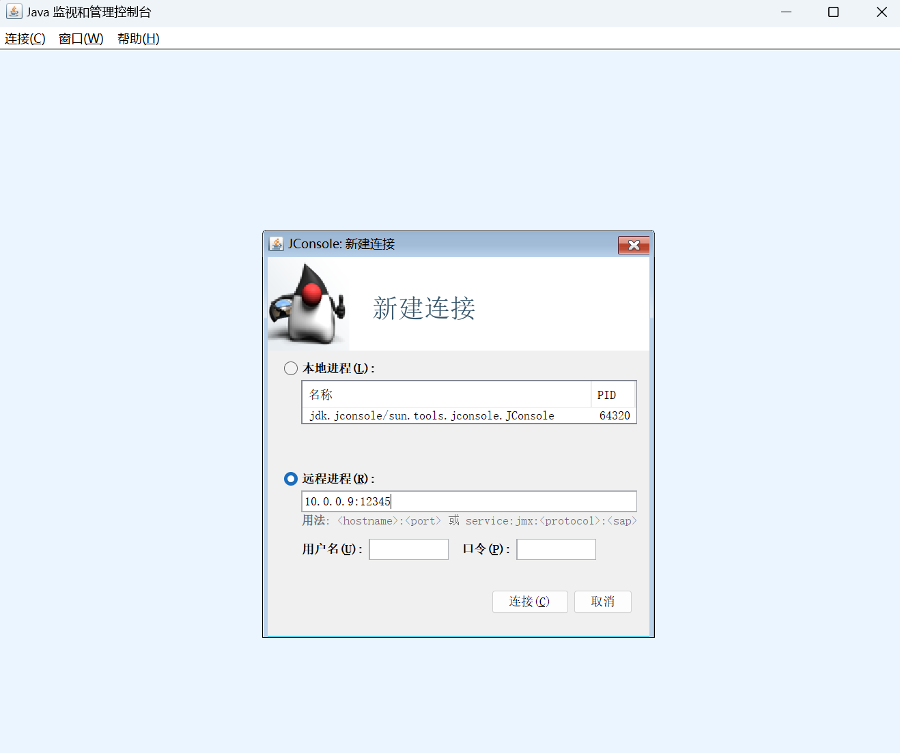

选择不安全连接

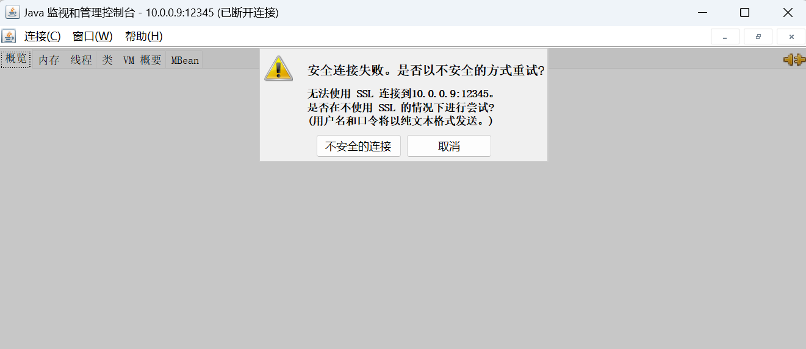

连接成功

