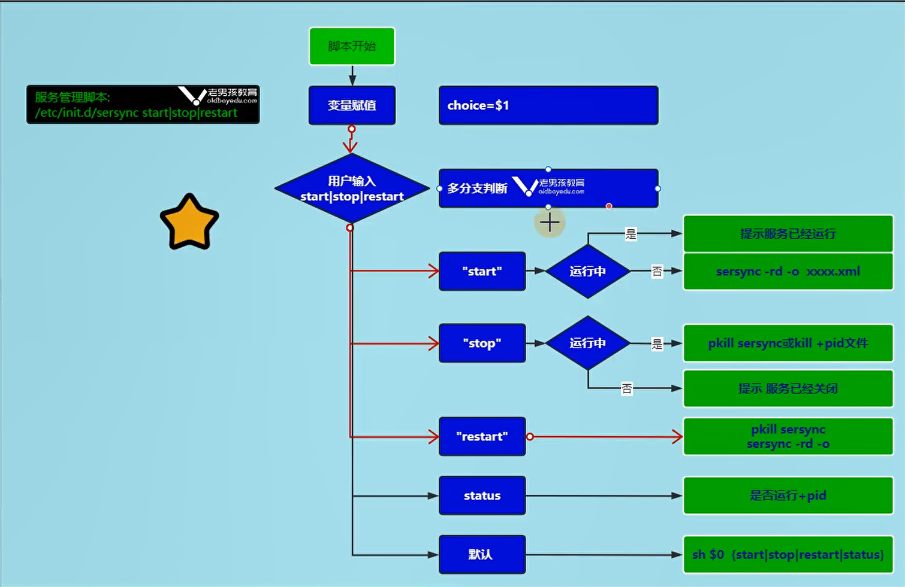

# 自动化架构-shell自动化编程（三）

今日内容：

# 一、Shell函数

## 1.1 函数基本使用

函数有三种定义方式

```shell
# 方式一：最完整
function func() {
}

# 方式二：最精简，推荐
func() {
}

# 方式三：缺少括号，不太明了
function func {
}
```

使用方式二定义函数

```shell
[root@mn01[ /server/scripts/devops-shell]#cat 13_func_01.sh
#!/bin/bash
##############################################################
# File Name:13_func_01.sh
# Version:V1.0
# Author:Haris Gong
# Organization:gsproj.github.io
# Desc:
##############################################################


# 定义函数
show() {
        echo "这是一个函数"
}

# 调用函数
show
```

测试

```shell
[root@mn01[ /server/scripts/devops-shell]#bash 13_func_01.sh
这是一个函数
```


## 1.2 函数传参

函数传参与shell脚本类似，也是用`$`格式

| 位置参数 | shell脚本中     | shell函数中     |
| -------- | --------------- | --------------- |
| $n       | 脚本的第n个参数 | 函数的第n个参数 |
| $0       | 脚本的名字      | 脚本的名字      |
| $#       | 脚本参数的个数  | 函数参数的个数  |
| $@ / $*  | 脚本所有参数    | 函数所有的参数  |

使用案例：

```shell
#!/bin/bash
##############################################################
# File Name:14_func_parm.sh
# Version:V1.0
# Author:Haris Gong
# Organization:gsproj.github.io
# Desc:
##############################################################

# 定义函数
show() {
cat << EOF
        show 函数参数的个数: $#
        show 函数的所有参数: $*
        ${1}.com
        ${2}.com
EOF
}

# 函数传参
show $1 $2
```

测试


## 1.3 案例-服务管理脚本

目标：

- 书写服务管理脚本
- /server/scripts/xxxx {start|stop|restart|status}
- sersync服务是二进制包，解压安装  

### 1.3.1 需求分析

需求：

- 书写data_sync.sh脚本，用于管理sersync服务
- sh data_sync.sh start|stop|restart|status

分析

- 如果用户输入的是start,则运行sersync启动的命令。
- 如果用户输入的是stop,则运行关闭sersync的命令。
- 如果用户输入的是status，则显示sersync是否运行中，pid。
- 如果用户输入的是restart,则运行stop的命令，然后运行start的命令。
- 如果用户输入的是其他的内容，则提示输入错误，提示格式  

提前准备sersync

```shell
# 下载
https://gitee.com/nutxi/sersync/blob/master/sersync2.5.4_64bit_binary_stable_final.tar.gz

# 解压放到对应的文件夹
[root@mn01[ /app/tools]#ls sersync/
confxml.xml  sersync2

# 设置软链接
ln -s /app/tools/sersync/sersync2 /usr/bin/sersync2
```

### 1.3.2 实现

```shell
#!/bin/bash
##############################################################
# File Name:15_data_sync.sh
# Version:V1.0
# Author:Haris Gong
# Organization:gsproj.github.io
# Desc: 服务管理脚本
##############################################################


# 1.vars
choice=$1

#2.定义函数
#2.0 加入检查类函数
#命令是否存在
#配置文件是否存在

#2.1 启动服务的函数
sersync_start() {
        sersync2 -rdo /app/tools/sersync/confxml.xml
}

#2.2 关闭服务的函数
sersync_stop() {
        sersync_pid=`ps -ef |grep sersync2|grep -v grep | awk '{print $2}'`
        kill $sersync_pid
}

#2.3 重启服务的函数
sersync_restart() {
        sersync_pid=`ps -ef | grep sersync2 | grep -v grep | awk '{print $2}'`
        kill $sersync_pid
        sersync2 -rdo /app/tools/sersync/confxml.xml
}

#2.4 服务的状态函数
sersync_status() {
        # 判断服务是否运行
        ## 如果运行则显示 sersync is running (pid)
        ## 如果没有运行显示 sersync is gualed
        #检查服务的进程数量
        sersync_count=`ps -ef | grep sersync2 | grep -v grep | wc -l`
        if [ $sersync_count -eq 0 ]
        then
                echo "sersync is stoped"
        else
                sersync_pid=`ps -ef | grep sersync2| grep -v grep | awk '{print $2}'`
                echo "sersync is running ${sersync_pid}"
        fi
}

# 2.5 用户输入异常
error_msg() {
        echo "Usage: $0 {start|stop|restart|status}"
}


# 3、case选择
case "${choice}" in
        start) sersync_start;;
        stop) sersync_stop;;
        restart) sersync_restart;;
        status) sersync_status;;
        *) error_msg
esac
```

测试

```shell
[root@mn01[ /server/scripts/devops-shell]#bash 15_data_sync.sh start
set the system param
execute：echo 50000000 > /proc/sys/fs/inotify/max_user_watches
execute：echo 327679 > /proc/sys/fs/inotify/max_queued_events
parse the command param
...
[root@mn01[ /server/scripts/devops-shell]#bash 15_data_sync.sh status
sersync is running 9866
[root@mn01[ /server/scripts/devops-shell]#bash 15_data_sync.sh restart
set the system param
execute：echo 50000000 > /proc/sys/fs/inotify/max_user_watches
execute：echo 327679 > /proc/sys/fs/inotify/max_queued_events
...
[root@mn01[ /server/scripts/devops-shell]#bash 15_data_sync.sh status
sersync is running 9900
[root@mn01[ /server/scripts/devops-shell]#bash 15_data_sync.sh stop
[root@mn01[ /server/scripts/devops-shell]#bash 15_data_sync.sh status
sersync is stoped
```

### 1.3.2 脚本改进

目前脚本只能做固定的启动、关闭、重启等操作，没有做状态判断，实际上应该是图中这样，对服务当前状态有所判断，然后再进行下一步操作。



