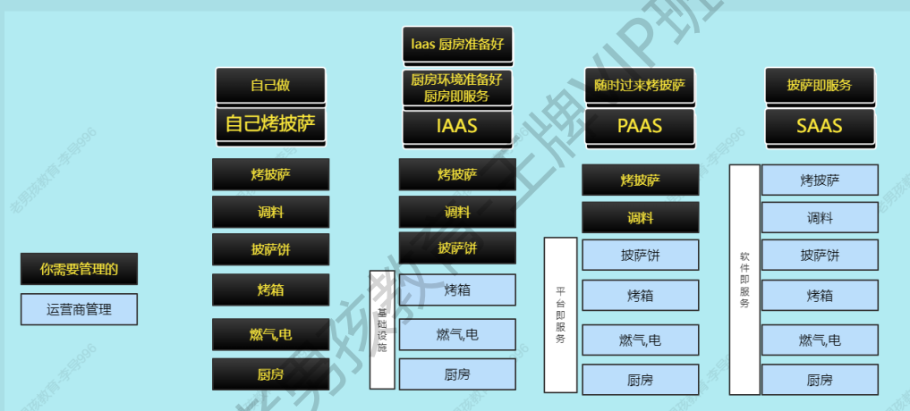
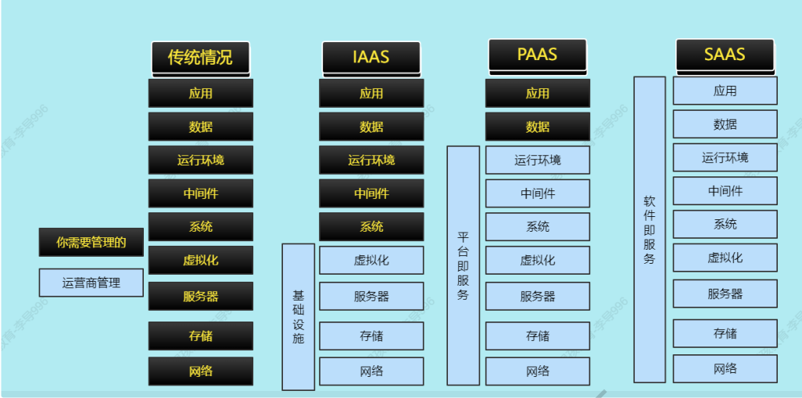
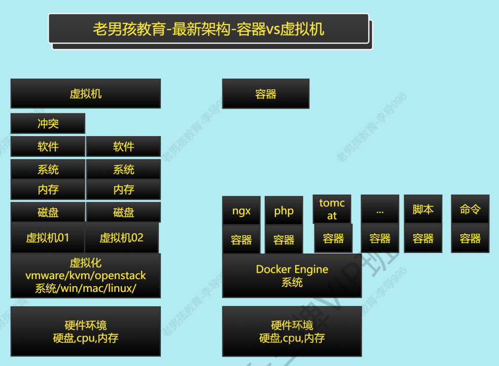
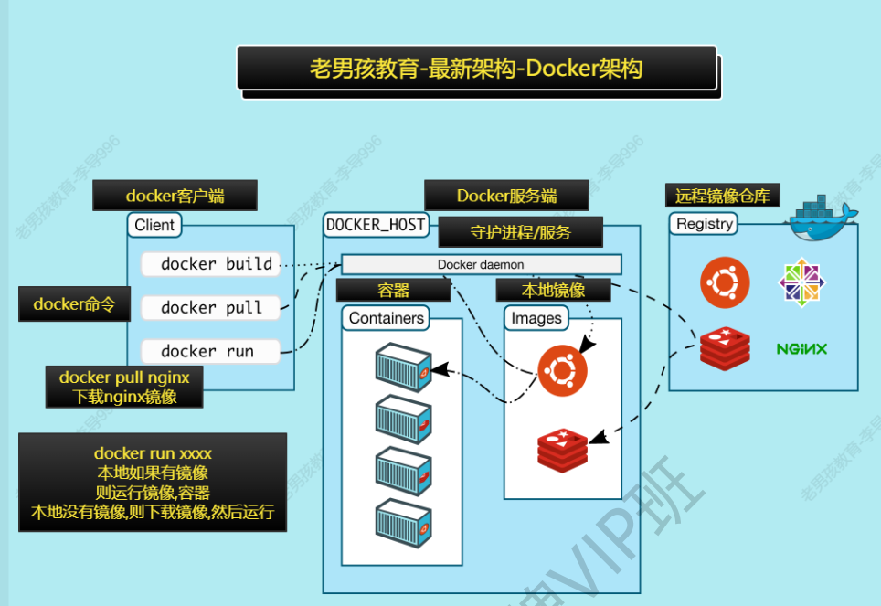

# 容器架构-Docker-01

今日内容：

- 服务架构概述
- 容器介绍
- Docker快速上手

# 一、IAAS PAAS SAAS概述

Iaas：基础设施即服务 Infrastructure-as-a-Service

Paas：平台即服务 Platform-as-a-Service

Saas：软件即服务 Software-as-a-Service

Caas：容器即服务 介于IAAS和PAAS

IAAS，PAAS，SAAS这些服务，用于帮助人们更快实现目标(搭建环境,使用产品)

从左到右，人们需要管理与维护的地方越来越少，人们可以把重点关注在使用/应用上.  


更形象点：

- IAAS平台:基础设施,阿里云,云厂商.
- PAAS平台:服务/运行环境是ok，公有云，负载均衡SLB
- SAAS平台:服务已经准备好，您直接用，具体产品，如processon,wps,亿图  


图示-抽象：




图示-具体：




# 二、容器介绍

## 2.1 什么是容器

容器是在隔离环境中运行的一个进程，如果进程结束，容器就会停止.

容器的隔离环境，拥有自己的ip地址、系统文件、主机名、进程管理，相当于一个mini的系统  

## 2.2 容器VS虚拟机🌟

|      | 虚拟机                                                       | 容器                                                         |
| ---- | ------------------------------------------------------------ | ------------------------------------------------------------ |
| 优点 | 1. 使用简单 <br/>2. 也有成熟管理工具,vmware esxi,KVM,Openstack <br/>3. 可以随意定制. <br/>4. 启动虚拟机要经历完整的Linux启动流程 | 1. 快速部署(扩容,弹性伸缩)<br/> 2. 大部分环境都有现成镜像<br/> 3. 让我们不再关注系统基础设施,把关注点放在配置,升级,优化 <br/>4. 不依赖硬件 <br/>5. 启动容器秒级.<br/> 6. 相当于一个进程 |
| 缺点 | 1. 需要硬件支持虚拟化技术(VT-X) <br/>2. 资源利用率不高 <br/>3. 同一台虚拟跑多个服务,可能有冲突<br/> 4. 占用资源较多. <br/>5. 不满足目前升级,快速扩容,快速部署,回滚不方便. | 1. 使用较为复杂<br/> 2. 共享linux系统内核,推荐使用较新linux内核. |




# 三、Docker极速上手

>Docker需要Linux内核: 3.10以上. 如果旧的内核需要升级内核才能使用  

Docker版本说明：

- 分为docker-ce(开源)和docker-ee(企业版)

- Docker版本从1.13开始改成年-月版本命名方式.

  

## 3.1 环境准备

准备两台机器，用于Docker实验

| docker环境              | ip                    | 配置            |
| ----------------------- | --------------------- | --------------- |
| docker01.oldboylinux.cn | 10.0.0.81/172.16.1.81 | 2c4G(至少1c2G)  |
| docker02.oldboylinux.cn | 10.0.0.82/172.16.1.82 | 2c4G(至少1c2G） |

## 3.2 安装docker

步骤

```shell
#1.安装相关依赖.
yum install -y yum-utils device-mapper-persistentdata lvm2

#2.下载官方的docker yum源文件
yum-config-manager --add-repo https://download.docker.com/linux/centos/docker-ce.repo

#3.替换yum源地址
sed -i 's+download.docker.com+mirrors.tuna.tsinghua.edu.cn/docker-ce+' /etc/yum.repos.d/docker-ce.repo

#4.清空缓存
yum clean all
yum makecache

#4.安装docker-ce
yum install -y docker-ce
systemctl enable --now docker

#5.检查
[root@docker01[ ~]#docker version
Client: Docker Engine - Community
 Version:           26.1.3
 API version:       1.45
 Go version:        go1.21.10
 Git commit:        b72abbb
 Built:             Thu May 16 08:36:24 2024
 OS/Arch:           linux/amd64
 Context:           default
Cannot connect to the Docker daemon at unix:///var/run/docker.sock. Is the docker daemon running?
```


## 3.3 Docker下载镜像加速

>阿里云,腾讯云有加速用的地址  
>
>如阿里云：https://help.aliyun.com/zh/acr/user-guide/accelerate-the-pulls-of-docker-official-images#section-9tt-j3m-d2f

配置镜像加速

```shell
# 创建配置文件夹目录
sudo mkdir -p /etc/docker

# 创建配置文件
[root@docker01[ ~]#cat /etc/docker/daemon.json 
{
	"registry-mirrors":["https://bjjtv7cs.mirror.aliyuncs.com"]
}

# 重新加载服务
[root@docker01[ ~]#sudo systemctl daemon-reload
[root@docker01[ ~]#sudo systemctl restart docker
```


## 3.4 配置docker自动补全

安装

```shell
yum install -y bash-completion bash-completion-extras
```


# 四、 Docker C/S架构

什么是CS架构？

- cs client/server 客户端/服务端

Docker的C/S架构也分为服务端和客户端：

- Docker 服务端:docker daemon 叫dockerd
- Docker 客户端:docker命令(下载镜像,运行容器...)  

| docker相关词汇 | 说明                 |
| -------------- | -------------------- |
| 镜像           | 存放各种的环境或服务 |
| 容器           | 进程,运行起来的镜像. |
| 仓库(存放镜像) | 远程仓库,本地仓库    |

图示：



示例：下载nginx镜像到本地仓库，然后启动容器

```shell
# 下载Niginx镜像
[root@docker01[ ~]#docker pull nginx
Using default tag: latest
latest: Pulling from library/nginx
a2abf6c4d29d: Pull complete 
a9edb18cadd1: Pull complete 
589b7251471a: Pull complete 
186b1aaa4aa6: Pull complete 
b4df32aa5a72: Pull complete 
a0bcbecc962e: Pull complete 
Digest: sha256:0d17b565c37bcbd895e9d92315a05c1c3c9a29f762b011a10c54a66cd53c9b31
Status: Downloaded newer image for nginx:latest
docker.io/library/nginx:latest

# 查看镜像
[root@docker01[ ~]#docker images
REPOSITORY   TAG       IMAGE ID       CREATED       SIZE
nginx        latest    605c77e624dd   2 years ago   141MB

# 启动容器
[root@docker01[ ~]#docker run -d -p 80:80 nginx
50715f7f85a3b083d136e92d2969cae4d40f5c31f4b7f243c57e5d31fc748dbd

# 查看容器
[root@docker01[ ~]#docker ps
CONTAINER ID   IMAGE     COMMAND                  CREATED          STATUS          PORTS                               NAMES
50715f7f85a3   nginx     "/docker-entrypoint.…"   56 seconds ago   Up 54 seconds   0.0.0.0:80->80/tcp, :::80->80/tcp   bold_bartik
```

测试访问


>以上docker run的选项说明：
>
>- -d 容器后台运行
>
>- -p 端口映射
>
>  - 可能需要开启系统的内核转发功能
>
>    ```shell
>    [root@docker01[ ~]# tail -1
>    /etc/sysctl.conf
>    net.ipv4.ip_forward = 1
>    [root@docker01[ ~]#sysctl -p
>    net.ipv4.ip_forward = 1
>    ```
>
>- nginx 镜像名字  

# 五、 Dcoker的镜像管理

## 5.1 镜像管理操作

### 1）查看镜像

查看镜像列表

```shell
[root@docker01[ ~]#docker images
REPOSITORY   TAG       IMAGE ID       CREATED       SIZE
nginx        latest    605c77e624dd   2 years ago   141MB
# 或者
[root@docker01[ ~]#docker image ls
REPOSITORY   TAG       IMAGE ID       CREATED       SIZE
nginx        latest    605c77e624dd   2 years ago   141MB
```

查看所有镜像，包括隐藏镜像

```shell
docker images -a
```

查看单个镜像的详细信息

```shell
[root@docker01[ ~]#docker image inspect nginx:latest 
[
    {
        "Id": "sha256:605c77e624ddb75e6110f997c58876baa13f8754486b461117934b24a9dc3a85",
        "RepoTags": [
            "nginx:latest"
        ],
...
```


### 2）搜索镜像

优先选官方、stars数量多的

```shell
[root@docker01[ ~]#docker search nginx
NAME                                              DESCRIPTION                                     STARS     OFFICIAL
nginx                                             Official build of Nginx.                        19857     [OK]
unit                                              Official build of NGINX Unit: Universal Web …   29        [OK]
nginx/nginx-ingress                               NGINX and  NGINX Plus 
....
```

### 3）拉取/推送镜像

拉取和推送的时候注意版本

```shell
# 拉取
docker pull nginx

# 推动，得要有自己仓库，且认证通过
[root@docker01[ ~]#docker push nginx
Using default tag: latest
The push refers to repository [docker.io/library/nginx]
d874fd2bc83b: Layer already exists 
32ce5f6a5106: Layer already exists 
f1db227348d0: Layer already exists 
b8d6e692a25e: Layer already exists 
e379e8aedd4d: Layer already exists 
2edcec3590a4: Layer already exists 
# 认证失败，不让推送
errors:
denied: requested access to the resource is denied
unauthorized: authentication required
```

>关于镜像版本的指定：
>
>- 只写服务名字一般下载服务的最新版本.
>- 下载ngx最新版本 nginx:latest
>- 下载ngx最新稳定的版本 nginx:stable
>- 下载指定的版本 nginx:1.20.2
>
>指定系统
>
>- nginx镜像默认的系统是Debian系统
>- docker pull nginx:1.20.2-alpine 使用alpine系统更加节约空间  
>
>| docker镜像使用的系统 |                                             |       |
>| -------------------- | ------------------------------------------- | ----- |
>| ubuntu               | 都可以做镜像的系统.                         |       |
>| debian               | 都可以做镜像的系统. bullseye ,bluster       |       |
>| centos               | 都可以做镜像的系统.                         | 最大. |
>| alpine               | 镜像非常小(命令,依赖精简) linux内核+busybox |       |


### 4）导入/导出镜像

单个镜像操作

```shell
# 导出镜像
[root@docker01[ ~]#docker save nginx -o /tmp/docker_nginx.tar.gz

# 导入镜像
[root@docker01[ ~]#docker load -i /tmp/docker_nginx.tar.gz 
Loaded image: nginx:latest
```

批量导出镜像

```shell
# 命令
docker images |awk 'NR>1{print "docker save",$1":"$2,"-o",$1"_"$2".tar"}'

# 最后加 | bash 运行，如
[root@docker01[ ~]#docker images |awk 'NR>1{print "docker save",$1":"$2,"-o",$1"_"$2".tar"}' | bash
```

### 5）删除镜像

正在运行的镜像是不能删除的

```shell
[root@docker01[ ~]#docker rmi nginx:latest 
Error response from daemon: conflict: unable to remove repository reference "nginx:latest" (must force) - container 50715f7f85a3 is using its referenced image 605c77e624dd
```

### 6）清理临时镜像

未来我们自定义镜像的时候会用到

```shell
# 查看系统中所有镜像,包含隐藏镜像
[root@docker01[ ~]#docker images -a
REPOSITORY   TAG             IMAGE ID       CREATED       SIZE
nginx        latest          605c77e624dd   2 years ago   141MB
nginx        stable-alpine   373f8d4d4c60   2 years ago   23.2MB
# 清理临时镜像
[root@docker01[ ~]#docker image prune
WARNING! This will remove all dangling images.
Are you sure you want to continue? [y/N] y
Total reclaimed space: 0B
```

### 7）镜像打标签

```shell
# 打标签
[root@docker01[ ~]#docker tag nginx nginx-my
[root@docker01[ ~]#docker images
REPOSITORY   TAG       IMAGE ID       CREATED       SIZE
nginx-my     latest    605c77e624dd   2 years ago   141MB
nginx        latest    605c77e624dd   2 years ago   141MB

# 把标签删掉
[root@docker01[ ~]#docker rmi nginx-my:latest 
Untagged: nginx-my:latest
```

## 5.2 知识扩展：jq命令

当我们使用`inspect`查看镜像的详细信息，出来的是一大串json内容，不知该从何下手，这时使用`jq`命令，可以很好的处理json格式的文件内容。

```shell
# 安装jq
yum install -y jq
```

### 案例01：处理简单json数据

```shell
# 文件内容
[root@docker01[ ~]#cat /tmp/json.txt 
{
  "name": "harryYang",
  "age": 38,
  "height": 100,
  "weight": "100kg"
}

# jq，不做处理
[root@docker01[ ~]#cat /tmp/json.txt | jq
{
  "name": "harryYang",
  "age": 38,
  "height": 100,
  "weight": "100kg"
}

# jq，获取name
[root@docker01[ ~]#cat /tmp/json.txt | jq .name
"harryYang"

# jq，获取age
[root@docker01[ ~]#cat /tmp/json.txt | jq .age
38

# 赋值给变量
[root@docker01[ ~]#name=`cat /tmp/json.txt |  jq .name`
[root@docker01[ ~]#echo $name
"harryYang"
```

### 案例02-处理复杂格式的inspect数据

```shell
[root@docker01[ ~]#docker inspect nginx:stable-alpine | jq .[].Id
"sha256:373f8d4d4c60c0ec2ad5aefe46e4bbebfbb8e86b8cf4263f8df9730bc5d22c11"
[root@docker01[ ~]#docker inspect nginx:stable-alpine | jq .[].Created
"2021-11-16T18:22:27.763985311Z"
[root@docker01[ ~]#docker inspect nginx:stable-alpine | jq .[].Config.Cmd
[
  "nginx",
  "-g",
  "daemon off;"
]
```


