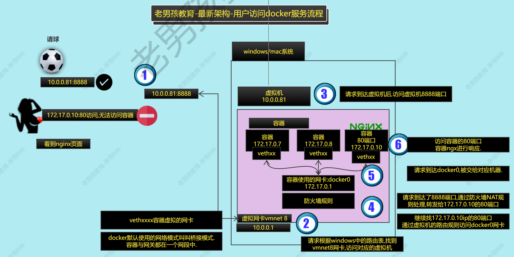
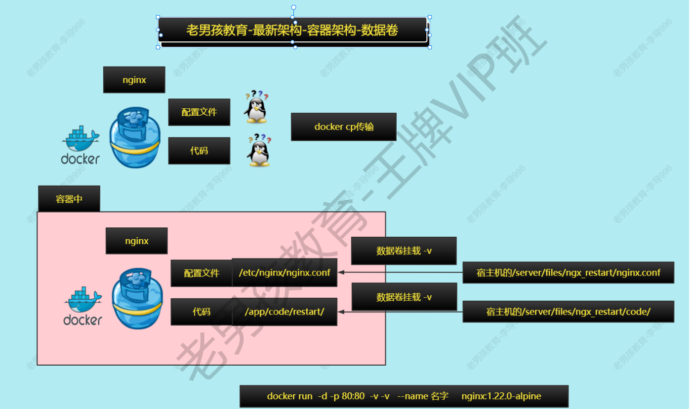
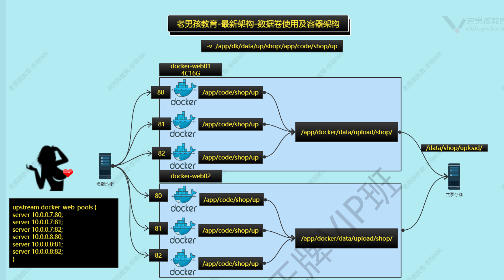

# 容器架构-Docker-02

今日内容：

- Docker容器管理

# 一、Docker容器管理🌟🌟

运行起来的镜像可以称为容器，1个容器相当于是1个进程。 

以`docker container`开头的指令一般表示容器管理指令，部分指令container可以省略  

```shell
# 完整写法
docker container ps
# 缩略写法
docker ps
```

## 1.1 容器管理的操作

### 1.1.1 查看容器

```shell
[root@docker01[ ~]#docker ps
CONTAINER ID   IMAGE     COMMAND                  CREATED       STATUS       PORTS                               NAMES
50715f7f85a3   nginx     "/docker-entrypoint.…"   4 hours ago   Up 4 hours   0.0.0.0:80->80/tcp, :::80->80/tcp   bold_bartik

# 完整写法
[root@docker01[ ~]#docker container ps
CONTAINER ID   IMAGE     COMMAND                  CREATED       STATUS       PORTS                               NAMES
50715f7f85a3   nginx     "/docker-entrypoint.…"   4 hours ago   Up 4 hours   0.0.0.0:80->80/tcp, :::80->80/tcp   bold_bartik
```

案例：查看当前运行中的容器，查看下80端口是否被占用

```shell
[root@docker01[ ~]#docker ps -a	
CONTAINER ID   IMAGE     COMMAND                  CREATED       STATUS       PORTS                               NAMES
50715f7f85a3   nginx     "/docker-entrypoint.…"   5 hours ago   Up 5 hours   0.0.0.0:80->80/tcp, :::80->80/tcp   bold_bartik

# 可见80端口已被占用
```

### 1.1.2 创建/运行容器

创建容器（一般直接用run）

```shell
docker create 创建容器 --name
```

运行容器

```shell
docker run -d -it -p 80:80 nginx:latest
```

>选项说明：
>
>- -d 容器后台运行.
>- -p 端口映射,外部或其他服务器想要访问容器内部的某个服务的端口. 
>- -p 外部用于访问的端口:容器内部服务的端口
>- --name 指定容器的名字  
>- -i 以交互式模式运行容器，通常与`-t`一起
>- -i 为程序重新分配一个伪输入终端，通常与`-i`一起
>
>docker run 的背后做了很多事情：
>
>- docker create 创建容器.
>- docker start 启动容器.
>- docker stop 关闭容器. #向容器中的主进程,pid 1 进程发出信号(kill),关闭.
>- docker restart重启重启  

**案例01**：创建一个nginx-alpine的容器并运行

```shell
# 创建
[root@docker01[ ~]#docker run -d -p 80:80 --name test_nginx_alpine_v1 nginx:stable-alpine 
cd4d36318002007a8354146d376e85d1a711ddfdfeb24d1a393258347844f0fa

# 查看
[root@docker01[ ~]#docker ps -a
CONTAINER ID   IMAGE                 COMMAND                  CREATED          STATUS          PORTS                               NAMES
cd4d36318002   nginx:stable-alpine   "/docker-entrypoint.…"   31 seconds ago   Up 31 seconds   0.0.0.0:80->80/tcp, :::80->80/tcp   test_nginx_alpine_v1
```

**案例02**：创建centos容器，并交互运行，进入容器内部

```shell
# run 创建并运行centos容器
[root@docker01[ ~]#docker run -it --name "my_docker_centos" centos
Unable to find image 'centos:latest' locally
latest: Pulling from library/centos
a1d0c7532777: Pull complete 
Digest: sha256:a27fd8080b517143cbbbab9dfb7c8571c40d67d534bbdee55bd6c473f432b177
Status: Downloaded newer image for centos:latest
# 因为-it选项的使用，已经进入容器内部，查看系统版本
[root@631cf5e874ba /]# cat /etc/system-release
CentOS Linux release 8.4.2105
```

>注意事项：
>
>以`-it`运行的容器，如果退出了会怎么样？
>
>- 容器退出后，直接关闭
>
>**这也是`-it`的缺点！**

### 1.1.3 启动/停止容器

```shell
# 启动容器
docker start
# 停止容器
docker stop 
# 重启容器
docker restart 
# 强制停止容器
docker kill 
```

案例：以上方法均在容器上用一遍

```shell
[root@docker01[ ~]#docker stop cd4d36318002
cd4d36318002
[root@docker01[ ~]#docker restart cd4d36318002
cd4d36318002
[root@docker01[ ~]#docker start cd4d36318002
cd4d36318002
[root@docker01[ ~]#docker kill -s 9 cd4d36318002
# -s表示信号 -s 9 等于 kill -9 pid强制结束
cd4d36318002
[root@docker01[ ~]#docker ps -a
CONTAINER ID   IMAGE                 COMMAND                  CREATED              STATUS                        PORTS     NAMES
cd4d36318002   nginx:stable-alpine   "/docker-entrypoint.…"   About a minute ago   Exited (137) 11 seconds ago             test_nginx_alpine_v1
```


### 1.1.4 删除容器

单个删除

```shell
docker rm
```

批量删除

```shell
docker rm -f `docker ps -a -q`
```

案例：删除已有的容器

```shell
# 找到一个容器
[root@docker01[ ~]#docker ps -a
CONTAINER ID   IMAGE     COMMAND                  CREATED       STATUS       PORTS                               NAMES
50715f7f85a3   nginx     "/docker-entrypoint.…"   5 hours ago   Up 5 hours   0.0.0.0:80->80/tcp, :::80->80/tcp   bold_bartik

# 删除，不成功，因为容器正在运行
[root@docker01[ ~]#docker  rm 50715f7f85a3
Error response from daemon: cannot remove container "/bold_bartik": container is running: stop the container before removing or force remove

# -f强制删除
[root@docker01[ ~]#docker  rm -f 50715f7f85a3
```

### 1.1.5 进入正在运行的容器

方法一`exec`：将分配一个新的终端

```shell
docker exec -it 容器id/容器名字 /bin/bash(/bin/sh)
```

方法二`attach`：使用相同的终端

```shell
docker attach

# 暂时退出：ctrl + p, ctrl + q
```

案例：exec进入已经运行的容器

```shell
# 查看已有容器
[root@docker01[ ~]#docker ps
CONTAINER ID   IMAGE                 COMMAND                  CREATED          STATUS          PORTS                               NAMES
5251e5df489e   nginx:stable-alpine   "/docker-entrypoint.…"   19 minutes ago   Up 19 minutes   0.0.0.0:80->80/tcp, :::80->80/tcp   test_nginx_alpine_v1
# 进入容器
[root@docker01[ ~]#docker exec -it test_nginx_alpine_v1 /bin/sh
/ # ls
bin                   etc                   mnt                   run                   tmp
dev                   home                  opt                   sbin                  usr
docker-entrypoint.d   lib                   proc                  srv                   var
docker-entrypoint.sh  media                 root                  sys
# 修改nginx首页内容
/ # cd /usr/share/nginx/html
/usr/share/nginx/html # echo "New Page" > /usr/share/nginx/html/index.html 
```

测试访问


#### exec和attach的区别

| docker container 指令 | exec                    | attach                                                       |
| --------------------- | ----------------------- | ------------------------------------------------------------ |
| 共同点                | 连接到容器              | 连接到容器                                                   |
| 区别                  | 连接的时候创建终端      | 容器要有终端(容器进程中要有个/bin/bash 或/bin/sh) 只能连接到已有的终端中. |
| 区别                  | 不同的exec连接互不影响, | 共用,所有连接都一样                                          |


### 1.1.6 查看容器信息与状态

```shell
docker inspect
docker stats
docker top
```


### 1.1.7 容器夯住才能一直运行🌟

体会下面2个命令的区别：

```shell
docker run -d --name "oldboy_centos_v2" centos
docker run -d --name "oldboy_centos_v2" centos sleep 20
```

执行后，没加`sleep`的容器刚运行就消失了，加了`sleep`的容器维持了20秒

```shell
[root@docker01[ ~]#docker run -d --name "oldboy_centos_v2" centos
fb8ba4d7a6c5dceffc6123953b2ad5235b0b13454ea7a4b0d072bf3fff0201d0
[root@docker01[ ~]#docker ps	
CONTAINER ID   IMAGE                 COMMAND                  CREATED          STATUS          PORTS                               NAMES
5251e5df489e   nginx:stable-alpine   "/docker-entrypoint.…"   12 minutes ago   Up 12 minutes   0.0.0.0:80->80/tcp, :::80->80/tcp   test_nginx_alpine_v1
# centos容器不见了

[root@docker01[ ~]#docker run -d --name "oldboy_centos_v3" centos sleep 20
bed3239b9850cda3235c73eda64472b8e3bd233ac3a40ede82ddec3acd24d801
[root@docker01[ ~]#docker run -ps
CONTAINER ID   IMAGE                 COMMAND                  CREATED          STATUS          PORTS                               NAMES
bed3239b9850   centos                "sleep 20"               2 seconds ago    Up 1 second                                         oldboy_centos_v3
5251e5df489e   nginx:stable-alpine   "/docker-entrypoint.…"   12 minutes ago   Up 12 minutes   0.0.0.0:80->80/tcp, :::80->80/tcp   test_nginx_alpine_v1
# centos容器还在
```

这是因为容器任务执行结束后，它也就自动退出了，因此 ，想要容器在后台（-d）一直运行，那么就要对容器运行的时候**加上初始命令，使容器夯住**(阻塞/前台运行)

例如：如何后台持续运行纯净系统的容器（Centos）

```shell
# 通过-itd选项来指定命令解释器持续运行
[root@docker01[ ~]#docker run -itd --name oldboy_centos_v6 centos
c4a59405f253ba62bfaa4f7431be2d21bbd8ca73ce174d27bb8b9f8475c0e872

# 容器还在
[root@docker01[ ~]#docker ps -a
CONTAINER ID   IMAGE                 COMMAND                  CREATED          STATUS                      PORTS                               NAMES
c4a59405f253   centos                "/bin/bash"              13 seconds ago   Up 13 seconds                                                   oldboy_centos_v6
...

# 进入容器
[root@docker01[ ~]#docker exec -it oldboy_centos_v6 /bin/bash
[root@c4a59405f253 /]# ls
bin  dev  etc  home  lib  lib64  lost+found  media  mnt  opt  proc  root  run  sbin  srv  sys  tmp  usr  var
```


### 1.1.8 容器传输文件

怎么跟容器互相传输文件？使用`docker cp`命令

|                    |           | 源              | 目标            |
| ------------------ | --------- | --------------- | --------------- |
| 宿主机-->容器 上传 | docker cp | 路径或文件      | 容器:容器中目录 |
| 容器-->宿主机 下载 | docker cp | 容器:容器中目录 | 路径或文件      |

案例01：从容器下载文件

```shell
# 拷贝容器中的hosts文件下来
[root@docker01[ ~]#docker cp oldboy_centos_v6:/etc/hosts ./docker_centos_hosts
Successfully copied 2.05kB to /root/docker_centos_hosts
```

案例02：上传文件到容器

```shell
# 百度首页，保存到物理机
[root@docker01[ ~]#curl -o index.html www.baidu.com
  % Total    % Received % Xferd  Average Speed   Time    Time     Time  Current
                                 Dload  Upload   Total   Spent    Left  Speed
100  2381  100  2381    0     0  31048      0 --:--:-- --:--:-- --:--:-- 30922

# 上传到nginx容器，替换首页
[root@docker01[ ~]#docker cp index.html test_nginx_alpine_v1:/usr/share/nginx/html/index.html
Successfully copied 4.1kB to test_nginx_alpine_v1:/usr/share/nginx/html/index.html
```


### 1.1.9 commit自定义镜像🌟

commit用于处理容器，生成镜像.  

使用流程:

- 运行服务镜像或系统镜像,启动后成为容器.
- 根据我们的需求,对容器进行修改.
- 测试完成后.
- 最后通过commit命令把容器保存为镜像.
- 根据新生成的镜像创建容器并测试.  

案例：修改nginx容器，生成自定义镜像

- 需求：
  - 基于ngx镜像创建容器
  - 修改站点目录 /app/code/restart/ (default.conf)
  - 上传代码,解压
  - 测试
  - commit

1、创建容器

```shell
[root@docker01[ ~]#docker run -d -p 80:80 --name "commit_nginx" nginx:stable-alpine 
d7919255e43900e6ac3b556e1e27dff6ba3c4932fe354e27a62319a215cc20aa
```

2、进入容器，修改配置文件，准备环境

```shell
# 修改配置文件
/etc/nginx/conf.d # cat default.conf
server {
    listen       80;
    server_name  restart.commit.cn;
    root   /app/code/restart;
    location / {
        index  index.html index.htm;
    }
}

# 创建文件夹
/ # mkdir -p /app/code/restart
```

3、上传html代码

```shell
[root@docker01[ ~]#echo "RESTART PAGE" > index.html 
[root@docker01[ ~]#docker cp index.html  commit_nginx:/app/code/restart
Successfully copied 2.05kB to commit_nginx:/app/code/restart
```

重启服务测试下

```shell
[root@docker01[ ~]#docker restart d7919255e439
d7919255e439
```


4、根据容器生成镜像

```shell
[root@docker01[ ~]#docker commit commit_nginx nginx:stable-alpine_restart_v1
sha256:21ca067362e8bf124ea914db502b69de62053cddcdae61699951abc34f8cf832

# 查看
[root@docker01[ ~]#docker images
REPOSITORY   TAG                        IMAGE ID       CREATED          SIZE
nginx        stable-alpine_restart_v1   21ca067362e8   18 seconds ago   23.2MB
...
```

5、根据新的镜像，重新创建容器，端口81

```shell
[root@docker01[ ~]#docker run -d -p 81:80 nginx:stable-alpine_restart_v1 
5477c2d5e0c9fab71a23b8bd6183277c2c4219fef8137ba761474909bbd34817
```

测试访问http://10.0.0.81:81


### 1.1.10 容器导出导入

导出容器成tar包

```shell
# 查看容器
[root@docker01 ~]#docker ps
CONTAINER ID   IMAGE              COMMAND                  CREATED         STATUS         PORTS                               NAMES
e4ee1efb593c   tengine:birds-v1   "nginx -g 'daemon of…"   3 seconds ago   Up 2 seconds   0.0.0.0:80->80/tcp, :::80->80/tcp   birds_test

# 导出容器
[root@docker01 ~]#docker export birds_test -o bird_test.tar
```

将打包文件拷贝到另一台机器中，导入成镜像（有坑）

```shell
# 拷贝到docker02中
[root@docker01 ~]#scp bird_test.tar 10.0.0.82:/tmp

# docker02虚拟机中没有任何镜像和容器
[root@docker02 ~]#docker images
REPOSITORY   TAG       IMAGE ID   CREATED   SIZE
[root@docker02 ~]#docker ps
CONTAINER ID   IMAGE     COMMAND   CREATED   STATUS    PORTS     NAMES

# docker02导入
[root@docker02 ~]#docker import /tmp/bird_test.tar 
sha256:a823ac7e01d4c783ec8f00356662176c5c279b10999fe6f463a4476a9b16bb05

# 坑，导入后生成的镜像没有名字标签
[root@docker02 ~]#docker images
REPOSITORY   TAG       IMAGE ID       CREATED          SIZE
<none>       <none>    a823ac7e01d4   11 seconds ago   409MB

# 重新添加仓库名和标签
[root@docker02 ~]#docker tag a823ac7e01d4 tengine:birds-v1
[root@docker02 ~]#docker images
REPOSITORY   TAG        IMAGE ID       CREATED         SIZE
tengine      birds-v1   a823ac7e01d4   3 minutes ago   409MB
```


# 二、端口映射

容器的端口映射怎么实现的？

- 使用`docker run -p`的时候，外界访问docker容器中的服务或端口，需要使用端口映射。
- 本质是通过iptables nat规则实现的，在nat表中创建了docker自定义的链  

```shell
[root@docker01[ ~]#iptables -t nat -nL
Chain PREROUTING (policy ACCEPT)
target     prot opt source               destination         
DOCKER     all  --  0.0.0.0/0            0.0.0.0/0            ADDRTYPE match dst-type LOCAL

Chain INPUT (policy ACCEPT)
target     prot opt source               destination         

Chain OUTPUT (policy ACCEPT)
target     prot opt source               destination         
DOCKER     all  --  0.0.0.0/0           !127.0.0.0/8          ADDRTYPE match dst-type LOCA

Chain POSTROUTING (policy ACCEPT)
target     prot opt source               destination         
MASQUERADE  all  --  172.17.0.0/16        0.0.0.0/0           
MASQUERADE  tcp  --  172.17.0.2           172.17.0.2           tcp dpt:80
MASQUERADE  tcp  --  172.17.0.3           172.17.0.3           tcp dpt:80

Chain DOCKER (2 references)
target     prot opt source               destination         
RETURN     all  --  0.0.0.0/0            0.0.0.0/0           
DNAT       tcp  --  0.0.0.0/0            0.0.0.0/0            tcp dpt:80 to:172.17.0.2:80
DNAT       tcp  --  0.0.0.0/0            0.0.0.0/0            tcp dpt:81 to:172.17.0.3:80
```


## 2.1 背后具体做了什么？

- 添加了对应防火墙规则 

```shell
# 类似于
iptables -t nat -A DOCKER ! -i docker0 -p tcp -m tcp --dport 81 -j DNAT --todestination 10.0.0.81:80
```

- 
  开启内核转发功能(需要我们自己开启)  

查看端口信息：

```shell
[root@docker01[ ~]#ss -lntup | grep 81
tcp    LISTEN     0      128       *:81                    *:*                   users:(("docker-proxy",pid=26582,fd=4))
tcp    LISTEN     0      128    [::]:81                 [::]:*                   users:(("docker-proxy",pid=26586,fd=4))
```


## 2.2 用户访问的时候经历了什么

内部通过`虚拟网卡`来实现分配，如图




## 2.3 端口映射的案例

### 2.3.1 一对一映射

还是使用`docker run -p`

```shell
docker run -d --name "oldboy_nginx_80" -p 80:80 nginx:1.20.2-alpine
```

关于`-p`选项的详细描述

| docker run                                |                                   |
| ----------------------------------------- | --------------------------------- |
| -p选项(小写字母P) 宿主机端口:容器中的端口 | -p 80:80 -p 443:443               |
| -p :容器中端口                            | -p :80 表示宿主机端口随机,很少用. |
| -p 端口范围:端口范围                      | 80-88:80-88                       |


### 2.3.2 多对多映射

映射8080,8081,8082 到容器中容器中也是8080,8081,8082  

```shell
# -d一个个写
[root@docker01[ ~]#dockedocker run -d -p 8080:8080 -p 8081:8081 -p 8082:8082 -p 86:80 nginx:stable-alpine
43bcb519597f7a2f00ceea65fcb4664c5e52419d80c92c62dd5fbc1ccc2a0f5e

# 查看状态
[root@docker01[ ~]#docker ps
CONTAINER ID   IMAGE                 COMMAND                  CREATED         STATUS         PORTS                                                                                              NAMES
43bcb519597f   nginx:stable-alpine   "/docker-entrypoint.…"   3 seconds ago   Up 2 seconds   0.0.0.0:8080-8082->8080-8082/tcp, :::8080-8082->8080-8082/tcp, 0.0.0.0:86->80/tcp, :::86->80/tcp   magical_margulis

# 查看port信息
[root@docker01[ ~]#docker port magical_margulis
80/tcp -> 0.0.0.0:86
80/tcp -> [::]:86
8080/tcp -> 0.0.0.0:8080
8080/tcp -> [::]:8080
8081/tcp -> 0.0.0.0:8081
8081/tcp -> [::]:8081
8082/tcp -> 0.0.0.0:8082
8082/tcp -> [::]:8082	# 容器中的端口 -> 宿主机端口
```


### 2.3.3 IP绑定端口

用户只能通过宿主机的某个网卡连接这个端口，起安全防护作用

```shell
# 只能用172.16.1.8:12306来访问容器的80端口
[root@docker01[ ~]#docker run -d -p 172.16.1.81:12306:80 nginx:stable-alpine
44d0e51e63f65650e0faadd705fb33c944409591b30a4d4731fa1c3643200f75

# 查看
[root@docker01[ ~]#docker ps
CONTAINER ID   IMAGE                 COMMAND                  CREATED          STATUS          PORTS                       NAMES
44d0e51e63f6   nginx:stable-alpine   "/docker-entrypoint.…"   44 seconds ago   Up 43 seconds   172.16.1.81:12306->80/tcp   nice_mendel
```


# 三、数据卷挂载

## 3.1 为什么需要挂载数据

数据放容器里，要是不小心`rm -f`删了怎么办？

为了解决这个数据持久化的问题，需要让数据永久**保存在宿主机**中，通过挂载的方式挂

到容器上




## 3.2 选项补充

### 3.2.1 docker run选项补充

`--rm`选项

- 容器退出的时候，容器自动删除
- 一般用于测试，临时使用容器

`--restart`选项，容器的重启策略

- always 自动重启
- unless-stopped 只在容器关闭，停止的时候
- on-failure 只在失败的时候重启
- 默认，不自动重启

### 3.2.2 docker exec选项补充

在进入Mysql或者redis等数据库时候，可以直接exec进入数据库操作终端，而不是/bin/bash，方法如下：

```shell
# 对Mysql
docker exec -it 容器 mysql -u root -p

# 对redis
docker exec -it 容器 redis-cli
```

## 3.3 挂载项目

将站点文件/站点目录、配置文件目录、日志目录以`-v`的方式挂载

### 3.3.1 挂载单个站点文件

使用数据卷挂载index.html到容器中的/usr/share/nginx/html/index.html  

```shell
# 创建本地文件
mkdir -p /app/docker/test/code
echo "<h1>THIS IS MOUNTED PAGE</h1>" > /app/docker/test/code/index.html

# 运行容器（挂载卷）
docker run -d \
--name "docker_volumnt_ngx_v1" \
-p 80:80 \
-v /app/docker/test/code/index.html:/usr/share/nginx/html/index.html \
nginx:stable-alpine

# 查看挂载
[root@docker01[ ~]#docker inspect docker_volumnt_ngx_v1 | jq .[].HostConfig.Binds
[
  "/app/docker/test/code/index.html:/usr/share/nginx/html/index.html"
]
```

测试


>提示：
>
>如果宿主机文件内容改变了，需要**重启容器才能生效**


### 3.3.2 挂载站点目录

需求：

- 用数据卷挂载：代码目录.
- 用数据卷挂载：配置文件，配置文件目录.
- 用数据卷挂载：数据目录(数据库)
- 还可以用于日志

>补充：
>
>Nginx - alpine镜像的配置文件：
>
>- 配置文件子目录: /app/docker/restart/conf/nginx/conf.d/
>  - 挂载到：/etc/nginx/conf.d/
>- 配置文件主目录: /app/docker/restart/conf/nginx/nginx.conf
>  - 挂载到：/etc/nginx/nginx.conf
>- 站点目录: /app/docker/restart/code/
>  - 挂载到：/app/code/restart/  

实现：

```shell
# 物理机，创建文件夹
[root@docker01[ /app/docker/test/code]#mkdir -p /app/docker/conf/nginx/conf.d /app/docker/code/restart

# 启动docker并挂载文件
docker run -d --name "oldboy_restart_volume_v1" -p 80:80 \
-v /app/docker/restart/conf/nginx/conf.d/:/etc/nginx/conf.d/ \
-v /app/docker/restart/conf/nginx/nginx.conf:/etc/nginx/nginx.conf \
-v /app/docker/restart/code/:/app/code/restart/ \
--restart=always \
nginx:alpine
```


## 3.4 数据卷空间

应用场景：只关注容器中的数据不丢，不关注数据具体放在哪里

```shell
# 创建数据卷
[root@docker01[ /]#docker volume create oldboydata
oldboydata

# 查看数据卷
[root@docker01[ /]#docker volume ls
DRIVER    VOLUME NAME
local     oldboydata

# 在物理机的实际存放位置
[root@docker01[ /]#tree /var/lib/docker/volumes/oldboydata/
/var/lib/docker/volumes/oldboydata/
└── _data
1 directory, 0 files

# 挂载数据卷运行
[root@docker01[ /]#docker run -d --name "nginx_vol" -p 80:80 -v oldboydata:/var/log/nginx/ nginx:stable-alpine
8c2800b434161fd7401b56b45ba236b3e0f10e354baecbc47be03e47e4b70878

# 已经生效
[root@docker01[ /app/docker/restart/conf/nginx]#ls -l /var/lib/docker/volumes/
total 24
brw-------. 1 root root 253, 0 May 24 10:35 backingFsBlockDev
-rw-------. 1 root root  32768 May 27 09:09 metadata.db
drwx-----x. 3 root root     19 May 27 09:09 oldboydata
[root@docker01[ /app/docker/restart/conf/nginx]#ls -l /var/lib/docker/volumes/oldboydata/_data/
total 0
lrwxrwxrwx. 1 root root 11 Nov 17  2021 access.log -> /dev/stdout
lrwxrwxrwx. 1 root root 11 Nov 17  2021 error.log -> /dev/stderr
```

>注意：
>
>nginx容器的日志默认是输出到docker标准输出和标准错误输出的，而不是存放在文
>
>件中。未来查看日志的时候，不用进入到容器，然后tail/less使用命令查看.
>
>直接使用docker logs 容器id或名字 就可以看日志。
>
>相当于查看access.log或error.log  


## 3.5 随机数据卷（较少使用）

```shell
# -v不指定具体的卷标
docker run -d --name "nginx_vol_oldboylogdatav2" -p :80 -v :/var/log/nginx/ nginx:stable-alpine
```

>注意：
>
>在Docker version 26.1.3中，测试已经不行了，会报错
>
>```shell
>docker: invalid spec: :/var/log/nginx/: empty section between colons
>```


## 3.6 容器时区的问题

进入容器内执行

```shell
# 安装tzdata工具，设置时区
apk update \
&& apk add tzdata \
&& cp /usr/share/zoneinfo/Asia/Shanghai /etc/locatime \
&& echo "Asia/Shanghai" > /etc/timezone
```

>测试，时区没有生效。。。。还是要用时网上找吧


## 3.7 数据卷使用与容器架构

运行多个docker的时候，只需要维护一份代码



