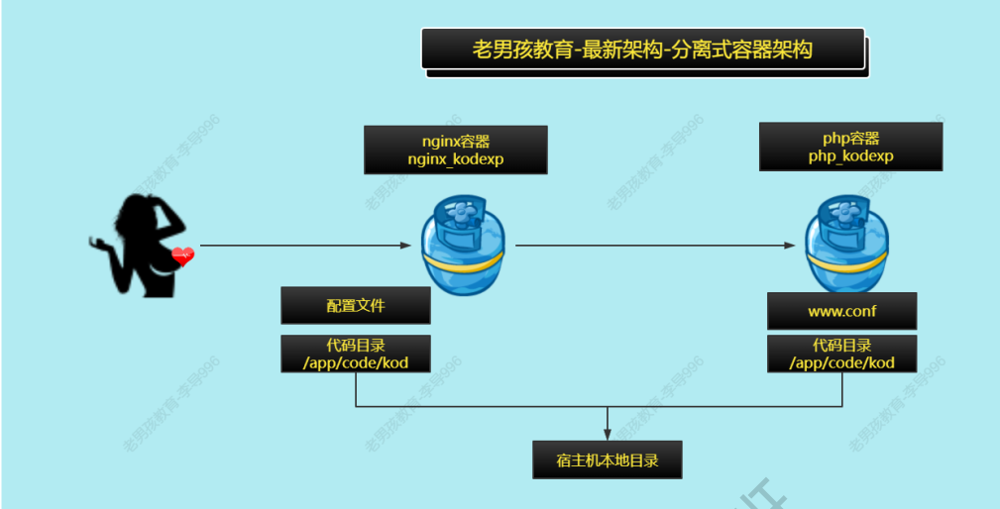
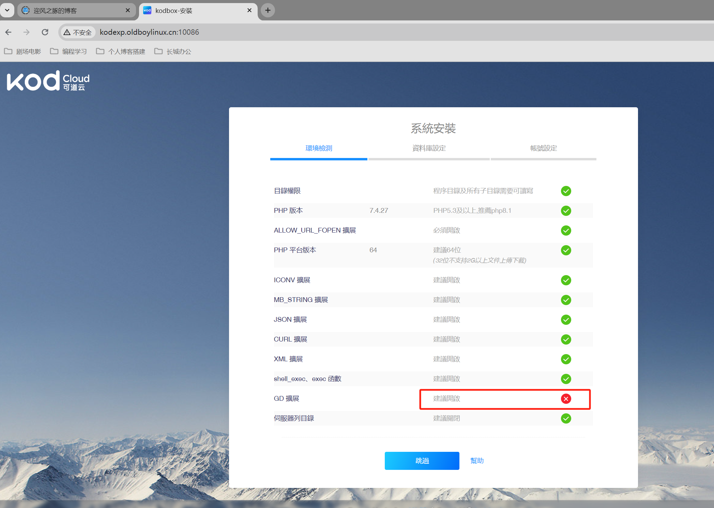

# 容器架构-Docker-04

今日内容：

- 容器互联

# 一、容器互联 

容器互联使用`--link`选项

## 1.1 分离式nginx + php

docker镜像架构分层次

- 基础:系统
- 服务:nginx,php,tomcat,jdk,.....
- 业务:kodexp  



实现：

### 1.1.1 准备项目代码目录

```shell
[root@docker02 /app/docker/kodexp]#ls
code  conf  data

# code存放kodexp的代码
[root@docker02 /app/docker/kodexp]#ls code/
app  Changelog.md  config  data  index.php  plugins  static
# 代码权限修改
[root@docker02 /app/docker/kodexp]#chmod -R 777 code

# conf存放配置文件
# data存放数据文件
```

### 1.1.2 启动php容器

- 配置文件挂载：/app/docker/kodexp/conf/www.conf  --> /usr/local/etc/php-fpm.d/www.conf
- kodexp代码挂载：/app/docker/code/kodexp/ --> /app/code/kodexp

```shell
# 准备php配置文件
[root@docker02 /app/docker]#cat www.conf 
[www]
user = www-data
group = www-data
listen = 0.0.0.0:9000
pm = dynamic
pm.max_children = 5
pm.start_servers = 2
pm.min_spare_servers = 1
pm.max_spare_servers = 3

# 运行php容器，挂载配置文件和code目录
[root@docker02 /app/docker]#docker run -d --name "kodexp_php" \
-v /app/docker/kodexp/conf/www.conf:/usr/local/etc/php-fpm.d/www.conf \
-v /app/docker/kodexp/code:/app/code/kodexp php:7-fpm-alpine 
```

>nginx与php，代码目录一致

### 1.1.3 启动nginx容器，互联php

```shell
# nginx配置
[root@docker02 /app/docker/kodexp/conf]#cat nginx.conf 
user nginx;
worker_processes auto;
error_log /var/log/nginx/error.log notice;
pid /var/run/nginx.pid;

events {
  worker_connections 1024;
}

http {
  include /etc/nginx/mime.types;
  default_type application/octet-stream;

  log_format  main  '$remote_addr - $remote_user [$time_local] "$request" '
                    '$status $body_bytes_sent "$http_referer" '
                    '"$http_user_agent" "$http_x_forwarded_for"';

  access_log /var/log/nginx/access.log main;
  sendfile on;
  #tcp_nopush on;
  keepalive_timeout 65;

  #gzip on;
  include /etc/nginx/conf.d/*.conf;
}

# kodexp的配置
[root@docker02 /app/docker/kodexp/conf]#cat kodexp.conf 
server {
  listen 80;
  server_name kodexp.oldboylinux.cn;
  root /app/code/kodexp;

  location / {
    index index.php;
  }
    location ~ \.php$ {
      # php是容器的名字，或者--link指定的容器别名
      fastcgi_pass php:9000;
      fastcgi_index index.php;
      fastcgi_param SCRIPT_FILENAME $document_root$fastcgi_script_name;
      include fastcgi_params;
  }
}

# 启动容器
# --link 容器名字:别名
[root@docker02 /app/docker/kodexp]#docker run -d --name "kodexp_nginx" -p 10086:80 \
--link kodexp_php:php \
-v `pwd`/conf/nginx.conf:/etc/nginx/nginx.conf \
-v `pwd`/conf/kodexp.conf:/etc/nginx/conf.d/kodexp.conf \
-v `pwd`/code:/app/code/kodexp/ \
nginx:stable-alpine
```

测试，设置hosts访问：http://kodexp.oldboylinux.cn:10086/



### 1.1.4 解决GD扩展的问题

访问显示建议开启GD扩展，可以通过Dockerfile来定制php镜像

```shell
#debian系统
FROM php:7.4-fpm
RUN apt-get update && apt-get install -y \
libfreetype6-dev \
libjpeg62-turbo-dev \
libpng-dev \
&& docker-php-ext-configure gd --with-freetype --with-jpeg \
&& docker-php-ext-install -j$(nproc) gd
```

构建镜像

```shell
[root@docker02 /server/dockerfile/05_link_nginx_php]#docker build -t php_gd:7.4-fpm .
```

再使用新建的镜像启动php

```shell
[root@docker02 /app/docker]#docker run -d --name "kodexp_php" \
-v /app/docker/kodexp/conf/www.conf:/usr/local/etc/php-fpm.d/www.conf \
-v /app/docker/kodexp/code:/app/code/kodexp php_gd:7.4-fpm 
```

