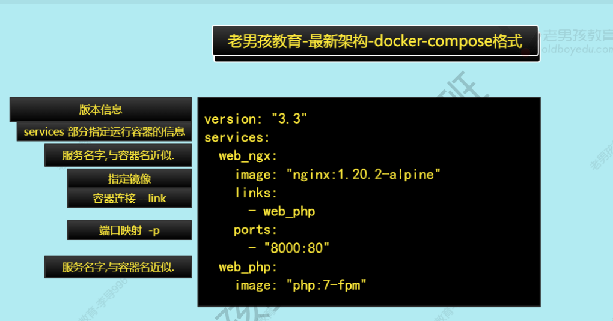
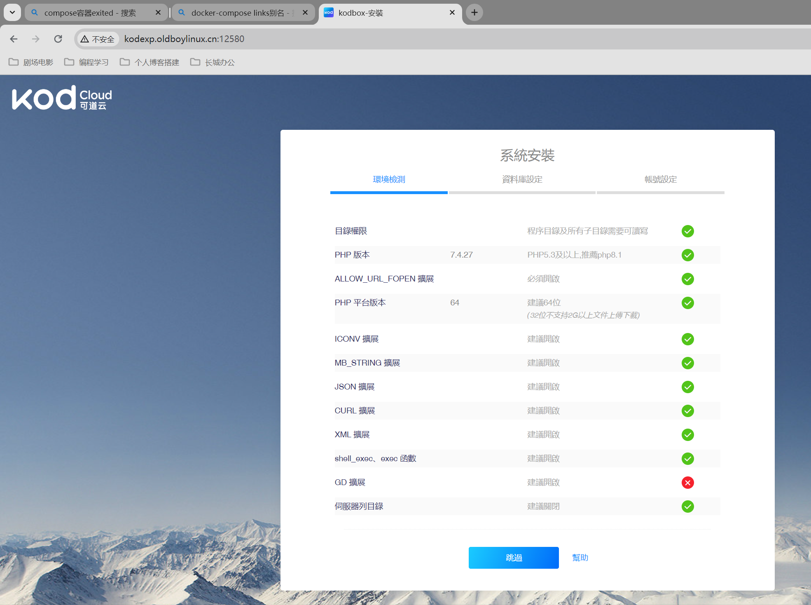
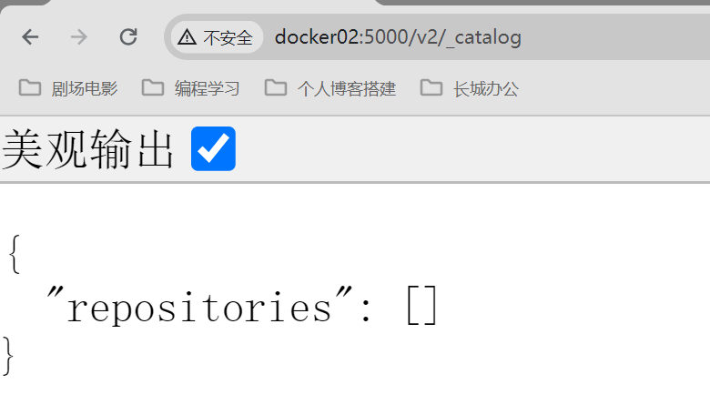
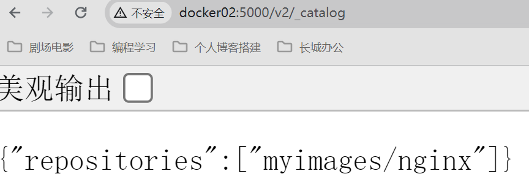
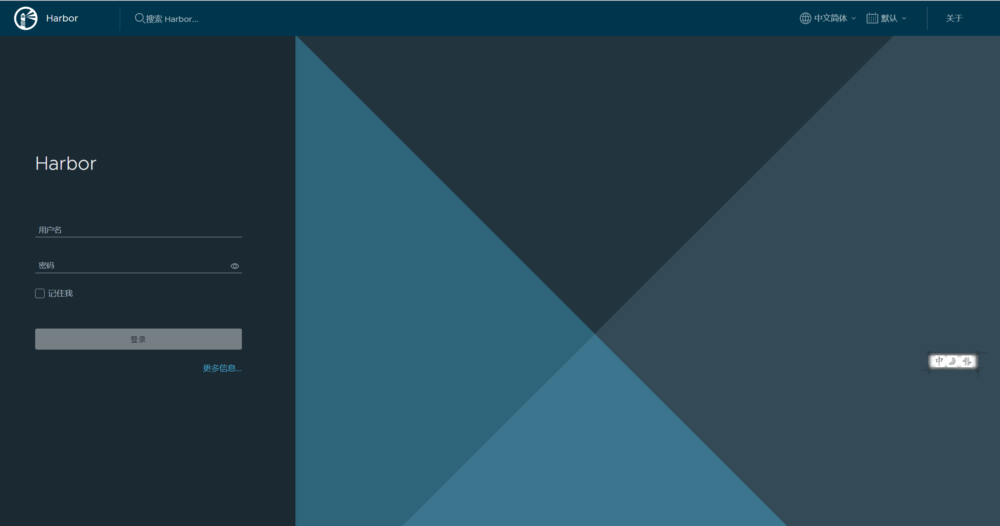
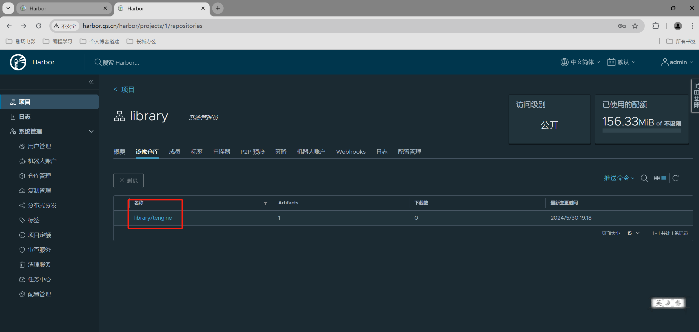

# 容器架构-Docker-05

今日内容：

- 容器编排

# 一、容器编排工具Compose

## 1.1 容器编排介绍

目前存在的问题：docker容器的管理(启动,关闭,重启)，需要手动执行，如何自动管理多个容器？  就像docker镜像可以通过Dockerfile一键创建。

这时，就是能使用容器编排技术。

单机容器编排工具：

- docker compose
- 需要单独安装(epel源中就有),语法yaml格式  

容器集群管理的方法：

- ansible + docker compose + dockerfile
- docker swarm实现集群管理.
- mesos
- 未来我们通过k8s kubernetes实现集群管理  

了解：docker三剑客

- docker machine(管理虚拟机)
- docker compose(容器编排)
- docker swarm(集群)

## 1.2 compose初步上手

### 1.2.1 安装

```shell
# 安装
[root@docker02 /]#yum install -y docker-compose 
# 准备工作目录
[root@docker02 /]#mkdir -p /server/compose/01-run-nginx
```

### 1.2.1 书写配置文件

书写格式参考：



编写一个简单的compose，部署nginx容器

```shell
[root@docker02 /server/compose/01-run-nginx]#cat docker-compose.yml 
version: "3.3"
services:
  nginx_compose:
    image: "nginx:stable-alpine"
    ports:
      - "18848:80"
```

>compose文件有一定的命名规则，建议按规范来

### 1.2.3 运行

执行yaml文件

```shell
[root@docker02 /server/compose/01-run-nginx]#docker-compose up -d
Creating 01runnginx_nginx_compose_1 ... done
```

查看，使用compose的ps

```shell
# 查看
[root@docker02 /server/compose/01-run-nginx]#docker-compose  ps
        Name                   Command          State           Ports        
-----------------------------------------------------------------------------
01runnginx_nginx_comp   /docker-entrypoint.sh   Up      0.0.0.0:18848->80/tcp
ose_1                   ngin ...                        ,:::18848->80/tcp 
```

测试

```shell
[root@docker02 /server/compose/01-run-nginx]#curl localhost:18848
<!DOCTYPE html>
<html>
<head>
<title>Welcome to nginx!</title>
...
```


## 1.3 docker-compose命令

docker-compose可以用于创建、运行容器、删除容器、查看容器情况等，包含多种功能。

实际上这个命令包含了docker container和docker image命令

| 命令格式           | 功能                                                         |
| ------------------ | ------------------------------------------------------------ |
| up                 | up == run，创建并运行容器<br/>其中`up -d`代表后台运行        |
| down               | 关闭容器、删除容器以及相关资源<font color=red>（慎用！！）</font> |
| stop/start/restart | 关闭、开启、重启容器                                         |
| ps                 | 查看容器运行情况，可选用`-q`选项                             |
| top                | 查看容器进程信息                                             |
| logs               | 容器日志                                                     |
| rm                 | 删除容器（需要容器已经关闭）                                 |
| images             | 查看镜像                                                     |

>注意：
>
>docker-compose命令只能看到受compose编排的容器信息


## 1.4 修改docker-compose与生效 

如果docker-compose简单修改端口、数据卷

- `docker-compose up -d`会自动识别，重新创建容器.  

如果容器的名字也改了，会造成新旧容器的端口冲突，会失败

- 可以` docker-compose up -d --remove-orphans` 删除之前容器或失效容器  


## 1.5 compose文件常用指令

挂载数据卷、容器之间的依赖、先后顺序。

```shell
depends_on: 依赖,先启动指定的容器然后再启动当前容器.
volumes: 数据卷
links: 容器连接,本质hosts解析
```

>建议到官网查找，按需求使用


## 1.6 案例:compose部署kodexp

把容器互联的案例，用compose再实现一遍

文件目录

```shell
[root@docker02 /app/docker/kodexp]#ls
code  conf  data  docker-compose.yml
```

原来的命令操作

```shell
# php
[root@docker02 /app/docker]#docker run -d --name "kodexp_php" \
-v /app/docker/kodexp/conf/www.conf:/usr/local/etc/php-fpm.d/www.conf \
-v /app/docker/kodexp/code:/app/code/kodexp php:7-fpm-alpine 

# nginx
[root@docker02 /app/docker/kodexp]#docker run -d --name "kodexp_nginx" -p 10086:80 \
--link kodexp_php:php \
-v `pwd`/conf/nginx.conf:/etc/nginx/nginx.conf \
-v `pwd`/conf/kodexp.conf:/etc/nginx/conf.d/kodexp.conf \
-v `pwd`/code:/app/code/kodexp/ \
nginx:stable-alpine
```

改用compose的yml文件：

```shell
[root@docker02 /app/docker/kodexp]#cat docker-compose.yml 
version: "3.3"
services:
  kodexp_ngx:
    image: "nginx:stable-alpine"
    ports:
      - "12580:80"
    links:
      - "kodexp_php:php"
    depends_on:
      - "kodexp_php"
    volumes:
      - "./conf/nginx.conf:/etc/nginx/nginx.conf"
      - "./conf/kodexp.conf:/etc/nginx/conf.d/kodexp.conf"
      - "./code:/app/code/kodexp"
  kodexp_php:
    image: "php:7-fpm-alpine"
    volumes:
      - "./conf/www.conf:/usr/local/etc/php-fpm/www.conf"
      - "./code:/app/code/kodexp"
```

执行

```shell
[root@docker02 /app/docker/kodexp]#docker-compose up -d 
Creating kodexp_kodexp_php_1 ... done
Creating kodexp_kodexp_php_1 ... 
Creating kodexp_kodexp_ngx_1 ... done
```

测试

```shell
[root@docker02 /app/docker/kodexp]#docker-compose  ps
       Name                  Command           State           Ports         
-----------------------------------------------------------------------------
kodexp_kodexp_ngx_1   /docker-entrypoint.sh    Up      0.0.0.0:12580->80/tcp,
                      ngin ...                         :::12580->80/tcp      
kodexp_kodexp_php_1   docker-php-entrypoint    Up      9000/tcp    
```



>问题记录：
>
>在启动后容器后，nginx容器显示EXIT 1状态，不正常。
>
>```shell
>[root@docker02 /app/docker/kodexp]#docker-compose ps 
>       Name                      Command               State     Ports  
>------------------------------------------------------------------------
>kodexp_kodexp_ngx_1   /docker-entrypoint.sh ngin ...   Exit 1           
>kodexp_kodexp_php_1   docker-php-entrypoint php-fpm    Up       9000/tcp
>
>```
>
>查看日志发现问题是由kodexp_php容器的别名引起的：
>
>```shell
>nginx: [emerg] host not found in upstream "php" in /etc/nginx/conf.d/kodexp.conf:10
>```
>
>修改nginx配置文件，不使用别名即可
>
>```shell
>[root@docker02 /app/docker/kodexp]#!cat
>cat conf/kodexp.conf 
>server {
>  listen 80;
>  server_name kodexp.oldboylinux.cn;
>  root /app/code/kodexp;
>
>  location / {
>    index index.php;
>  }
>    location ~ \.php$ {
>      fastcgi_pass kodexp_php:9000;	# 不用别名
>      fastcgi_index index.php;
>      fastcgi_param SCRIPT_FILENAME $document_root$fastcgi_script_name;
>      include fastcgi_params;
>  }
>}
>```

## 1.7 案例：compose和dockerfile结合使用

通过dockerfile构建镜像，在通过compose启动容器

以tengine的bird案例为基准，重构为：tengine+birds+compose

目录结构

```shell
[root@docker02 /server/dockerfile/01_bird]#ls
bird.tar.gz  docker-compose.yml  Dockerfile  tengine-2.3.3.tar.gz
```

yml内容

```shell
[root@docker02 /server/dockerfile/01_bird]#cat docker-compose.yml 
version: "3.3"
services:
  ngx_bird:
    build: .
    image: "web:ngx_bird"
    ports:
      - "80:80"
```

Dockerfile内容

```shell
FROM ubuntu:20.04
LABEL author="Haris Gong" \
	url='gsproj.github.io'

ADD tengine-2.3.3.tar.gz /tmp/

ENV Web_User="nginx"
ENV Web_Server="tengine"
ENV Web_Version="2.3.2"
ENV Server_Dir="/app/tools/tengine-2.3.2"
ENV Server_Dir_Soft="/app/tools/tengine"

RUN sed -ri 's#archive.ubuntu.com|security.ubuntu.com#mirrors.aliyun.com#g' /etc/apt/sources.list \
&& apt update && apt-get install -y vim curl libssl-dev make gcc pcre2-utils libpcre3-dev zlib1g-dev \
&& cd /tmp/tengine-2.3.3/ \
&& ./configure --prefix=/app/tools/${Web_Server}-${Web_Version}/ \
--user=${Web_User} \
--group=${Web_User} \
--with-http_ssl_module \
--with-http_v2_module \
--with-http_realip_module \
--with-http_stub_status_module \
--with-http_mp4_module \
--with-stream \
--with-stream_ssl_module \
--with-stream_realip_module \
--add-module=modules/ngx_http_upstream_check_module/ \
--add-module=modules/ngx_http_upstream_session_sticky_module \
&& make -j 1 \
&& make install \
&& ln -s ${Server_Dir} ${Server_Dir_Soft} \
&& ln -s ${Server_Dir_Soft}/sbin/nginx /sbin/nginx \
&& groupadd ${Web_User} \
&& useradd -s /sbin/nologin -g ${Web_User} ${Web_User}

ADD bird.tar.gz ${Server_Dir_Soft}/html/

RUN rm -fr /tmp/* /var/cache/*

EXPOSE 80
CMD [ "nginx","-g","daemon off;" ]
```

执行compose，可见compose自动调用Dockerfile开始构建ngx_bird镜像。

但是**构建完之后有警告**

```shell
[root@docker02 /server/dockerfile/01_bird]#docker-compose up -d
Creating network "01bird_default" with the default driver
Building ngx_bird
Step 1/13 : FROM ubuntu:20.04
20.04: Pulling from library/ubuntu
7b1a6ab2e44d: Already exists
Digest: sha256:626ffe58f6e7566e00254b638eb7e0f3b11d4da9675088f4781a50ae288f3322
...
Successfully built 2642d663c8d5
Successfully tagged web:ngx_bird
# ！警告！
WARNING: Image for service ngx_bird was built because it did not already exist. To rebuild this image you must use `docker-compose build` or `docker-compose up --build`.
Creating 01bird_ngx_bird_1 ... done
```

按照警告的要求执行

```shell
[root@docker02 /server/dockerfile/01_bird]#docker-compose up -d --build
Building ngx_bird
..
Successfully built 2642d663c8d5
Successfully tagged web:ngx_bird
01bird_ngx_bird_1 is up-to-date
```

已经运行起来了

```shell
[root@docker02 /server/dockerfile/01_bird]#docker-compose ps
      Name                Command          State             Ports           
-----------------------------------------------------------------------------
01bird_ngx_bird_1   nginx -g daemon off;   Up      0.0.0.0:80->80/tcp,:::80->
                                                   80/tcp            
```

测试，访问：http://10.0.0.82:80


# 二、Docker镜像仓库

Docker镜像仓库主要分为四种，具有各自的应用场景

| 仓库方案         | 应用场景                                                     |
| ---------------- | ------------------------------------------------------------ |
| 镜像保存为压缩包 | save/load，仅适用于节点极少的情况，很不方便                  |
| registry镜像仓库 | 适用于小型网站集群（镜像不多，环境不复杂），命令行操作，使用方便 |
| harbor镜像仓库   | 企业级镜像仓库（docker、k8s都可用），图形化页面              |
| 公有云的镜像仓库 | 在公有云上申请（个人、企业）                                 |

## 2.1 registry仓库

### 2.1.1 环境准备

| 主机名   | IP地址    | 备注     |
| -------- | --------- | -------- |
| docker01 | 10.0.0.81 |          |
| docker02 | 10.0.0.82 | 作为仓库 |

所有主机对应主机名能够解析  

```shell
cat >>/etc/hosts<<EOF
10.0.0.81 docker01
10.0.0.82 docker02
EOF
```


### 2.1.2 极速上手

#### A.服务端部署

1、安装镜像仓库服务

```shell
[root@docker02 /]#docker pull registry
Using default tag: latest
```

2、配置服务端，允许使用http（未来所有使用私有镜像仓库的节点都要配置）

```shell
cat > /etc/docker/daemon.json<<'EOF'
{
  "registry-mirrors":["https://bjjtv7cs.mirror.aliyuncs.com"],
  "insecure-registries": ["docker02:5000"]
}
EOF
```

配置完重启docker

```shell
systemctl restart docker
```

3、启动registry容器（未来可以用compose实现）

```shell
# 创建数据卷
[root@docker02 /]#docker volume create registry
[root@docker02 /]#docker volume ls
DRIVER    VOLUME NAME
local     oldboydata
local     registry

# 映射端口，并启动
docker run -d --name "oldboy_registry"  \
-p 5000:5000 -v registry:/var/lib/registry \
--restart=always registry:latest

# --restart表示容器异常退出,会自动重启容器
```

访问：http://docker02:5000/v2/_catalog

查看私有仓库信息（默认没有什么有用信息）



#### B.客户端上传镜像

1、客户端docker02，上传镜像

首先也得设置docker配置文件，并重启docker服务

```shell
cat > /etc/docker/daemon.json<<'EOF'
{
  "registry-mirrors":["https://bjjtv7cs.mirror.aliyuncs.com"],
  "insecure-registries": ["docker02:5000"]
}
EOF
```

2、再镜像打标签

```shell
[root@docker01 ~]#docker images
REPOSITORY   TAG                        IMAGE ID       CREATED       SIZE
...
nginx        stable-alpine              373f8d4d4c60   2 years ago   23.2MB
...

[root@docker01 ~]#docker tag nginx:stable-alpine docker02:5000/myimages/nginx:stable-alpine
[root@docker01 ~]#docker images
REPOSITORY                     TAG                        IMAGE ID       CREATED       SIZE
...
nginx                          stable-alpine              373f8d4d4c60   2 years ago   23.2MB
docker02:5000/myimages/nginx   stable-alpine              373f8d4d4c60   2 years ago   23.2MB
...
```

3、再上传

```shell
[root@docker01 ~]#docker push docker02:5000/myimages/nginx:stable-alpine 
The push refers to repository [docker02:5000/myimages/nginx]
6f44c5b5d074: Pushed 
002fcf848e67: Pushed 
e419fa208fe1: Pushed 
112ee9c2903a: Pushed 
68e5252d0d33: Pushed 
1a058d5342cc: Pushed 
stable-alpine: digest: sha256:f6609f898bcdad15047629edc4033d17f9f90e2339fb5ccb97da267f16902251 size: 1568
```

>如果没有提前进行docker配置，会报错
>
>```shell
>[root@docker01 ~]#docker push docker02:5000/myimages/nginx:stable-alpine 
>The push refers to repository [docker02:5000/myimages/nginx]
>Get "https://docker02:5000/v2/": http: server gave HTTP response to HTTPS client
>[root@docker01 ~]#vim /etc/docker/daemon.json 
>```

再次访问registry网页，可以看到上传到的镜像




#### C.客户端下载镜像

```shell
[root@docker01 ~]#docker pull docker02:5000/myimages/nginx:stable-alpine 
stable-alpine: Pulling from myimages/nginx
Digest: sha256:f6609f898bcdad15047629edc4033d17f9f90e2339fb5ccb97da267f16902251
Status: Downloaded newer image for docker02:5000/myimages/nginx:stable-alpine
docker02:5000/myimages/nginx:stable-alpine
```

### 2.1.3 写成compose

```yaml
#registry-docker-compose
version: "3.3"
services:
  oldboy_registry:
    container_name: "oldboy_reg"
    image: "registry:latest"
    ports:
      - "5000:5000"
    restart: always
    volumes:
      - "registry:/var/lib/registry"
volumes:
  registry:
```


## 2.2 企业级镜像仓库--harbor

### 2.2.1 极速上手

#### A.服务端部署

1、github下载harbor

```she
https://github.com/goharbor/harbor/releases
```

2、解压

```shell
[root@docker02 /app]#tar -vxf harbor-offline-installer-v2.9.4.tgz 
harbor/harbor.v2.9.4.tar.gz
harbor/prepare
harbor/LICENSE
harbor/install.sh	# 每次修改配置，都需要执行下
harbor/common.sh
harbor/harbor.yml.tmpl	# 配置文件模板
```

3、hosts文件修改，添加harbor的域名

```shell
cat >>/etc/hosts<<EOF
10.0.0.81 docker01
10.0.0.82 docker02 harbor.gs.cn
EOF
```

4、编辑harbor配置文件

```shell
# 从模板复制一份
[root@docker02 /app/harbor]#cp harbor.yml.tmpl harbor.yml

# 修改主机名
hostname: harbor.gs.cn

# 禁用https功能
#https:
  # https port for harbor, default is 443
  #port: 443
  # The path of cert and key files for nginx
  #certificate: /your/certificate/path
  #private_key: /your/private/key/path

# 修改默认密码
harbor_admin_password: redhat123
```

5、安装harbor

```shell
[root@docker02 /app/harbor]#./install.sh 

[Step 0]: checking if docker is installed ...

Note: docker version: 26.1.3
...
 ✔ Container harbor-jobservice  Starte...                               3.1s 
 ✔ Container nginx              Started                                 3.1s 
✔ ----Harbor has been installed and started successfully.----
```

>注意：
>
>​	要检查80端口是否被占用  

浏览器访问：http://harbor.gs.cn



>admin / redhat123


#### B. 客户端使用

1、配置docker

```shell
[root@docker01 ~]#vim /etc/docker/daemon.json
{
        "registry-mirrors":["https://bjjtv7cs.mirror.aliyuncs.com"],
        "insecure-registries": ["harbor.gs.cn"]
}

# 重启服务
systemctl restart docker
```

2、登录harbor

```shell
[root@docker01 ~]#docker login -uadmin -predhat123 harbor.gs.cn
WARNING! Using --password via the CLI is insecure. Use --password-stdin.
WARNING! Your password will be stored unencrypted in /root/.docker/config.json.
Configure a credential helper to remove this warning. See
https://docs.docker.com/engine/reference/commandline/login/#credentials-store

Login Succeeded
```

3、打标签

```shell
[root@docker01 ~]#docker images
REPOSITORY                     TAG                        IMAGE ID       CREATED       SIZE
tengine                        birds-v1                   403c22c533aa   2 days ago    427MB
...

[root@docker01 ~]#docker tag tengine:birds-v1 harbor.gs.cn/library/tengine:birds-v1
[root@docker01 ~]#docker images
REPOSITORY                     TAG                        IMAGE ID       CREATED       SIZE
tengine                        birds-v1                   403c22c533aa   2 days ago    427MB
harbor.gs.cn/library/tengine   birds-v1                   403c22c533aa   2 days ago    427MB
...
```

>tag的目录要跟harbor中的目录一致！

4、上传

```shell
[root@docker01 ~]#docker push harbor.gs.cn/library/tengine:birds-v1 
The push refers to repository [harbor.gs.cn/library/tengine]
6d3a7f85e089: Pushed 
000e70118252: Pushed 
910ec3ec43d0: Pushed 
ee1e9dcd2d96: Pushed 
9f54eef41275: Pushed 
birds-v1: digest: sha256:aa0f126752929d60811c709bc5c3042e3dd3e4bb2200e893aee2b8cdede932c6 size: 1369
```

查看上传的镜像




### 2.2.2 harbor高可用 （了解）

可以通过harbor自带的镜像同步工具实现.(搭建2个harbor服务器)，找出harbor的镜像目录(registry目录),目录备份/同步  

```shell
/data/registry/docker/registry/v2/repositories
```


## 2.3 Dockerr命令脑图

https://www.processon.com/view/link/6347dbb207912921d8137498 

