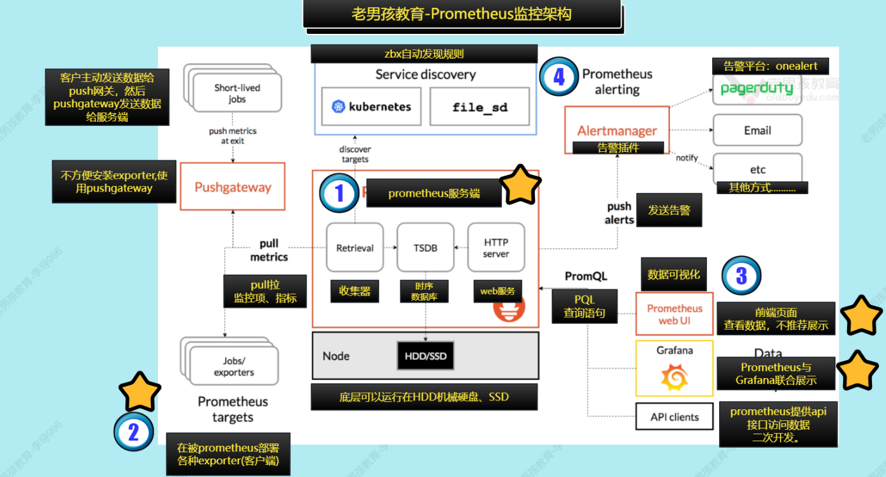

# 监控架构-Prometheus-01

今日内容：


# 一、Prometheus介绍

## 2.1 概述

Prometheus（普罗米修斯）监控架构，使用Golang语言实现。

使用简单，学习门槛较高，Prometheus一般与Grafana配合。  


## 2.2 Prometheus对比Zabbix

| 指标         | Prometheus                             | Zabbix                                  |
| ------------ | -------------------------------------- | --------------------------------------- |
| 语言         | Golang(Go)                             | PHP,C,GO                                |
| 部署         | 二进制，解压即用.                      | yum/编译安装、数据库、php依赖           |
| 是否容易掌握 | 门槛较高                               | 容易使用                                |
| 监控方式     | 通过各种exporter，监控一般都是基于http | 各种模板，客户端，自定义监控，各种协议. |
| 应用场景     | 监控服务、容器、k8s。                  | 监控系统底层，硬件，系统，网络。        |


# 二、极速上手

## 2.1 环境准备

| 角色             | 主机名                            | ip                    |
| ---------------- | --------------------------------- | --------------------- |
| prometheus服务端 | m04-prometheus pro.oldboylinux.cn | 10.0.0.64/172.16.1.64 |
| grafana          | m03-grafana gra.oldboylinux.cn    | 10.0.0.63/172.16.1.63 |
| docker01         | docker01 docker01.oldboylinux.cn  | 10.0.0.81/172.16.1.81 |


## 2.2 时间同步

确保各服务器时间一致

```shell
crontab -e

# sync time 
*/3 * * * * /sbin/ntpdate ntp1.aliyun.com &>/dev/null
```


## 2.3 部署prometheus

>mn04操作

1、官网下载安装包，上传到服务器，解压

```shell
mkdir -p /app/
tar xf prometheus-2.53.0.linux-amd64.tar.gz -C /app/
ln -s /app/prometheus-2.53.0.linux-amd64/ /app/prometheus

[root@mn04[ /app]#ls
prometheus  prometheus-2.53.0.linux-amd64  rpms  src  tools

[root@mn04[ /app/prometheus]#ls
console_libraries  consoles  LICENSE  NOTICE  prometheus  prometheus.yml  promtool
```

2、主要文件说明

| 文件           | 作用                   |
| -------------- | ---------------------- |
| prometheus     | prometheus服务端的命令 |
| prometheus.yml | 配置文件。             |

3、查看版本信息

```shell
[root@mn04[ /app/prometheus]#./prometheus --version
prometheus, version 2.53.0 (branch: HEAD, revision: 4c35b9250afefede41c5f5acd76191f90f625898)
  build user:       root@7f8d89cbbd64
  build date:       20240619-07:39:12
  go version:       go1.22.4
  platform:         linux/amd64
  tags:             netgo,builtinassets,stringlabels
```

4、启动

- 前台启动方式

```shell
[root@mn04[ /app/prometheus]#./prometheus 
```

- 后台启动方式

```shell
nohup /app/prometheus/prometheus &>>/var/log/prometheus.log &
```

- systemctl管理方式（推荐）

```shell
# 创建服务文件
[root@mn04[ /app/prometheus]#cat /usr/lib/systemd/system/prometheus.service 
[Unit]
Description=Prometheus Server
After=network.target
[Service]
Type=simple
ExecStart=/app/prometheus/prometheus --config.file=/app/prometheus/prometheus.yml
KillMode=process
[Install]
WantedBy=multi-user.target

# 启动服务
[root@mn04[ /app/prometheus]#systemctl enable --now prometheus.service 
Created symlink from /etc/systemd/system/multi-user.target.wants/prometheus.service to /usr/lib/systemd/system/prometheus.service.
```

5、查看进程信息

```shell
[root@mn04[ /app/prometheus]#ps -ef | grep prome
root       5115   2247  0 09:49 pts/0    00:00:00 ./prometheus
root       5168   5125  0 09:50 pts/1    00:00:00 grep --color=auto prome
[root@mn04[ /app/prometheus]#ss -lntup | grep prome
tcp    LISTEN     0      128    [::]:9090               [::]:*                   users:(("prometheus",pid=5115,fd=7))
```

测试访问http://10.0.0.64:9090，访问成功


# 三、Promethues的监控架构

Prometheus不像zbbix什么都集成在一起，它是拆分式的。

1、启动pro服务端

- 收集器：收集客户端回传的数据
- TSDB：内置时序数据库，存放收集的数据，（时间 ---- 数据）
- HTTP Server：提供Web服务

2、在被管控机上部署各种exporter（客户端，类似于zbx的agent）

- exporter负责收集数据、传给服务端
- exporter可以在github获取（如：prometheus/mysqld_exporter）
- 在自定义监控方面，exporter不如zbx的自定义方便，需要动代码，不过一般github提供的很够用，监控指标非常多

3、前端展示数据（通过PQL查询语句获取）

- Prometheus自带的UI（简单看看）
- Grafana展示
- API接口外传，二次开发

4、配置告警平台

- pro自身不具备告警的功能，需要安装插件来实现




# 四、简单使用

## 4.1 简单过滤

1、勾上use local time，过滤器选择过滤项，点击执行


查看结果（文字）


查看结果（图形）


## 4.2 查看所有键值

浏览器访问：http://10.0.0.64:9090/metrics


命令行访问

```shell
curl -s http://10.0.0.64:9090/metrics | grep -v '#'
```


# 五、Prometheus命令和配置文件

## 5.1 服务端命令行选项

| prometheus命令行核心选项            |                                                              |
| ----------------------------------- | ------------------------------------------------------------ |
| --config.file="prometheus.yml"      | 指定配置文件，默认是当前目录下在的prometheus.yml             |
| --web.listen address="0.0.0.0:9090" | 前端web页面,端口和监听的地址。如果想增加访问认证可以用ngx。  |
| --web.max-connections=512           | 并发连接数.                                                  |
| --storage.tsdb.path="data/"         | 指定tsdb数据存放目录,相对于安装目录.                         |
| --log.level=info                    | 日志级别,info(一般),debug(超级详细).prometheus日志默认输出到屏幕（标准输 出） |
| --log.format=logfmt                 | 日志格式。logfmt默认格式。 json格式（日志收集的时候使用）    |

完整的启动命令

```shell
/app/prometheus/prometheus --config.file="/app/prometheus/prometheus.yml" --web.listen-address="0.0.0.0:9090" --web.max-connections=512 &>/var/log/prometheus.log &
```

写入开机自启动

```shell
vim /etc/rc.local
```

写入service文件

```shell
[root@mn04[ /app/prometheus]#cat /usr/lib/systemd/system/prometheus.service 
[Unit]
Description=Prometheus Server
After=network.target
[Service]
Type=simple
ExecStart=/app/prometheus/prometheus --config.file=/app/prometheus/prometheus.yml --web.listen-address=0.0.0.0:9090 --web.max-connections=512
KillMode=process
[Install]
WantedBy=multi-user.target
```


## 5.2 配置文件详解

配置文件`prometheus.yml`

第一部分：全局定义部分

```shell
# my global config
global:
  # prometheus采集数据的间隔
  scrape_interval: 15s # Set the scrape interval to every 15 seconds. Default is every 1 minute. 
  # 执行对应的rules(规则)间隔，一般适用于报警规则
  evaluation_interval: 15s # Evaluate rules every 15 seconds. The default is every 1 minute. // 
  # 采集数据的超时时间，默认是10秒.
  # scrape_timeout is set to the global default (10s).
```

第二部分：警告信息部分

```shell
# Alertmanager configuration
# 用于配置警告信息，alertmanager配置。
alerting:
  alertmanagers:
    - static_configs:
        - targets:
          # - alertmanager:9093

# Load rules once and periodically evaluate them according to the global 'evaluation_interval'.
rule_files:
  # - "first_rules.yml"
  # - "second_rules.yml"
```

第三部分：数据采集相关的配置（客户端）

```shell
# A scrape configuration containing exactly one endpoint to scrape:
# Here it's Prometheus itself.
scrape_configs:
  # The job name is added as a label `job=<job_name>` to any timeseries scraped from this config.
  # 任务名字.体现采集哪些机器，哪些指标
  - job_name: "prometheus"

    # metrics_path defaults to '/metrics'
    # scheme defaults to 'http'.
	
	# 静态配置文件，直接指定被采集的对象. 修改后要重启prometheus.
    static_configs:
      - targets: ["localhost:9090"]
    # 动态配置文件，动态读取文件内容，然后进行采集,实时监控
    file_sd_configs:
```

>从上面的分析可以看出pro服务端配置文件核心是：scrape_configs
>
>用于配置各种的exporter  

### 5.2.1 修改配置文件

配置服务端自我监控，设置名字

```shell
[root@mn04[ /app/prometheus]#grep -v "#" prometheus.yml 
global:
alerting:
  alertmanagers:
    - static_configs:
        - targets:
rule_files:
scrape_configs:
  - job_name: "prometheus-server"	# 修改
    static_configs:
      - targets: ["localhost:9090"]
```

在web页面的"Target"中可以看到


# 六、Prometheus的exporter