# 监控架构-Prometheus-01

今日内容：

- 认识prometheus
- prometheus的基本用法以及数据查询语句
- Prometheus的exporter客户端
- Grafana展示promethues的数据
- 使用PushGateway实现自定义监控

# 一、Prometheus介绍

## 2.1 概述

Prometheus（普罗米修斯）监控架构，使用Golang语言实现。

使用简单，学习门槛较高，Prometheus一般与Grafana配合。  


## 2.2 Prometheus对比Zabbix

| 指标         | Prometheus                             | Zabbix                                  |
| ------------ | -------------------------------------- | --------------------------------------- |
| 语言         | Golang(Go)                             | PHP,C,GO                                |
| 部署         | 二进制，解压即用.                      | yum/编译安装、数据库、php依赖           |
| 是否容易掌握 | 门槛较高                               | 容易使用                                |
| 监控方式     | 通过各种exporter，监控一般都是基于http | 各种模板，客户端，自定义监控，各种协议. |
| 应用场景     | 监控服务、容器、k8s。                  | 监控系统底层，硬件，系统，网络。        |


# 二、极速上手

## 2.1 环境准备

| 角色             | 主机名                            | ip                    |
| ---------------- | --------------------------------- | --------------------- |
| prometheus服务端 | m04-prometheus pro.oldboylinux.cn | 10.0.0.64/172.16.1.64 |
| grafana          | m03-grafana gra.oldboylinux.cn    | 10.0.0.63/172.16.1.63 |
| docker01         | docker01 docker01.oldboylinux.cn  | 10.0.0.81/172.16.1.81 |


## 2.2 时间同步

确保各服务器时间一致

```shell
crontab -e

# sync time 
*/3 * * * * /sbin/ntpdate ntp1.aliyun.com &>/dev/null
```


## 2.3 部署prometheus

>mn04操作

1、官网下载安装包，上传到服务器，解压

```shell
mkdir -p /app/
tar xf prometheus-2.53.0.linux-amd64.tar.gz -C /app/
ln -s /app/prometheus-2.53.0.linux-amd64/ /app/prometheus

[root@mn04[ /app]#ls
prometheus  prometheus-2.53.0.linux-amd64  rpms  src  tools

[root@mn04[ /app/prometheus]#ls
console_libraries  consoles  LICENSE  NOTICE  prometheus  prometheus.yml  promtool
```

2、主要文件说明

| 文件           | 作用                   |
| -------------- | ---------------------- |
| prometheus     | prometheus服务端的命令 |
| prometheus.yml | 配置文件。             |

3、查看版本信息

```shell
[root@mn04[ /app/prometheus]#./prometheus --version
prometheus, version 2.53.0 (branch: HEAD, revision: 4c35b9250afefede41c5f5acd76191f90f625898)
  build user:       root@7f8d89cbbd64
  build date:       20240619-07:39:12
  go version:       go1.22.4
  platform:         linux/amd64
  tags:             netgo,builtinassets,stringlabels
```

4、启动

- 前台启动方式

```shell
[root@mn04[ /app/prometheus]#./prometheus 
```

- 后台启动方式

```shell
nohup /app/prometheus/prometheus &>>/var/log/prometheus.log &
```

- systemctl管理方式（推荐）

```shell
# 创建服务文件
[root@mn04[ /app/prometheus]#cat /usr/lib/systemd/system/prometheus.service 
[Unit]
Description=Prometheus Server
After=network.target
[Service]
Type=simple
ExecStart=/app/prometheus/prometheus --config.file=/app/prometheus/prometheus.yml
KillMode=process
[Install]
WantedBy=multi-user.target

# 启动服务
[root@mn04[ /app/prometheus]#systemctl enable --now prometheus.service 
Created symlink from /etc/systemd/system/multi-user.target.wants/prometheus.service to /usr/lib/systemd/system/prometheus.service.
```

5、查看进程信息

```shell
[root@mn04[ /app/prometheus]#ps -ef | grep prome
root       5115   2247  0 09:49 pts/0    00:00:00 ./prometheus
root       5168   5125  0 09:50 pts/1    00:00:00 grep --color=auto prome
[root@mn04[ /app/prometheus]#ss -lntup | grep prome
tcp    LISTEN     0      128    [::]:9090               [::]:*                   users:(("prometheus",pid=5115,fd=7))
```

测试访问http://10.0.0.64:9090，访问成功


# 三、Promethues的监控架构

Prometheus不像zbbix什么都集成在一起，它是拆分式的。

1、启动pro服务端

- 收集器：收集客户端回传的数据
- TSDB：内置时序数据库，存放收集的数据，（时间 ---- 数据）
- HTTP Server：提供Web服务

2、在被管控机上部署各种exporter（客户端，类似于zbx的agent）

- exporter负责收集数据、传给服务端
- exporter可以在github获取（如：prometheus/mysqld_exporter）
- 在自定义监控方面，exporter不如zbx的自定义方便，需要动代码，不过一般github提供的很够用，监控指标非常多

3、前端展示数据（通过PQL查询语句获取）

- Prometheus自带的UI（简单看看）
- Grafana展示
- API接口外传，二次开发

4、配置告警平台

- pro自身不具备告警的功能，需要安装插件来实现


# 四、简单使用

## 4.1 简单过滤

1、勾上use local time，过滤器选择过滤项，点击执行


查看结果（文字）


查看结果（图形）

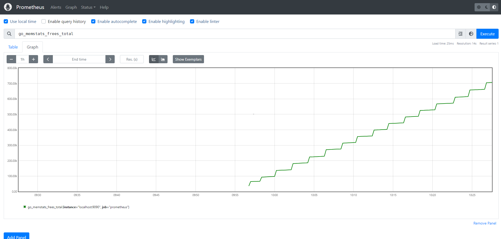


## 4.2 查看所有键值

浏览器访问：http://10.0.0.64:9090/metrics

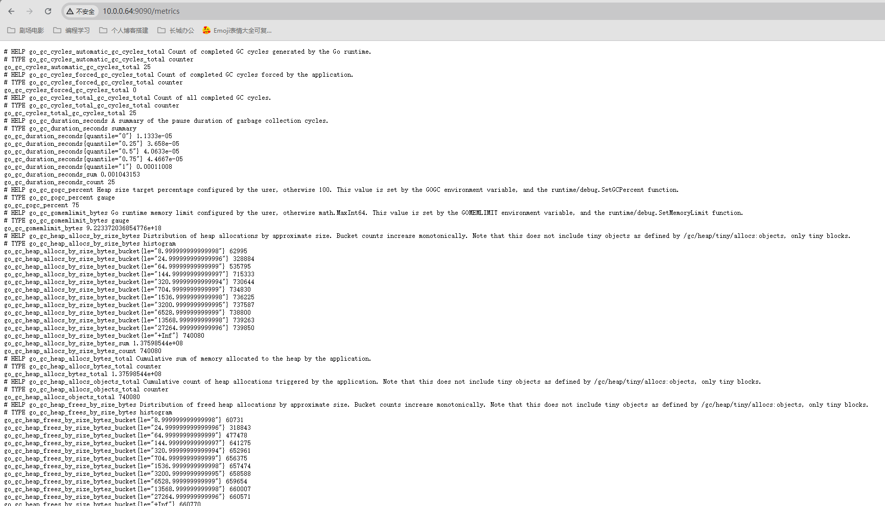

命令行访问

```shell
curl -s http://10.0.0.64:9090/metrics | grep -v '#'
```


# 五、Prometheus命令和配置文件

## 5.1 服务端命令行选项

| prometheus命令行核心选项            |                                                              |
| ----------------------------------- | ------------------------------------------------------------ |
| --config.file="prometheus.yml"      | 指定配置文件，默认是当前目录下在的prometheus.yml             |
| --web.listen address="0.0.0.0:9090" | 前端web页面,端口和监听的地址。如果想增加访问认证可以用ngx。  |
| --web.max-connections=512           | 并发连接数.                                                  |
| --storage.tsdb.path="data/"         | 指定tsdb数据存放目录,相对于安装目录.                         |
| --log.level=info                    | 日志级别,info(一般),debug(超级详细).prometheus日志默认输出到屏幕（标准输 出） |
| --log.format=logfmt                 | 日志格式。logfmt默认格式。 json格式（日志收集的时候使用）    |

完整的启动命令

```shell
/app/prometheus/prometheus --config.file="/app/prometheus/prometheus.yml" --web.listen-address="0.0.0.0:9090" --web.max-connections=512 &>/var/log/prometheus.log &
```

写入开机自启动

```shell
vim /etc/rc.local
```

写入service文件

```shell
[root@mn04[ /app/prometheus]#cat /usr/lib/systemd/system/prometheus.service 
[Unit]
Description=Prometheus Server
After=network.target
[Service]
Type=simple
ExecStart=/app/prometheus/prometheus --config.file=/app/prometheus/prometheus.yml --web.listen-address=0.0.0.0:9090 --web.max-connections=512
KillMode=process
[Install]
WantedBy=multi-user.target
```


## 5.2 配置文件详解

配置文件`prometheus.yml`

第一部分：全局定义部分

```shell
# my global config
global:
  # prometheus采集数据的间隔
  scrape_interval: 15s # Set the scrape interval to every 15 seconds. Default is every 1 minute. 
  # 执行对应的rules(规则)间隔，一般适用于报警规则
  evaluation_interval: 15s # Evaluate rules every 15 seconds. The default is every 1 minute. // 
  # 采集数据的超时时间，默认是10秒.
  # scrape_timeout is set to the global default (10s).
```

第二部分：警告信息部分

```shell
# Alertmanager configuration
# 用于配置警告信息，alertmanager配置。
alerting:
  alertmanagers:
    - static_configs:
        - targets:
          # - alertmanager:9093

# Load rules once and periodically evaluate them according to the global 'evaluation_interval'.
rule_files:
  # - "first_rules.yml"
  # - "second_rules.yml"
```

第三部分：数据采集相关的配置（客户端）

```shell
# A scrape configuration containing exactly one endpoint to scrape:
# Here it's Prometheus itself.
scrape_configs:
  # The job name is added as a label `job=<job_name>` to any timeseries scraped from this config.
  # 任务名字.体现采集哪些机器，哪些指标
  - job_name: "prometheus"

    # metrics_path defaults to '/metrics'
    # scheme defaults to 'http'.
	
	# 静态配置文件，直接指定被采集的对象. 修改后要重启prometheus.
    static_configs:
      - targets: ["localhost:9090"]
    # 动态配置文件，动态读取文件内容，然后进行采集,实时监控
    file_sd_configs:
```

>从上面的分析可以看出pro服务端配置文件核心是：scrape_configs
>
>用于配置各种的exporter  

### 5.2.1 修改配置文件

配置服务端自我监控，设置名字

```shell
[root@mn04[ /app/prometheus]#grep -v "#" prometheus.yml 
global:
alerting:
  alertmanagers:
    - static_configs:
        - targets:
rule_files:
scrape_configs:
  - job_name: "prometheus-server"	# 修改
    static_configs:
      - targets: ["localhost:9090"]
```

在web页面的"Target"中可以看到


# 六、prometheus的exporter

## 6.1 概述

prometheus有众多的exporters，基本通过命令或docker运行。  

命名规则：

| exporter        | 说明                         |
| --------------- | ---------------------------- |
| node_exporter   | 获取节点基础信息（系统监控） |
| xx服务_exporter | 监控指定服务的。             |

各种exporter的使用流程基本类似：

- 在被控机下载、部署、启动exporter.
- prometheus服务端配置、在配置中添加这主机+端口  

## 6.2 客户端部署node_exporter

0、环境准备

| 节点            | 部署的内容    | ip地址                |
| --------------- | ------------- | --------------------- |
| mn04-prometheus | node_exporter | 10.0.0.64/172.16.1.64 |
| mn03-grafana    | node_exporter | 10.0.0.63/172.16.1.63 |

1、github下载：https://github.com/prometheus/node_exporter

2、开始部署

> mn03、04都要操作

```shell
# 解压
[root@mn03 /app/tools]#tar -vxf node_exporter-1.8.1.linux-amd64.tar.gz
# 目录软链接
[root@mn03 /app/tools]#ln -s node_exporter-1.8.1.linux-amd64/ node_exporter
# 命令软链接
[root@mn03 /app/tools]#ln -s /app/tools/node_exporter/node_exporter /bin/node_exporter
```

3、测试使用，查看版本

```shell
[root@mn03 /app/tools]#node_exporter --version
node_exporter, version 1.8.1 (branch: HEAD, revision: 400c3979931613db930ea035f39ce7b377cdbb5b)
  build user:       root@7afbff271a3f
  build date:       20240521-18:36:22
  go version:       go1.22.3
  platform:         linux/amd64
  tags:             unknown
```

4、创建service服务文件

```shell
# 创建服务文件
[root@mn03 /app/tools]#cat /usr/lib/systemd/system/node_exporter.service 
[Unit]
Description=prometheus node_exporter
After=network.target
[Service]
Type=simple
ExecStart=/bin/node_exporter
KillMode=process
[Install]
WantedBy=multi-user.target
```

启动服务

```shell
[root@mn03 /app/tools]#systemctl daemon-reload 
[root@mn03 /app/tools]#systemctl enable --now node_exporter.service 
```

查看状态

```shell
[root@mn03 /app/tools]#systemctl status node_exporter.service 
● node_exporter.service - prometheus node_exporter
   Loaded: loaded (/usr/lib/systemd/system/node_exporter.service; enabled; vendor preset: disabled)
   Active: active (running) since Wed 2024-07-03 11:48:51 CST; 5s ago
```

检查端口信息

```shell
[root@mn03 /app/tools]#ps -ef | grep node
root      15636      1  0 11:48 ?        00:00:00 /bin/node_exporter
root      15659   2322  0 11:50 pts/0    00:00:00 grep --color=auto node
[root@mn03 /app/tools]#ss -lntup | grep node
tcp    LISTEN     0      128    [::]:9100               [::]:*                   users:(("node_exporter",pid=15636,fd=3))
```


## 6.3 服务端配置-静态配置版  

配置yml文件，静态版本

```shell
[root@mn04[ /app/prometheus]#cat prometheus.yml 
...
scrape_configs:
  # The job name is added as a label `job=<job_name>` to any timeseries scraped from this config.
  - job_name: "prometheus-server"

    # metrics_path defaults to '/metrics'
    # scheme defaults to 'http'.

    static_configs:
      - targets: ["localhost:9090"]

  # 新增
  - job_name: "basic_info_node_exporter"
    static_configs:
      - targets: ["10.0.0.63:9100"]
      - targets: ["10.0.0.64:9100"]
```

重启服务

```shell
systemctl restart prometheus.service
```

检查，确保web页面中可以查询到配置的主机

测试过滤条件可用

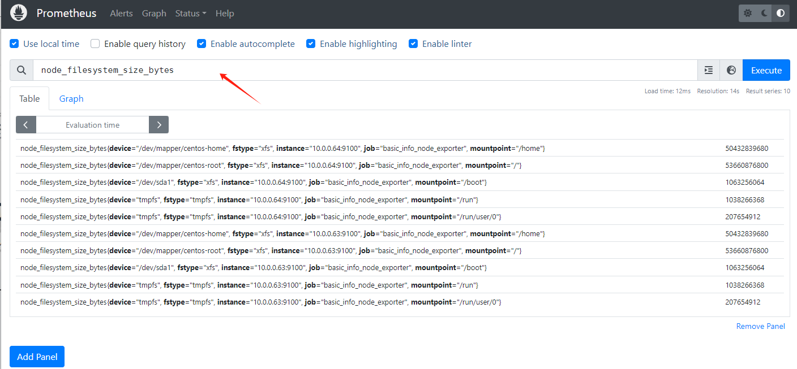

## 6.4 服务端配置-动态配置版

作用是什么？

- 获取的exporter域名+端口，写入配置文件，可以定时读取并加入到prometheus中。
- 用于解决，大量主机添加、删除的操作  

在服务端yml文件中配置，动态版本

```shell
[root@mn04[ /app/prometheus]#cat prometheus.yml 
...
  - job_name: "prometheus-server"

    # metrics_path defaults to '/metrics'
    # scheme defaults to 'http'.

    static_configs:
      - targets: ["localhost:9090"]

  # 静态的不需要了
  #- job_name: "basic_info_node_exporter"
  #  static_configs:
  #    - targets: ["10.0.0.63:9100"]
  #    - targets: ["10.0.0.64:9100"]
  
  # 新增动态
  - job_name: "basic_info_node_exporter_discovery"
    file_sd_configs:
      - files:
        - /app/prometheus/discovery_node_exporter.json
        refresh_interval: 5s
```

选项的作用

```shell
file_sd_configs: 动态读取与加载配置文件。
files: 指定要加载的配置文件.
refresh_interval 读取间隔.
```

创建json文件

```shell
[root@mn04[ /app/prometheus]#cat discovery_node_exporter.json 
[
  {
    "targets": [
      "10.0.0.63:9100",
      "10.0.0.64:9100"
    ]
  }
]
```

重启服务并测试


# 七、Prometheus的过滤语句

## 7.1 基本过滤

过滤方法：直接写上prometheus的键值，比如获取所有主机的可用内存

```shell
node_memory_MemFree_bytes
```


值不方便看，可以加入**运算符**，改为`G`显示

```shell
node_memory_MemFree_bytes/1024^3
```


从Targets页面，点击对应主机可以查看到所有键值

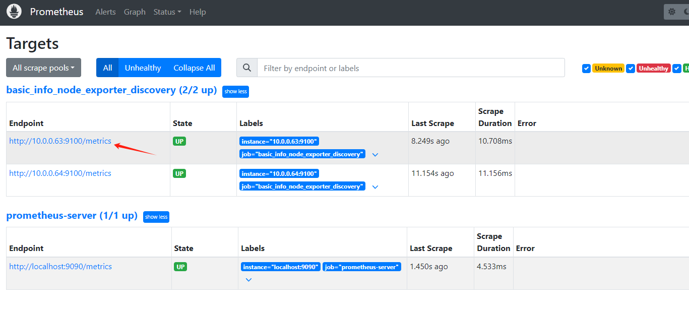

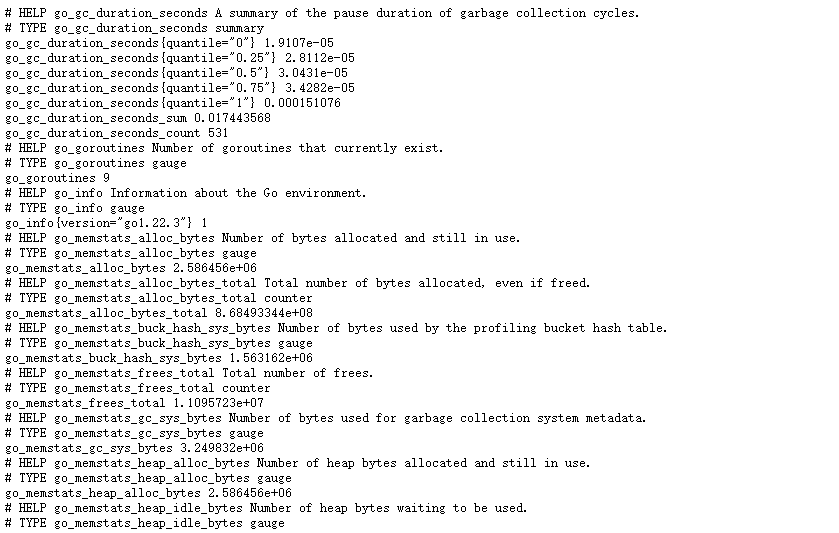

## 7.2 包含条件的过滤（重要）

### 7.2.1 过滤指定主机的数据

应用场景：只需要指定主机的数据

比如查看剩余内存的信息，只需要mn04的数据

```shell
node_memory_MemFree_bytes{instance="10.0.0.64:9100"}
```


### 7.2.2 过滤指定主机CPU信息中的iowait

应用场景：你给的数据太多了，我只要其中一个字段

```shell
node_cpu_seconds_total{instance="10.0.0.63:9100",mode="iowait"}
```

不指定的情况下，这样

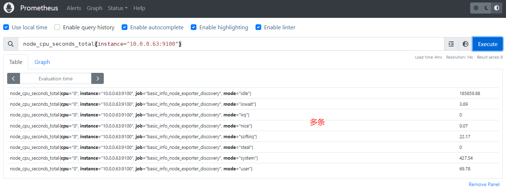

指定iowait的效果


### 7.2.3 过滤出所有主机非idle的指标

应用场景：反向查询

```shell
node_cpu_seconds_total{instance="10.0.0.63:9100",mode!="idle"}
```


### 7.2.4 使用正则匹配

查询语句

```shell
node_cpu_seconds_total{mode=~"^i.*"}
```

不使用正则过滤


使用后


### 7.2.5 取出最近1分钟系统CPU的信息

关键字：`[1m]`

```shell
node_cpu_seconds_total{cpu="0",instance="10.0.0.64:9100",mode="iowait"}[1m]
```


### 7.2.6 条件过滤小结

PQL过滤，可以使用匹配符号，如`=、!=、=~、!~`  

| 符号 | 含义                                                         |
| ---- | ------------------------------------------------------------ |
| =    | 等于.                                                        |
| !=   | 不等于.                                                      |
| =~   | 支持正则，匹配，要完全匹配对应的内容 node_cpu_seconds_total{mode=~"^i.*"} |
| !~   | 支持正则，不匹配                                             |


## 7.3 使用函数

### 7.3.1 rate函数

**案例01**-过去5分钟内promethues总共收到多少http请求（/metrics）

```shell
prometheus_http_requests_total{handler="/metrics"}[5m]
```

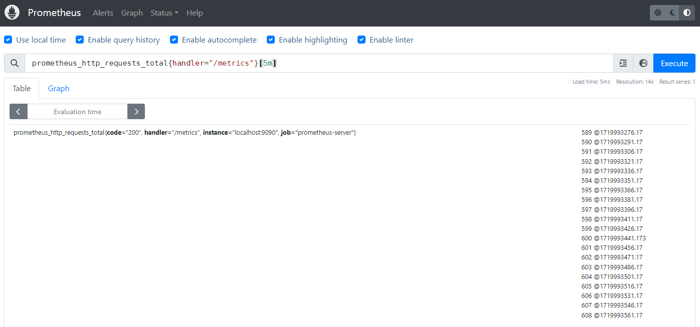

那请求每秒钟加了多少呢？此时可以用rate函数来获取

```shell
rate(prometheus_http_requests_total{handler="/metrics"}[5m])
# 可以看到每秒约加了0.06
```


**案例02**-检查过去一分钟内的CPU速率

```shell
rate(node_cpu_seconds_total{instance="10.0.0.64:9100"}[1m])
```

排除“idle”，查看cpu速率每秒加了多少

```shell
rate(node_cpu_seconds_total{instance="10.0.0.64:9100",mode!="idle"}[1m])
```

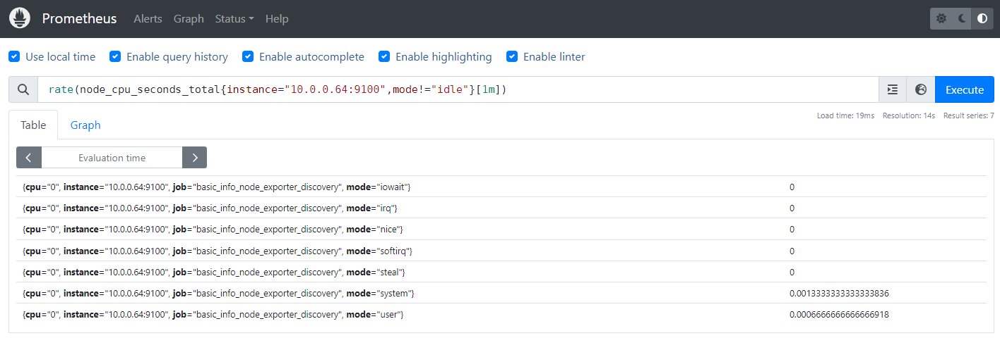


### 7.3.2 sum函数求和

比如：查询总内存的语句

```shell
node_memory_MemTotal_bytes

# 结果
node_memory_MemTotal_bytes{instance="10.0.0.64:9100", job="basic_info_node_exporter_discovery"} 2076536832
node_memory_MemTotal_bytes{instance="10.0.0.63:9100", job="basic_info_node_exporter_discovery"} 2076536832
```

使用求和函数

```shell
sum(node_memory_MemTotal_bytes)

# 结果
{} 4153073664
```


### 7.3.3 count函数求数量

7.3.2的语句改为count函数

```shell
count(node_memory_MemTotal_bytes)

# 结果
{} 2
```


>还有一堆函数，可以在官网查询
>
>https://prometheus.io/docs/prometheus/latest/querying/functions/


## 7.4 复杂语句（重要）

所谓复杂函数，就是把不同语句混合计算，求得结果。

比如：计算内存使用率

```shell
# （总内存-剩余内存）/总内存
(node_memory_MemTotal_bytes - node_memory_MemFree_bytes) / node_memory_MemTotal_bytes * 100

# 结果
{instance="10.0.0.64:9100", job="basic_info_node_exporter_discovery"}
58.20359116076589
{instance="10.0.0.63:9100", job="basic_info_node_exporter_discovery"}
75.3697972451856
```


# 八、Grafana展示数据

prometheus webui一般用于调试PromQL语句（查询语句）

展示交给Grafana

本质：Grafana执行PromQL语句（查询语句）获取数据，然后进行展示  


## 8.1 使用流程

### 8.1.1 添加数据源

进入数据源设置界面，点击添加数据源

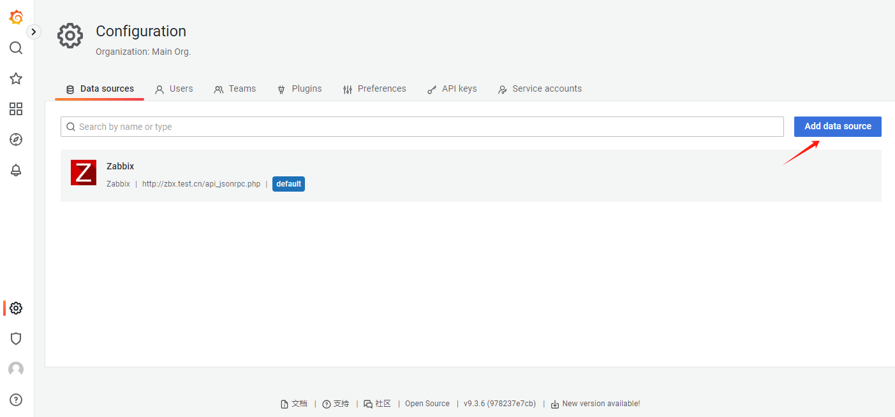

选择prometheus

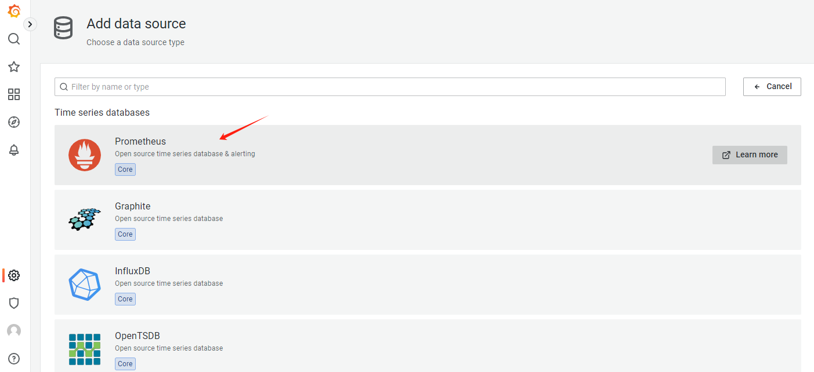

填写信息，保存退出即可

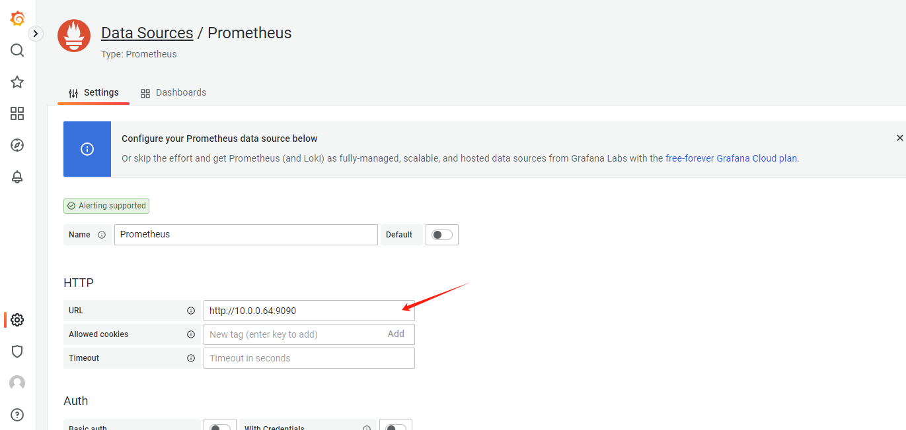

回到数据源总览界面，点击配置好的prometheus源进去

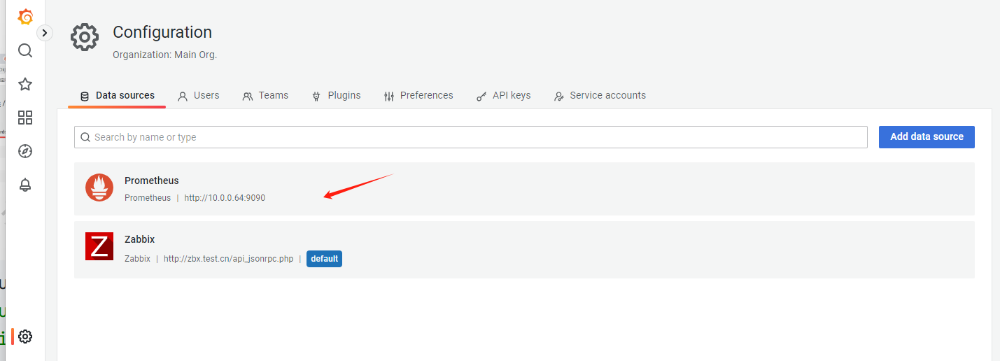

导入自带的三个仪表盘


### 8.1.2 修改仪表盘

进到仪表盘页面，进入"Prometheus Stats"仪表盘

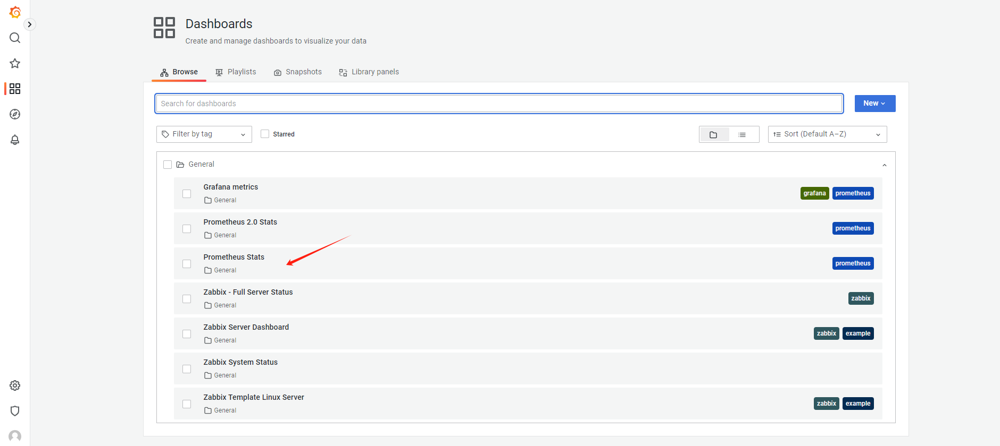

可以看到默认的数据不全，很多都是缺失的


以Uptime面板为例，点进去查看它的查询语句

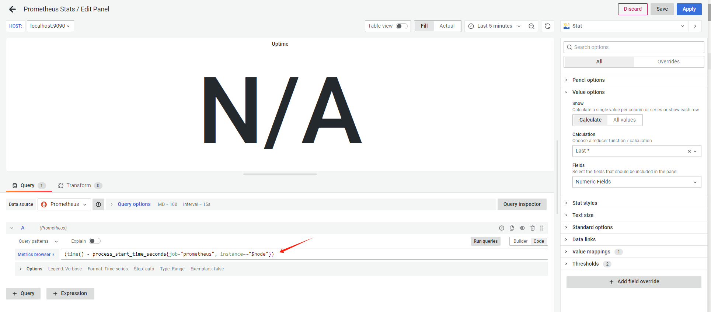

发现是有问题的

```shell
# job名不对
(time() - process_start_time_seconds{job="prometheus", instance=~"$node"})

# 修改为
(time() - process_start_time_seconds{job="prometheus-server", instance=~"$node"})
```

修改后正常获取数据

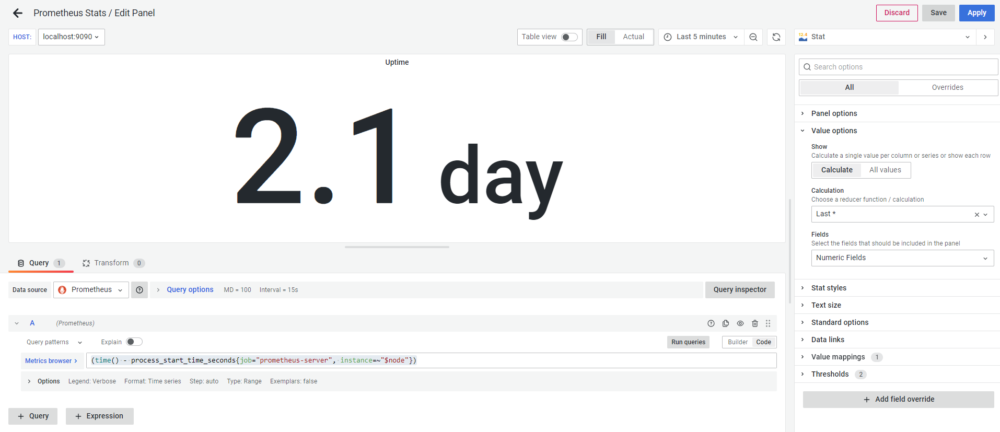

>这个自带的仪表盘，功能不是很完善，有的面板查询语句是正常的，但是根本查不出数据，更别说在Grafana显示了


### 8.1.3 导入第三方仪表盘

为了解决自带仪表盘功能不完善的问题，从grafana官网下载第三方仪表盘

https://grafana.com/grafana/dashboards/1860-node-exporter-full/

同样下载JSON文件

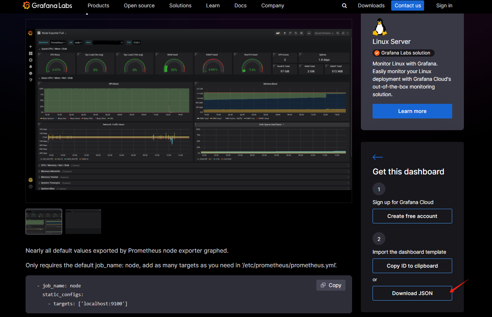

再导入进去即可

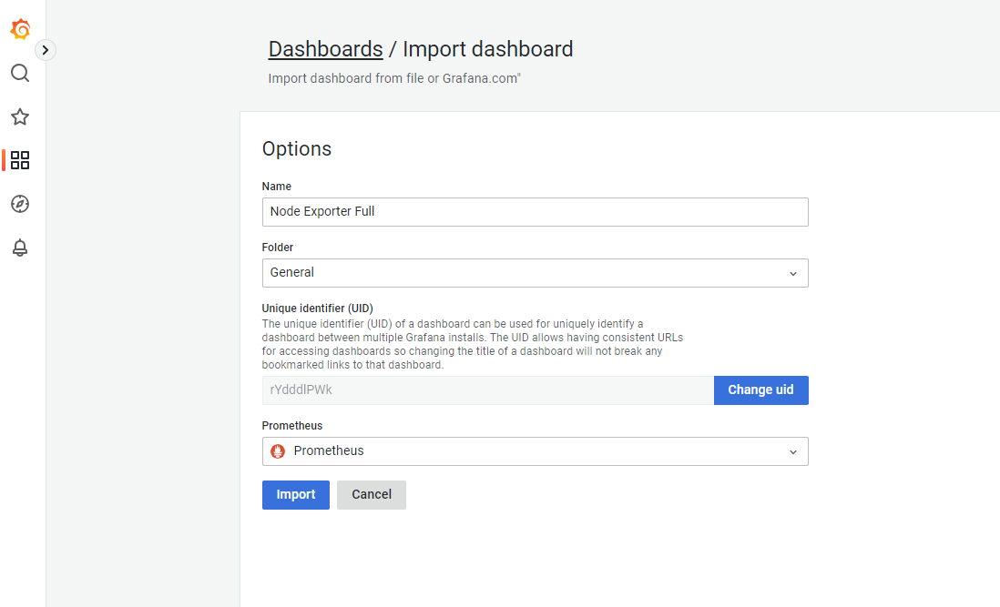

效果如下，丰富很多

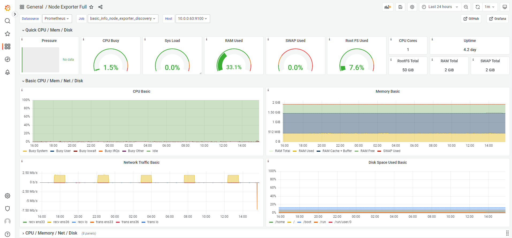


# 九、Push Gateway

Pushgateway是一种**中介服务**，可以将无法被Prometheus直接拉取的指标推送给它，然后再向

Prometheus公开，常用于自定义监控项，以及分布式监控（如 zabbix proxy）

## 9.1 使用流程

- 部署、启动pushgateway
- 服务端ip/域名+端口
- 写入配置（动态、静态）。
- 书写脚本获取你要的信息，把信息发送到pushgateway中。  


### 9.1.1 安装部署

> 在grafana节点（mn03）部署push gateway

1、获取安装包

```shell
https://github.com/prometheus/pushgateway/releases/tag/v1.9.0
```

2、解压、创建软连接

```shell
tar -vxf pushgateway-1.9.0.linux-amd64.tar.gz 
ln -s pushgateway-1.9.0.linux-amd64 pushgateway

[root@mn03 /app/tools]#ls
node_exporter  node_exporter-1.8.1.linux-amd64  pushgateway  pushgateway-1.9.0.linux-amd64  pushgateway-1.9.0.linux-amd64.tar.gz  sersync
```

3、测试使用

```shell
[root@mn03 /app/tools/pushgateway]#./pushgateway --version
pushgateway, version 1.9.0 (branch: HEAD, revision: d1ca1a6a426126a09a21f745e8ffbaba550f9643)
  build user:       root@2167597b1e9c
  build date:       20240608-15:04:08
  go version:       go1.22.4
  platform:         linux/amd64
  tags:             unknown
```

4、启动服务

手动方式

```shell
pushgateway &ՎҴ/tmp/pushgw.log &
```

systemctl管理方式（推荐）

```shell
# 创建service文件
[root@mn03 /]#cat /usr/lib/systemd/system/pushgateway-server.service 
[Unit]
Description=Push Gateway Server
After=network.target
[Service]
Type=simple
ExecStart=/app/tools/pushgateway/pushgateway 
KillMode=process
[Install]
WantedBy=multi-user.target

# 重新加载并启动服务
[root@mn03 /]#systemctl daemon-reload 
[root@mn03 /]#systemctl enable --now pushgateway-server.service 
Created symlink from /etc/systemd/system/multi-user.target.wants/pushgateway-server.service to /usr/lib/systemd/system/pushgateway-server.service.
```

4、查看状态，其端口是9091

```shell
[root@mn03 /]#systemctl status pushgateway-server.service 
● pushgateway-server.service - Push Gateway Server
   Loaded: loaded (/usr/lib/systemd/system/pushgateway-server.service; enabled; vendor preset: disabled)
   Active: active (running) since Fri 2024-07-05 16:10:34 CST; 26s ago
...
[root@mn03 /]#ps -ef | grep push
root      33538      1  0 16:10 ?        00:00:00 /app/tools/pushgateway/pushgateway
root      33555   2322  0 16:11 pts/0    00:00:00 grep --color=auto push
[root@mn03 /]#ss -lntup | grep push
tcp    LISTEN     0      128    [::]:9091               [::]:*                   users:(("pushgateway",pid=33538,fd=3))
```


### 9.1.2 Prometheus配置

修改Prometheus的配置文件（静态），把push gateway添加进去

```shell
[root@mn04[ /app/prometheus]#cat prometheus.yml 
...
  # The job name is added as a label `job=<job_name>` to any timeseries scraped from this config.
  - job_name: "prometheus-server"

    # metrics_path defaults to '/metrics'
    # scheme defaults to 'http'.

    static_configs:
      - targets: ["localhost:9090"]

  # 静态的不需要了
  #- job_name: "basic_info_node_exporter"
  #  static_configs:
  #    - targets: ["10.0.0.63:9100"]
  #    - targets: ["10.0.0.64:9100"]
  
  # 新增动态
  - job_name: "basic_info_node_exporter_discovery"
    file_sd_configs:
      - files:
        - /app/prometheus/discovery_node_exporter.json
        refresh_interval: 5s
  
  # 新增pushgateway监控     
  - job_name: "pushgateway"
    static_configs:
      - targets: ["10.0.0.63:9091"]
```

重启prometheus服务

```shell
[root@mn04[ /app/prometheus]#systemctl restart prometheus.service 
```

查看是否添加成功

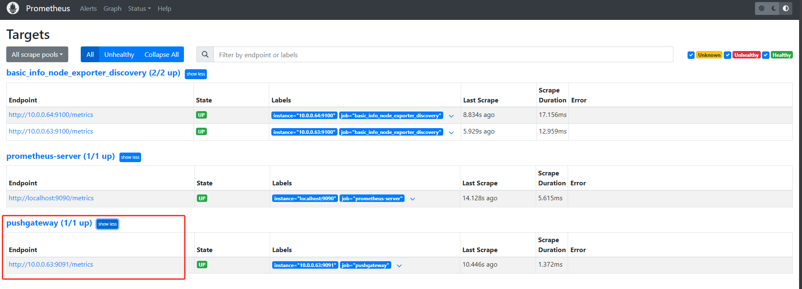


### 9.1.3 使用push gateway

测试自定义监控，以获取CPU核心数的命令为例

shell命令如下

```shell
[root@mn03 /app/tools/pushgateway]#lscpu |awk '/^CPU\(s\):/{print $2}'
1
```

写成脚本，上传数据

```shell
[root@mn03 /server/scripts]#cat test-push.sh 
#!/bin/bash
##############################################################
# File Name:test-push.sh
# Version:V1.0
# Author:Haris Gong
# Organization:gsproj.github.io
# Desc:
##############################################################


#1. vars 
job="pushgateway"
ins="10.0.0.63:9091"
pushgw="http://10.0.0.63:9091"
cores=`lscpu |awk '/^CPU\(s\):/{print $2}'`

#2、推送到pushgateway
echo "cpu_cores $cores" | \
curl --data-binary @- ${pushgw}/metrics/job/${job}/instance/${ins}
```

执行脚本

```shell
[root@mn03 /server/scripts]#sh -x test-push.sh 
+ job=pushgateway
+ ins=10.0.0.63:9091
+ pushgw=http://10.0.0.63:9091
++ lscpu
++ awk '/^CPU\(s\):/{print $2}'
+ cores=1
+ curl --data-binary @- http://10.0.0.63:9091/metrics/job/pushgateway/instance/10.0.0.63:9091
```

执行完，可以去prometheus页面去看看是否添加成功了

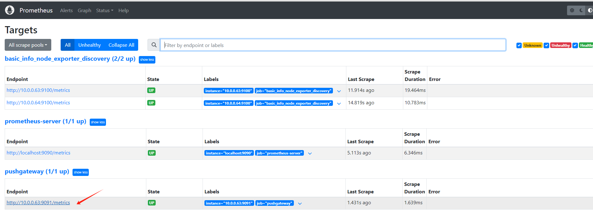

已经可以看到

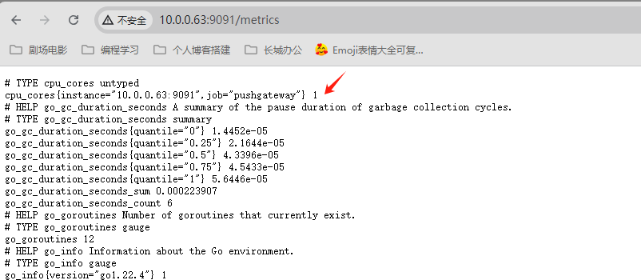

测试查询语句正常


## 9.2 小结

push gateway算是对prometheus功能的补充，类似于zbx的自定义监控

- 当前学习的只是一个很小的案例，功能很少，
- 后续可以根据实际需求，把脚本交给定时任务、或者死循环每5秒执行一次，不断地向push gateway服务器推送数据，确保数据实时有效