# Devops架构-Git与Gitlab

今日内容：

- 

# 一、运维的发展过程

发展过程描述：

- 手工时代（2000-2005）
  - 物理服务器、虚拟机
  - 手动敲命令
- 自动化时代（2005-2010）
  - shell批量管理、Ansible自动化
- 平台化时代（2010-2015）
  - 自动化运维平台，如CMDB、devops
- 模块化（2015-2020）
  - 各功能相对独立，模块化
- 智能化/云原生/微服务（2020-至今）
  - 各功能相对独立，模块化
  - docker、k8s、zabbix...

云原生时代的描述：

以Devops、SRE框架为指导，Docker/K8S/微服务为基础，用分布式方式加上 Python和Go语言，构建一套云技术产品体系，以及进行高级管理工具的二次开发，实现属于公司自己的自动化运维体系以及云技术体系的自动化产品。


# 二、CI-CD-CD基础

## 2.1 软件的生命周期

一个软件从0到1再到0的流程

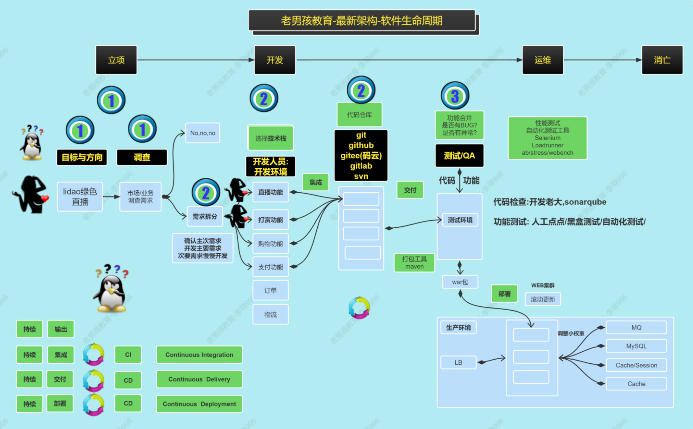

代码上线流程:

- 开发书写代码
- 把代码上传到代码仓库
- 通过工具拉取代码到测试环境中,运行代码,测试人员测试.
- 通过工具拉取代码部署到生产环境  


## 2.2 什么是CI/CD？

CI：持续集成（Continuous Intergration）：开发的代码集成到代码仓库

CD：持续交付（Continuous Delivery）：从代码仓库拉取代码部署到测试环境

CD：持续部署(Continuous Deployment)：从代码仓库拉取代码部署到生产环境


## 2.3 什么是DevOps？

概念如下：

- DevOps：是一种理念，让开发人员可以持续继承，运维人为可以持续交付/部署，让整个开发过程自动化部署、上线
- Development 开发
- Operation 运维
- 还有个进阶的理念叫DevSevOps，Sec安全

如何实现？

- 开发（存放代码 - CI）：git、gitlab、github、gitee（代码存放平台）
- 运维（部署代码 - CD）：jenkins、maven...插件

整体概念图如下：

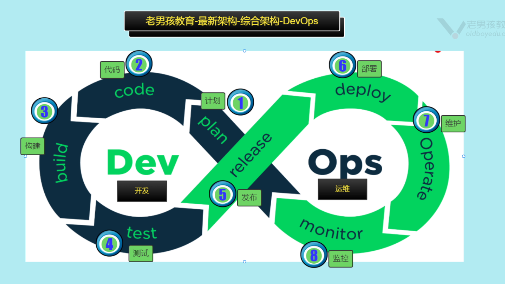

各流程涉及到的软件

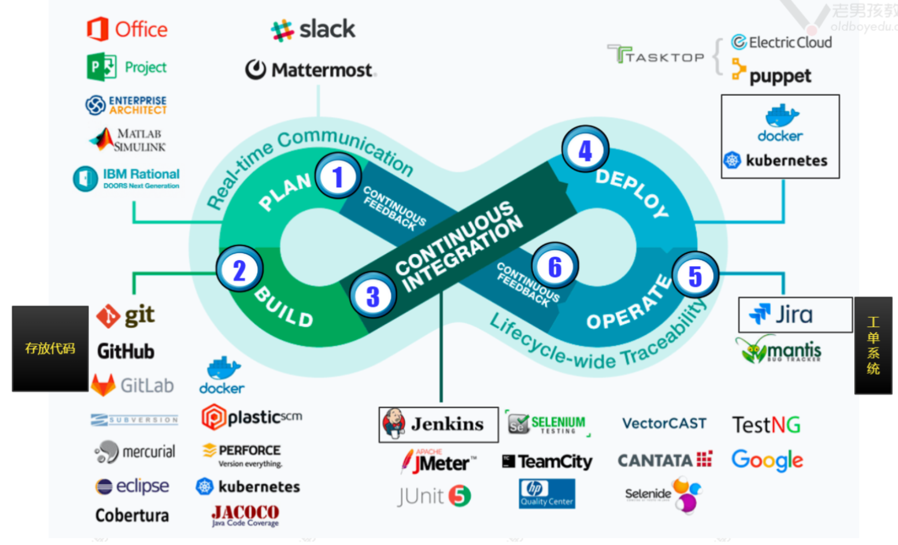

## 2.4 什么是环境？

在计算机领域，环境分为以下几种：

- 开发环境
  - 开发人员书写代码、简单测试的环境
  - 开发人员自己的电脑
- 测试环境
  - 开发人员初步测试的环境
  - 公司内部小机房
- 预生产环境
  - 正式部署前的最后一轮测试
  - 与生产环境保持相对一致
- 生产环境
  - 直接提供给用户的环境
  - 不能轻易修改，需要获得客户许可


## 2.5 代码发布/部署的流程


# 三、Git快速上手

## 3.1 实验环境准备

| 角色               | 主机名   | ip                    | 内存              |
| ------------------ | -------- | --------------------- | ----------------- |
| gitlab私有代码仓库 | devops01 | 10.0.0.71/172.16.1.71 | 2G(至少) 推荐2C4G |
| jenkins            | devops02 | 10.0.0.72/172.16.1.72 | 1G(至少) 推荐2C4G |
| sonarqube代码检查  | devops03 | 10.0.0.73/172.16.1.73 | 1c1G              |
| nexus私服          | devops04 | 10.0.0.74/172.16.1.74 | 1c1G              |

安装git

```shell
yum install -y git
```

## 3.2 Git仓库创建命令

### 3.2.1 新建git仓库案例

1、配置Git相关信息

```shell
[root@devops01 /]#git config --global user.name 'gs'
[root@devops01 /]#git config --global user.email '724262366@qq.com'
[root@devops01 /]#git config --global color.ui true
# 查询信息
[root@devops01 /]#git config --global --list
user.name=gs
user.email=724262366@qq.com
color.ui=true
```

2、创建代码目录，并初始化

```shell
# 创建代码目录
[root@devops01 /]#mkdir -p /app/gitest/project01/
[root@devops01 /]#cd /app/gitest/project01/
# git目录初始化
[root@devops01 /app/gitest/project01]#git init
Initialized empty Git repository in /app/gitest/project01/.git/
# 会生成.git目录，自带部分文件
[root@devops01 /app/gitest/project01]#ll .git/
total 12
drwxr-xr-x. 2 root root   6 Jul  9 14:08 branches
-rw-r--r--. 1 root root  92 Jul  9 14:08 config
-rw-r--r--. 1 root root  73 Jul  9 14:08 description
-rw-r--r--. 1 root root  23 Jul  9 14:08 HEAD
...
```

3、书写代码，提交到暂存区

```shell
# 新建文件
[root@devops01 /app/gitest/project01]#echo test >index.html
# git状态，找到新文件
[root@devops01 /app/gitest/project01]#git status
# On branch master
#
# Initial commit
#
# Untracked files:
#   (use "git add <file>..." to include in what will be committed)
#
#	index.html
nothing added to commit but untracked files present (use "git add" to track)
# 提交
[root@devops01 /app/gitest/project01]#git add .
[root@devops01 /app/gitest/project01]#git status
# On branch master
#
# Initial commit
#
# Changes to be committed:
#   (use "git rm --cached <file>..." to unstage)
#
#	new file:   index.html
#
```

4、提交代码到本地仓库

```shell
[root@devops01 /app/gitest/project01]#git commit -m '新增index.html文件'
[master (root-commit) 54f7721] 新增index.html文件
 1 file changed, 1 insertion(+)
 create mode 100644 index.html
[root@devops01 /app/gitest/project01]#git status
# On branch master
nothing to commit, working directory clean
```

5、查看提交日志

```shell
[root@devops01 /app/gitest/project01]#git log
commit 54f77216ffb1033b47db7d187b49e6361b742691
Author: gs <724262366@qq.com>
Date:   Tue Jul 9 14:12:15 2024 +0800

    新增index.html文件
```

### 3.2.2 小结

| 名字                         | 含义                                                         |
| ---------------------------- | ------------------------------------------------------------ |
| git init                     | 初始化本地仓库目录                                           |
| git config --global          | 邮箱,用户名,颜色                                             |
| git add                      | 提交数据到缓冲区(暂存区) git add . (所有文件) 或 git add 文件 |
| git commit                   | 把暂存区的数据提交到本地仓库 git commit -m "标记/说明"       |
| git status                   | 显示工作空间的状态                                           |
| git reset                    | 回滚                                                         |
| git reset --soft cid(版本号) | 把指定的版本数据内容下载到暂存区                             |
| git reset HEAD               | 暂存区-->工作空间(被修改的状态)                              |
| git checkout                 | 文件下载到工作空间并可以使用 git checkout . 或 git checkout 文件 |
| git reset --mix 版本号       |                                                              |
| git reset --hard 版本号      | 把本地仓库指定版本信息数据下载到工作目录中（强制覆盖）       |


## 3.3 Git区域与状态


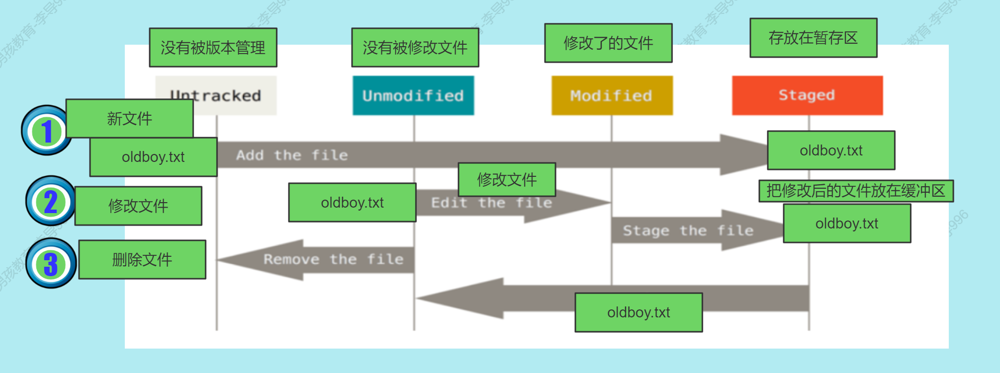

## 3.3 Git分支命令（branch）

### 3.3.1 分支概述

分支即是平行空间，假设你在为某个手机系统研发拍照功能，代码已经完成了80%，但如果将这不完整的代码直接提交到git仓库中，又有可能影响到其他人的工作，此时我们便可以在该软件的项目之上创建一个名叫”拍照功能”的分支。

- 这种分支只会属于你自己，而其他人看不。
- 等代码编写完成后再与原来的项目主分支合并下即可。
- 这样即能保证代码不丢失，又不影响其他人的工作。

默认的分支-master 主分支，这个分支的代码一般都是可用，可以部署到生产环境的。
一般开发人员开发代码的时候创建dev分支，shopping分支。应用名称分支，每个分支对应独立功能  

图示如下：

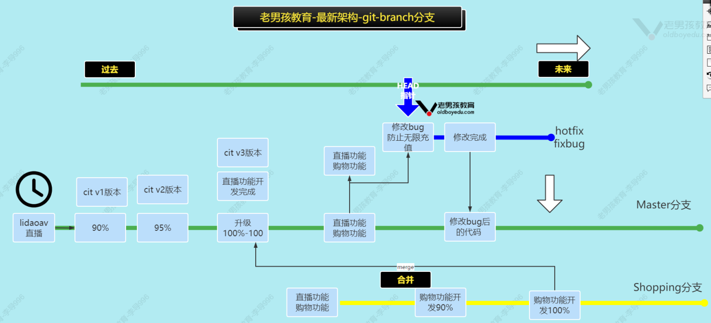

## 3.3.2 分支创建与合并案例

1、查看当前项目拥有的分支，默认master主分支

```shell
[root@devops01 /app/gitest/project01]#git branch 
* master
[root@devops01 /app/gitest/project01]#ls
index.html
```

2、创建shopping分支

```shell
[root@devops01 /app/gitest/project01]#git branch shopping
[root@devops01 /app/gitest/project01]#git branch 
* master
  shopping
```

3、切换到shopping分支

```shell
[root@devops01 /app/gitest/project01]#git checkout shopping
Switched to branch 'shopping'
[root@devops01 /app/gitest/project01]#git branch 
  master
* shopping
```

4、在shopping分支书写代码并提交

```shell
[root@devops01 /app/gitest/project01]#echo shopping>shopping.index
[root@devops01 /app/gitest/project01]#ls
index.html  shopping.index
[root@devops01 /app/gitest/project01]#git add .
[root@devops01 /app/gitest/project01]#git commit -m '添加shopping.index文件'
[shopping 2832f59] 添加shopping.index文件
 1 file changed, 1 insertion(+)
 create mode 100644 shopping.index
```

5、shopping分支合并到master分支中

```shell
# 确认shopping分支中的文件
[root@devops01 /app/gitest/project01]#ls
index.html  shopping.index

# 切换到master分支
[root@devops01 /app/gitest/project01]#git checkout master
Switched to branch 'master'
[root@devops01 /app/gitest/project01]#ls
index.html

# 合并
[root@devops01 /app/gitest/project01]#git merge shopping
Updating 54f7721..2832f59
Fast-forward
 shopping.index | 1 +
 1 file changed, 1 insertion(+)
 create mode 100644 shopping.index
 
 # master分支中出现shopping分支的代码
[root@devops01 /app/gitest/project01]#ls
index.html  shopping.index
```

查看日志

```shell
[root@devops01 /app/gitest/project01]#git log
commit 2832f59c1dd920742751815c785722510e7bdc89
Author: gs <724262366@qq.com>
Date:   Tue Jul 9 14:18:24 2024 +0800

    添加shopping.index文件

commit 54f77216ffb1033b47db7d187b49e6361b742691
Author: gs <724262366@qq.com>
...
```

### 3.3.2 小结

| git 分支相关命令      |                                              |
| --------------------- | -------------------------------------------- |
| git branch            | 查看分支                                     |
| git branch name       | 创建分支                                     |
| git branch -d name    | 删除分支                                     |
| git checkout 分支名字 | 切换分支                                     |
| git merge 分支名字    | 合并(吸收)分支(把指定的分支合并到当前分支中) |
| git checkout -b name  | 创建分支并切换到这个分支                     |


## 3.4 Git远程仓库

### 3.4.1 Github的连接与使用

就是Github的用法，跳过

### 3.4.2 Git tag打标签

使用场景：commit太长不好记，可以给每个commit加上tag标签

```shell
#创建标签
COMMIT ID的一个别名,COMMIT ID不好记忆, 标签相对的好记忆.
git tag -a "标签名称" -m "描述"

基于当前最新的COMMITID
git tag -a "标签名称" -m "描述"
commitID 指定版本打标签

#如何上传标签
git push origin --tags
git push origin "标签名称"
Master: V1.0 V2.0
Dev: b1.0 b2.0
git clone -b 标签、分支 https/git
```


### 3.4.3 gitignore文件

作用：上传代码的时候，代码中可能包含临时文件cache .swp等，需要排除

使用方法：在代码根目录中创建文件.gitignore 写上要排除的内容  

```shell
$ cat .gitignore
#*.jpg
*.tmp
cache/*
```


# 四、Gitlab

## 4.1 gitlab概述

私有代码仓库

精细化权限配置,让系统更安全

控制用户/用户组是否可以提交到主分支 (PR Push Request)

它使用Ruby语言写成。后来，一些部分用Go语言重写  


## 4.2 Gitlab vs Github/Gitee  

| Gitlab | Github/Gitee                                   |                                             |
| ------ | ---------------------------------------------- | ------------------------------------------- |
| 共同点 | 存放代码,git访问                               | 存放代码,git访问                            |
| 不同点 | 精确化控制权限 全面安全措施 定时备份 升级 迁移 | 使用权限,用户管理比较弱,无法做到精细化权限. |


## 4.3 Gitlab 应用场景  

- 开源免费,搭建简单,维护成本低,符合中小公司口味 
- 权限管理,实现代码对部分人可见,安全性高
- 离线同步  


## 4.4 快速上手

版本选择：

- ce community edition 社区版
- ee enterprice edition 企业版  


步骤总览

1. 安装Gitlab依赖包
2. 下载,安装
3. 配置,访问域名
4. 初始化,启动
5. 访问  


### 4.4.1 安装要求

```shell
#系统要求
Ubuntu (16.04/18.04/20.04)
Debian (9/10)
CentOS (7/8)
openSUSE Leap (15.2)
SUSE Linux Enterprise Server (12 SP2/12 SP5)
Red Hat Enterprise Linux (please use the CentOS
packages and instructions)

#硬件要求
## 磁盘空间
存放代码,比代码空间大
7.2k以上的磁盘 sas ssd

## CPU
4 核心 500用户
8 核心 1000用户

## 内存
4 G内存 500用户
8 G内存 1000用户
```


### 4.4.2 安装gitlab组件

获取安装包：https://packages.gitlab.com/gitlab/gitlab-ce

```shell
[root@devops01 /app/gitest/rpms]#ls
gitlab-ce-16.6.8-ce.0.el7.x86_64.rpm
```

安装

```shell
[root@devops01 /app/gitest/rpms]#yum localinstall -y ./gitlab-ce-16.6.8-ce.0.el7.x86_64.rpm 
```


### 4.4.3 配置访问URL

修改配置文件内容，配置访问URL

>修改前先备份

```shell
[root@devops01 /etc/gitlab]#vim gitlab.rb
...
external_url 'http://gitlab.test.cn'
...
```


### 4.4.4 初始化Gitlab

```shell
#使用gitlab.rb文件生成子配置文件
gitlab-ctl reconfigure
#重启所有gitlab相关文件.
gitlab-ctl restart
# 查看状态
gitlb-ctl status
```

注意，在reconfigure后，会有提示默认的账号密码

```shell
Notes:
Default admin account has been configured with following details:
Username: root
Password: You didn't opt-in to print initial root password to STDOUT.
Password stored to /etc/gitlab/initial_root_password. This file will be cleaned up in first reconfigure run after 24 hours.
```


### 4.4.5 登录与查看

浏览器访问：http://10.0.0.71/users/sign_in

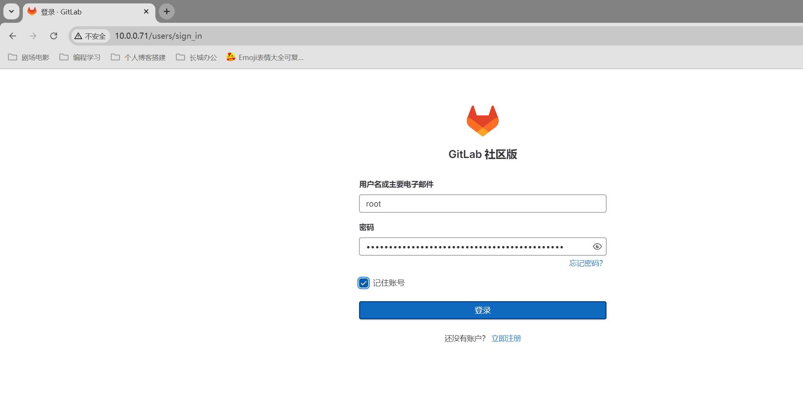

登陆后的界面

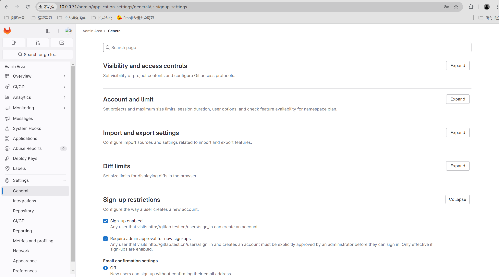


### 4.4.6 汉化

头像 ---> perferances

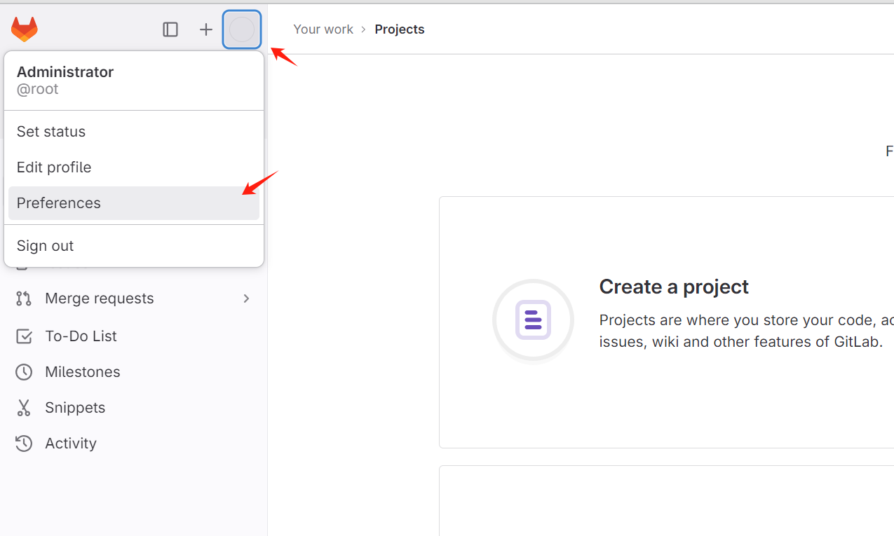

在语言项，改为中文

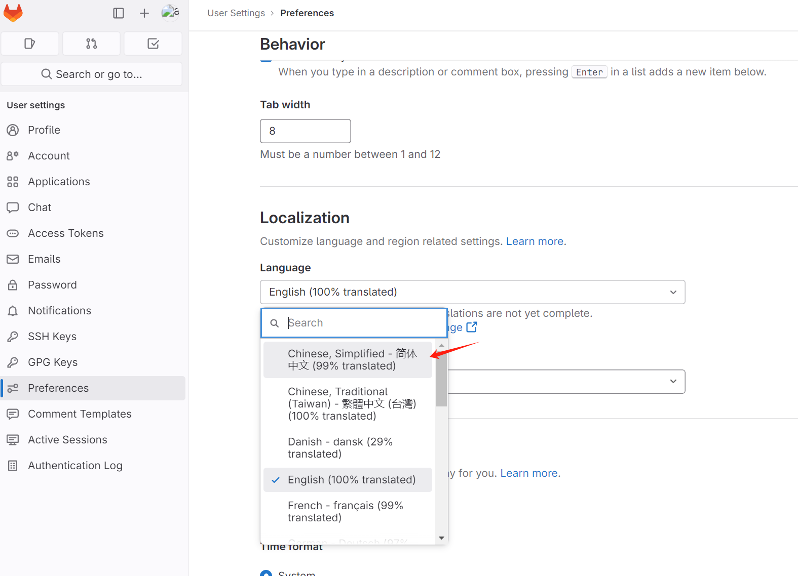

保存后，重新加载页面生效

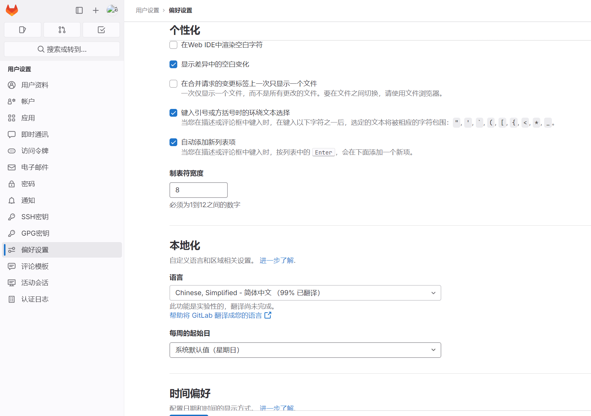


### 4.4.7 设置密码

进入“密码”设置页，可以重新设置密码

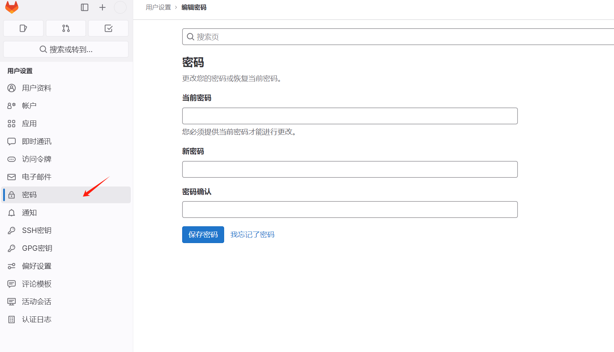


### 4.4.8 重置密码

如果密码忘记了，可以按以下方法重置密码

```shell
gitlab-rake "gitlab:password:reset"

[root@devops01 /etc/gitlab]#gitlab-rake "gitlab:password:reset"
Enter username: root
Enter password: 
Confirm password: 
```


### 4.4.9 删除gitlab

删除步骤：

- 删除rpm包
- /var/opt/gitlab /opt/gitlab/ 2个目录删除.
- 备份内核参数配置 `/opt/gitlab/embedded/etc/*-gitlab-*.conf`

如果需要重新安装，待安装完成后，覆盖回去上面几个conf即可  


### 4.4.10 500和502错误

一般是需要等待，gitlab启动较慢造成的，检查资源是否够用  

如果遇到500错误，可以尝试以下操作

```shell
gitlab-rake db:migrate
gitlab-ctl reconfigure
gitlab-ctl restart
```


## 4.5 Gitlab的用户和组

### 4.5.1 用户和组的关系

Gitlab用户、用户组、项目/仓库的关系


### 4.5.2 应用案例

流程概览：

- 创建dev开发组
- 创建用户gs，添加到dev开发组中
- 创建1个项目live_ app，与dev开发组关联

#### 4.5.2.1 创建用户组dev

新建群组

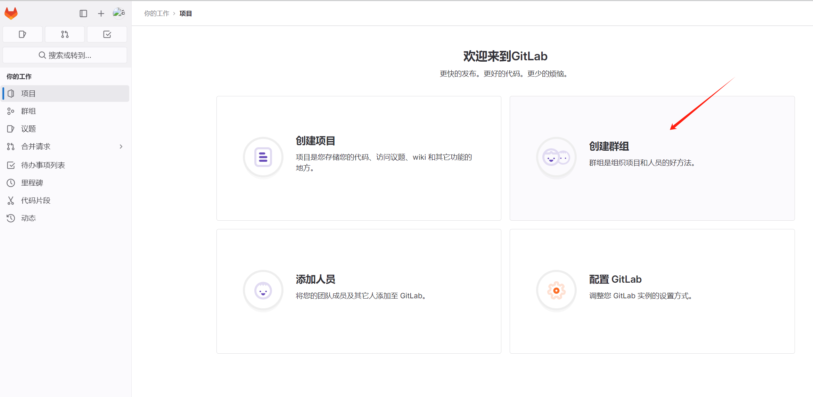

填写信息

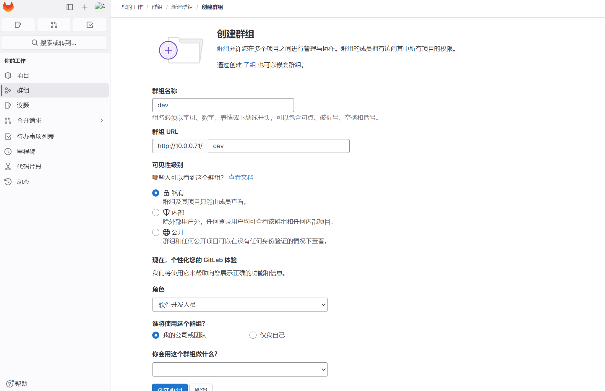


#### 4.5.2.2 创建用户gs

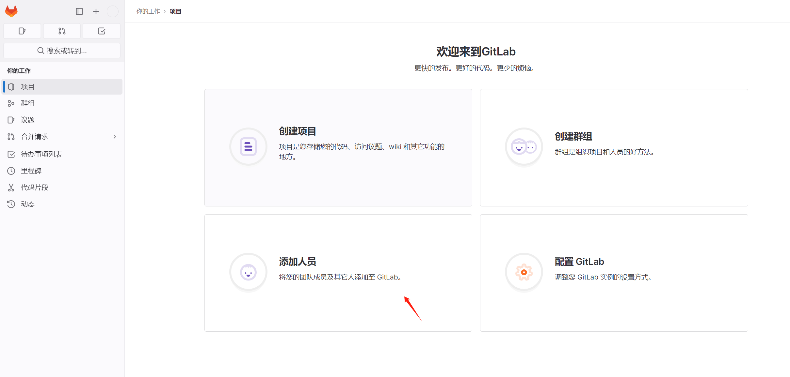

填写信息

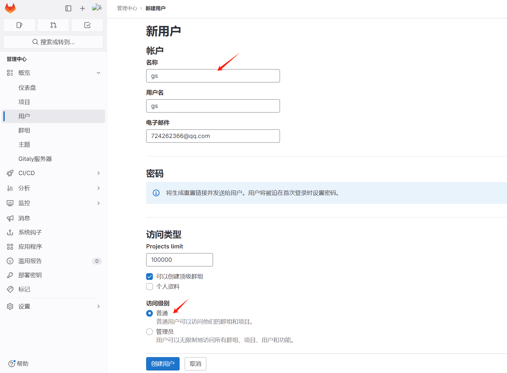


#### 4.5.2.3 将用户加到群组

进入群组，管理权限设置

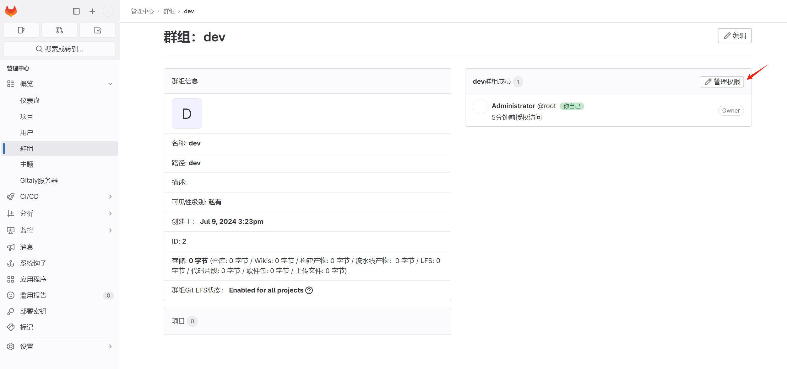

点击“邀请成员”，邀请gs，角色选择owner

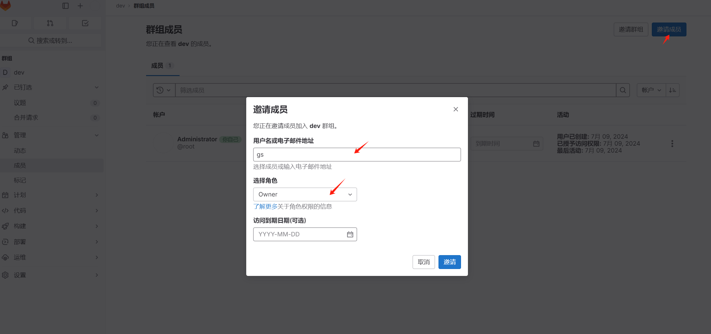

添加成功

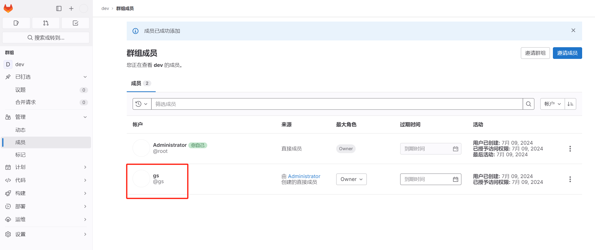


#### 4.5.2.4 新建项目

首页--创建项目

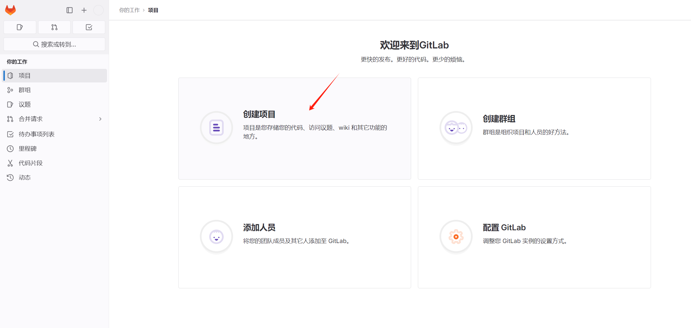

创建空白项目，填写信息

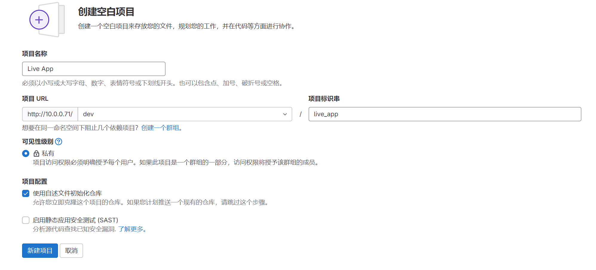

创建完成，查看项目信息，确保与dev组关联

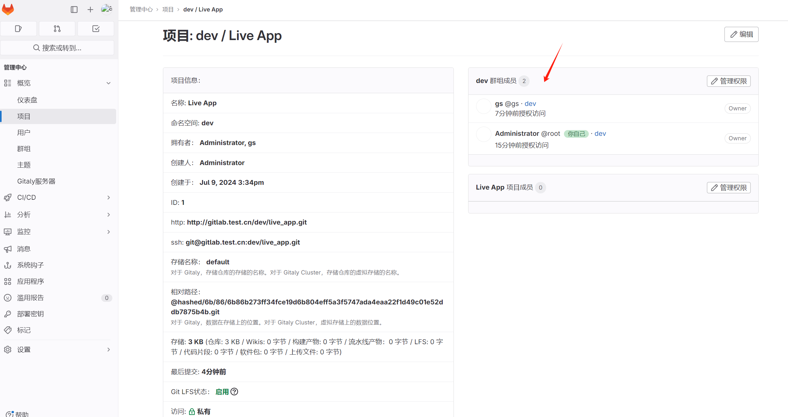


#### 4.5.2.5 测试推送代码

登录上面的gs用户,然后配置密钥认证(流程类似于github)

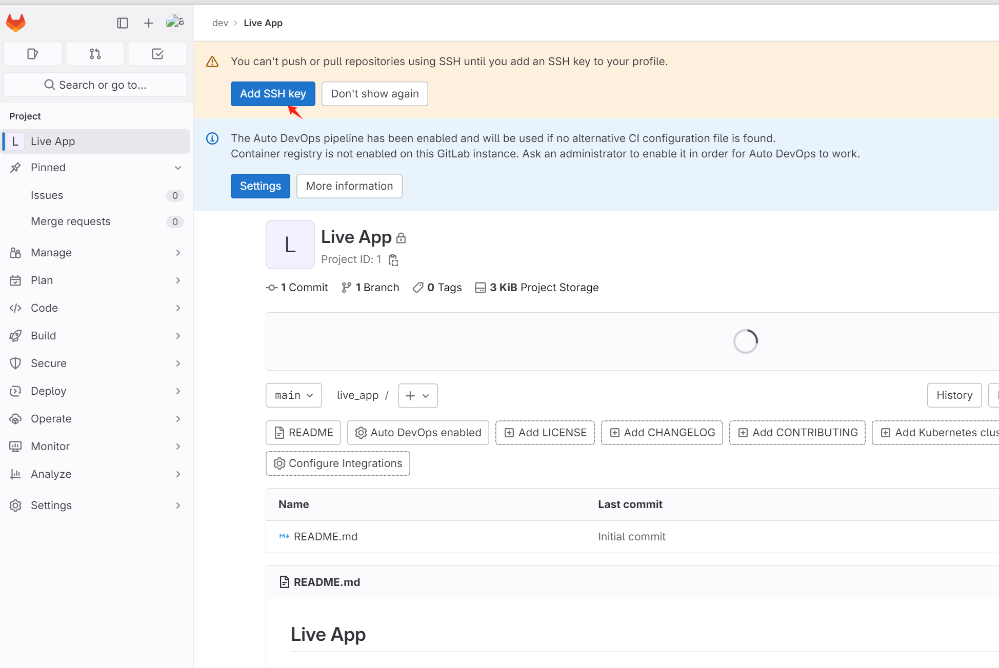

添加完ssh key

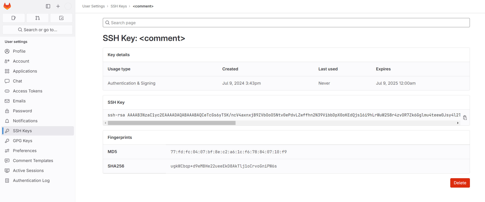

推送代码

```shell
#推送现有的 Git 仓库
cd /app/code/live-app/
#重命名已有的仓库
git remote rename origin old-origin
#添加新的仓库地址
git remote add origin git@10.0.0.71:dev/live_app.git
#推送所有分支
git push -u origin --all
#推送所有标签
git push -u origin --tags


[root@devops01 /app/gitest/project01]#git remote add origin git@10.0.0.71:/dev/live_app.git
[root@devops01 /app/gitest/project01]#git push -u origin --all
The authenticity of host '10.0.0.71 (10.0.0.71)' can't be established.
ECDSA key fingerprint is SHA256:OVpquCehSKXH4UACbiezs1feEbgyswAvmfM0c1jFOww.
ECDSA key fingerprint is MD5:00:f4:c5:99:88:a5:d9:f3:5d:fa:65:d4:57:bd:39:a3.
Are you sure you want to continue connecting (yes/no)? yes
Warning: Permanently added '10.0.0.71' (ECDSA) to the list of known hosts.
Counting objects: 9, done.
Compressing objects: 100% (5/5), done.
Writing objects: 100% (9/9), 773 bytes | 0 bytes/s, done.
Total 9 (delta 0), reused 0 (delta 0)
...
```

查看web页面仓库，推送成功

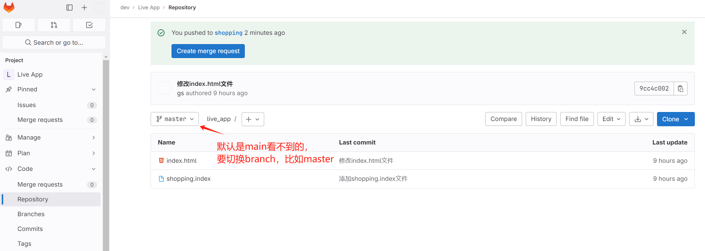


## 4.6 Gitlab的备份与恢复