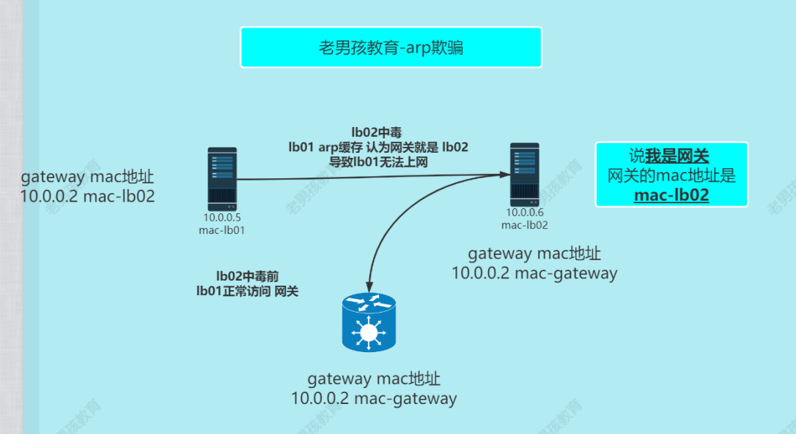
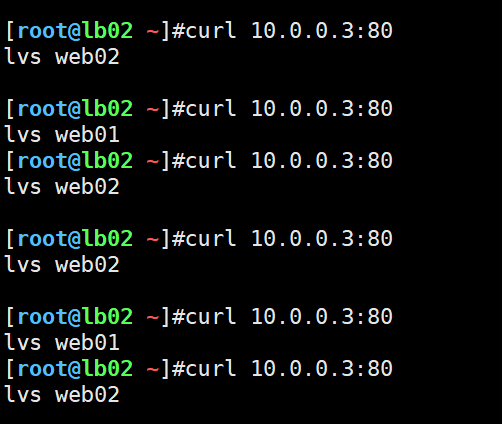

# Devops架构-Jenkins-04

今日内容：

- LVS负载均衡
- 加密通信隧道
- JumpServer

# 一、负载均衡介绍

## 1.1 常见负载均衡对比

| 常见负载均衡对比             | 优势                                                         | 缺点                                                         |
| ---------------------------- | ------------------------------------------------------------ | ------------------------------------------------------------ |
| 硬件：如F5负载均衡           | 性能好、购买有技术支持                                       | 价格昂贵，且一次需要购买2台凑成1对。                         |
| LVS                          | 工作在4层，效率极其高                                        | 需要部署维护(运维成本较高)                                   |
| Nginx/Tengine/Openresty(lua) | 使用简单，支持4层(1.9版本后支持)和7层负载均衡、反向代理、缓存、流量镜像(mirror) | 处理数据为 “代理模式”，即替用户去查找，找到后发送给用户。在并发较大(1w以 上)时会卡 |
| Haproxy                      | 相对复杂 支持4层和7层 反向代理 动态加载配置文件.             | 处理数据为“代理模式”，并发较大(1w以上，但比nginx多) 时会卡   |
| 云服务：如clb(slb)           | 支持4层和7层                                                 | 只能支持url或者域名的转发                                    |
| ALB                          | 支持更多的7层的转发功能 ，如基于用户请求头 http_user_agent、用户语言、 镜像流量(申请,深圳) | 只支持7层负载均衡                                            |

四层负载均衡和七层负载均衡的对比：

- 四层负载均衡：在传输层，负载均衡最多到端口级别
- 七层负载均衡，在应用层，URL、URI 转发、HTTP HTTPS


## 1.2 反向代理和负载均衡的区别

反向代理：Nginx / Haproxy做**代理**，代替用户找，找到后发给用户

负载均衡：VS对数据进行**转发**


## 1.3 ARP地址解析

DNS域名解析：域名 解析成 IP

ARP地址解析：IP 解析成  Mac地址


### 1.3.1 ARP欺骗




# 二、LVS快速上手

## 2.1 LVS概述

LVS的工作模式：

- DR 模式
- NAT 模式
- TUN隧道模式
- FLL NAT 完全NAT模式

关键词：

| 名称     | 单词          | 含义                              |
| -------- | ------------- | --------------------------------- |
| CIP      | client ip     | 客户端ip地址                      |
| VIP      | Virtual ip    | 虚拟ip                            |
| DIP      | director ip   | 负载均衡本身的ip                  |
| RS服务器 | real server   | 真实服务器 处理用户请求.          |
| RIP      | Real erver IP | real server ip 真实服务器的ip地址 |


## 2.2 LVS-DR模式上手

### 2.2.1 环境准备

| 主机  | 作用        | 真实ip   | 虚拟IP（vip）    |
| ----- | ----------- | -------- | ---------------- |
| lb01  | LVS主服务器 | 10.0.0.5 | 10.0.0.3         |
| web01 | nginx-01    | 10.0.0.7 | 数据转向10.0.0.3 |
| web02 | nginx-02    | 10.0.0.8 | 数据转向10.0.0.3 |

### 2.2.2 前提处理

1、web01和web02准备站点

```shell
# 站点文件 
[root@web01 /server/code/lvs]#cat index.html 
lvs web01
[root@web02 ~]#cat /server/code/lvs/index.html 
lvs web02

# Nginx虚拟主机，web01/02相同
[root@web02 ~]#cat /etc/nginx/conf.d/lvs.test.cn.conf 
server {
  listen 80;
  server_name lvs.test.cn;
  root /server/code/lvs;
  location / {
    index index.html;
  }
}

# 重启服务,设置HOSTS，并测试
[root@web01 /etc/nginx/conf.d]#curl -H Host:lvs.test.cn 10.0.0.7
lvs web01
[root@web02 ~]#curl -H Host:lvs.test.cn 10.0.0.8
lvs web02
```

2、lb01和lb02关闭不需要的服务，安装LVS

```shell
# 关闭keepalived和nginx，防止影响负载均衡
[root@lb01 ~]#systemctl stop keepalived nginx
[root@lb01 ~]#systemctl disable keepalived nginx

# 安装LVS
[root@lb01 ~]#yum install -y ipvsadm

# 检查模块是否已加载
[root@lb01 ~]#lsmod | grep ip_vs
ip_vs                 145458  0 
nf_conntrack          139264  1 ip_vs
libcrc32c              12644  3 xfs,ip_vs,nf_conntrack
```


### 2.2.3 DR模式配置流程

#### 2.2.3.1 LVS服务器配置

1、手动添加VIP，后面是由Keepalived生成（需先把网卡名改成eth0）

```shell
[root@lb01 ~]#ifconfig eth0:0 10.0.0.3 netmask 255.255.255.0
```

永久保存

```shell
[root@lb01 /etc/sysconfig/network-scripts]#cat ifcfg-eth0:0
DEVICE=eth0:0
IPADDR=10.0.0.3
NETMASK=255.255.255.0
ONBOOT=yes
NAME=eth0:0
```

2、添加规则 (类似于nginx的upstream)

```shell
ipvsadm -A -t 10.0.0.3:80 -s wrr
#-A --add-service 创建池塘
#-t --tcp-service tcp协议
# 10.0.0.3:80 组名称
# -s scheduler 轮询算法 wrr weight 加权轮询 rrlc wlc
# -p persistent 会话保持时间（时间别设置太长，不然测试xiao'guo）
```

3、添加规则（类似于向upstream中添加server）

```shell
ipvsadm -a -t 10.0.0.3:80 -r 10.0.0.7:80 -g -w 1
ipvsadm -a -t 10.0.0.3:80 -r 10.0.0.8:80 -g -w 2

# -a 添加 rs服务器
# -t tcp协议
# -r 指定rs服务器ip
# -g --gatewaying dr模式 默认的
# -w 权重
```

>类似于使用Nginx配置负载均衡
>
>```shell
>upstream web_pools {
>	server 10.0.0.7:80;
>	server 10.0.0.8:80;
>}
>server {
>	location / {
>		proxy_pass http://web_pools;
>	} 
>}
>```

4、查看LVS规则

```shell
[root@lb01 ~]#ipvsadm
# 或者
[root@lb01 ~]#ipvsadm -ln
```


#### 2.2.3.2 后端web服务器配置

1、lo网卡绑定

```shell
[root@web01 /etc/nginx/conf.d]#ifconfig lo:1 10.0.0.3 netmask 255.255.255.255  
```

永久保存

```shell
[root@web01 /etc/nginx/conf.d]#cat /etc/sysconfig/network-scripts/ifcfg-lo:1
DEVICE=lo:1
IPADDR=10.0.0.3
NETMASK=255.255.255.255
ONBOOT=yes
NAME=loopback
```

重启网络并查看

```shell
[root@web01 /etc/nginx/conf.d]#systemctl restart network
[root@web01 /etc/nginx/conf.d]#ip a s lo
1: lo: <LOOPBACK,UP,LOWER_UP> mtu 65536 qdisc noqueue state UNKNOWN group default qlen 1000
    link/loopback 00:00:00:00:00:00 brd 00:00:00:00:00:00
    inet 127.0.0.1/8 scope host lo
       valid_lft forever preferred_lft forever
    inet 10.0.0.3/32 brd 10.0.0.3 scope global lo:1
       valid_lft forever preferred_lft forever
    inet6 ::1/128 scope host 
       valid_lft forever preferred_lft forever
```

2、抑制ARP解析

```shell
cat >>/etc/sysctl.conf<<EOF
net.ipv4.conf.all.arp_ignore = 1
net.ipv4.conf.all.arp_announce = 2
net.ipv4.conf.lo.arp_ignore = 1
net.ipv4.conf.lo.arp_announce = 2
EOF

# 查看
[root@web01 /etc/nginx/conf.d]#sysctl -p
net.ipv4.conf.all.arp_ignore = 1
net.ipv4.conf.all.arp_announce = 2
net.ipv4.conf.lo.arp_ignore = 1
net.ipv4.conf.lo.arp_announce = 2
```


#### 2.2.3.3 测试

多次访问http://10.0.0.3:80，应该指向不同的web服务端




### 2.2.4 LVS规则的备份和恢复

1、保存配置和还原

```shell
# 导出配置
ipvsadm-save -n >/root/ipvs.txt
# 还原配置
ipvsadm-restore </root/ipvs.txt
```

2、清空LVS规则，记得清空前备份

```shell
[root@lb01 ~]#ipvsadm -C
```


## 2.3 LVS与keepalived结合

### 2.3.1 环境准备

| 主机  | 作用        | 真实ip   | 虚拟IP（vip）    |
| ----- | ----------- | -------- | ---------------- |
| lb01  | LVS主服务器 | 10.0.0.5 | 10.0.0.3         |
| lb01  | LVS备服务器 | 10.0.0.6 | 10.0.0.3         |
| web01 | nginx-01    | 10.0.0.7 | 数据转向10.0.0.3 |
| web02 | nginx-02    | 10.0.0.8 | 数据转向10.0.0.3 |

```shell
                              |
             +----------------+-----------------+
             |                                  |
10.0.0.5     |----       VIP:10.0.0.3       ----|     10.0.0.6
     +-------+--------+                +--------+-------+
     | 	    DS1       |                |       DS2      |
     | LVS+Keepalived |                | LVS+Keepalived |
     +-------+--------+                +--------+-------+
             |			                |
             +----------------+-----------------+
                              |
  +------------+              |               +------------+
  |     RS1    |10.0.0.7      |       10.0.0.8|     RS2    |
  | Web Server +--------------+---------------+ Web Server |
  +------------+                              +------------+
```


### 2.3.2 DS服务器配置

#### 1）DS1配置LVS+Keepalived

> 配置前，先清空LVS的规则和eth0:0接口，因为keepalived会自动创建

```shell
cat /etc/keepalived/keepalived.conf
! Configuration File for keepalived

global_defs {
  router_id LVS_DEVEL
}


vrrp_instance VI_1 {
    state MASTER            # 两个 DS，一个为 MASTER 一个为 BACKUP
    interface eth0        # 当前 IP 对应的网络接口，通过 ifconfig 查询
    virtual_router_id 62    # 虚拟路由 ID(0-255)，在一个 VRRP 实例中主备服务器 ID 必须一样
    priority 200            # 优先级值设定：MASTER 要比 BACKUP 的值大
    advert_int 1            # 通告时间间隔：单位秒，主备要一致
    authentication {        # 认证机制，主从节点保持一致即可
        auth_type PASS
        auth_pass 1111
    }
    virtual_ipaddress {
        10.0.0.3       # VIP，可配置多个
    }
}

# LB 配置
virtual_server 10.0.0.3 80  {
    delay_loop 3                    # 设置健康状态检查时间
    lb_algo rr                      # 调度算法，这里用了 rr 轮询算法
    lb_kind DR                      # 这里测试用了 Direct Route 模式
    persistence_timeout 50          # 持久连接超时时间
    protocol TCP
    real_server 10.0.0.7 80 {
        weight 1
        TCP_CHECK {
            connect_timeout 10　　　
            retry 3　　　　　　      # 旧版本为 nb_get_retry 
            delay_before_retry 3　　　
            connect_port 80
        }
    }
    real_server 10.0.0.8 80 {
        weight 1
        TCP_CHECK {
            connect_timeout 10
            retry 3
            delay_before_retry 3
            connect_port 80
        }
    }
}
```


#### 2）DS2配置LVS+Keepalived

把配置文件中的`MASTER`改为`BACKUP`即可


### 2.3.3 RS服务器配置

两台服务器参考`2.2.3.2`章节配置即可


### 2.3.4 测试

#### 1） keepalived的主备切换

启动服务后，默认lb01是主，并且有生成10.0.0.3的网络接口

```shell
[root@lb01 /etc/sysconfig/network-scripts]#systemctl status keepalived.service 
● keepalived.service - LVS and VRRP High Availability Monitor
...
Aug 20 16:43:06 lb01 Keepalived_vrrp[5888]: Sending gratuitous ARP on eth0 for 10.0.0.3
Aug 20 16:43:11 lb01 Keepalived_vrrp[5888]: VRRP_Instance(VI_1) Sending/queueing gratuitous ARPs on eth0 for 10.0.0.3
...
```

lb02为备，不生成10.0.0.3网络接口

```shell
[root@lb02 ~]#systemctl status keepalived.service 
● keepalived.service - LVS and VRRP High Availability Monitor
...
Aug 20 16:43:06 lb02 Keepalived_vrrp[5049]: VRRP_Instance(VI_1) Entering BACKUP STATE
...
```

关闭lb01的keepalived服务，手动造成故障

```shell
[root@lb01 /etc/sysconfig/network-scripts]#systemctl stop keepalived.service 
```

lb02切换为主，验证成功

```shell
[root@lb02 ~]#systemctl status keepalived.service 
● keepalived.service - LVS and VRRP High Availability Monitor
...
Aug 20 16:55:14 lb02 Keepalived_vrrp[5162]: VRRP_Instance(VI_1) Transition to MASTER STATE
Aug 20 16:55:15 lb02 Keepalived_vrrp[5162]: Sending gratuitous ARP on eth0 for 10.0.0.3
Aug 20 16:55:15 lb02 Keepalived_vrrp[5162]: VRRP_Instance(VI_1) Sending/queueing gratuitous ARPs on eth0 for 10.0.0.3
Aug 20 16:55:15 lb02 Keepalived_vrrp[5162]: Sending gratuitous ARP on eth0 for 10.0.0.3
```


#### 2） LVS的负载均衡测试

访问http://10.0.0.3:80，可见访问web01和web02循环。

查看LVS规则流量信息，确保两条路都有流量，验证成功

```shell
[root@lb01 /etc/sysconfig/network-scripts]#ipvsadm -ln --stats
IP Virtual Server version 1.2.1 (size=4096)
Prot LocalAddress:Port               Conns   InPkts  OutPkts  InBytes OutBytes
  -> RemoteAddress:Port
TCP  10.0.0.3:80                         8      132        0    34840        0
  -> 10.0.0.7:80                         4       90        0    24476        0
  -> 10.0.0.8:80                         4       42        0    10364        0
```


# 二、加密隧道服务

## 2.1 应用场景

两点之间如何传输数据最安全？

- 方案1：铺设专线，成本高昂
- 方案2：使用硬件3层路由、硬件VPN设备（如深信服VPN）
- 方案3：使用公有云等商业产品，通过网络传输
- 方案4：使用开源软件搭建VPN（如OpenVPN）

加密隧道服务即是其中的方案4，OpenVPN有如下应用场景：

- 运营：通过OpenVPN实现网站安全登录（后台地址，设置为只能通过VPN登录）
- 开发：通过OpenVPN实现开发与测试人员连接网站，进行开发测试
- 运维：通过OpenVPN连接内网服务器进行管理

