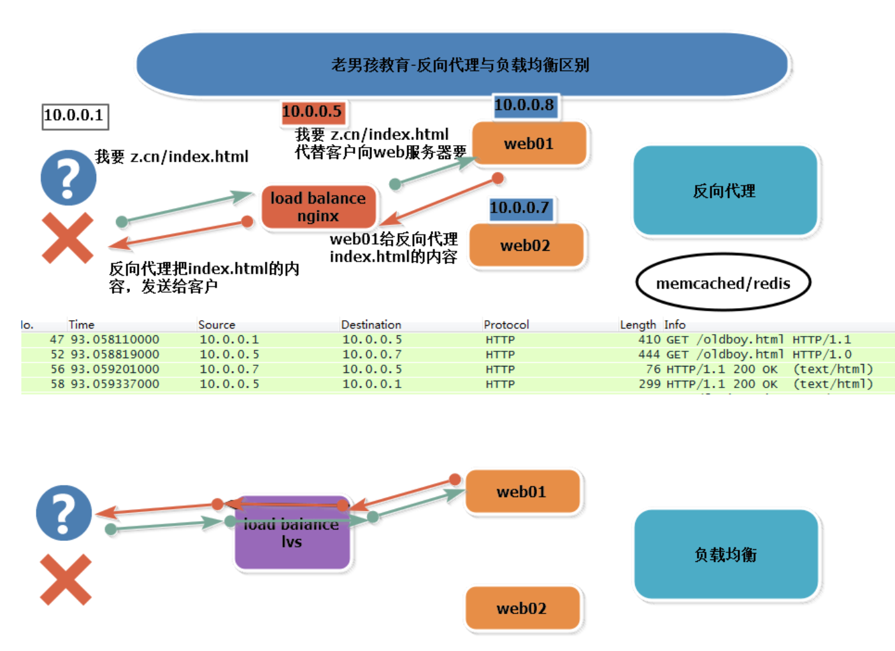

# Devops架构-Jenkins-04

今日内容：

- LVS负载均衡
- 加密通信隧道
- JumpServer

# 一、负载均衡介绍

## 1.1 常见负载均衡对比

| 常见负载均衡对比             | 优势                                                         | 缺点                                                         |
| ---------------------------- | ------------------------------------------------------------ | ------------------------------------------------------------ |
| 硬件：如F5负载均衡           | 性能好、购买有技术支持                                       | 价格昂贵，且一次需要购买2台凑成1对。                         |
| LVS                          | 工作在4层，效率极其高                                        | 需要部署维护(运维成本较高)                                   |
| Nginx/Tengine/Openresty(lua) | 使用简单，支持4层(1.9版本后支持)和7层负载均衡、反向代理、缓存、流量镜像(mirror) | 处理数据为 “代理模式”，即替用户去查找，找到后发送给用户。在并发较大(1w以 上)时会卡 |
| Haproxy                      | 相对复杂 支持4层和7层 反向代理 动态加载配置文件.             | 处理数据为“代理模式”，并发较大(1w以上，但比nginx多) 时会卡   |
| 云服务：如clb(slb)           | 支持4层和7层                                                 | 只能支持url或者域名的转发                                    |
| ALB                          | 支持更多的7层的转发功能 ，如基于用户请求头 http_user_agent、用户语言、 镜像流量(申请,深圳) | 只支持7层负载均衡                                            |

四层负载均衡和七层负载均衡的对比：

- 四层负载均衡：在传输层，负载均衡最多到端口级别
- 七层负载均衡，在应用层，URL、URI 转发、HTTP HTTPS


## 1.2 反向代理和负载均衡的区别

反向代理：Nginx / Haproxy做**代理**，代替用户找，找到后发给用户

负载均衡：VS对数据进行**转发**



## 1.3 ARP地址解析

DNS域名解析：域名 解析成 IP

ARP地址解析：IP 解析成  Mac地址


### 1.3.1 ARP欺骗


# 二、LVS快速上手

## 2.1 LVS概述

LVS的工作模式：

- DR 模式
- NAT 模式
- TUN隧道模式
- FLL NAT 完全NAT模式

关键词：

| 名称     | 单词          | 含义                              |
| -------- | ------------- | --------------------------------- |
| CIP      | client ip     | 客户端ip地址                      |
| VIP      | Virtual ip    | 虚拟ip                            |
| DIP      | director ip   | 负载均衡本身的ip                  |
| RS服务器 | real server   | 真实服务器 处理用户请求.          |
| RIP      | Real erver IP | real server ip 真实服务器的ip地址 |


## 2.2 LVS-DR模式上手

### 2.2.1 环境准备

| 主机  | 服务  | ip       |
| ----- | ----- | -------- |
| lb01  | lvs   | 10.0.0.5 |
| vip   | vip   | 10.0.0.3 |
| lb02  |       | 10.0.0.6 |
| web01 | nginx | 10.0.0.7 |
| web02 | nginx | 10.0.0.8 |


### 2.2.2 前提处理

1、web01和web02准备站点

```shell
# 站点文件 
[root@web01 /server/code/lvs]#cat index.html 
lvs web01
[root@web02 ~]#cat /server/code/lvs/index.html 
lvs web02

# Nginx虚拟主机，web01/02相同
[root@web02 ~]#cat /etc/nginx/conf.d/lvs.test.cn.conf 
server {
  listen 80;
  server_name lvs.test.cn;
  root /server/code/lvs;
  location / {
    index index.html;
  }
}

# 重启服务,设置HOSTS，并测试
[root@web01 /etc/nginx/conf.d]#curl -H Host:lvs.test.cn 10.0.0.7
lvs web01
[root@web02 ~]#curl -H Host:lvs.test.cn 10.0.0.8
lvs web02
```

2、lb01和lb02关闭不需要的服务，安装LVS

```shell
# 关闭keepalived和nginx，防止影响负载均衡
[root@lb01 ~]#systemctl stop keepalived nginx
[root@lb01 ~]#systemctl disable keepalived nginx

# 安装LVS
[root@lb01 ~]#yum install -y ipvsadm

# 检查模块是否已加载
[root@lb01 ~]#lsmod | grep ip_vs
ip_vs                 145458  0 
nf_conntrack          139264  1 ip_vs
libcrc32c              12644  3 xfs,ip_vs,nf_conntrack
```


### 2.2.3 DR模式配置流程

#### 2.2.3.4 LVS服务端配置

1、手动添加VIP，后面是由Keepalived生成

```shell

```

