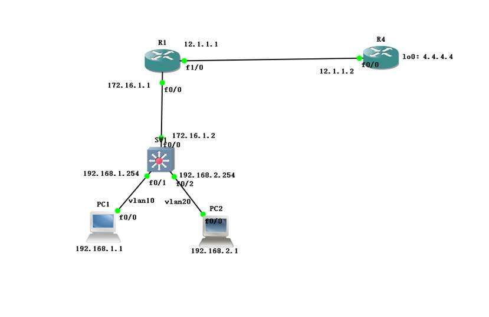

# ACL 访问控制列表

# 一、作用：

允许或拒绝某些流量来访问或者经过我

过滤+抓取路由


# 二、分类

 1.标准的ACL

2.扩展的ACL

3.命名的ACL

4.基于时间的ACL

 

# 三、详解

标准的ACL

- 编号为：1-99、1300-1999
- 只检测源IP地址
- 尽量靠近目标
- 默认有一条拒绝所有

 

扩展的ACL

- 编号为：100-199，2000-2699

- 检查SIP（源IP）、DIP（目标IP）、SP（源端口）、DP（目的端口）、协议号（如ICMP）

- 尽量靠近源目标

- 默认拒绝所有

  

命名的ACL

- 标准/扩展ACL有个致命的缺点 1000条删掉其中一条，其余999条也没了
- 命名的ACL的好处，删掉一条就一条，其余不动

 

基于时间的ACL

- 限定几点到几点可以上网

 

 

# 四、实验拓扑

拓扑图：

# 五、配置命令

## 5.1 常规配置：

PC1配置：

```shell
PC1(config)#no ip routing //关闭PC路由功能
PC1(config)#int f0/0 
PC1(config-if)#ip add 192.168.1.1 255.255.255.0 //配置端口IP地址和子网掩码
PC1(config-if)#no shu //端口不关闭
PC1(config-if)#exit
```

PC2配置：

```shell
PC2(config)#no ip routing
PC2(config)#int f0/0
PC2(config-if)#ip add 192.168.2.1 255.255.255.0
PC2(config-if)#no shu
PC2(config-if)#exit
```

SW1配置：

```shell
SW1(config)#int f0/0
SW1(config-if)#no switchport //关闭交换机功能，思科私有
SW1(config-if)#ip add 172.16.1.2 255.255.255.0 //配置IP地址和子网掩码
SW1(config-if)#no shu
SW1(config-if)#end

SW1#vlan database //进入配置vlan
SW1(vlan)#vlan 10  
SW1(vlan)#vlan 20 //划分vlan
SW1(vlan)#exit

SW1(config)#int f0/1
SW1(config-if)#switchport mode access 
SW1(config-if)#switchport access vlan 10 //将f0/1分入vlan10
SW1(config-if)#exit
SW1(config)#int f0/2
SW1(config-if)#switchport mode access 
SW1(config-if)#switchport access vlan 20 //将f0/2分入vlan20
SW1(config-if)#exit

SW1(config)#int vlan 10
SW1(config-if)#ip add 192.168.1.254 255.255.255.0 //配置vlan10 网关
SW1(config-if)#no shu
SW1(config-if)#exit

SW1(config)#int vlan 20
SW1(config-if)#ip add 192.168.2.254 255.255.255.0 //配置vlan20 网关
SW1(config-if)#no shu
SW1(config-if)#exit

SW1(config)#ip route 0.0.0.0 0.0.0.0 172.16.1.1 //实现路由
```


R1配置：

```shell
R1(config)#int f1/0
R1(config-if)#ip add 12.1.1.1 255.255.255.0
R1(config-if)#no sh
R1(config-if)#exit
R1(config)#int f0/0
R1(config-if)#ip add 172.16.1.1 255.255.255.0
R1(config-if)#no shu
R1(config-if)#exit

R1(config)#ip route 4.4.4.0 255.255.255.0 12.1.1.2
R1(config)#ip route 192.168.1.0 255.255.255.0 172.16.1.2
R1(config)#ip route 192.168.2.0 255.255.255.0 172.16.1.2 //实现路由


R1(config)#line vty 0 4 //配置端口0-4
R1(config-line)#privilege level 15 //允许最高等级
R1(config-line)#no login //不用登录
R1(config-line)#exit
```

R4配置

```shell
R4(config)#int f0/0
R4(config-if)#ip add 12.1.1.2 255.255.255.0
R4(config-if)#no shu

R4(config)#int loo0
R4(config-if)#ip add 4.4.4.4 255.255.255.0
R4(config-if)#no shu
R4(config-if)#exit

R4(config)#ip route 0.0.0.0 0.0.0.0 12.1.1.1
R4(config)#line vty 0 4 //配置端口0-4
R4(config-line)#privilege level 15 /允许最高等级
R4(config-line)#no login /不用登录
```


## 5.2 标准ACL配置：

（以禁止PC1【192.168.1.1】连接R4为例）

效果：pc1 ping R4的12.1.1.2和4.4.4.4不通，pc2能通


R4配置：

```shell
R4(config)#access-list 10 deny 192.168.1.1 //ACL 10 拒绝192.168.1.1
R4(config)#access-list 10 permit any //允许所有
R4(config)#int f0/0
R4(config-if)#ip access-group 10 in //为端口配置ACL
```


## 5.3 扩展型ACL

（以禁止PC2【192.168.2.1】访问R4的HTTP和TELNET服务为例）

效果：PC2仅能PING通R4，但是telnet R4会失败，PC1既能PING通，又能telnet控制

R1配置

```shell
R1(config)#access-list 100 deny tcp 192.168.2.0 0.0.0.255 host 12.1.1.2 eq 80
R1(config)#access-list 100 deny tcp 192.168.2.0 0.0.0.255 host 12.1.1.2 eq 23
R1(config)#access-list 100 deny tcp 192.168.2.0 0.0.0.255 host 4.4.4.4 eq 23 
R1(config)#access-list 100 deny tcp 192.168.2.0 0.0.0.255 host 4.4.4.4 eq 80 //ACL100拒绝tcp协议中的HTTP和TELNET服务
R1(config)#access-list 100 permit ip any any //允许所有
R1(config)#int f1/0
R1(config-if)#ip access-group 100 out //为端口配置上ACL100
```

## 5.4 命名的ACL

（将上面两种实验用命名的ACL再做一次）

 

### 5.4.1 命名的-标准ACL配置

【这好像是并不是标准ACL，不知道怎么做了】

R4配置命令：

```shell
R4(config)#ip access-list extended gs //命名ACL，并进入配置
R4(config-ext-nacl)#deny ip 192.168.1.0 0.0.0.255 host 12.1.1.2 
R4(config-ext-nacl)#permit ip any any
R4(config-ext-nacl)#exit


R4(config)#int f0/0
R4(config-if)#ip access-group gs in //为端口配置ACL，进来
```


### 5.4.2 命名的-扩展ACL的配置

R1配置命令：

```shell
R1(config)#ip access-list extended gs //命名ACL，并进入配置
R1(config-ext-nacl)#deny tcp 192.168.2.0 0.0.0.255 host 12.1.1.2 eq 80
R1(config-ext-nacl)#deny tcp 192.168.2.0 0.0.0.255 host 12.1.1.2 eq 23
R1(config-ext-nacl)#deny tcp 192.168.2.0 0.0.0.255 host 4.4.4.4 eq 23 
R1(config-ext-nacl)#deny tcp 192.168.2.0 0.0.0.255 host 4.4.4.4 eq 80
//ACL100拒绝tcp协议中的HTTP和TELNET服务
R1(config-ext-nacl)#permit ip any any //允许所有
R1(config-ext-nacl)#exit
R1(config)#int f1/0
R1(config-if)#ip access-group gs out //为端口配置ACL，出去
R1(config-if)#exit
R1(config)#end
```


### 5.4.5 基于时间的ACL

基于时间的（扩展ACL）

R1配置命令：

```shell
R1(config)#time-range sj //命名时间范围并进入设置
R1(config-time-range)#periodic weekdays 8:00 to 18:00 //配置工作日和时间点
R1(config-time-range)#exit
R1(config)#ip access-list extended gs 
R1(config)#access-list 100 permit ip any any time-range sj //为ACL配置时间范围
```


## 5.5 时间设置和查看

时间设置命令：

```shell 
set clock
```

时间查看命令：

```shell
sh clock
```


